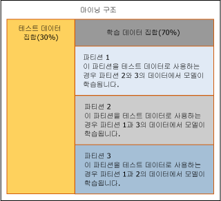

# 교차 유효성 검사(Analysis Services - 데이터 마이닝)
[!INCLUDE[ssas-appliesto-sqlas](../../includes/ssas-appliesto-sqlas.md)]
  *교차 유효성 검사* 는 분석의 표준 도구이며 데이터 마이닝 모델 개발 및 미세 조정에 도움이 되는 중요한 기능입니다. 마이닝 구조 및 관련 마이닝 모델을 만든 후 교차 유효성 검사를 사용하여 모델의 유효성을 확인합니다.  교차 유효성 검사는 다음과 같이 적용됩니다.  
  
-   특정 마이닝 모델의 견고성 확인  
  
-   단일 문에서 여러 모델 평가  
  
-   여러 모델을 작성한 다음 통계를 기반으로 최상의 모델 식별  
  
 이 섹션에서는 데이터 마이닝에 제공된 교차 유효성 검사 기능을 사용하는 방법과 단일 모델에 대한 교차 유효성 검사 또는 단일 데이터 집합을 기반으로 하는 여러 모델에 대한 교차 유효성 검사의 결과를 해석하는 방법에 대해 설명합니다.  
  
## 교차 유효성 검사 프로세스 개요  
 교차 유효성 검사는 학습 및 결과 생성의 두 단계로 구성됩니다. 이러한 단계에는 다음과 같은 절차가 포함됩니다.  
  
-   대상 마이닝 구조를 선택합니다.  
  
-   테스트할 모델을 지정합니다. 이 단계는 선택 사항입니다. 마이닝 구조만 테스트할 수도 있습니다.  
  
-   학습된 모델을 테스트하기 위한 매개 변수를 지정합니다.  
  
    -   예측 가능한 특성, 예측 값 및 정확도 임계값을 지정합니다.  
  
    -   구조 또는 모델 데이터를 분할할 접기 수를 지정합니다.  
  
-   [!INCLUDE[ssASnoversion](../../includes/ssasnoversion-md.md)]에서 접기 수만큼 모델을 만들고 학습합니다.  
  
-   그러면 [!INCLUDE[ssASnoversion](../../includes/ssasnoversion-md.md)]에서 각 모델의 접기 또는 전체 데이터 집합에 대한 정확도 메트릭 집합을 반환합니다.  
  
## 교차 유효성 검사 구성  
 교집합 영역의 수, 테스트되는 모델 및 예측용 정확도 막대를 제어하기 위해 교차 유효성 검사가 작동하는 방식을 사용자 지정할 수 있습니다. 교차 유효성 검사 저장 프로시저를 사용하는 경우에는 모델의 유효성 검사에 사용되는 데이터 집합도 지정할 수 있습니다. 이러한 다양한 선택 사항을 통해 다양한 많은 결과 집합을 쉽게 생성할 수 있습니다. 이러한 결과는 이후에 비교하고 분석해야 합니다.  
  
 이 섹션에서는 교차 유효성 검사를 적절하게 구성하는 데 도움이 되는 정보를 제공합니다.  
  
### 파티션 수 설정  
 파티션 수를 지정할 때 생성할 임시 모델 수를 결정합니다. 각 파티션에 대해 데이터의 교집합 영역이 테스트 집합으로 사용되도록 플래그가 지정되고 파티션에 없는 나머지 데이터를 학습하여 새 모델이 생성됩니다. [!INCLUDE[ssASnoversion](../../includes/ssasnoversion-md.md)] 에서 지정된 모델 수를 만들고 테스트할 때까지 이 프로세스가 반복됩니다. 교차 유효성 검사에 대해 사용 가능하도록 지정한 데이터는 모든 파티션에 골고루 분산됩니다.  
  
 다음 다이어그램의 예에서는 3개의 접기가 지정된 경우의 데이터 사용을 보여 줍니다.  
  
   
  
 위 다이어그램의 시나리오에서 마이닝 구조에는 테스트에 사용되는 홀드아웃 데이터 집합이 포함되어 있지만 테스트 데이터 집합은 교차 유효성 검사에 포함되지 않았습니다. 따라서 마이닝 구조 데이터의 70%인 학습 데이터 집합의 모든 데이터가 교차 유효성 검사에 사용됩니다. 교차 유효성 검사 보고서에는 각 파티션에 사용된 총 사례 수가 표시됩니다.  
  
 사용할 전체 사례 수를 지정하여 교차 유효성 검사 중 사용되는 데이터의 양을 지정할 수도 있습니다. 사례는 모든 접기 전체에 골고루 분산됩니다.  
  
 SQL Server [!INCLUDE[ssASnoversion](../../includes/ssasnoversion-md.md)]인스턴스에 저장된 마이닝 구조의 경우 접기 수에 대해 설정할 수 있는 최대값은 256과 사례 수 중 작은 값입니다. 세션 마이닝 구조를 사용하는 경우 최대 접기 수는 10입니다.  
  
> [!NOTE]  
>  각 접기에 대해 모델을 생성하고 테스트해야 하기 때문에 접기 수를 늘리면 교차 유효성 검사를 수행하는 데 필요한 시간도 이에 따라 증가합니다. 접기 수가 너무 많으면 성능 문제가 발생할 수 있습니다.  
  
### 정확도 임계값 설정  
 상태 임계값을 사용하면 예측용 정확도 막대를 설정할 수 있습니다. 모델은 각 사례에 대해 예측 상태가 올바를 확률인 *예측 확률*을 계산합니다. 예측 확률이 정확도 막대를 초과하는 경우 예측이 올바른 것으로 간주되고 초과하지 않는 경우 예측이 잘못된 것으로 간주됩니다. **상태 임계값** 을 0.0과 1.0 사이의 숫자로 설정하여 이 값을 제어합니다. 여기서 1에 가까운 숫자는 예측의 신뢰도 수준이 높음을 나타내고 0에 가까운 숫자는 예측이 거짓일 가능성이 높음을 나타냅니다. 상태 임계값의 기본값은 NULL이며 이는 확률이 가장 높은 예측 상태가 대상 값으로 간주됨을 의미합니다.  
  
 상태 임계값 설정은 모델의 정확도 측정값에 영향을 줍니다. 예를 들어 테스트할 모델이 세 개 있다고 가정합니다. 모두 동일한 마이닝 구조를 기반으로 하고 [Bike Buyer] 열을 예측합니다. 또한 "예. 구입합니다"를 의미하는 단일 값 1을 예측할 수 있습니다. 이 3개의 모델은 예측 확률이 0.05, 0.15 및 0.8인 예측을 반환합니다. 이때 상태 임계값을 0.10으로 설정하면 예측 중 2개는 올바른 것으로 간주됩니다. 상태 임계값을 0.5로 설정하면 1개의 모델만 올바른 예측을 반환한 것으로 간주됩니다. 기본값인 Null을 사용하면 가장 가능성이 높은 예측이 올바른 것으로 간주됩니다. 이 경우 3개의 예측이 모두 올바른 것으로 간주됩니다.  
  
> [!NOTE]  
>  임계값을 0.0으로 설정할 수 있지만 확률이 0이더라도 모든 예측이 올바른 것으로 간주되므로 이 값은 의미가 없습니다. **상태 임계값** 을 실수로 0.0으로 설정하지 않도록 주의하십시오.  
  
### 유효성을 검사할 모델 및 열 선택  
 데이터 마이닝 디자이너의 **교차 유효성 검사** 탭을 사용할 때는 먼저 목록에서 예측 가능한 열을 선택해야 합니다. 일반적으로 마이닝 구조는 여러 마이닝 모델을 지원할 수 있으며 이러한 모델 중 일부는 같은 예측 가능한 열을 사용하지 않을 수 있습니다. 교차 유효성 검사를 실행할 때는 같은 예측 가능한 열을 사용하는 모델만 보고서에 포함될 수 있습니다.  
  
 예측 가능한 특성을 선택하려면 **대상 특성** 을 클릭하고 목록에서 열을 선택합니다. 형식을 사용 하는 중첩 열의 이름을 입력 해야 대상 특성이 중첩된 열 또는 중첩된 테이블의 열 이면 \<중첩 테이블 이름 > (키).\< 중첩 열 > 합니다. 중첩된 테이블에서 사용 된 유일한 열은 키 열을 사용 하면 \<중첩 테이블 이름 > (키)입니다.  
  
 예측 가능한 특성을 선택하면 [!INCLUDE[ssASnoversion](../../includes/ssasnoversion-md.md)] 가 동일한 예측 가능한 특성을 사용하는 모든 모델을 자동으로 테스트합니다. 대상 특성에 불연속 값이 포함되어 있는 경우에는 예측 가능한 열을 선택한 후 예측할 특정 값이 있으면 필요에 따라 대상 상태를 입력할 수 있습니다.  
  
 선택하는 대상 상태는 반환되는 측정값에 영향을 줍니다. 대상 특성, 즉 열 이름을 지정하고 모델이 예측할 특정 값을 선택하지 않으면 기본적으로 가능성이 가장 높은 상태에 대한 예측에 따라 모델이 평가됩니다.  
  
 클러스터링 모델에서 교차 유효성 검사를 사용하는 경우에는 예측 가능한 열이 없습니다. 대신 **대상 특성** 목록 상자의 예측 가능한 특성 목록에서 **#Cluster** 를 선택합니다. 이 옵션을 선택한 후에는 **대상 상태**와 같이 클러스터링 모델과 관계가 없는 기타 옵션을 사용할 수 없게 됩니다. [!INCLUDE[ssASnoversion](../../includes/ssasnoversion-md.md)]는 마이닝 구조와 연결된 모든 클러스터링 모델을 테스트합니다.  
  
## 교차 유효성 검사 도구  
 데이터 마이닝 디자이너에서 교차 유효성 검사를 사용하거나 저장 프로시저를 실행하여 교차 유효성 검사를 수행할 수 있습니다.  
  
 데이터 마이닝 디자이너 도구를 사용하여 교차 유효성 검사를 수행하는 경우 단일 대화 상자에서 학습 및 정확도 결과 매개 변수를 구성할 수 있습니다. 이렇게 하면 결과를 쉽게 설정하고 볼 수 있습니다. 단일 마이닝 구조와 관련된 모든 마이닝 모델의 정확도를 측정한 다음 즉시 HTML 보고서에서 결과를 볼 수 있습니다. 그러나 저장 프로시저는 추가된 사용자 지정 항목 및 프로세스 스크립팅 기능과 같은 몇 가지 이점을 제공합니다.  
  
### 데이터 마이닝 디자이너의 교차 유효성 검사  
 **또는 SQL Server Development Studio에서 마이닝 정확도 차트 뷰의** 교차 유효성 검사 [!INCLUDE[ssManStudioFull](../../includes/ssmanstudiofull-md.md)] 탭을 사용하여 교차 유효성 검사를 수행할 수 있습니다.  
  
 사용자 인터페이스를 사용하여 교차 유효성 검사 보고서를 만드는 방법의 예는 [교차 유효성 검사 보고서 만들기](../../analysis-services/data-mining/create-a-cross-validation-report.md)를 참조하세요.  
  
### 교차 유효성 검사 저장 프로시저  
 고급 사용자의 경우 전체 매개 변수가 있는 시스템 저장 프로시저 형태의 교차 유효성 검사를 사용할 수 있습니다. 인스턴스에 연결 하 여 저장된 프로시저를 실행할 수 있습니다 [!INCLUDE[ssManStudioFull](../../includes/ssmanstudiofull-md.md)], 또는 모든 관리 코드 응용 프로그램입니다.  
  
 저장 프로시저는 마이닝 모델 유형별로 그룹화됩니다. 하나의 저장 프로시저 집합은 클러스터링 모델에서만 작동합니다. 다른 저장 프로시저 집합은 다른 마이닝 모델에서 작동합니다.  
  
 각 유형의 마이닝 모델(클러스터형 또는 비클러스터형)에 대해 저장 프로시저는 두 개의 별도 단계로 교차 유효성 검사를 수행합니다.  
  
 **데이터 분할 및 파티션의 메트릭 생성**  
  
 첫 번째 단계에서는 데이터 집합 내에 사용자가 지정하는 수만큼의 파티션을 만들고 각 파티션에 대한 정확도 결과를 반환하는 시스템 저장 프로시저를 호출합니다. 그러면 Analysis Services에서 각 메트릭에 대해 파티션의 평균값과 표준 편차를 계산합니다.  
  
-   [SystemGetCrossValidationResults & #40; Analysis Services-데이터 마이닝 & #41;](../../analysis-services/data-mining/systemgetcrossvalidationresults-analysis-services-data-mining.md)  
  
-   [SystemGetClusterCrossValidationResults & #40; Analysis Services-데이터 마이닝 & #41;](../../analysis-services/data-mining/systemgetclustercrossvalidationresults-analysis-services-data-mining.md)  
  
 **전체 데이터 집합의 메트릭 생성**  
  
 두 번째 단계에서는 다른 저장 프로시저 집합을 호출합니다. 이러한 저장 프로시저는 데이터 집합을 분할하지 않고 지정된 데이터 집합 전체에 대한 정확도 결과를 생성합니다. 마이닝 구조를 이미 분할하고 처리한 경우 이 두 번째 저장 프로시저 집합을 호출하여 동일한 결과를 얻을 수 있습니다.  
  
-   [SystemGetAccuracyResults & #40; Analysis Services-데이터 마이닝 & #41;](../../analysis-services/data-mining/systemgetaccuracyresults-analysis-services-data-mining.md)  
  
-   [SystemGetClusterAccuracyResults & #40; Analysis Services-데이터 마이닝 & #41;](../../analysis-services/data-mining/systemgetclusteraccuracyresults-analysis-services-data-mining.md)  
  
#### 테스트 데이터 정의  
 정확도를 계산하는 교차 유효성 검사 저장 프로시저(SystemGetAccuracyResults 또는 SystemGetClusterAccuracyResults)를 실행할 때 교차 유효성 검사 중 테스트에 사용되는 데이터의 원본을 지정할 수 있습니다. 사용자 인터페이스에는 이 옵션이 제공되지 않습니다.  
  
 다음 옵션 중 하나를 테스트 데이터 원본으로 지정할 수 있습니다.  
  
-   학습 데이터만 사용  
  
-   기존 테스트 데이터 집합 포함  
  
-   테스트 데이터 집합만 사용  
  
-   각 모델에 기존 필터 적용  
  
-   학습 집합, 테스트 집합 및 모델 필터의 임의 조합  
  
 테스트 데이터 원본을 지정하려면 저장 프로시저의 **DataSet** 매개 변수에 대한 정수 값을 제공하면 됩니다. 인수 값 목록은 관련 저장 프로시저 참조 항목의 설명 섹션을 참조하십시오.  
  
 데이터 마이닝 디자이너의 **교차 유효성 검사** 보고서를 사용하여 교차 유효성 검사를 수행하는 경우에는 사용되는 데이터 집합을 변경할 수 없습니다. 기본적으로 각 모델에 대한 학습 사례가 사용됩니다. 모델과 연결된 필터가 있는 경우 해당 필터가 적용됩니다.  
  
## 교차 유효성 검사의 결과  
 데이터 마이닝 디자이너를 사용하는 경우 이러한 결과는 표 형태의 웹 뷰어에 표시됩니다. 교차 유효성 검사 저장 프로시저를 사용하는 경우 이러한 결과는 테이블로 반환됩니다.  
  
 보고서에는 두 가지 유형의 측정값, 즉 접기로 분할된 경우 데이터 집합의 가변성을 나타내는 집계와 각 접기에 대한 모델별 정확도 측정값이 포함됩니다. 다음 항목에서는 이러한 메트릭에 대해 자세히 설명합니다.  
  
 [교차 유효성 검사 수식](../../analysis-services/data-mining/cross-validation-formulas.md)  
  
 모든 측정값을 테스트 유형별로 나열합니다. 측정값을 해석하는 방법에 대해 일반적으로 설명합니다.  
  
 [교차 유효성 검사 보고서의 측정값](../../analysis-services/data-mining/measures-in-the-cross-validation-report.md)  
  
 각 측정값을 계산하는 수식을 설명하고 각 측정값을 적용할 수 있는 특성 유형을 나열합니다.  
  
## 교차 유효성 검사에 대한 제한 사항  
 SQL Server Development Studio에서 교차 유효성 검사 보고서를 사용하여 교차 유효성 검사를 수행하는 경우 테스트할 수 있는 모델과 설정할 수 있는 매개 변수에 몇 가지 제한 사항이 있습니다.  
  
-   선택한 마이닝 구조와 연결된 모든 모델에 대해 기본적으로 교차 유효성 검사가 수행됩니다. 모델이나 모델 목록을 지정할 수는 없습니다.  
  
-   Microsoft 시계열 알고리즘이나 Microsoft 시퀀스 클러스터링 알고리즘을 기반으로 하는 모델에 대해서는 교차 유효성 검사가 지원되지 않습니다.  
  
-   마이닝 구조에 교차 유효성 검사로 테스트할 수 있는 모델이 포함되어 있지 않은 경우 보고서를 만들 수 없습니다.  
  
-   마이닝 구조에 클러스터링 모델과 클러스터링 이외의 모델이 모두 포함되어 있는 상태에서 **#Cluster** 옵션을 선택하지 않으면 특성, 상태 및 임계값 설정이 클러스터링 모델에 적합하지 않더라도 두 모델 유형에 대한 결과가 모두 같은 보고서에 표시됩니다.  
  
-   일부 매개 변수 값은 사용에 제한이 있습니다. 예를 들어 접기 수가 10을 초과하면 너무 많은 모델이 생성되어 보고서가 느리게 표시될 수 있으므로 경고가 표시됩니다.  
  
 여러 마이닝 모델을 테스트하며 모델에 필터가 있는 경우 각 모델은 별도로 필터링됩니다. 교차 유효성 검사 중 모델에 필터를 추가하거나 모델에 대한 필터를 변경할 수 없습니다.  
  
 기본적으로 교차 유효성 검사는 구조와 연결된 모든 마이닝 모델을 테스트하므로 일부 모델에 필터가 있고 다른 모델에는 필터가 없을 경우 일관성 없는 결과가 발생할 수 있습니다. 동일한 필터가 있는 모델만 비교되도록 하려면 저장 프로시저를 사용하고 마이닝 모델 목록을 지정해야 합니다. 또는 필터가 없는 마이닝 구조 테스트 집합만 사용하여 모든 모델에 일관성 있는 데이터 집합이 사용되도록 합니다.  
  
 저장 프로시저를 사용하여 교차 유효성 검사를 수행하는 경우에는 테스트 데이터 원본을 선택할 수 있는 추가 옵션이 제공됩니다. 데이터 마이닝 디자이너를 사용하여 교차 유효성 검사를 수행하는 경우에는 모델 또는 구조와 연결된 테스트 데이터 집합(있는 경우)을 사용해야 합니다. 일반적으로 고급 설정을 지정하려면 교차 유효성 검사 저장 프로시저를 사용해야 합니다.  
  
 교차 유효성 검사는 시계열 또는 시퀀스 클러스터링 모델에 사용할 수 없습니다. 특히, KEY TIME 열 또는 KEY SEQUENCE 열이 포함된 모델은 교차 유효성 검사에 포함할 수 없습니다.  
  
## 관련 내용  
 교차 유효성 검사 또는 관련 마이닝 모델 테스트 방법(예: 정확도 차트)에 대한 자세한 내용은 다음 항목을 참조하십시오.  
  
|항목|링크|  
|------------|-----------|  
|SQL Server Development Studio에서 교차 유효성 검사 매개 변수를 설정하는 방법에 대해 설명합니다.|[교차 유효성 검사 탭 & #40; 마이닝 정확도 차트 뷰 & #41;](http://msdn.microsoft.com/library/bd215a68-1ad7-4046-9c44-ec8e2be13a64)|  
|교차 유효성 검사에서 제공되는 메트릭에 대해 설명합니다.|[교차 유효성 검사 수식](../../analysis-services/data-mining/cross-validation-formulas.md)|  
|교차 유효성 검사 보고서 형식을 설명하고 각 모델 유형에 대해 제공되는 통계 측정값을 정의합니다.|[교차 유효성 검사 보고서의 측정값](../../analysis-services/data-mining/measures-in-the-cross-validation-report.md)|  
|교차 유효성 검사 통계를 계산하는 저장 프로시저를 나열합니다.|[데이터 마이닝 저장 프로시저 & #40; Analysis Services-데이터 마이닝 & #41;](../../analysis-services/data-mining/data-mining-stored-procedures-analysis-services-data-mining.md)|  
|||  
|마이닝 구조 및 관련 모델의 테스트 데이터 집합을 만드는 방법에 대해 설명합니다.|[학습 및 테스트 데이터 집합](../../analysis-services/data-mining/training-and-testing-data-sets.md)|  
|다른 정확도 차트 유형에 대한 예를 참조합니다.|[분류표&#40;Analysis Services - 데이터 마이닝&#41;](../../analysis-services/data-mining/classification-matrix-analysis-services-data-mining.md)   [리프트 차트&#40;Analysis Services - 데이터 마이닝&#41;](../../analysis-services/data-mining/lift-chart-analysis-services-data-mining.md)   [수익 차트&#40;Analysis Services - 데이터 마이닝&#41;](../../analysis-services/data-mining/profit-chart-analysis-services-data-mining.md)   [산 점도 & #40; Analysis Services-데이터 마이닝 & #41;](../../analysis-services/data-mining/scatter-plot-analysis-services-data-mining.md)|  
|여러 가지 정확도 차트를 만드는 단계에 대해 설명합니다.|[테스트 및 유효성 검사 작업과 방법&#40;데이터 마이닝&#41;](../../analysis-services/data-mining/testing-and-validation-tasks-and-how-tos-data-mining.md)|  
  
## 관련 항목:  
 [테스트 및 유효성 검사&#40;데이터 마이닝&#41;](../../analysis-services/data-mining/testing-and-validation-data-mining.md)  
  
  
