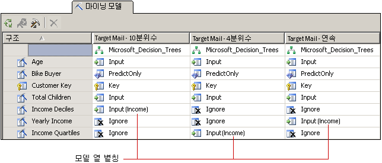

# 마이닝 모델 및 구조 사용자 지정
[!INCLUDE[ssas-appliesto-sqlas](../../includes/ssas-appliesto-sqlas.md)]
비즈니스 요구를 충족하는 알고리즘을 선택한 후 다음과 같은 방법으로 마이닝 모델을 사용자 지정하여 결과를 잠재적으로 향상시킬 수 있습니다.  
  
-   모델에서 다른 열의 데이터를 사용하거나 열의 사용법, 내용 유형 또는 분할 메서드를 변경합니다.  
  
-   마이닝 모델에서 필터를 만들어 모델 학습에 사용되는 데이터를 제한합니다.  
  
-   데이터를 분석하는 데 사용된 알고리즘을 변경합니다.  
  
-   알고리즘 매개 변수를 설정하여 임계값, 트리 분할 또는 기타 중요한 조건을 제어합니다.  
  
 이 항목에서는 이러한 옵션에 대해 설명합니다.  
  
## 모델에 사용되는 데이터 변경  
 모델에서 사용할 데이터 열과 해당 데이터를 사용 및 처리하는 방법에 대한 결정은 분석 결과에 큰 영향을 줍니다. 다음 항목에서는 이러한 선택 사항을 이해하는 데 도움이 되는 정보를 제공합니다.  
  
### 기능 선택 사용  
 [!INCLUDE[ssASnoversion](../../includes/ssasnoversion-md.md)] 의 데이터 마이닝 알고리즘에서는 대부분 *기능 선택* 이라는 프로세스를 사용하여 모델에 추가할 가장 유용한 특성만 선택합니다. 열과 특성 수를 줄이면 모델 품질 및 성능을 향상시킬 수 있습니다. 사용 가능한 기능 선택 방법은 선택한 알고리즘에 따라 달라집니다.  
  
 [기능 선택&#40;데이터 마이닝&#41;](../../analysis-services/data-mining/feature-selection-data-mining.md).  
  
### 사용법 변경  
 마이닝 모델에 포함할 열과 각 열의 사용 방법을 변경할 수 있습니다. 원하는 결과를 얻지 못한 경우 입력으로 사용한 열의 예제를 만들어 열을 올바르게 선택했는지, 그리고 다음을 포함하여 데이터 처리를 향상시키기 위해 수행할 수 있는 작업이 있는지 확인해야 합니다.  
  
-   레이블이 숫자로 잘못 지정된 범주 변수 확인  
  
-   범주를 추가하여 특성 수를 축소한 후 상관 관계를 보다 쉽게 확인  
  
-   숫자가 범주화되거나 분할되는 방식 변경  
  
-   고유 값이 많은 열 또는 주소나 중간 이름과 같이 실제로 데이터를 참조하고 분석에는 유용하지 않은 열 제거  
  
 실제로 마이닝 구조에서 열을 제거할 필요는 없으며 열에 **무시**로 플래그를 지정하기만 하면 됩니다. 열이 마이닝 모델에서 제거되지만 구조의 다른 마이닝 모델에서는 해당 열을 계속 사용할 수 있으며 드릴스루 쿼리에서 참조됩니다.  
  
### 모델 열의 별칭 만들기  
 마이닝 모델을 만들 때 [!INCLUDE[ssASnoversion](../../includes/ssasnoversion-md.md)] 에서는 마이닝 구조에 있는 이름과 동일한 열 이름을 사용합니다. 마이닝 모델의 모든 열에 별칭을 추가할 수 있습니다. 이렇게 하면 열 내용 또는 사용법을 보다 쉽게 이해할 수 있으며 쿼리 작성 시 편리하도록 이름을 짧게 만들 수 있습니다. 별칭은 열의 복사본을 만들고 이해하기 쉬운 이름을 지정하려는 경우에도 유용합니다.  
  
 마이닝 모델 열의 **Name** 속성을 편집하여 별칭을 만듭니다. [!INCLUDE[ssASnoversion](../../includes/ssasnoversion-md.md)] 에서는 계속 원래 이름을 열의 ID로 사용하며 사용자가 **Name** 에 입력하는 새 값이 열 별칭이 되어 표에서 열 사용법 옆에 괄호로 묶여 나타납니다.  
  
   
  
 이 그림에서는 모두 소득과 관련된 마이닝 구조 열의 여러 복사본이 있는 관련 모델을 보여 줍니다. 구조 열의 각 복사본은 서로 다른 방식으로 불연속화되었습니다. 다이어그램의 모델은 각각 마이닝 구조의 다른 열을 사용하지만 모델 전체에서 열을 비교할 때 편리하도록 각 모델의 열 이름을 [**Income**]으로 바꾸었습니다.  
  
### 필터 추가  
 마이닝 모델에 필터를 추가할 수 있습니다. 필터는 모델 사례의 데이터를 일부 하위 집합으로 제한하는 WHERE 조건 집합입니다. 필터는 모델을 학습할 때 사용되며 모델을 테스트하거나 정확도 차트를 만들 때 사용될 수도 있습니다.  
  
 필터를 추가하면 마이닝 구조를 다시 사용하되 크게 다른 데이터 하위 집합을 기반으로 모델을 만들 수 있습니다. 또는 필터를 사용하여 특정 행을 제거하고 분석 품질을 향상시킬 수도 있습니다.  
  
 자세한 내용은 [마이닝 모델에 대한 필터&#40;Analysis Services - 데이터 마이닝&#41;](../../analysis-services/data-mining/filters-for-mining-models-analysis-services-data-mining.md)를 참조하세요.  
  
## 알고리즘 변경  
 마이닝 구조에 추가한 새 모델은 동일한 데이터 집합을 공유하지만 다른 알고리즘(데이터에서 지원하는 경우)을 사용하거나 알고리즘의 매개 변수를 변경하여 다른 결과를 얻을 수 있습니다. 또한 모델링 플래그를 설정할 수 있습니다.  
  
 선택한 알고리즘에 따라 결과의 종류가 결정됩니다. 특정 알고리즘이 작동하는 방식에 대한 일반적인 내용이나 특정 알고리즘을 사용하는 것이 이익이 되는 비즈니스 시나리오는 [데이터 마이닝 알고리즘&#40;Analysis Services - 데이터 마이닝&#41;](../../analysis-services/data-mining/data-mining-algorithms-analysis-services-data-mining.md).  
  
 요구 사항 및 제한 사항에 대한 설명과 각 알고리즘에서 지원하는 사용자 지정 항목에 대한 자세한 내용은 각 알고리즘의 기술 참조 항목을 참조하십시오.  
  
|||  
|-|-|  
|[Microsoft 의사 결정 트리 알고리즘](../../analysis-services/data-mining/microsoft-decision-trees-algorithm.md)|[Microsoft 시계열 알고리즘](../../analysis-services/data-mining/microsoft-time-series-algorithm.md)|  
|[Microsoft 클러스터링 알고리즘](../../analysis-services/data-mining/microsoft-clustering-algorithm.md)|[Microsoft 신경망 알고리즘](../../analysis-services/data-mining/microsoft-neural-network-algorithm.md)|  
|[Microsoft Naive Bayes 알고리즘](../../analysis-services/data-mining/microsoft-naive-bayes-algorithm.md)|[Microsoft 로지스틱 회귀 알고리즘](../../analysis-services/data-mining/microsoft-logistic-regression-algorithm.md)|  
|[Microsoft 연결 알고리즘](../../analysis-services/data-mining/microsoft-association-algorithm.md)|[Microsoft 선형 회귀 알고리즘](../../analysis-services/data-mining/microsoft-linear-regression-algorithm.md)|  
|[Microsoft 시퀀스 클러스터링 알고리즘](../../analysis-services/data-mining/microsoft-sequence-clustering-algorithm.md)||  
  
## 알고리즘 매개 변수 사용자 지정  
 각 알고리즘에는 알고리즘의 동작을 사용자 지정하고 모델 결과를 미세 조정하는 데 사용할 수 있는 매개 변수가 지원됩니다. 각 매개 변수를 사용하는 방법은 다음 항목을 참조하십시오.  
  
 또한 각 알고리즘 유형에 대한 항목에서는 해당 알고리즘을 기반으로 하는 모델과 함께 사용할 수 있는 예측 함수가 나열됩니다.  
  
|속성 이름|적용 대상|  
|-------------------|----------------|  
|AUTO_DETECT_PERIODICITY|[Microsoft 시계열 알고리즘 기술 참조](../../analysis-services/data-mining/microsoft-time-series-algorithm-technical-reference.md)|  
|CLUSTER_COUNT|[Microsoft 클러스터링 알고리즘 기술 참조](../../analysis-services/data-mining/microsoft-clustering-algorithm-technical-reference.md)   [Microsoft 시퀀스 클러스터링 알고리즘 기술 참조](../../analysis-services/data-mining/microsoft-sequence-clustering-algorithm-technical-reference.md)|  
|CLUSTER_SEED|[Microsoft 클러스터링 알고리즘 기술 참조](../../analysis-services/data-mining/microsoft-clustering-algorithm-technical-reference.md)|  
|CLUSTERING_METHOD|[Microsoft 클러스터링 알고리즘 기술 참조](../../analysis-services/data-mining/microsoft-clustering-algorithm-technical-reference.md)|  
|COMPLEXITY_PENALTY|[Microsoft 의사 결정 트리 알고리즘 기술 참조](../../analysis-services/data-mining/microsoft-decision-trees-algorithm-technical-reference.md)   [Microsoft 시계열 알고리즘 기술 참조](../../analysis-services/data-mining/microsoft-time-series-algorithm-technical-reference.md)|  
|FORCE_REGRESSOR|[Microsoft 의사 결정 트리 알고리즘 기술 참조](../../analysis-services/data-mining/microsoft-decision-trees-algorithm-technical-reference.md)   [Microsoft 선형 회귀 알고리즘 기술 참조](../../analysis-services/data-mining/microsoft-linear-regression-algorithm-technical-reference.md)   [모델링 플래그 &#40; 데이터 마이닝 &#41;](../../analysis-services/data-mining/modeling-flags-data-mining.md)|  
|FORECAST_METHOD|[Microsoft 시계열 알고리즘 기술 참조](../../analysis-services/data-mining/microsoft-time-series-algorithm-technical-reference.md)|  
|HIDDEN_NODE_RATIO|[Microsoft 신경망 알고리즘 기술 참조](../../analysis-services/data-mining/microsoft-neural-network-algorithm-technical-reference.md)|  
|HISTORIC_MODEL_COUNT|[Microsoft 시계열 알고리즘 기술 참조](../../analysis-services/data-mining/microsoft-time-series-algorithm-technical-reference.md)|  
|HISTORICAL_MODEL_GAP|[Microsoft 시계열 알고리즘 기술 참조](../../analysis-services/data-mining/microsoft-time-series-algorithm-technical-reference.md)|  
|HOLDOUT_PERCENTAGE|[Microsoft 로지스틱 회귀 알고리즘 기술 참조](../../analysis-services/data-mining/microsoft-logistic-regression-algorithm-technical-reference.md)   [Microsoft 신경망 알고리즘 기술 참조](../../analysis-services/data-mining/microsoft-neural-network-algorithm-technical-reference.md)   참고: 이 매개 변수는 마이닝 구조에 적용되는 홀드아웃 백분율 값과는 다릅니다.|  
|HOLDOUT_SEED|[Microsoft 로지스틱 회귀 알고리즘 기술 참조](../../analysis-services/data-mining/microsoft-logistic-regression-algorithm-technical-reference.md)   [Microsoft 신경망 알고리즘 기술 참조](../../analysis-services/data-mining/microsoft-neural-network-algorithm-technical-reference.md)   참고: 이 매개 변수는 마이닝 구조에 적용되는 홀드아웃 초기값과는 다릅니다.|  
|INSTABILITY_SENSITIVITY|[Microsoft 시계열 알고리즘 기술 참조](../../analysis-services/data-mining/microsoft-time-series-algorithm-technical-reference.md)|  
|MAXIMUM_INPUT_ATTRIBUTES|[Microsoft 클러스터링 알고리즘 기술 참조](../../analysis-services/data-mining/microsoft-clustering-algorithm-technical-reference.md)   [Microsoft 의사 결정 트리 알고리즘 기술 참조](../../analysis-services/data-mining/microsoft-decision-trees-algorithm-technical-reference.md)   [Microsoft 선형 회귀 알고리즘 기술 참조](../../analysis-services/data-mining/microsoft-linear-regression-algorithm-technical-reference.md)   [Microsoft Naive Bayes 알고리즘 기술 참조](../../analysis-services/data-mining/microsoft-naive-bayes-algorithm-technical-reference.md)   [Microsoft 신경망 알고리즘 기술 참조](../../analysis-services/data-mining/microsoft-neural-network-algorithm-technical-reference.md)   [Microsoft 로지스틱 회귀 알고리즘 기술 참조](../../analysis-services/data-mining/microsoft-logistic-regression-algorithm-technical-reference.md)|  
|MAXIMUM_ITEMSET_COUNT|[Microsoft 연결 알고리즘 기술 참조](../../analysis-services/data-mining/microsoft-association-algorithm-technical-reference.md)|  
|MAXIMUM_ITEMSET_SIZE|[Microsoft 연결 알고리즘 기술 참조](../../analysis-services/data-mining/microsoft-association-algorithm-technical-reference.md)|  
|MAXIMUM_OUTPUT_ATTRIBUTES|[Microsoft 의사 결정 트리 알고리즘 기술 참조](../../analysis-services/data-mining/microsoft-decision-trees-algorithm-technical-reference.md)   [Microsoft 선형 회귀 알고리즘 기술 참조](../../analysis-services/data-mining/microsoft-linear-regression-algorithm-technical-reference.md)   [Microsoft 로지스틱 회귀 알고리즘 기술 참조](../../analysis-services/data-mining/microsoft-logistic-regression-algorithm-technical-reference.md)   [Microsoft Naive Bayes 알고리즘 기술 참조](../../analysis-services/data-mining/microsoft-naive-bayes-algorithm-technical-reference.md)   [Microsoft 신경망 알고리즘 기술 참조](../../analysis-services/data-mining/microsoft-neural-network-algorithm-technical-reference.md)|  
|MAXIMUM_SEQUENCE_STATES|[Microsoft 시퀀스 클러스터링 알고리즘 기술 참조](../../analysis-services/data-mining/microsoft-sequence-clustering-algorithm-technical-reference.md)|  
|MAXIMUM_SERIES_VALUE|[Microsoft 시계열 알고리즘 기술 참조](../../analysis-services/data-mining/microsoft-time-series-algorithm-technical-reference.md)|  
|MAXIMUM_STATES|[Microsoft 클러스터링 알고리즘 기술 참조](../../analysis-services/data-mining/microsoft-clustering-algorithm-technical-reference.md)   [Microsoft 신경망 알고리즘 기술 참조](../../analysis-services/data-mining/microsoft-neural-network-algorithm-technical-reference.md)   [Microsoft 시퀀스 클러스터링 알고리즘 기술 참조](../../analysis-services/data-mining/microsoft-sequence-clustering-algorithm-technical-reference.md)|  
|MAXIMUM_SUPPORT|[Microsoft 연결 알고리즘 기술 참조](../../analysis-services/data-mining/microsoft-association-algorithm-technical-reference.md)|  
|MINIMUM_IMPORTANCE|[Microsoft 연결 알고리즘 기술 참조](../../analysis-services/data-mining/microsoft-association-algorithm-technical-reference.md)|  
|MINIMUM_ITEMSET_SIZE|[Microsoft 연결 알고리즘 기술 참조](../../analysis-services/data-mining/microsoft-association-algorithm-technical-reference.md)|  
|MINIMUM_DEPENDENCY_PROBABILITY|[Microsoft Naive Bayes 알고리즘 기술 참조](../../analysis-services/data-mining/microsoft-naive-bayes-algorithm-technical-reference.md)|  
|MINIMUM_PROBABILITY|[Microsoft 연결 알고리즘 기술 참조](../../analysis-services/data-mining/microsoft-association-algorithm-technical-reference.md)|  
|MINIMUM_SERIES_VALUE|[Microsoft 시계열 알고리즘 기술 참조](../../analysis-services/data-mining/microsoft-time-series-algorithm-technical-reference.md)|  
|MINIMUM_SUPPORT|[Microsoft 연결 알고리즘 기술 참조](../../analysis-services/data-mining/microsoft-association-algorithm-technical-reference.md)   [Microsoft 클러스터링 알고리즘 기술 참조](../../analysis-services/data-mining/microsoft-clustering-algorithm-technical-reference.md)   [Microsoft 의사 결정 트리 알고리즘 기술 참조](../../analysis-services/data-mining/microsoft-decision-trees-algorithm-technical-reference.md)   [Microsoft 시퀀스 클러스터링 알고리즘 기술 참조](../../analysis-services/data-mining/microsoft-sequence-clustering-algorithm-technical-reference.md)   [Microsoft 시계열 알고리즘 기술 참조](../../analysis-services/data-mining/microsoft-time-series-algorithm-technical-reference.md)|  
|MISSING_VALUE_SUBSTITUTION|[Microsoft 시계열 알고리즘 기술 참조](../../analysis-services/data-mining/microsoft-time-series-algorithm-technical-reference.md)|  
|MODELLING_CARDINALITY|[Microsoft 클러스터링 알고리즘 기술 참조](../../analysis-services/data-mining/microsoft-clustering-algorithm-technical-reference.md)|  
|PERIODICITY_HINT|[Microsoft 시계열 알고리즘 기술 참조](../../analysis-services/data-mining/microsoft-time-series-algorithm-technical-reference.md)|  
|PREDICTION_SMOOTHING|[Microsoft 시계열 알고리즘 기술 참조](../../analysis-services/data-mining/microsoft-time-series-algorithm-technical-reference.md)|  
|SAMPLE_SIZE|[Microsoft 클러스터링 알고리즘 기술 참조](../../analysis-services/data-mining/microsoft-clustering-algorithm-technical-reference.md)   [Microsoft 로지스틱 회귀 알고리즘 기술 참조](../../analysis-services/data-mining/microsoft-logistic-regression-algorithm-technical-reference.md)   [Microsoft 신경망 알고리즘 기술 참조](../../analysis-services/data-mining/microsoft-neural-network-algorithm-technical-reference.md)|  
|SCORE_METHOD|[Microsoft 의사 결정 트리 알고리즘 기술 참조](../../analysis-services/data-mining/microsoft-decision-trees-algorithm-technical-reference.md)|  
|SPLIT_METHOD|[Microsoft 의사 결정 트리 알고리즘 기술 참조](../../analysis-services/data-mining/microsoft-decision-trees-algorithm-technical-reference.md)|  
|STOPPING_TOLERANCE|[Microsoft 클러스터링 알고리즘 기술 참조](../../analysis-services/data-mining/microsoft-clustering-algorithm-technical-reference.md)|  
  
## 관련 항목:  
 [데이터 마이닝 알고리즘&#40;Analysis Services - 데이터 마이닝&#41;](../../analysis-services/data-mining/data-mining-algorithms-analysis-services-data-mining.md)   
 [물리적 아키텍처 &#40; Analysis Services-데이터 마이닝 &#41;](../../analysis-services/data-mining/physical-architecture-analysis-services-data-mining.md)  
  
  
