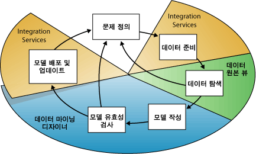
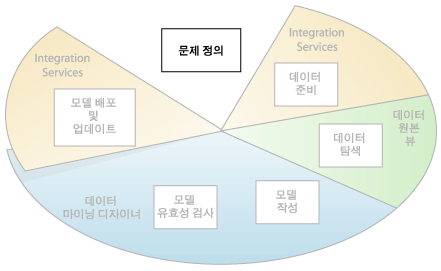
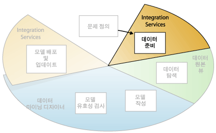
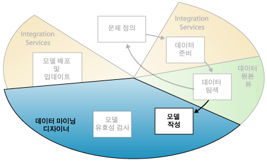
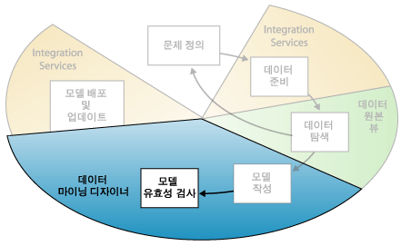
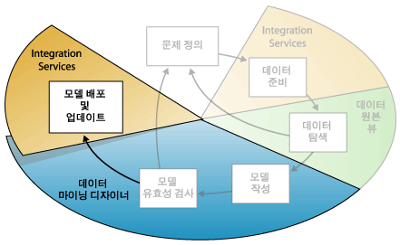

# 데이터 마이닝 개념
[!INCLUDE[ssas-appliesto-sqlas](../../includes/ssas-appliesto-sqlas.md)]
  데이터 마이닝은 큰 데이터 집합에서 동작 가능한 정보를 찾는 프로세스입니다. 데이터 마이닝에서는 수학적 분석을 사용하여 데이터에 있는 패턴 및 추세를 찾습니다. 일반적으로는 관계가 너무 복잡하거나 데이터가 너무 많아서 전통적인 데이터 탐색으로는 이러한 패턴을 찾을 수 없습니다.  
  
 이러한 패턴과 추세를 수집하여 *데이터 마이닝 모델*로 정의할 수 있습니다. 마이닝 모델은 다음과 같은 특정 시나리오에 적용할 수 있습니다.  
  
-   **예측**: 서버 부하 또는 서버 가동 중지 시간을 예측 하는 추정 판매  
  
-   **위험 및 확률**: 타겟 메일링을 위한 최적합 고객의 선택, 위험 시나리오를 위한 예상 손익 평형 포인트 결정, 진단 또는 기타 결과에 확률 할당  
  
-   **추천**: 함께 판매될 가능성이 높은 제품 결정, 추천 제품 구성  
  
-   **연계성 찾기**: 장바구니의 고객 선택 분석, 적절한 다음 이벤트 예측  
  
-   **그룹화**: 고객 또는 이벤트를 관련된 항목의 클러스터로 분리, 선호도 분석 및 예측  
  
 마이닝 모델을 작성하는 것은 데이터에 대해 질문하고 이러한 질문에 답을 해 줄 모델을 만드는 것부터 모델을 작업 환경에 배포하는 것에 이르기까지 모든 작업을 포함하는 대규모 프로세스의 일부분입니다. 이 프로세스는 다음 6가지 기본 단계로 정의될 수 있습니다.  
  
1.  [문제 정의](#DefiningTheProblem)  
  
2.  [데이터 준비](#PreparingData)  
  
3.  [데이터 탐색](#ExploringData)  
  
4.  [모델 작성](#BuildingModels)  
  
5.  [모델 탐색 및 유효성 검사](#ValidatingModels)  
  
6.  [모델 배포 및 업데이트](#DeployingandUpdatingModels)  
  
 다음 다이어그램에서는 프로세스의 각 단계 간 관계와 각 단계를 수행하는 데 사용할 수 있는 [!INCLUDE[msCoName](../../includes/msconame-md.md)] [!INCLUDE[ssNoVersion](../../includes/ssnoversion-md.md)] 기술을 볼 수 있습니다.  
  
   
  
 다이어그램에서 보여 주는 프로세스는 순환 프로세스로서, 데이터 마이닝 모델 생성은 동적이고도 반복적인 프로세스입니다. 데이터 탐색 후 적절한 마이닝 모델을 만들기에는 데이터가 불충분하여 보다 많은 데이터를 수집해야 한다는 사실을 발견할 수도 있고 여러 모델을 작성한 후에 모델이 정의한 문제를 해결하는 데 충분하지 않아 문제를 다시 정의해야 한다는 사실을 발견할 수도 있습니다. 또한 모델을 배포한 후 사용 가능한 추가 데이터가 발생하여 모델을 업데이트해야 할 수 있습니다. 좋은 모델을 만들기 위해 프로세스의 각 단계를 여러 번 반복해야 할 수도 있습니다.  
  
 Microsoft SQL Server 데이터 마이닝은 데이터 마이닝 모델 생성 및 작업을 위한 통합 환경을 제공합니다. 이 환경에는 다양한 프로젝트를 위한 포괄적인 솔루션을 손쉽게 구축할 수 있도록 도와 주는 데이터 마이닝 알고리즘과 쿼리 도구를 제공하는 SQL Server Development Studio와, 모델 검색 및 데이터 마이닝 개체 관리를 위한 도구를 제공하는 [!INCLUDE[ssManStudioFull](../../includes/ssmanstudiofull-md.md)]가 포함됩니다. 자세한 내용은 [SSDT&#40;SQL Server Data Tools&#41;를 사용하여 다차원 모델 만들기](../../analysis-services/multidimensional-models/creating-multidimensional-models-using-sql-server-data-tools-ssdt.md)를 참조하세요.  
  
 [!INCLUDE[ssNoVersion](../../includes/ssnoversion-md.md)] 도구를 비즈니스 시나리오에 적용하는 방법의 예는 [기본 데이터 마이닝 자습서](http://msdn.microsoft.com/library/6602edb6-d160-43fb-83c8-9df5dddfeb9c)를 참조하세요.  
  
##   문제 정의  
 데이터 마이닝 프로세스의 첫 번째 단계는 다음 다이어그램에 강조 표시된 바와 같이 문제를 명확하게 정의하고, 문제에 대한 답을 제공하기 위해 데이터를 활용할 수 있는 방법을 고려하는 것입니다.  
  
   
  
 이 단계에는 비즈니스 요구 사항 분석, 문제 영역 정의, 모델을 평가할 메트릭 정의 및 데이터 마이닝 프로젝트의 구체적 목표 정의가 포함됩니다. 이러한 태스크를 질문으로 바꾸면 다음과 같습니다.  
  
-   찾으려는 것이 무엇입니까? 찾을 관계의 유형은 무엇입니까?  
  
-   해결할 문제가 비즈니스의 정책 또는 프로세스를 반영합니까?  
  
-   데이터 마이닝 모델을 사용하여 예측을 만들 것입니까 아니면 주목할 만한 패턴 및 관계만 찾을 것입니까?  
  
-   예측할 결과 또는 특성은 무엇입니까?  
  
-   어떤 종류의 데이터가 있으며 각 열에 어떤 종류의 정보가 들어 있습니까? 테이블이 여러 개인 경우 테이블 간의 관계는 어떻습니까? 데이터를 사용 가능하게 만들기 위해 정리, 집계 또는 처리를 수행해야 합니까?  
  
-   데이터가 어떻게 배포되어 있습니까? 데이터가 주기적입니까? 데이터가 비즈니스의 프로세스를 정확하게 나타냅니까?  
  
 이러한 질문에 답하려면 데이터 가용성 및 사용 가능한 데이터에 대한 비즈니스 사용자의 요구 사항을 조사해야 할 수 있습니다. 데이터가 사용자의 요구 사항에 부합하지 않으면 프로젝트를 다시 정의해야 할 수 있습니다.  
  
 모델의 결과를 비즈니스 프로세스를 측정하는 데 사용되는 KPI(핵심 성과 지표)로 통합할 방법을 고려해야 할 수도 있습니다.  
  
##   데이터 준비  
 데이터 마이닝 프로세스의 두 번째 단계는 다음 다이어그램에 강조 표시된 바와 같이 [문제 정의](#DefiningTheProblem) 단계에서 식별한 데이터를 통합하고 정리하는 것입니다.  
  
   
  
 데이터가 회사의 여러 부서에 흩어져 서로 다른 형식으로 저장되기도 하고 항목이 잘못되었거나 항목이 누락되는 등 데이터가 불일치할 수도 있습니다. 예를 들어 제품이 시장에 공급되기도 전에 고객이 제품을 구입했다거나 집에서 3220km나 떨어진 매장에서 정기적으로 제품을 구입한다고 데이터에 표시되어 있을 수 있습니다.  
  
 데이터 정리는 단지 잘못된 데이터를 제거하거나 누락된 값을 보간하는 것만이 아니라 데이터의 숨겨진 상관 관계를 찾아내고, 가장 정확한 데이터 원본을 식별하고, 분석에 사용할 가장 적절한 열을 확인하는 것입니다. 예를 들어 운송 날짜나 주문 날짜를 사용해야 합니까? 수량, 총 가격 또는 할인 가격 중 판매에 가장 큰 영향을 주는 요인은 무엇입니까? 불완전한 데이터, 잘못된 데이터 및 개별적인 것으로 보이지만 실제로는 매우 밀접한 상관 관계에 있는 모든 입력은 모델의 결과에 예상치 않은 영향을 줄 수 있습니다.  
  
 따라서 마이닝 모델 작성을 시작하기 전에 이러한 문제를 파악하고 수정 방법을 확인해야 합니다. 데이터 마이닝의 경우 일반적으로 매우 큰 데이터 집합으로 작업하므로 모든 트랜잭션의 데이터 품질을 검사할 수 없습니다. 따라서 데이터를 탐색하고 불일치하는 사항을 찾아내기 위해 [!INCLUDE[ssISnoversion](../../includes/ssisnoversion-md.md)], [!INCLUDE[ssMDSlong](../../includes/ssmdslong-md.md)]또는 [!INCLUDE[ssDQSnoversionLong](../../includes/ssdqsnoversionlong-md.md)] 에 제공되는 도구 등과 같이 특정 형태의 데이터 프로파일링 도구와 자동 데이터 정리 및 필터링 도구가 필요할 수 있습니다. 자세한 내용은 다음 리소스를 참조하십시오.  
  
-   [Business Intelligence Development Studio의 Integration Services](https://technet.microsoft.com/library/ms174181\(v=sql.110\).aspx)  
  
-   [Master Data Services 개요&#40;MDS&#41;](../../master-data-services/master-data-services-overview-mds.md)  
  
-   [Data Quality Services](../../data-quality-services/data-quality-services.md)  
  
 데이터 마이닝에 사용하는 데이터를 OLAP(온라인 분석 처리) 큐브나 관계형 데이터베이스에 저장하지 않아도 이 두 가지를 모두 데이터 원본으로 사용할 수 있습니다. [!INCLUDE[ssASnoversion](../../includes/ssasnoversion-md.md)] 데이터 원본으로 정의된 데이터의 원본을 사용하여 데이터 마이닝을 수행할 수 있습니다. 여기에는 텍스트 파일, Excel 통합 문서 또는 다른 외부 공급자의 데이터가 포함될 수 있습니다. 자세한 내용은 [지원되는 데이터 원본&#40;SSAS - 다차원&#41;](../../analysis-services/multidimensional-models/supported-data-sources-ssas-multidimensional.md)을 참조하세요.  
  
##   데이터 탐색  
 데이터 마이닝 프로세스의 3번째 단계는 다음 다이어그램에 강조 표시된 바와 같이 준비된 데이터를 탐색하는 것입니다.  
  
   
  
 마이닝 모델을 만들 때 적절한 결정을 내리기 위해서는 데이터를 이해해야 합니다. 탐색 기술에는 최소값 및 최대값 계산, 평균 및 표준 편차 계산, 데이터 배포 검토 등이 포함됩니다. 예를 들어 최대값, 최소값 및 평균 값을 검토하여 데이터가 고객 또는 비즈니스 프로세스를 대표하지 않는지 확인하고, 그러한 경우 보다 균형 있는 데이터를 가져오거나 예상의 기초가 된 가정을 검토해야 하는지 확인할 수 있습니다. 표준 편차 및 기타 분포 값은 결과의 안정성과 정확도에 대한 유용한 정보를 제공할 수 있습니다. 표준 편차가 크면 다른 데이터를 추가하여 모델을 개선할 수 있습니다. 표준 분포에서 지나치게 벗어나는 데이터는 왜곡된 것일 수도 있고 실제 문제를 정확히 나타낸 것일 수도 있지만 이러한 데이터가 있으면 데이터에 맞는 모델을 만들기가 어려워집니다.  
  
 비즈니스 문제를 정확히 이해하고 데이터를 탐색하면 데이터 집합에 결함이 있는 데이터가 있는지 확인한 다음 문제를 해결할 수 있는 전략을 고안하거나 비즈니스의 일반적인 동작을 보다 깊이 있게 이해할 수 있습니다.  
  
 [!INCLUDE[ssMDSshort](../../includes/ssmdsshort-md.md)] 등과 같은 도구를 사용하여 사용 가능한 데이터 원본을 조사하고 데이터 마이닝을 위한 가용성을 확인할 수 있습니다. [!INCLUDE[ssDQSnoversionLong](../../includes/ssdqsnoversionlong-md.md)]등과 같은 도구 또는 Integration Services의 데이터 프로파일러를 사용하여 데이터 배포를 분석하고 잘못된 데이터나 누락된 데이터 등과 같은 문제를 복구할 수 있습니다.  
  
 원본을 정의한 후 [!INCLUDE[ssBIDevStudio](../../includes/ssbidevstudio-md.md)]의 데이터 원본 뷰 디자이너를 사용하여 데이터 원본 뷰에서 그러한 원본을 조합합니다. 자세한 내용은 [다차원 모델의 데이터 원본 뷰](../../analysis-services/multidimensional-models/data-source-views-in-multidimensional-models.md)를 참조하세요. 또한 이 디자이너에는 데이터를 탐색하여 모델 생성에 사용할 수 있는지를 확인하는 데 사용할 수 있는 몇 가지 도구도 있습니다. 자세한 내용은 [데이터 원본 뷰에서 데이터 탐색&#40;Analysis Services&#41;](../../analysis-services/multidimensional-models/explore-data-in-a-data-source-view-analysis-services.md)을 참조하세요.  
  
 모델을 만들 때 [!INCLUDE[ssASnoversion](../../includes/ssasnoversion-md.md)] 에서 모델에 포함된 데이터의 통계 요약을 자동으로 만들며 이를 쿼리하여 보고서 또는 추가 분석에 사용할 수 있습니다. 자세한 내용은 [데이터 마이닝 쿼리](../../analysis-services/data-mining/data-mining-queries.md)를 참조하세요.  
  
##   모델 작성  
 데이터 마이닝 프로세스의 4번째 단계는 다음 다이어그램에 강조 표시된 바와 같이 마이닝 모델을 작성하는 것입니다. [데이터 탐색](#ExploringData) 단계에서 얻은 정보를 사용하면 모델을 정의하고 만드는 데 도움이 됩니다.  
  
   
  
 마이닝 구조를 만들어 사용할 데이터 열을 정의합니다. 마이닝 구조는 데이터 원본에 링크되지만 처리되기 전까지는 실제로 데이터가 포함되지 않습니다. 마이닝 구조를 처리하면 [!INCLUDE[ssASnoversion](../../includes/ssasnoversion-md.md)] 에서는 분석에 사용할 수 있는 집계 및 기타 통계 정보를 생성합니다. 이 정보는 해당 구조를 기반으로 하는 마이닝 모델에서 사용할 수 있습니다. 마이닝 구조와 마이닝 모델의 관계에 대한 자세한 내용은 [논리적 아키텍처&#40;Analysis Services - 데이터 마이닝&#41;](../../analysis-services/data-mining/logical-architecture-analysis-services-data-mining.md)를 참조하세요.  
  
 구조 및 모델이 처리되기 전에는 데이터 마이닝 모델 역시 단지 입력에 사용되는 열, 예측할 특성 및 알고리즘에 데이터 처리 방식을 알려 주는 매개 변수를 지정하는 컨테이너입니다. 모델을 처리하는 작업을 *학습*이라고도 합니다. 학습은 패턴을 추출하기 위해 구조의 데이터에 특정 수학적 알고리즘을 적용하는 프로세스입니다. 학습 프로세스에서 찾은 패턴은 선택한 학습 데이터, 선택한 알고리즘 및 알고리즘의 구성 방식에 따라 달라집니다. [!INCLUDE[ssCurrent](../../includes/sscurrent-md.md)]다양 한 알고리즘이, 다른 유형의 태스크에 적합 및 다른 유형의 모델을 만드는 각각 포함 되어 있습니다. [!INCLUDE[ssCurrent](../../includes/sscurrent-md.md)]에서 제공되는 알고리즘 목록은 [데이터 마이닝 알고리즘&#40;Analysis Services - 데이터 마이닝&#41;](../../analysis-services/data-mining/data-mining-algorithms-analysis-services-data-mining.md)을 참조하세요.  
  
 매개 변수를 사용하여 각 알고리즘을 조정하고 일부 데이터만 사용하도록 학습 데이터에 필터를 적용하여 다른 결과를 만들 수도 있습니다. 모델을 통해 데이터를 전달한 후 마이닝 모델 개체에는 예측을 위해 쿼리하거나 사용할 수 있는 요약 및 패턴이 포함됩니다.  
  
 [!INCLUDE[ssBIDevStudio](../../includes/ssbidevstudio-md.md)]의 데이터 마이닝 마법사를 사용하거나 DMX(Data Mining Extensions) 언어를 사용하여 새 모델을 정의할 수 있습니다. 데이터 마이닝 마법사를 사용하는 방법에 대한 자세한 내용은 [데이터 마이닝 마법사&#40;Analysis Services - 데이터 마이닝&#41;](../../analysis-services/data-mining/data-mining-wizard-analysis-services-data-mining.md)를 참조하세요. DMX를 사용하는 방법에 대한 자세한 내용은 [DMX&#40;Data Mining Extensions&#41; 참조](../../dmx/data-mining-extensions-dmx-reference.md)를 참조하세요.  
  
 데이터가 변경될 때마다 마이닝 구조와 마이닝 모델을 모두 업데이트해야 합니다. 마이닝 구조를 다시 처리하여 업데이트하면 [!INCLUDE[ssASnoversion](../../includes/ssasnoversion-md.md)] 에서는 원본에서 데이터를 검색하고 마이닝 구조를 다시 채웁니다. 원본이 동적으로 업데이트된 경우에는 검색 시 새 데이터도 포함됩니다. 해당 구조를 기반으로 하는 모델이 있는 경우 이러한 모델을 업데이트하여 새 데이터에 대해 다시 학습되도록 할 수도 있고 모델을 그대로 둘 수도 있습니다. 자세한 내용은 [처리 요구 사항 및 고려 사항&#40;데이터 마이닝&#41;](../../analysis-services/data-mining/processing-requirements-and-considerations-data-mining.md)을 참조하세요.  
  
##   모델 탐색 및 유효성 검사  
 데이터 마이닝 프로세스의 5번째 단계는 다음 다이어그램에 강조 표시된 바와 같이 작성한 마이닝 모델을 탐색하고 모델의 효율성을 테스트하는 것입니다.  
  
   
  
 모델을 프로덕션 환경에 배포하기 전에 모델의 효율성을 테스트해야 합니다. 또한 모델을 작성할 때는 일반적으로 각기 다른 구성으로 여러 모델을 만들고 모든 모델을 테스트하여 어떤 모델에서 문제 및 데이터에 대한 최상의 결과가 얻어지는지 확인합니다.  
  
 [!INCLUDE[ssASnoversion](../../includes/ssasnoversion-md.md)]학습 집합과 테스트 데이터 집합은 동일한 데이터에서 모든 모델의 성능을 정확 하 게 평가할 수 있도록으로 데이터를 분리 하는 데 도움이 되는 도구를 제공 합니다. 학습 데이터 집합으로는 모델을 작성할 수 있고 테스트 데이터 집합으로는 예측 쿼리를 만들어 모델의 정확도를 테스트할 수 있습니다. 이 분할 방법은 마이닝 모델을 작성 하는 동안 자동으로 합니다. 자세한 내용은 [테스트 및 유효성 검사&#40;데이터 마이닝&#41;](../../analysis-services/data-mining/testing-and-validation-data-mining.md)를 참조하세요.  
  
 [!INCLUDE[ssBIDevStudio](../../includes/ssbidevstudio-md.md)]의 데이터 마이닝 디자이너에 있는 뷰어를 사용하여 알고리즘이 검색한 추세 및 패턴을 탐색할 수 있습니다. 자세한 내용은 [데이터 마이닝 모델 뷰어](../../analysis-services/data-mining/data-mining-model-viewers.md)를 참조하세요. 또한 리프트 차트 및 분류 행렬과 같은 디자이너의 도구를 사용하여 모델의 예측 정확도를 테스트할 수 있습니다. 모델이 데이터와 관련되어 있는지 또는 일반적인 모집단에 대해 유추하는 데 사용할 수 있는지 확인하려면 *교차 유효성 검사*라는 통계 기법을 사용하여 데이터의 하위 집합을 자동으로 만들고 각 하위 집합에 대해 모델을 테스트합니다. 자세한 내용은 [테스트 및 유효성 검사&#40;데이터 마이닝&#41;](../../analysis-services/data-mining/testing-and-validation-data-mining.md)를 참조하세요.  
  
 [모델 작성](#BuildingModels) 단계에서 만든 모델의 효율성이 모두 떨어지는 경우 프로세스의 이전 단계로 돌아가서 문제를 다시 정의하거나 원래 데이터 집합의 데이터를 다시 조사해야 할 수 있습니다.  
  
##   모델 배포 및 업데이트  
 데이터 마이닝 프로세스의 마지막 단계는 다음 다이어그램에 강조 표시된 바와 같이 가장 효율적인 모델을 프로덕션 환경에 배포하는 것입니다.  
  
   
  
 프로덕션 환경에 마이닝 모델을 배포한 다음에는 필요에 따라 다양한 태스크를 수행할 수 있습니다. 다음은 수행할 수 있는 일부 태스크입니다.  
  
-   모델을 사용하여 예측 만들기. 이러한 예측을 사용하여 비즈니스상의 의사 결정을 내릴 수 있습니다. [!INCLUDE[ssNoVersion](../../includes/ssnoversion-md.md)]예측 쿼리 및 예측 쿼리 작성기는 쿼리를 작성할 수 있도록 만드는 데 사용할 수 있는 DMX 언어를 제공 합니다. 자세한 내용은 [DMX&#40;Data Mining Extensions&#41; 참조](../../dmx/data-mining-extensions-dmx-reference.md)를 참조하세요.  
  
-   내용 쿼리를 만들어 모델에서 통계, 규칙 또는 수식 검색. 자세한 내용은 [데이터 마이닝 쿼리](../../analysis-services/data-mining/data-mining-queries.md)를 참조하세요.  
  
-   데이터 마이닝 기능을 직접 응용 프로그램에 포함할 수 있습니다. 마이닝 구조 및 마이닝 모델의 생성, 변경, 처리 및 삭제를 위해 응용 프로그램에서 사용할 수 있는 개체 집합이 들어 있는 AMO(Analysis Management Objects)를 포함할 수 있습니다. 또는 [!INCLUDE[ssASnoversion](../../includes/ssasnoversion-md.md)]인스턴스에 XMLA(XML for Analysis) 메시지를 직접 보낼 수도 있습니다. 자세한 내용은 [개발(Analysis Services - 데이터 마이닝)](https://technet.microsoft.com/library/bb522473\(v=sql.110\).aspx)을 참조하세요.  
  
-   [!INCLUDE[ssISnoversion](../../includes/ssisnoversion-md.md)] 를 사용하여 마이닝 모델을 통해 들어오는 데이터를 여러 테이블에 논리적으로 분리하는 패키지 만들기. 예를 들어 잠재적인 고객으로 데이터베이스를 계속 업데이트하는 경우 [!INCLUDE[ssISnoversion](../../includes/ssisnoversion-md.md)] 와 함께 마이닝 모델을 사용하여 들어오는 데이터를 제품을 구매할 가능성이 높은 고객과 제품을 구매하지 않을 가능성이 높은 고객으로 분할할 수 있습니다. 자세한 내용은 [Integration Services의 일반적인 사용](http://msdn.microsoft.com/en-us/3b97897a-d418-4ef4-b5a4-5aabf4fa6bca)을 참조하세요.  
  
-   사용자가 기존 마이닝 모델에 대해 직접 쿼리할 수 있는 보고서 만들기. 자세한 내용은 [SQL Server Data Tools의 Reporting Services&#40;SSDT&#41;](../../reporting-services/tools/reporting-services-in-sql-server-data-tools-ssdt.md)를 참조하세요.  
  
-   검토 및 분석 후 모델 업데이트. 업데이트 시 모델을 다시 처리해야 합니다. 자세한 내용은 [Processing Data Mining Objects](../../analysis-services/data-mining/processing-data-mining-objects.md)를 참조하세요.  
  
-   조직에 더 많은 데이터가 들어올 때 모델을 동적으로 업데이트. 지속적인 변경을 통해 솔루션의 효율성을 높이는 것은 배포 전략의 일부가 되어야 합니다. 자세한 내용은 [데이터 마이닝 솔루션 및 개체 관리](../../analysis-services/data-mining/management-of-data-mining-solutions-and-objects.md)를 참조하세요.  
  
## 관련 항목:  
 [데이터 마이닝 솔루션](../../analysis-services/data-mining/data-mining-solutions.md)   
 [데이터 마이닝 도구](../../analysis-services/data-mining/data-mining-tools.md)  
  
  
