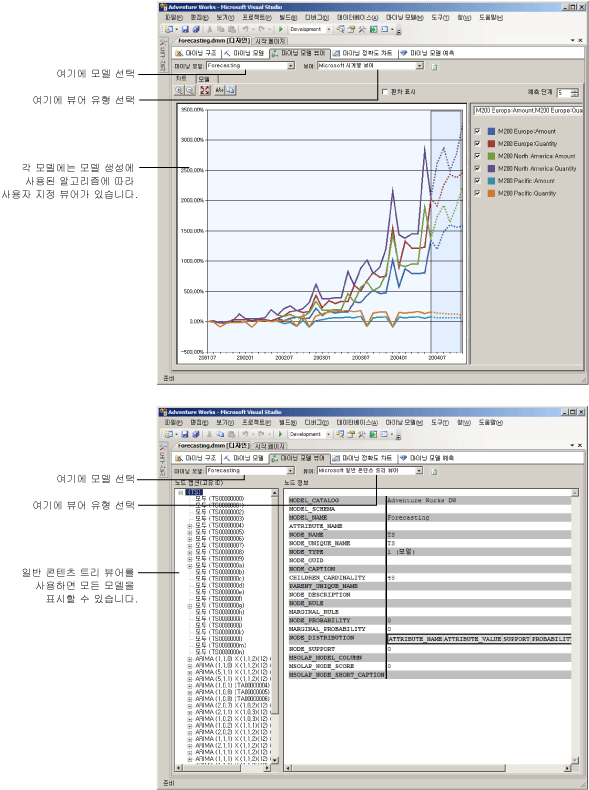

# 데이터 마이닝 모델 뷰어
[!INCLUDE[ssas-appliesto-sqlas](../../includes/ssas-appliesto-sqlas.md)]
  [!INCLUDE[msCoName](../../includes/msconame-md.md)] [!INCLUDE[ssNoVersion](../../includes/ssnoversion-md.md)] [!INCLUDE[ssASnoversion](../../includes/ssasnoversion-md.md)]에서 데이터 마이닝 모델의 성향을 습득한 후 모델에서 관심 있는 추세를 탐색할 수 있습니다. 마이닝 모델의 결과는 복잡하며 원시 형식으로 이해하기 어려울 수 있으므로 데이터를 시각적으로 조사하는 것이 데이터 내에서 알고리즘으로 찾은 규칙과 관계를 가장 쉽게 이해하는 방법일 수 있습니다.  
  
 모델 작성 시 사용하는 알고리즘에 따라 다른 유형의 결과가 반환됩니다. 따라서 [!INCLUDE[ssASnoversion](../../includes/ssasnoversion-md.md)] 에서는 각 알고리즘에 대해 별개의 뷰어를 제공합니다. [!INCLUDE[ssBIDevStudioFull](../../includes/ssbidevstudiofull-md.md)]에서 마이닝 모델을 찾으면 해당 모델의 적절한 뷰어를 사용하여 데이터 마이닝 디자이너의 **마이닝 모델 뷰어** 탭에 해당 모델이 표시됩니다.  
  
## 모델 뷰어 사용 방법  
 먼저 마이닝 모델을 선택한 다음 뷰어를 선택합니다. 항상 각 모델에는 여러 탭을 포함할 수 있는 사용자 지정 뷰어와 일반 뷰어라는 두 개의 뷰어가 있습니다.  
  
 선택한 모델의 유형에 따라 모델을 탐색하는 서로 다른 옵션이 표시됩니다. 각 모델 유형에 연결된 사용자 지정 뷰어는 선택된 데이터 마이닝 모델을 만드는 데 사용한 알고리즘에 맞게 조정됩니다. 각 사용자 지정 뷰어에는 모델의 패턴 및 통계를 탐색하거나, 차트를 보거나, 대화형으로 확률 임계값 작업을 수행하거나, 이름별로 항목을 필터링하여 제외하는 데 도움이 되는 다양한 도구 및 대화 상자가 있습니다.  
  
 다음 다이어그램에서는 같은 모델에 대해 사용자 지정 뷰어와 일반 뷰어를 선택할 때의 차이점을 보여 줍니다.  
  
1.  먼저 Microsoft 시계열 알고리즘을 기반으로 하는 마이닝 모델을 선택할 때 표시되는 사용자 지정 뷰어를 보여 줍니다.  
  
     이 사용자 지정 뷰어에서는 시계열 그래프를 자동으로 만들고 5개의 예측을 제공합니다.  
  
2.  그런 다음 **Microsoft 일반 콘텐츠 트리 뷰어**를 사용하여 표시되는 동일한 모델을 보여 줍니다.  
  
     왼쪽에 있는 일반 뷰어에는 모델에 있는 노드 목록이 표시됩니다. 노드를 클릭하면 해당 내용이 오른쪽 창에 표시됩니다.  
  
   
  
## Microsoft 일반 콘텐츠 트리 뷰어에 대한 자세한 정보  
 [Microsoft 일반 콘텐츠 트리 뷰어&#40;데이터 마이닝&#41;](http://msdn.microsoft.com/library/751b4393-f6fd-48c1-bcef-bdca589ce34c)를 사용하여 각 모델을 볼 수도 있습니다. 이 뷰어에는 표준 HTML 테이블 형식에 따라 마이닝 모델의 내용이 표시됩니다. 모드 정렬과 각 노드의 내용은 결과를 생성하는 데 사용된 알고리즘에 따라 크게 달라집니다.  
  
 사용자 지정 뷰어가 모델을 탐색하고 이해하기 위해 디자인된 반면 일반 뷰어는 이미 모델을 이해하고 있으며 특정 노드에서 통계 또는 규칙을 추출하려고 할 때 보다 유용합니다. 예를 들어 노드 확률, 회귀 수식 등과 같이 [!INCLUDE[ssASnoversion](../../includes/ssasnoversion-md.md)] 에서 분석 중에 캡처하는 패턴 및 통계에 대한 자세한 정보를 보려면 일반 뷰어를 사용합니다.  
  
 이 뷰어에 표시되는 모든 정보를 가져오도록 DMX를 사용하여 *내용 쿼리* 를 작성할 수도 있습니다. 자세한 내용은 [내용 쿼리&#40;데이터 마이닝&#41;](../../analysis-services/data-mining/content-queries-data-mining.md)를 참조하세요.  
  
## 섹션 내용  
 다음 항목에서는 각 뷰어에 대해 자세히 설명하고 각 뷰어에서 정보를 해석하는 방법에 대해 알아봅니다.  
  
 [Microsoft 트리 뷰어를 사용 하 여 모델 찾아보기](../../analysis-services/data-mining/browse-a-model-using-the-microsoft-tree-viewer.md)  
 [!INCLUDE[msCoName](../../includes/msconame-md.md)] 트리 뷰어에 대해 설명합니다. 이 뷰어는 [!INCLUDE[msCoName](../../includes/msconame-md.md)] 의사 결정 트리 알고리즘과 [!INCLUDE[msCoName](../../includes/msconame-md.md)] 선형 회귀 알고리즘을 사용하여 작성된 마이닝 모델을 표시합니다.  
  
 [Microsoft 클러스터 뷰어를 사용 하 여 모델 찾아보기](../../analysis-services/data-mining/browse-a-model-using-the-microsoft-cluster-viewer.md)  
 [!INCLUDE[msCoName](../../includes/msconame-md.md)] 클러스터 뷰어에 대해 설명합니다. 이 뷰어는 [!INCLUDE[msCoName](../../includes/msconame-md.md)] 클러스터링 알고리즘을 사용하여 작성된 마이닝 모델을 표시합니다.  
  
 [Microsoft 시계열 뷰어를 사용 하 여 모델 찾아보기](../../analysis-services/data-mining/browse-a-model-using-the-microsoft-time-series-viewer.md)  
 [!INCLUDE[msCoName](../../includes/msconame-md.md)] 시계열 뷰어에 대해 설명합니다. 이 뷰어는 [!INCLUDE[msCoName](../../includes/msconame-md.md)] 시계열 알고리즘을 사용하여 작성된 마이닝 모델을 표시합니다.  
  
 [Microsoft Naive Bayes 뷰어를 사용 하 여 모델 찾아보기](../../analysis-services/data-mining/browse-a-model-using-the-microsoft-naive-bayes-viewer.md)  
 [!INCLUDE[msCoName](../../includes/msconame-md.md)] Naive Bayes 뷰어에 대해 설명합니다. 이 뷰어는 [!INCLUDE[msCoName](../../includes/msconame-md.md)] Naive Bayes 알고리즘을 사용하여 작성된 마이닝 모델을 표시합니다.  
  
 [Microsoft 시퀀스 클러스터 뷰어를 사용 하 여 모델 찾아보기](../../analysis-services/data-mining/browse-a-model-using-the-microsoft-sequence-cluster-viewer.md)  
 [!INCLUDE[msCoName](../../includes/msconame-md.md)] 시퀀스 클러스터 뷰어에 대해 설명합니다. 이 뷰어는 [!INCLUDE[msCoName](../../includes/msconame-md.md)] 시퀀스 클러스터링 알고리즘을 사용하여 작성된 마이닝 모델을 표시합니다.  
  
 [Microsoft 연결 규칙 뷰어를 사용 하 여 모델 찾아보기](../../analysis-services/data-mining/browse-a-model-using-the-microsoft-association-rules-viewer.md)  
 [!INCLUDE[msCoName](../../includes/msconame-md.md)] 연결 규칙 뷰어에 대해 설명합니다. 이 뷰어는 [!INCLUDE[msCoName](../../includes/msconame-md.md)] 연결 알고리즘을 사용하여 작성된 마이닝 모델을 표시합니다.  
  
 [Microsoft 신경망 뷰어를 사용 하 여 모델 찾아보기](../../analysis-services/data-mining/browse-a-model-using-the-microsoft-neural-network-viewer.md)  
 [!INCLUDE[msCoName](../../includes/msconame-md.md)] 신경망 뷰어에 대해 설명합니다. 이 뷰어는 [!INCLUDE[msCoName](../../includes/msconame-md.md)] 로지스틱 회귀 분석 알고리즘을 사용하는 모델을 포함하여 [!INCLUDE[msCoName](../../includes/msconame-md.md)] 신경망 알고리즘을 사용하여 작성된 마이닝 모델을 표시합니다.  
  
 [Microsoft 일반 콘텐츠 트리 뷰어를 사용 하 여 모델 찾아보기](../../analysis-services/data-mining/browse-a-model-using-the-microsoft-generic-content-tree-viewer.md)  
 모든 데이터 마이닝 모델에 대한 일반 뷰어에서 사용할 수 있는 세부 정보에 대해 설명하고 각 알고리즘의 정보를 해석하는 방법에 대한 예를 제공합니다.  
  
## 관련 항목:  
 [데이터 마이닝 알고리즘&#40;Analysis Services - 데이터 마이닝&#41;](../../analysis-services/data-mining/data-mining-algorithms-analysis-services-data-mining.md)   
 [데이터 마이닝 디자이너](../../analysis-services/data-mining/data-mining-designer.md)  
  
  
