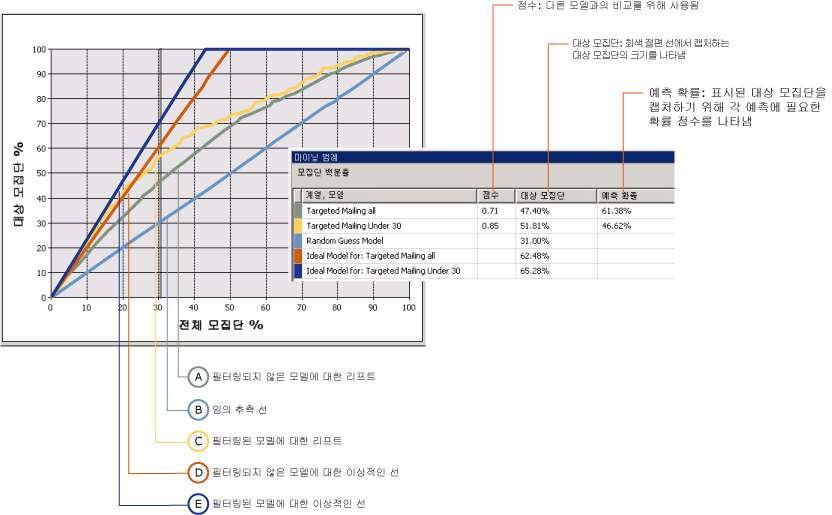
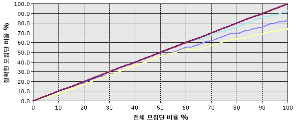

# 리프트 차트(Analysis Services - 데이터 마이닝)
[!INCLUDE[ssas-appliesto-sqlas](../../includes/ssas-appliesto-sqlas.md)]
  A *리프트 chart* 는 임의 추측에 대해 비교할 때 마이닝 모델이 제공하는 향상률을 그래픽으로 나타내며 *리프트* 점수를 기준으로 변화를 측정합니다. 서로 다른 모델에 대한 리프트 점수를 비교하여 가장 적합한 모델을 확인할 수 있습니다. 또한 모델의 예측이 유용하지 않은 지점을 확인할 수 있습니다. 예를 들어 리프트 차트를 검토하면 프로모션 캠페인이 30%의 고객에게만 효과적임을 파악하고 해당 수치를 사용하여 캠페인의 범위를 제한할 수 있습니다.  
  
 [!INCLUDE[ssNoVersion](../../includes/ssnoversion-md.md)] 데이터 마이닝에서는 리프트 차트를 사용하여 동일한 예측 가능한 특성이 있는 여러 모델의 정확도를 비교할 수 있습니다. 단일 결과(예측 가능한 특성의 단일 값)에 대해 또는 모든 결과(지정된 특성의 모든 값)에 대해 예측의 정확도를 평가할 수도 있습니다.  
  
 수익 차트는 리프트 차트와 동일한 정보가 포함된 관련 차트 종류이지만 각 모델 사용과 연관된 수익의 예상 증가치도 보여 줍니다.  
  
##   리프트 차트 이해  
 abstract에서 리프트 차트를 이해하는 것은 어려울 수 있습니다. 따라서 리프트 차트 도구의 사용과 차트의 정보를 설명하기 위해 이 섹션에서는 리프트 차트를 사용하여 타겟 메일링 캠페인에 대한 응답을 평가하는 시나리오를 제공합니다.  
  
 이 시나리오의 마케팅 부서는 10%의 응답률이 메일 캠페인에 일반적임을 알고 있습니다. 이 부서의 데이터베이스에는 10,000명의 잠재적인 고객 목록이 테이블에 저장되어 있는데 일반 응답률을 기준으로 약 1,000명의 잠재 고객만이 응답할 것으로 일반적으로 예상할 수 있습니다. 그러나 데이터베이스에 있는 10,000명의 고객 모두에게 연락하기에는 프로젝트에 대한 예산이 부족하며, 응답률을 높이려고 합니다. 이 시나리오에서는 예산에 따라 5,000명의 고객에게만 광고 메일을 전송할 수 있다고 가정합니다. 마케팅 부서에서는 다음과 같은 두 가지 옵션을 선택할 수 있습니다.  
  
-   임의로 5,000명의 고객을 대상으로 선택합니다.  
  
-   마이닝 모델을 사용하여 응답 가능성이 가장 높은 5,000명의 고객을 대상으로 선택합니다.  
  
 리프트 차트를 사용하면 두 옵션의 예상 결과를 비교할 수 있습니다. 예를 들어, 회사에서 5,000명의 고객을 임의로 선택하는 경우 일반적인 응답률을 기반으로 500개의 응답만 예상할 수 있습니다. 이 시나리오는 리프트 차트에서 *임의* 선으로 나타납니다. 그러나 마케팅 부서에서 마이닝 모델을 사용하여 메일 전송 대상을 결정하는 경우 응답률이 가장 높은 고객을 대상으로 선정할 수 있으므로 훨씬 높은 응답률을 예상할 수 있습니다. 모델이 완벽한 경우 오류가 전혀 없는 예측을 만들 수 있으며 회사는 모델에서 권장하는 1,000명의 잠재적인 고객에게만 메일을 전송하여 1,000개의 응답을 받을 것으로 예상할 수 있습니다. 이 시나리오는 리프트 차트에서 *이상적인* 선으로 나타납니다.  
  
 실제 상황에서는 마이닝 모델이 이러한 두 가지 극단적인 예측, 즉 임의 추측과 완벽한 예측 사이에 해당할 가능성이 높습니다. 임의 추측의 향상률은 리프트로 간주됩니다.  
  
 리프트 차트를 만들면 특정 값을 대상으로 지정하여 해당 결과에 대해서만 리프트를 측정하거나, 가능한 모든 결과에 대해 리프트를 측정하는 모델의 일반 평가를 만들 수 있습니다. 이 선택은 다음 섹션의 설명과 같이 최종 차트에 영향을 미칩니다.  
  
 [맨 위로 이동](#bkmk_Top)  
  
### 대상 값이 있는 리프트 차트  
 다음 차트에서는 **Basic Data Mining Tutorial** 에서 만든 [타겟 메일링](http://msdn.microsoft.com/library/6602edb6-d160-43fb-83c8-9df5dddfeb9c)모델에 대한 리프트 차트를 보여 줍니다. 이 차트에서 대상 특성은 [Bike Buyer]이며 대상 값은 1입니다. 이 값은 고객이 자전거를 구입할 것으로 예상됨을 의미합니다. 따라서 리프트 차트는 이러한 잠재 고객을 식별할 때 모델이 제공하는 향상률을 보여 줍니다.  
  
 이 차트에는 동일한 데이터를 기반으로 여러 모델이 포함됩니다. 이러한 모델 중 하나는 특정 고객을 대상으로 사용자 지정되었습니다. 모델을 학습하는 데 사용되는 데이터에 필터를 추가하여 모델을 사용자 지정할 수 있습니다. 이 필터는 학습 및 평가에 사용되는 사례를 30세 미만의 고객으로 제한합니다. 필터링의 효과 중 하나는 기본 모델과 필터링된 모델이 다른 데이터 집합을 사용하며 따라서 리프트 차트에서 평가에 사용된 사례의 수도 다르다는 것입니다. 예측 결과 및 기타 통계를 해석할 때는 이러한 사실을 반드시 유념해야 합니다.  
  
   
  
 차트의 X축은 예측을 비교하는 데 사용되는 테스트 데이터 집합의 비율을 나타냅니다. 차트의 Y축은 예측되는 값의 비율을 나타냅니다.  
  
 여기에 파란색으로 표시된 대각선은 모든 차트에 나타납니다. 이 선은 임의 추측의 결과를 나타내며 리프트를 평가할 기준선입니다. 리프트 차트에 추가하는 각 모델에 대해 두 개의 선이 있습니다. 첫 번째 선은 항상 완벽하게 예측되는 모델을 만들 수 있는 경우의 학습 데이터 집합에 대한 이상적인 결과를 보여 주며, 두 번째 선은 모델에 대한 결과의 실제 리프트 또는 향상률을 보여 줍니다.  
  
 이 예에서 필터링된 모델에 대한 이상적인 선은 진한 파란색으로 표시되며 실제 리프트에 대한 선은 노란색으로 표시됩니다. 이 차트에서 이상적인 선은 40% 부근에서 꼭지점을 이루는데, 이는 모델이 완벽한 경우 전체 모집단의 40%에 메일을 보낼 때 100%의 대상 고객에 도달할 수 있음을 의미합니다. 모집단의 40%를 대상으로 지정할 경우 필터링된 모델에 대한 실제 리프트는 60%에서 70% 사이이며, 이는 전체 고객 모집단의 40%에 메일을 보낼 때 60 ~ 70%의 대상 고객에 도달할 수 있음을 의미합니다.  
  
 **마이닝 범례** 에는 곡선에 있는 모든 점의 실제 값이 포함되어 있습니다. 회색 세로 막대를 클릭하여 옮기면 측정되는 위치를 바꿀 수 있습니다. 차트에서 회색 선은 30% 지점으로 옮겨졌습니다. 이 지점이 필터링된 모델과 필터링되지 않은 모델 두 가지 모두 가장 효과적인 지점이며, 이 지점 이후 리프트의 양이 감소하기 때문입니다.  
  
 **마이닝 범례** 에는 차트 해석에 도움이 되는 점수와 통계도 포함되어 있습니다. 이러한 결과는 회색 선에서의 모델 정확도를 나타내며 이 시나리오의 경우 회색 선은 전체 테스트 사례의 30%를 포함하는 위치에 있습니다.  
  
|계열 및 마이닝|점수|대상 모집단|예측 확률|  
|-----------------------|-----------|-----------------------|-------------------------|  
|전체 타겟 메일링|0.71|47.40%|61.38%|  
|30세 미만 타겟 메일링|0.85|51.81%|46.62%|  
|임의 추측 모델||31.00%||  
|이상적인 모델: 전체 타겟 메일링||62.48%||  
|이상적인 모델: 30 미만 타겟 메일링||65.28%||  
  
 [맨 위로 이동](#bkmk_Top)  
  
#### 결과 해석  
 이 결과를 보면 모든 사례의 30%에서 측정할 때 일반적인 모델[전체 타겟 메일링]은 대상 모집단의 47.40%에 0대해 자전거 구입 행동을 예측할 수 있습니다. 즉, 데이터베이스에 있는 고객의 30%에게만 타겟 메일링을 보낼 경우 대상의 절반에 조금 못미치게 도달할 수 있습니다. 필터링된 모델을 사용하면 약간 더 나은 결과를 얻을 수 있으며 대상 고객의 약 51%에 도달할 수 있습니다.  
  
 **예측 확률** 값은 “구입할 가능성이 높은” 사례의 고객을 포함하는 데 필요한 임계값을 나타냅니다. 각 사례에 대해 모델은 각 예측의 정확도를 예상하여 이 값을 저장합니다. 이 값은 고객을 걸러내거나 대상으로 지정하는 데 사용할 수 있습니다. 예를 들어 기본 모델에서 구입할 가능성이 높은 고객을 식별하려면 예측 확률이 61% 이상인 사례를 검색하는 쿼리를 사용하면 됩니다. 필터링된 모델에 의해 대상으로 지정된 고객을 가져오려면 모든 조건, 즉 나이와 최소 46%의 **PredictProbability** 값을 모두 충족하는 사례를 검색하는 쿼리를 만들면 됩니다.  
  
 모델을 비교해 보면 흥미롭습니다. 필터링된 모델은 더 많은 잠재 고객을 잡아내는 것으로 나타나지만 46%의 예측 확률 점수로 고객을 대상으로 지정할 경우 자전거를 구입하지 않을 사람에게 메일을 보낼 가능성도 53%가 됩니다. 따라서 어느 모델이 더 나은지 결정해야 한다면 기본 모델의 선택력, 그리고 필터링된 모델의 높은 정확도 및 작은 대상 크기를 상호 비교 평가해야 합니다.  
  
 **점수** 값은 정규화된 모집단에 대한 모델의 효율성을 계산하는 방법으로 모델을 비교하는 데 도움이 됩니다. 점수는 높을수록 더 좋으므로 이 사례에서는 30세 미만의 고객을 대상으로 지정하는 방법이 낮은 예측 확률에도 불구하고 가장 효율적인 전략이라고 판단할 수 있습니다.  
  
#### 점수 계산 방법  
 점수는 x축에는 실제 값이 포함되고 y축에는 예측 값이 포함되며 각 요소에 연결된 확률이 있는 산점도를 구성하는 모든 요소의 기하 평균 점수로 계산됩니다.  
  
 모든 개별 요소 점수의 통계적 의미는 해당 지점에서 측정된 모델에 대한 예측 리프트입니다. 모든 요소의 평균은 모델에 대한 점수를 구성합니다.  
  
 [맨 위로 이동](#bkmk_Top)  
  
### 대상 값이 없는 모델에 대한 리프트 차트  
 예측 가능한 열의 상태를 지정하지 않은 경우에는 다음 다이어그램에 표시된 차트 종류를 만들어야 합니다. 이 차트는 예측 가능한 특성의 모든 상태에 대한 모델의 성능을 보여 줍니다. 예를 들어 이 차트는 자전거를 구입할 가능성이 높은 고객과 구입할 가능성이 낮은 고객을 모델이 얼마나 잘 예측하는지 보여 줍니다.  
  
 X축은 예측 가능한 열이 지정된 차트에서와 동일하지만 Y축은 정확한 예측의 비율을 나타냅니다. 따라서 이상적인 선은 대각선이며, 이 선은 모델이 데이터의 50%에서 사례의 50%(예측 가능한 최대값)를 정확히 예측함을 보여 줍니다.  
  
   
  
 차트를 클릭하여 회색 세로 막대를 옮길 수 있으며 **마이닝 범례** 는 전체 사례의 비율과 정확하게 예측된 사례의 비율을 표시합니다. 예를 들어 회색 슬라이더를 50% 표시 지점에 놓으면 **마이닝 범례** 는 다음과 같은 정확도 점수를 표시합니다. 이 수치는 기본 데이터 마이닝 자습서에서 만든 TM_Decision 트리 모델을 기반으로 합니다.  
  
|계열, 모델|점수|대상 모집단|예측 확률|  
|-------------------|-----------|-----------------------|-------------------------|  
|TM_Decision 트리|0.77|40.50%|72.91%|  
|이상적인 모델||50.00%||  
  
 이 표를 보면 모델이 모집단의 50%에서 정확히 사례의 40%를 예측함을 알 수 있습니다. 이 모델은 꽤 정확한 모델로 볼 수 있습니다. 그러나 이 특정 모델은 예측 가능한 특성의 모든 값을 예측한다는 점을 유의하십시오. 따라서 고객의 90%가 자전거를 구입하지 않을 것이란 이 모델의 예측이 정확할 수도 있습니다.  
  
 [맨 위로 이동](#bkmk_Top)  
  
### 리프트 차트에 대한 제한 사항  
 리프트 차트에서 예측 가능한 특성은 불연속 값이어야 합니다. 다시 말해서 리프트 차트를 사용하여 연속 숫자 값을 예측하는 모델의 정확도를 측정할 수 없습니다.  
  
 예측 가능한 특성의 모든 불연속 값에 대한 예측 정확도는 한 줄로 표시됩니다. 예측 가능한 특성의 개별적인 값에 대한 예측 정확도 선을 보려면 각 대상 값에 대해 별도의 리프트 차트를 만들어야 합니다.  
  
 동일한 예측 가능한 특성을 가진 여러 모델을 리프트 차트에 추가할 수 있습니다. 특성을 공유하지 않는 모델은 **입력** 탭에서 선택할 수 없습니다.  
  
 리프트 차트 또는 수익 차트에는 시계열 모델을 표시할 수 없습니다. 시계열 예측의 정확도를 측정하기 위한 일반적인 방법은 기록 데이터의 일부를 예약하고 해당 데이터를 예측과 비교하는 것입니다. 자세한 내용은 [Microsoft Time Series Algorithm](../../analysis-services/data-mining/microsoft-time-series-algorithm.md)을 참조하세요.  
  
### 관련 내용  
 [맨 위로 이동](#bkmk_Top)  
  
## 관련 항목:  
 [테스트 및 유효성 검사&#40;데이터 마이닝&#41;](../../analysis-services/data-mining/testing-and-validation-data-mining.md)  
  
  
