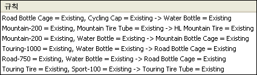

# Microsoft 연결 알고리즘
[!INCLUDE[ssas-appliesto-sqlas](../../includes/ssas-appliesto-sqlas.md)]
  [!INCLUDE[msCoName](../../includes/msconame-md.md)] 연결 알고리즘은 추천 엔진에 자주 사용되는 알고리즘입니다. 추천 엔진은 고객이 이미 구입한 항목 또는 관심을 나타낸 항목을 바탕으로 고객에게 항목을 추천합니다. [!INCLUDE[msCoName](../../includes/msconame-md.md)] 연결 알고리즘은 시장 바구니 분석에도 유용합니다.   
  
 연결 모델은 개별 사례 및 사례에 포함된 항목 모두에 대한 식별자를 포함하는 데이터 세트를 기반으로 작성됩니다. 사례에 포함된 항목 그룹을 *항목 집합*이라고 합니다. 연결 모델은 일련의 항목 집합과 이러한 항목이 사례 내에서 그룹화되는 방법을 설명하는 규칙으로 구성됩니다. 알고리즘이 식별하는 규칙은 고객의 쇼핑 카트에 이미 들어 있는 항목을 바탕으로 고객의 향후 구매 항목을 예측하는 데 사용할 수 있습니다. 다음 다이어그램에서는 항목 집합에 포함된 일련의 규칙을 보여 줍니다.  
  
   
  
 다이어그램에서와 같이 [!INCLUDE[msCoName](../../includes/msconame-md.md)] 연결 알고리즘을 사용하여 데이터 세트 내에 있는 많은 규칙을 찾을 수 있습니다. 알고리즘은 지지도 매개 변수 및 확률 매개 변수를 사용하여 알고리즘이 생성하는 항목 집합 및 규칙을 설명합니다. 예를 들어 쇼핑 카트에 들어 있을 수 있는 두 항목을 X와 Y라고 할 때 지지도 매개 변수는 X 항목과 Y 항목의 조합을 포함하는 데이터 세트 내 사례 수입니다. 알고리즘은 생성되는 항목 세트 수를 사용자 정의 매개 변수 *MINIMUM_SUPPORT* 및 *MAXIMUM_SUPPORT,* 와 함께 지지도 매개 변수를 사용하여 제어합니다. *신뢰도*라고도 하는 확률 매개 변수는 X와 Y를 포함하는 데이터 집합 내 사례의 일부를 나타냅니다. 알고리즘은 *MINIMUM_PROBABILITY* 매개 변수와 함께 확률 매개 변수를 사용하여 생성되는 규칙 수를 제어합니다.  
  
## 예제  
 [!INCLUDE[ssSampleDBCoShort](../../includes/sssampledbcoshort-md.md)] Cycle사에서 웹 사이트의 기능을 다시 디자인하고 있습니다. 이번 디자인은 제품의 판매량 증가를 목표로 하고 있습니다. 회사의 트랜잭션 데이터베이스에 모든 판매가 기록되기 때문에 [!INCLUDE[msCoName](../../includes/msconame-md.md)] 연결 알고리즘을 사용하여 함께 구매될 가능성이 높은 제품 집합을 식별할 수 있습니다. 그런 다음 고객의 시장 바구니에 이미 들어 있는 항목을 바탕으로 고객이 관심을 가질 만한 추가 항목을 예측할 수 있습니다.  
  
## 알고리즘 작동 방법  
 [!INCLUDE[msCoName](../../includes/msconame-md.md)] 연결 알고리즘은 데이터 집합을 이동하여 사례에 함께 나타나는 항목을 찾습니다. 그런 다음 *MINIMUM_SUPPORT* 매개 변수에 의해 지정된 최소 사례 수에 나타나는 관련 항목을 항목 집합으로 그룹화합니다. 예를 들어 항목 집합이 "Mountain 200=Existing, Sport 100=Existing"이고 지지도 매개 변수 값이 710인 경우 이 알고리즘은 해당 항목 집합에서 규칙을 생성합니다. 이러한 규칙은 알고리즘이 중요하다고 식별하는 다른 특정 항목의 존재 여부를 바탕으로 데이터베이스에 특정 항목이 존재하는지 여부를 예측하는 데 사용됩니다. 예를 들어 규칙이 "if Touring 1000=existing and Road bottle cage=existing, then Water bottle=existing"이고 확률 매개 변수 값이 0.812인 경우 알고리즘은 장바구니에 Touring 1000 Tire 및 Road Bottle Cage가 들어 있음을 식별하고 Water Bottle도 장바구니에 포함될 가능성이 높음을 예측합니다.  
  
 알고리즘에 대한 자세한 내용 및 알고리즘 동작을 사용자 지정하고 마이닝 모델의 결과를 제어하기 위한 매개 변수 목록은 [Microsoft 연결 알고리즘 기술 참조](../../analysis-services/data-mining/microsoft-association-algorithm-technical-reference.md)를 참조하세요.  
  
## 연결 모델에 필요한 데이터  
 연결 규칙 모델에 사용할 데이터를 준비할 때는 필요한 데이터의 양과 사용법을 비롯하여 특정 알고리즘의 요구 사항을 알고 있어야 합니다.  
  
 연결 규칙 모델의 요구 사항은 다음과 같습니다.  
  
-   **단일 키 열** 각 모델은 각 레코드를 고유하게 식별하는 숫자 또는 텍스트 열을 하나 포함해야 합니다. 복합 키는 사용할 수 없습니다.  
  
-   **단일 예측 가능한 열** 연결 모델은 예측 가능한 열을 한 개만 포함할 수 있습니다. 일반적으로 이 열은 구매한 제품을 나열하는 필드와 같은 중첩 테이블의 키 열로, 값은 Discrete 또는 Discretized여야 합니다.  
  
-   **입력 열** 입력 열은 불연속 열이어야 합니다. 연결 모델에 대한 입력 데이터가 두 개의 테이블에 포함되는 경우가 자주 있습니다. 예를 들어 한 테이블은 고객 정보를 포함하고 다른 테이블은 고객 구매 내역을 포함할 수 있습니다. 중첩 테이블을 사용하여 이 데이터를 모델에 입력할 수 있습니다. 중첩 테이블에 대한 자세한 내용은 [중첩 테이블&#40;Analysis Services - 데이터 마이닝&#41;](../../analysis-services/data-mining/nested-tables-analysis-services-data-mining.md)을 참조하세요.  
  
 연결 모델에 대해 지원되는 콘텐츠 형식 및 데이터 형식에 대한 자세한 내용은 [Microsoft 연결 알고리즘 기술 참조](../../analysis-services/data-mining/microsoft-association-algorithm-technical-reference.md)의 요구 사항 섹션을 참조하세요.  
  
## 연결 모델 보기  
 **Microsoft 연결 뷰어**를 사용하여 모델을 탐색할 수 있습니다. 연결 모델을 볼 때 [!INCLUDE[ssASnoversion](../../includes/ssasnoversion-md.md)] 에서는 데이터에서 발견된 관계와 규칙을 보다 잘 이해할 수 있도록 상관 관계를 다른 관점에서 표시합니다. 뷰어의 **항목 집합** 창에는 가장 일반적인 조합 또는 항목 집합에 대한 자세한 분류가 표시됩니다. **규칙** 창에는 데이터로부터 일반화된 규칙 목록이 표시되고 확률 계산이 추가되며 상대적 중요도에 따라 규칙 순위가 매겨집니다. 종속성 네트워크 뷰어에서는 서로 다른 개별 항목이 연결되는 방식을 시각적으로 살펴볼 수 있습니다. 자세한 내용은 [Microsoft 클러스터 뷰어를 사용하여 모델 찾아보기](../../analysis-services/data-mining/browse-a-model-using-the-microsoft-cluster-viewer.md)를 참조하세요.  
  
 항목 집합 및 규칙에 대한 자세한 내용을 보려면 [Microsoft 일반 콘텐츠 트리 뷰어](../../analysis-services/data-mining/browse-a-model-using-the-microsoft-generic-content-tree-viewer.md)에서 모델을 살펴 보십시오. 모델에 대해 각 항목 집합에 대한 지지도, 각 규칙의 점수, 기타 통계 등의 콘텐츠가 저장됩니다. 자세한 내용은 [연결 모델에 대한 마이닝 모델 콘텐츠&#40;Analysis Services - 데이터 마이닝&#41;](../../analysis-services/data-mining/mining-model-content-for-association-models-analysis-services-data-mining.md)를 참조하세요.  
  
## 예측 만들기  
 모델이 처리된 후에는 규칙 및 항목 집합을 사용하여 예측을 만들 수 있습니다. 연결 모델에서는 예측을 통해 지정된 항목이 있을 경우 발생할 가능성이 있는 항목을 파악할 수 있습니다. 예측에는 확률, 지지도 또는 중요도와 같은 정보가 포함될 수 있습니다. 연결 모델에 대한 쿼리를 만드는 방법에 대한 예는 [연결 모델 쿼리 예제](../../analysis-services/data-mining/association-model-query-examples.md)를 참조하세요.  
  
 데이터 마이닝 모델에 대한 쿼리를 만드는 방법은 [데이터 마이닝 쿼리](../../analysis-services/data-mining/data-mining-queries.md)를 참조하세요.  
  
## 성능  
 항목 집합을 만들고 상관 관계 수를 계산하는 프로세스는 시간이 많이 걸릴 수 있습니다. [!INCLUDE[msCoName](../../includes/msconame-md.md)] 연결 규칙 알고리즘은 최적화 기술을 사용하여 공간을 절약하고 처리 속도를 높이기는 했지만 다음과 같은 상황에서는 성능 문제가 발생할 수 있습니다.  
  
-   개별 항목을 많이 포함하여 데이터 집합이 클 경우  
  
-   최소 항목 집합 크기가 너무 작게 설정된 경우  
  
 처리 시간을 최소화하고 항목 집합의 복잡성을 줄이려면 데이터를 분석하기 전에 관련 항목을 범주별로 그룹화해 보십시오.  
  
## Remarks  
  
-   PMML(Predictive Model Markup Language)을 사용한 마이닝 모델 생성은 지원하지 않습니다.  
  
-   드릴스루를 지원합니다.  
  
-   OLAP 마이닝 모델의 사용을 지원합니다.  
  
-   데이터 마이닝 차원의 생성을 지원합니다.  
  
## 관련 항목  
 [데이터 마이닝 알고리즘&#40;Analysis Services - 데이터 마이닝&#41;](../../analysis-services/data-mining/data-mining-algorithms-analysis-services-data-mining.md)   
 [Microsoft 연결 규칙 뷰어를 사용하여 모델 찾아보기](../../analysis-services/data-mining/browse-a-model-using-the-microsoft-association-rules-viewer.md)   
 [연결 모델에 대한 마이닝 모델 콘텐츠&#40;Analysis Services - 데이터 마이닝&#41;](../../analysis-services/data-mining/mining-model-content-for-association-models-analysis-services-data-mining.md)   
 [Microsoft 연결 알고리즘 기술 참조](../../analysis-services/data-mining/microsoft-association-algorithm-technical-reference.md)   
 [연결 모델 쿼리 예제](../../analysis-services/data-mining/association-model-query-examples.md)  
  
  
