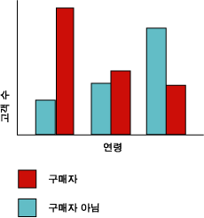
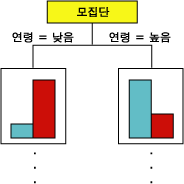
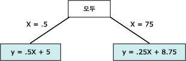

# Microsoft 의사 결정 트리 알고리즘
  [!INCLUDE[msCoName](../../includes/msconame-md.md)] 의사 결정 트리 알고리즘은 불연속 특성 및 연속 특성 모두의 예측 모델링에 사용하기 위해 분류 및 회귀 알고리즘입니다.  
  
 불연속 특성의 경우 알고리즘은 데이터 집합 내 입력 열 간의 관계를 기반으로 예측합니다. 이 알고리즘은 해당 열의 값인 상태를 사용하여 사용자가 예측 가능으로 지정하는 열의 상태를 예측합니다. 특히 알고리즘은 예측 가능한 열과 상관 관계에 있는 입력 열을 식별합니다. 예를 들어 자전거를 구입할 가능성이 높은 고객을 예측하는 시나리오에서 청년층 고객의 경우 10명 중 9명이 자전거를 구입한 반면 중장년층 고객의 경우 10명 중 2명만이 자전거를 구입했다면 알고리즘은 자전거 구입에 있어 연령이 좋은 지표가 될 수 있음을 유추합니다. 의사 결정 트리에서는 이러한 경향을 기반으로 특정 결과를 예측합니다.  
  
 연속 특성의 경우 알고리즘은 선형 회귀를 사용하여 의사 결정 트리의 분할 위치를 결정합니다.  
  
 둘 이상의 열을 예측 가능으로 설정한 경우 또는 입력 데이터에 예측 가능으로 설정된 중첩 테이블이 포함된 경우 알고리즘은 각 예측 가능한 열에 대해 별도의 의사 결정 트리를 작성합니다.  
  
## 예제  
 [!INCLUDE[ssSampleDBCoFull](../../includes/sssampledbcofull-md.md)] 사의 마케팅 부서에서는 이전 고객이 향후에 제품을 구입할지 여부를 나타낼 수 있는 고객 특징을 식별하려고 합니다. [!INCLUDE[ssSampleDBnormal](../../includes/sssampledbnormal-md.md)] 데이터베이스는 이전 고객에 대한 인구 통계 정보를 저장합니다. [!INCLUDE[msCoName](../../includes/msconame-md.md)] 의사 결정 트리 알고리즘을 사용하여 이러한 정보를 분석하면 마케팅 부서에서는 인구 통계적 패턴 및 과거 구매 패턴과 같이 해당 고객에 대해 알려진 열의 상태를 기반으로 특정 고객의 제품 구매 여부를 예측하는 모델을 작성할 수 있습니다.  
  
## 알고리즘 작동 방법  
 [!INCLUDE[msCoName](../../includes/msconame-md.md)] 의사 결정 트리 알고리즘은 트리에 분할 집합을 만들어 데이터 마이닝 모델을 작성합니다. 이러한 분할은 *노드*로 표시됩니다. 이 알고리즘은 예측 가능한 열과 깊은 상관 관계에 있는 입력 열을 발견할 때마다 모델에 노드를 추가합니다. 알고리즘이 분할을 결정하는 방법은 예측하는 열이 연속 열인지, 아니면 불연속 열인지에 따라 달라집니다.  
  
 [!INCLUDE[msCoName](../../includes/msconame-md.md)] 의사 결정 트리 알고리즘은 *기능 선택* 을 사용하여 가장 유용한 특성이 선택되도록 안내합니다. 분석 품질 및 성능을 향상시키기 위해 기능 선택은 모든 [!INCLUDE[ssNoVersion](../../includes/ssnoversion-md.md)] Data Mining algorithms to improve performance and the quality of analysis. 기능 선택은 중요하지 않은 특성이 프로세서 시간을 사용하는 것을 방지하는 데 중요합니다. 데이터 마이닝 모델을 디자인할 때 너무 많은 입력 또는 예측 가능한 특성을 사용할 경우 모델을 처리하는 데 너무 오래 걸리거나 메모리가 부족해질 수 있습니다. 트리를 분할할지 여부를 결정하는 데 사용되는 방법에는 *entropy* 및 Bayesian 네트워크에 대한 업계 표준 메트릭이 포함됩니다*.* 의미 있는 특성을 선택한 다음 특성의 점수와 순위를 매기는 데 사용되는 방법은 [기능 선택&#40;데이터 마이닝&#41;](../../analysis-services/data-mining/feature-selection-data-mining.md)을 참조하세요.  
  
 데이터 마이닝 모델의 일반적인 문제는 학습 데이터의 작은 차이에도 모델이 너무 민감해져서 *과도한 맞춤* 또는 *과도한 학습*이 수행된다는 것입니다. 과도한 맞춤이 수행된 모델은 다른 데이터 집합에 대해 일반화될 수 없습니다. 특정 데이터 집합에 대해 과잉 맞춤이 수행되지 않도록 하기 위해 [!INCLUDE[msCoName](../../includes/msconame-md.md)] 의사 결정 트리 알고리즘은 트리 증가를 제어하기 위한 기술을 사용합니다. [!INCLUDE[msCoName](../../includes/msconame-md.md)] 의사 결정 트리 알고리즘 작동 방법은 [Microsoft 의사 결정 트리 알고리즘 기술 참조](../../analysis-services/data-mining/microsoft-decision-trees-algorithm-technical-reference.md)를 참조하세요.  
  
### 불연속 열 예측  
 [!INCLUDE[msCoName](../../includes/msconame-md.md)] 의사 결정 트리 알고리즘이 예측 가능한 불연속 열에 대한 트리를 작성하는 방법은 히스토그램을 사용하여 설명할 수 있습니다. 다음 다이어그램에서는 입력 열인 Age에 대해 예측 가능한 열인 Bike Buyer를 표시하는 히스토그램을 보여 줍니다. 이 히스토그램에서는 고객의 연령으로 고객이 자전거를 구입할지 여부를 구분할 수 있음을 보여 줍니다.  
  
   
  
 다이어그램에 표시된 상관 관계로 인해 [!INCLUDE[msCoName](../../includes/msconame-md.md)] 의사 결정 트리 알고리즘은 모델에 새 노드를 만듭니다.  
  
   
  
 알고리즘이 모델에 새 노드를 추가함에 따라 트리 구조가 형성됩니다. 트리의 최상위 노드는 전체 고객 모집단에 대한 예측 가능한 열의 분석에 대해 설명합니다. 모델이 커짐에 따라 알고리즘은 모든 열을 고려하게 됩니다.  
  
### 연속 열 예측  
 [!INCLUDE[msCoName](../../includes/msconame-md.md)] 의사 결정 트리 알고리즘이 예측 가능한 연속 열을 기반으로 트리를 작성하는 경우 각 노드에는 회귀 수식이 포함됩니다. 분할은 회귀 수식의 비선형점에서 발생합니다. 예를 들어 다음 다이어그램을 참조하십시오.  
  
   
  
 표준 회귀 모델에서 전체 데이터에 대한 관계 및 추세를 나타내는 단일 수식을 파생하려고 합니다.  그러나 단일 수식은 복잡한 데이터에서 불연속성을 제대로 캡처하지 못할 수 있습니다. 대신 [!INCLUDE[msCoName](../../includes/msconame-md.md)] 의사 결정 트리 알고리즘은 트리에서 주로 선형인 세그먼트를 찾아 이러한 세그먼트에 대한 별도 수식을 만듭니다. 서로 다른 세그먼트로 데이터를 분할하여 모델에서 데이터를 보다 잘 나타낼 수 있습니다.  
  
 다음 다이어그램은 위 산점도의 모델에 대한 트리 다이어그램을 나타냅니다.  이 모델에서는 두 개의 서로 다른 수식(왼쪽 분기에 수식 y = .5x x 5 및 오른쪽 분기에 수식 y = .25x + 8.75)을 제공하여 결과를 예측합니다. 산점도에서 두 선이 만나는 점이 비선형점이며 이 점에서 의사 결정 트리 모델의 노드가 분할됩니다.  
  
   
  
 이 모델은 두 개의 선형 수식만 있는 간단한 모델이므로 **All** 노드 다음에 바로 트리가 분할됩니다. 그러나 분할은 트리의 모든 수준에서 발생할 수 있습니다. 즉, 여러 수준 및 노드를 포함하는 트리에서 각 노드의 특징은 서로 다른 특성 컬렉션에 의해 지정되고 수식은 여러 노드 간에 공유될 수 있으며 단일 노드에만 적용할 수도 있습니다. 예를 들어 "특정 연령 및 특정 수입 이상인 고객"으로 정의된 노드에 대한 수식을 하나 가져오고, "통근 거리가 먼 고객"을 나타내는 노드에서 또 다른 수식을 가져올 수 있습니다. 개별 노드 또는 세그먼트에 대한 수식을 보려면 노드를 클릭하면 됩니다.  
  
## 의사 결정 트리 모델에 필요한 데이터  
 의사 결정 트리 모델에 사용할 데이터를 준비할 때는 필요한 데이터의 양과 사용법을 비롯하여 특정 알고리즘의 요구 사항을 알고 있어야 합니다.  
  
 의사 결정 트리 모델의 요구 사항은 다음과 같습니다.  
  
-   **단일 키 열** 각 모델은 각 레코드를 고유하게 식별하는 숫자 또는 텍스트 열을 하나 포함해야 합니다. 복합 키는 사용할 수 없습니다.  
  
-   **예측 가능한 열** 하나 이상의 예측 가능한 열이 필요합니다. 여러 예측 가능한 특성을 모델에 포함할 수 있으며 예측 가능한 특성은 다른 유형(숫자 또는 불연속)이 될 수 있습니다. 그러나 예측 가능한 특성 수를 늘리면 처리 시간이 증가할 수 있습니다.  
  
-   **입력 열** 불연속 또는 연속일 수 있는 입력 열이 필요합니다. 입력 특성 수를 늘리면 처리 시간이 영향을 받습니다.  
  
 의사 결정 트리 모델에 대해 지원되는 콘텐츠 형식 및 데이터 형식에 대한 자세한 내용은 [Microsoft 의사 결정 트리 알고리즘 기술 참조](../../analysis-services/data-mining/microsoft-decision-trees-algorithm-technical-reference.md)의 요구 사항 섹션을 참조하세요.  
  
## 의사 결정 트리 모델 보기  
 **Microsoft 트리 뷰어**를 사용하여 모델을 탐색할 수 있습니다. 모델에서 여러 트리를 생성할 경우 하나의 트리를 선택하면 각 예측 가능한 특성에 대해 사례가 범주화되는 방법에 대한 분석이 뷰어에 표시됩니다. 또한 종속성 네트워크 뷰어를 사용하여 트리의 상호 작용을 볼 수 있습니다. 자세한 내용은 [Microsoft 트리 뷰어를 사용하여 모델 찾아보기](../../analysis-services/data-mining/browse-a-model-using-the-microsoft-tree-viewer.md)를 참조하세요.  
  
 트리의 분기 또는 노드에 대한 세부 정보를 보려면 [Microsoft 일반 콘텐츠 트리 뷰어](../../analysis-services/data-mining/browse-a-model-using-the-microsoft-generic-content-tree-viewer.md)를 사용하여 모델을 탐색할 수도 있습니다. 각 노드의 모든 값에 대한 분포, 트리의 각 수준에서의 확률, 연속 특성에 대한 회귀 수식 등의 콘텐츠가 모델에 대해 저장됩니다. 자세한 내용은 [의사 결정 트리 모델에 대한 마이닝 모델 콘텐츠&#40;Analysis Services - 데이터 마이닝&#41;](../../analysis-services/data-mining/mining-model-content-for-decision-tree-models-analysis-services-data-mining.md)로 표시됩니다.  
  
## 예측 만들기  
 모델을 처리한 후에는 해당 결과가 일련의 패턴 및 통계로 저장되며 이를 사용하여 관계를 탐색하거나 예측을 만들 수 있습니다.  
  
 의사 결정 트리 모델에서 사용하는 쿼리의 예제는 [의사 결정 트리 모델 쿼리 예제](../../analysis-services/data-mining/decision-trees-model-query-examples.md)를 참조하세요.  
  
 마이닝 모델에 대한 쿼리를 만드는 방법에 대한 일반적인 내용은 [데이터 마이닝 쿼리](../../analysis-services/data-mining/data-mining-queries.md)를 참조하세요.  
  
## 주의  
  
-   PMML(Predictive Model Markup Language)을 사용하여 마이닝 모델을 만들 수 있습니다.  
  
-   드릴스루를 지원합니다.  
  
-   OLAP 마이닝 모델의 사용과 마이닝 모델 차원의 생성을 지원합니다.  
  
## 관련 항목:  
 [데이터 마이닝 알고리즘&#40;Analysis Services - 데이터 마이닝&#41;](../../analysis-services/data-mining/data-mining-algorithms-analysis-services-data-mining.md)   
 [Microsoft 의사 결정 트리 알고리즘 기술 참조](../../analysis-services/data-mining/microsoft-decision-trees-algorithm-technical-reference.md)   
 [의사 결정 트리 모델 쿼리 예제](../../analysis-services/data-mining/decision-trees-model-query-examples.md)   
 [의사 결정 트리 모델에 대한 마이닝 모델 콘텐츠&#40;Analysis Services - 데이터 마이닝&#41;](../../analysis-services/data-mining/mining-model-content-for-decision-tree-models-analysis-services-data-mining.md)  
  
  

