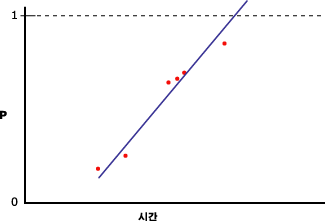
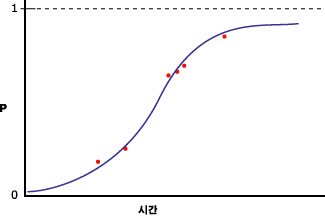

# <a name="microsoft-logistic-regression-algorithm-technical-reference"></a>Microsoft 로지스틱 회귀 알고리즘 기술 참조
[!INCLUDE[ssas-appliesto-sqlas](../../includes/ssas-appliesto-sqlas.md)]
  [!INCLUDE[msCoName](../../includes/msconame-md.md)] 로지스틱 회귀 분석 알고리즘은 [!INCLUDE[msCoName](../../includes/msconame-md.md)] 신경망 알고리즘의 변형으로, *HIDDEN_NODE_RATIO* 매개 변수가 0으로 설정됩니다. 이렇게 설정하면 숨겨진 계층을 포함하지 않으므로 로지스틱 회귀와 동등한 신경망 모델이 생성됩니다.  
  
## <a name="implementation-of-the-microsoft-logistic-regression-algorithm"></a>Microsoft 로지스틱 회귀 알고리즘 구현  
 예측 가능한 열에 포함된 상태가 두 개뿐이지만 예측 가능한 열에 특정 상태가 포함될 확률과 입력 열을 연결하여 회귀 분석을 수행한다고 가정합니다. 다음 다이어그램에서는 예측 가능한 열의 상태에 1과 0을 할당하고 열에 특정 상태가 포함될 확률을 계산한 다음 입력 변수에 대해 선형 회귀를 수행할 경우 나타나는 결과를 보여 줍니다.  
  
   
  
 x축은 입력 열의 값을 포함합니다. y축은 예측 가능한 열이 특정 상태일 확률을 포함합니다. 이 경우 선형 회귀가 열의 최대값과 최소값인 0과 1 사이에 있도록 열을 제한하지 않는다는 문제점이 있습니다. 이 문제를 해결하는 방법은 로지스틱 회귀를 수행하는 것입니다. 선형 회귀 분석은 직선을 만드는 대신 최대 및 최소 제약 조건이 포함된 "S"자 곡선을 만듭니다. 예를 들어 다음 다이어그램에서는 이전 예에 사용된 것과 동일한 데이터에 대해 로지스틱 회귀를 수행할 경우 나타나는 결과를 보여 줍니다.  
  
   
  
 곡선이 0과 1 사이에서 유지됩니다. 로지스틱 회귀를 사용하면 예측 가능한 열의 상태를 결정할 때 어떤 입력 열이 중요한지 설명할 수 있습니다.  
  
### <a name="feature-selection"></a>기능 선택  
 모든 Analysis Services 데이터 마이닝 알고리즘에서는 자동으로 기능 선택을 사용하여 분석을 향상시키고 처리 로드를 줄입니다. 로지스틱 회귀 모델의 기능 선택에 사용되는 방법은 특성의 데이터 형식에 따라 달라집니다. 로지스틱 회귀는 Microsoft 신경망 알고리즘을 기반으로 하므로 신경망에 적용되는 기능 선택 방법 중 일부를 사용합니다. 자세한 내용은 [기능 선택&#40;데이터 마이닝&#41;](../../analysis-services/data-mining/feature-selection-data-mining.md)을 참조하세요.  
  
### <a name="scoring-inputs"></a>입력 점수 매기기  
 신경망 모델 또는 로지스틱 회귀 모델의 컨텍스트에서*점수 매기기* 는 데이터에 있는 값을 동일한 배율을 사용하는 값 집합으로 변환하여 각 값을 비교할 수 있게 해 주는 프로세스를 의미합니다. 예를 들어 Income의 입력 범위는 0에서 100,000 사이이고 [Number of Children]의 입력 범위는 0에서 5 사이라고 가정합니다. 이 변환 프로세스를 사용하면 값의 차이에 관계없이 각 입력의 중요도를 비교할 수 있습니다.  
  
 모델은 학습 집합에 나타나는 각 상태에 대해 입력을 생성합니다. 불연속 또는 불연속화된 입력의 경우 학습 집합에서 누락 상태가 한 번 이상 나타나면 Missing 상태를 나타내기 위해 추가 입력이 만들어집니다. 연속 입력의 경우 최대 두 개의 입력 노드가 만들어집니다. 하나는 Missing 값(학습 데이터에 있는 경우)에 대한 입력을 포함하고, 다른 하나는 존재하는, 즉 Null이 아닌 모든 값에 대한 입력을 포함합니다. 각 입력은 z 점수 정규화 방법, `(x – μ)\StdDev`을 사용하여 숫자 형식으로 배율이 지정됩니다.  
  
 z 점수 정규화 도중에는 전체 학습 집합을 대상으로 평균(μ) 및 표준 편차를 구합니다.  
  
 **연속 값**  
  
 값이 있음:   `(X – μ)/σ ` (X는 인코딩할 실제 값임)  
  
 값이 없음:    `-   μ/σ `  (음의 mu를 시그마로 나눔)  
  
 **불연속 값**  
  
 `μ = p`  (상태의 사전 확률)  
  
 StdDev  `= sqrt(p\(1-p))`  
  
 값이 있음:     `\(1 – μ)/σ` (1에서 mu를 뺀 다음 시그마로 나눔)  
  
 값이 없음:     `(– μ)/σ` (음의 mu를 시그마로 나눔)  
  
### <a name="understanding-logistic-regression-coefficients"></a>로지스틱 회귀 계수 이해  
 통계 자료에서는 다양한 방법으로 로지스틱 회귀를 수행할 수 있지만 모든 방법에서 중요한 부분은 모델의 적합도를 평가하는 것입니다. 교차비와 공변량 패턴 간에는 다양한 적합도 통계가 제안됩니다. 모델의 적합도를 측정하는 방법에 대한 설명은 이 항목에서 다루지 않습니다. 그러나 모델에서 계수 값을 검색하고 이 값을 사용하여 고유한 적합도 측정 방법을 디자인할 수 있습니다.  
  
> [!NOTE]  
>  로지스틱 회귀 모델의 일부로 만들어진 계수는 교차비를 나타내지 않으므로 교차비로 해석되지 않아야 합니다.  
  
 모델 그래프의 각 노드에 대한 계수는 해당 노드에 대한 입력의 가중치 합을 나타냅니다. 로지스틱 회귀 모델에서 숨겨진 계층은 비어 있으므로 출력 노드에 저장되는 계수 집합은 하나만 있습니다. 계수 값은 다음 쿼리를 사용하여 검색할 수 있습니다.  
  
```  
SELECT FLATTENED [NODE_UNIQUE NAME],  
(SELECT ATTRIBUTE_NAME< ATTRIBUTE_VALUE  
FROM NODE_DISTRIBUTION) AS t  
FROM <model name>.CONTENT  
WHERE NODE_TYPE = 23  
```  
  
 이 쿼리는 각 출력 값에 대해 다시 관련 입력 노드를 가리키는 계수 및 ID를 반환합니다. 또한 출력 값과 절편이 들어 있는 행을 반환합니다. 각 입력 X에는 고유한 계수(Ci)가 있지만 중첩 테이블에도 다음 수식에 따라 계산된 "자유" 계수(Co)가 들어 있습니다.  
  
 `F(X) = X1*C1 + X2*C2 + … +Xn*Cn + X0`  
  
 활성화: `exp(F(X)) / (1 + exp(F(X)) )`  
  
 자세한 내용은 [로지스틱 회귀 분석 모델 쿼리 예제](../../analysis-services/data-mining/logistic-regression-model-query-examples.md)를 참조하세요.  
  
## <a name="customizing-the-logistic-regression-algorithm"></a>로지스틱 회귀 알고리즘 사용자 지정  
 [!INCLUDE[msCoName](../../includes/msconame-md.md)] 로지스틱 회귀 알고리즘은 결과 마이닝 모델의 동작, 성능 및 정확도에 영향을 주는 여러 매개 변수를 지원합니다. 입력으로 사용된 열에 모델링 플래그를 설정하여 모델의 동작을 수정할 수도 있습니다.  
  
### <a name="setting-algorithm-parameters"></a>알고리즘 매개 변수 설정  
 다음 표에서는 Microsoft 로지스틱 회귀 알고리즘에서 사용할 수 있는 매개 변수에 대해 설명합니다.  
  
 HOLDOUT_PERCENTAGE  
 홀드아웃 오류를 계산하는 데 사용되는 학습 데이터 내의 사례 비율을 지정합니다. HOLDOUT_PERCENTAGE는 마이닝 모델의 학습 중 중지 조건의 일부로 사용됩니다.  
  
 기본값은 30입니다.  
  
 HOLDOUT_SEED  
 홀드아웃 데이터를 무작위로 결정할 때 난수 생성기의 초기값으로 사용할 숫자를 지정합니다. HOLDOUT_SEED를 0으로 설정하면 알고리즘은 마이닝 모델의 이름을 기반으로 초기값을 생성하여 다시 처리하는 동안 모델 내용이 동일하게 유지되도록 합니다.  
  
 기본값은 0입니다.  
  
 MAXIMUM_INPUT_ATTRIBUTES  
 기능 선택을 호출하기 전에 알고리즘이 처리할 수 있는 입력 특성 수를 정의합니다. 이 값을 0으로 설정하면 기능 선택이 해제됩니다.  
  
 기본값은 255입니다.  
  
 MAXIMUM_OUTPUT_ATTRIBUTES  
 기능 선택을 호출하기 전에 알고리즘이 처리할 수 있는 출력 특성 수를 정의합니다. 이 값을 0으로 설정하면 기능 선택이 해제됩니다.  
  
 기본값은 255입니다.  
  
 MAXIMUM_STATES  
 알고리즘이 지원하는 최대 특성 상태 수를 지정합니다. 특성의 상태 수가 최대 상태 수보다 많으면 알고리즘은 가장 많이 사용되는 특성 상태를 사용하고 나머지 상태를 무시합니다.  
  
 기본값은 100입니다.  
  
 SAMPLE_SIZE  
 모델의 학습에 사용되는 사례 수를 지정합니다. 알고리즘 공급자는 지정한 수와 HOLDOUT_PERCENTAGE 매개 변수로 지정된 홀드아웃 비율에 포함되지 않은 총 사례 수의 비율 중 더 작은 값을 사용합니다.  
  
 즉, HOLDOUT_PERCENTAGE를 30으로 설정하면 알고리즘은 이 매개 변수 값이나 총 사례 수의 70%에 해당하는 값 중 더 작은 값을 사용합니다.  
  
 기본값은 10000입니다.  
  
### <a name="modeling-flags"></a>모델링 플래그  
 [!INCLUDE[msCoName](../../includes/msconame-md.md)] 로지스틱 회귀 알고리즘에서 지원되는 모델링 플래그는 다음과 같습니다.  
  
 NOT NULL  
 열에 null이 포함될 수 없음을 나타냅니다. 따라서 Analysis Services가 모델 학습 중 Null을 발견할 경우 오류가 발생합니다.  
  
 마이닝 구조 열에 적용됩니다.  
  
 MODEL_EXISTENCE_ONLY  
 열이 **Missing** 및 **Existing**상태를 갖는 것으로 간주됩니다. Null은 누락 값입니다.  
  
 마이닝 모델 열에 적용됩니다.  
  
## <a name="requirements"></a>요구 사항  
 로지스틱 회귀 모델은 하나의 키 열, 입력 열 및 하나 이상의 예측 가능한 열을 포함해야 합니다.  
  
### <a name="input-and-predictable-columns"></a>입력 열과 예측 가능한 열  
 [!INCLUDE[msCoName](../../includes/msconame-md.md)] 로지스틱 회귀 알고리즘은 다음 표에 나열된 특정 입력 열 내용 유형, 예측 가능한 열 내용 유형 및 모델링 플래그를 지원합니다. 마이닝 모델에 사용되는 경우 콘텐츠 형식의 의미에 대한 자세한 내용은 [콘텐츠 형식&#40;데이터 마이닝&#41;](../../analysis-services/data-mining/content-types-data-mining.md)을 참조하세요.  
  
|열|내용 유형|  
|------------|-------------------|  
|입력 특성|Continuous, Discrete, Discretized, Key, Table|  
|예측 가능한 특성|Continuous, Discrete, Discretized|  
  
## <a name="see-also"></a>관련 항목:  
 [Microsoft 로지스틱 회귀 알고리즘](../../analysis-services/data-mining/microsoft-logistic-regression-algorithm.md)   
 [선형 회귀 모델 쿼리 예제](../../analysis-services/data-mining/linear-regression-model-query-examples.md)   
 [로지스틱 회귀 모델 & #40;에 대 한 마이닝 모델 콘텐츠 Analysis Services-데이터 마이닝 & #41;](../../analysis-services/data-mining/mining-model-content-for-logistic-regression-models.md)   
 [Microsoft 신경망 알고리즘](../../analysis-services/data-mining/microsoft-neural-network-algorithm.md)  
  
  
