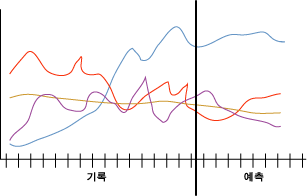

# Microsoft 시계열 알고리즘
[!INCLUDE[ssas-appliesto-sqlas](../../includes/ssas-appliesto-sqlas.md)][!INCLUDE[msCoName](../../includes/msconame-md.md)] 시계열 알고리즘은 시간에 따른 제품 판매량과 같은 연속 값을 예측에 대 한 최적화 된 여러 알고리즘을 제공 합니다. 의사 결정 트리와 같은 다른 [!INCLUDE[msCoName](../../includes/msconame-md.md)] 알고리즘에서는 새 정보로 된 추가 열을 입력해야 추세를 예측할 수 있지만, 시계열 모델에서는 이런 열이 필요하지 않습니다. 시계열 모델은 이 모델을 만드는 데 사용되는 원래 데이터 집합만을 기반으로 추세를 예측할 수 있습니다. 또한 예측을 만들고 자동으로 새 데이터를 추세 분석에 통합하는 경우 시계열 모델에 새 데이터를 추가할 수도 있습니다.  
  
 다음 다이어그램에서는 4개의 다른 판매 지역에서 시간에 따른 제품 판매량을 예측하기 위한 일반적인 모델을 보여 줍니다. 다이어그램에 표시된 모델은 빨간색, 노란색, 보라색 및 파란색 선으로 표시된 각 지역별 판매량을 보여 줍니다. 각 지역의 선은 다음 두 부분으로 구성됩니다.  
  
-   기록 정보는 세로선의 왼쪽에 나타나며 알고리즘이 모델을 만드는 데 사용하는 데이터를 나타냅니다.  
  
-   예측 정보는 세로선의 오른쪽에 나타나며 모델이 만드는 예측을 나타냅니다.  
  
 원본 데이터와 예측 데이터의 조합을 *계열*이라고 합니다.  
  
   
  
 [!INCLUDE[msCoName](../../includes/msconame-md.md)] 시계열 알고리즘의 중요한 기능은 교차 예측을 수행할 수 있다는 것입니다. 관련된 두 개의 별도 계열이 있는 알고리즘을 학습하는 경우 결과 모델을 사용하여 한 계열의 동작을 기반으로 다른 계열의 결과를 예측할 수 있습니다. 예를 들어 관찰된 특정 제품의 판매량이 다른 제품의 예측 판매량에 영향을 줄 수 있습니다.  또한 교차 예측은 여러 계열에 적용될 수 있는 일반 모델을 만드는 데에도 유용합니다. 예를 들어 계열에 높은 품질의 데이터가 부족하기 때문에 특정 지역에 대한 예측이 불안정합니다.  4개 지역 모두의 평균으로 일반 모델을 학습한 다음 개별 계열에 이 모델을 적용하여 각 지역에 대해 더 안정된 예측을 만들 수 있습니다.  
  
## 예제  
 [!INCLUDE[ssSampleDBCoFull](../../includes/sssampledbcofull-md.md)] 사의 관리 팀은 내년도 월별 자전거 판매량을 예측하려고 합니다. 이 회사에서는 한 자전거 모델의 판매량을 사용하여 다른 모델의 판매량을 예측할 수 있는지 여부에 특히 관심이 많습니다. 지난 3년 동안의 기록 데이터에 대해 [!INCLUDE[msCoName](../../includes/msconame-md.md)] 시계열 알고리즘을 사용하여 이 회사에서는 향후 자전거 판매량을 예측하는 데이터 마이닝 모델을 생성할 수 있으며 교차 예측을 수행하여 개별 자전거 모델의 판매 경향이 서로 관련되어 있는지 여부를 확인할 수 있습니다.  
  
 이 회사는 각 분기마다 최신 판매량 데이터로 모델을 업데이트하고 이들의 예측을 업데이트하여 최신 추세로 모델링할 계획입니다. 판매량 데이터를 정확하거나 일관되게 업데이트하지 않는 점포의 문제를 해결하려면 일반 예측 모델을 만들고 이 모델을 사용하여 모든 지역에 대한 예측을 만듭니다.  
  
## 알고리즘 작동 방법  
 [!INCLUDE[ssVersion2005](../../includes/ssversion2005-md.md)]에서 [!INCLUDE[msCoName](../../includes/msconame-md.md)] 시계열 알고리즘은 ARTXP라는 단일 자동 회귀 시계열 방법을 사용했습니다. ARTXP 알고리즘은 단기 예측에 대해 최적화되었으므로 계열의 적절한 다음 값을 예측하는 데 탁월했습니다. [!INCLUDE[ssKatmai](../../includes/sskatmai-md.md)]부터 [!INCLUDE[msCoName](../../includes/msconame-md.md)] 시계열 알고리즘은 장기 예측에 최적화된 두 번째 알고리즘인 ARIMA를 추가했습니다. ARTXP 및 ARIMA 알고리즘의 구현에 대한 자세한 내용은 [Microsoft Time Series Algorithm Technical Reference](../../analysis-services/data-mining/microsoft-time-series-algorithm-technical-reference.md)를 참조하십시오.  
  
 기본적으로 [!INCLUDE[msCoName](../../includes/msconame-md.md)] 시계열 알고리즘은 패턴을 분석하고 예측을 수행할 때 알고리즘을 혼합하여 사용합니다. 알고리즘은 동일한 데이터에서 두 개의 모델을 별도로 학습합니다. 한 모델은 ARTXP 알고리즘을 사용하고 다른 모델은 ARIMA 알고리즘을 사용합니다. 그러면 알고리즘은 두 모델의 결과를 혼합하여 여러 개의 시간 조각에 대한 최상의 예측을 생성합니다. ARTXP는 단기 예측에 가장 적합하므로 일련의 예측이 시작되는 부분에서는 ARTXP에 더 비중을 둡니다. 그러나 예측하는 시간 조각이 보다 미래로 이동하면 ARIMA에 더 비중을 둡니다.  
  
 알고리즘의 혼합을 제어하여 시계열에서 단기 예측 또는 장기 예측 중 하나를 우선시할 수도 있습니다. [!INCLUDE[ssKatmai](../../includes/sskatmai-md.md)] Standard부터 사용할 알고리즘을 지정할 수 있습니다.  
  
-   단기 예측에 ARTXP만 사용합니다.  
  
-   장기 예측에 ARIMA만 사용합니다.  
  
-   두 알고리즘의 혼합을 기본값으로 사용합니다.  
  
 [!INCLUDE[ssEnterpriseEd10](../../includes/ssenterpriseed10-md.md)]부터 예측을 위해 [!INCLUDE[msCoName](../../includes/msconame-md.md)] 시계열 알고리즘이 모델을 혼합하는 방식을 사용자 지정할 수도 있습니다. 혼합 모델을 사용하는 경우 [!INCLUDE[msCoName](../../includes/msconame-md.md)] 시계열 알고리즘은 두 가지 알고리즘을 다음과 같은 방식으로 혼합합니다.  
  
-   처음 두 개의 예측을 수행하는 데 항상 ARTXP만 사용됩니다.  
  
-   처음 두 개의 예측 이후에는 ARIMA 및 ARTXP의 조합이 사용됩니다.  
  
-   예측 단계의 수가 늘어날수록 예측은 ARIMA를 더 많이 사용하며 더 이상 ARTXP를 사용하지 않습니다.  
  
-   PREDICTION_SMOOTHING 매개 변수를 설정하여 ARTXP의 가중치는 감소하고 ARIMA의 가중치는 증가하는 비율의 혼합 지점을 제어합니다.  
  
 두 알고리즘 모두 여러 수준에서 데이터의 계절성을 검색할 수 있습니다. 예를 들어 데이터에는 연간 주기 내에 중첩된 월간 주기가 포함될 수 있습니다. 이러한 계절적 주기를 검색하려면 주기 힌트를 제공하거나 알고리즘이 자동으로 주기를 검색하도록 지정할 수 있습니다.  
  
 주기성뿐만 아니라 [!INCLUDE[msCoName](../../includes/msconame-md.md)] 시계열 알고리즘이 주기성을 검색하거나 예측을 만들거나 사례를 분석할 때 이 알고리즘의 동작을 제어하는 여러 가지 다른 매개 변수가 있습니다. 알고리즘 매개 변수를 설정하는 방법은 [Microsoft Time Series Algorithm Technical Reference](../../analysis-services/data-mining/microsoft-time-series-algorithm-technical-reference.md)를 참조하십시오.  
  
## 시계열 모델에 필요한 데이터  
 데이터 마이닝 모델을 학습하는 데 사용할 데이터를 준비할 경우 특정 모델의 요구 사항과 데이터가 사용되는 방법을 이해해야 합니다.  
  
 각 예측 모델은 변경되는 동안 시간 조각 또는 다른 계열을 지정하는 열인 사례 계열을 포함해야 합니다. 예를 들어 위 다이어그램의 데이터는 수개월 동안의 자전거 판매량에 대한 기록 정보와 예측 정보의 계열을 보여 줍니다. 이 모델의 경우 각 지역은 계열이며 날짜 열에는 사례 계열이기도 한 시계열이 포함됩니다. 다른 모델에서 사례 계열은 고객 ID 또는 트랜잭션 ID와 같은 일부 식별자나 텍스트 필드가 될 수 있습니다. 그러나 시계열 모델은 항상 해당 사례 계열에 대해 다른 고유한 숫자 값, 날짜 또는 시간을 사용해야 합니다.  
  
 시계열 모델의 요구 사항은 다음과 같습니다.  
  
-   **단일 키 시간 열** 각 모델에는 숫자 열이나 날짜 열이 한 개 있어야 합니다. 이 열은 모델에서 사용할 시간 조각을 정의하는 사례 계열로 사용됩니다. key time 열의 데이터 형식은 datetime 데이터 형식 또는 numeric 데이터 형식 중 하나가 될 수 있습니다. 그러나 열은 연속 값을 포함해야 하고 이 값은 각 계열에 대해 고유해야 합니다. 시계열 모델에 대한 사례 계열은 연도 열 및 월 열과 같은 두 개의 열에 저장될 수 없습니다.  
  
-   **예측 가능한 열** 각 모델에는 알고리즘이 시계열 모델을 작성할 예측 가능한 열이 한 개 이상 있어야 합니다. 예측 가능한 열의 데이터 형식에는 연속 값이 있어야 합니다. 예를 들어 수입, 판매량 또는 기온과 같은 숫자 특성이 시간에 따라 변화하는 방식을 예측할 수 있습니다. 그러나 구매 상태 또는 교육 수준과 같은 불연속 값을 포함하는 열은 예측 가능한 열로 사용할 수 없습니다.  
  
-   **선택적 계열 키 열** 각 모델에는 계열을 식별하는 고유한 값을 포함하는 추가 키 열이 있을 수 있습니다. 선택적 계열 키 열은 고유한 값을 포함해야 합니다. 예를 들어 모든 시간 조각의 각 제품 이름에 대해 한 개의 레코드만 있으면 단일 모델이 여러 제품 모델의 판매량을 포함할 수 있습니다.  
  
 여러 가지 다양한 방법으로 [!INCLUDE[msCoName](../../includes/msconame-md.md)] 시계열 모델에 대한 입력 데이터를 정의할 수 있습니다. 그러나 입력 사례의 형식이 마이닝 모델의 정의에 영향을 주기 때문에 업무에 필요한 사항을 고려하여 적절히 데이터를 준비해야 합니다. 다음 두 가지 예에서는 입력 데이터가 모델에 미치는 영향을 보여 줍니다. 두 가지 예에서, 완료된 데이터 마이닝 모델에는 다음과 같은 4개의 고유한 계열에 대한 패턴이 있습니다.  
  
-   A 제품의 판매량  
  
-   B 제품의 판매량  
  
-   A 제품의 부피  
  
-   B 제품의 부피  
  
 두 가지 예에서 향후 각 제품의 새로운 판매량과 부피를 예측할 수 있지만 제품 또는 시간에 대한 새로운 값을 예측할 수는 없습니다.  
  
### 예제 1: 계열이 열 값으로 표현된 시계열 데이터 집합  
 이 예에서는 다음 입력 사례 표를 사용합니다.  
  
|TimeID|Product|Sales|볼륨|  
|------------|-------------|-----------|------------|  
|1/2001|변수를 잠그기 위한|1000|600|  
|2/2001|변수를 잠그기 위한|1100|500|  
|1/2001|B|500|900|  
|2/2001|B|300|890|  
  
 이 테이블의 TimeID 열은 시간 식별자를 포함하며 각 날짜에 대해 두 개의 항목을 포함합니다. TimeID 열은 사례 계열이 됩니다. 따라서 이 열을 시계열 모델에 대한 key time 열로 지정하게 됩니다.  
  
 Product 열은 데이터베이스에 제품을 정의합니다. 이 열에는 제품 계열이 포함됩니다. 따라서 이 열을 시계열 모델의 두 번째 키로 지정하게 됩니다.  
  
 Sales 열은 지정한 제품의 하루 매출총이익을 나타내고 Volume 열은 창고에 남아 있는 지정한 제품의 수량을 나타냅니다. 이러한 두 개의 열에는 모델을 학습하는 데 사용되는 데이터가 들어 있습니다. Sales와 Volume은 둘 다 Product 열에 있는 각 계열의 예측 가능한 특성일 수 있습니다.  
  
### 예제 2: 각 계열이 별도의 열에 있는 시계열 데이터 집합  
 이 예에서는 기본적으로 첫 번째 예와 동일한 입력 데이터를 사용하지만 다음 표와 같이 입력 데이터가 다르게 구성됩니다.  
  
|TimeID|A_Sales|A_Volume|B_Sales|B_Volume|  
|------------|--------------|---------------|--------------|---------------|  
|1/2001|1000|600|500|900|  
|2/2001|1100|500|300|890|  
  
 이 표에서 TimeID 열에는 key time 열로 지정한 시계열 모델에 대한 사례 계열이 계속 포함됩니다. 그러나 이전의 Sales 열 및 Volume 열은 이제 각각 두 개의 열로 분할되고 분할된 각 열 앞에는 제품 이름이 붙습니다. 그 결과 각 날짜에 대해 TimeID 열에 하나의 항목만 존재합니다. 그리고 A_Sales, A_Volume, B_Sales 및 B_Volume과 같은 4개의 예측 가능한 열이 포함되는 시계열 모델이 생성됩니다.  
  
 또한 제품을 다른 열로 구분했기 때문에 추가 계열 키 열을 지정하지 않아도 됩니다. 모델의 모든 열은 사례 계열 열 또는 예측 가능한 열 중 하나입니다.  
  
## 시계열 모델 보기  
 모델을 학습한 후에는 그 결과가 일련의 패턴으로 저장되며 이러한 패턴을 탐색하거나 사용하여 예측을 만들 수 있습니다.  
  
 모델을 탐색하는 데는 [시계열 뷰어](../../analysis-services/data-mining/browse-a-model-using-the-microsoft-time-series-viewer.md)를 사용할 수 있습니다. 뷰어에는 미래 예측을 표시하는 차트 및 데이터의 주기적 구조에 대한 트리 뷰가 포함됩니다.  
  
 예측을 계산하는 방법에 대해 자세히 보려면 [Microsoft 일반 콘텐츠 트리 뷰어](../../analysis-services/data-mining/browse-a-model-using-the-microsoft-generic-content-tree-viewer.md)에서 모델을 찾아보십시오. 모델에 대해 저장된 콘텐츠에는 ARIMA 및 ARTXP 알고리즘으로 검색되는 주기적 구조, 알고리즘 혼합에 사용되는 수식 및 기타 통계와 같은 세부 정보가 들어 있습니다.  
  
## 시계열 예측 만들기  
 기본적으로 사용자는 [!INCLUDE[ssASnoversion](../../includes/ssasnoversion-md.md)] 를 통해 한 개의 시계열 모델에 대해 5개의 예측을 확인할 수 있습니다. 그러나 여러 가지 예측을 반환하는 쿼리를 만들 수 있고 예측에 열을 추가하여 기술 통계를 반환할 수 있습니다. 시계열 모델에 대한 쿼리를 만드는 방법에 대한 자세한 내용은 [시계열 모델 쿼리 예제](../../analysis-services/data-mining/time-series-model-query-examples.md)를 참조하세요. DMX(Data Mining Extensions)를 사용하여 시계열 예측을 만드는 방법의 예는 [PredictTimeSeries&#40;DMX&#41;](../../dmx/predicttimeseries-dmx.md)를 참조하세요.  
  
 [!INCLUDE[msCoName](../../includes/msconame-md.md)] 시계열 알고리즘을 사용하여 예측을 만들 경우 다음 추가 제한 사항 및 요구 사항을 고려해야 합니다.  
  
-   교차 예측은 혼합 모델 또는 ARTXP 알고리즘 기반 모델을 사용하는 경우에만 사용할 수 있습니다. ARIMA 알고리즘에만 기반을 둔 모델을 사용하는 경우 교차 예측은 수행할 수 없습니다.  
  
-   시계열 모델은 서버에서 사용하는 64비트 운영 체제에 따라 때로는 크게 다른 예측을 만들 수 있습니다. 이러한 차이는 [!INCLUDE[vcpritanium](../../includes/vcpritanium-md.md)]기반 시스템이 부동 소수점 산술의 수를 표시하고 처리하는 방식이 [!INCLUDE[vcprx64](../../includes/vcprx64-md.md)]기반 시스템의 방식과 다르기 때문에 발생합니다. 예측 결과는 운영 체제에 따라 달라질 수 있으므로 프로덕션 환경에서 사용할 운영 체제와 동일한 운영 체제에서 모델을 평가하는 것이 좋습니다.  
  
## 주의  
  
-   PMML(Predictive Model Markup Language)을 사용한 마이닝 모델 생성은 지원하지 않습니다.  
  
-   OLAP 마이닝 모델의 사용을 지원합니다.  
  
-   데이터 마이닝 차원의 생성은 지원하지 않습니다.  
  
-   드릴스루를 지원합니다.  
  
## 관련 항목:  
 [데이터 마이닝 알고리즘&#40;Analysis Services - 데이터 마이닝&#41;](../../analysis-services/data-mining/data-mining-algorithms-analysis-services-data-mining.md)   
 [Microsoft 시계열 뷰어를 사용 하 여 모델 찾아보기](../../analysis-services/data-mining/browse-a-model-using-the-microsoft-time-series-viewer.md)   
 [Microsoft 시계열 알고리즘 기술 참조](../../analysis-services/data-mining/microsoft-time-series-algorithm-technical-reference.md)   
 [시계열 모델 쿼리 예제](../../analysis-services/data-mining/time-series-model-query-examples.md)   
 [시계열 모델에 대한 마이닝 모델 콘텐츠&#40;Analysis Services - 데이터 마이닝&#41;](../../analysis-services/data-mining/mining-model-content-for-time-series-models-analysis-services-data-mining.md)  
  
  
