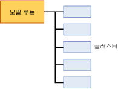

# 클러스터링 모델에 대한 마이닝 모델 콘텐츠(Analysis Services - 데이터 마이닝)
[!INCLUDE[ssas-appliesto-sqlas](../../includes/ssas-appliesto-sqlas.md)]
  이 항목에서는 Microsoft 클러스터링 알고리즘을 사용하는 모델에만 적용되는 마이닝 모델 콘텐츠에 대해 설명합니다. 모든 모델 유형에 적용되는 마이닝 모델 콘텐츠에 대한 일반적인 설명은 [마이닝 모델 콘텐츠&#40;Analysis Services - 데이터 마이닝&#41;](../../analysis-services/data-mining/mining-model-content-analysis-services-data-mining.md)를 참조하세요.  
  
## 클러스터링 모델 구조에 대한 이해  
 클러스터링 모델의 구조는 간단합니다. 각 모델에는 모델과 메타데이터를 나타내는 부모 노드가 한 개 있고 각 부모 노드에는 클러스터 기본 목록이 있습니다(NODE_TYPE = 5). 이 구조는 다음 이미지와 같습니다.  
  
   
  
 각 자식 노드는 단일 클러스터를 나타내며 해당 클러스터 내에 있는 사례의 특성에 대한 자세한 통계를 포함합니다. 이러한 통계에는 클러스터 내 사례 수 및 해당 클러스터를 다른 클러스터와 구별하게 해주는 값의 분포가 포함됩니다.  
  
> [!NOTE]  
>  클러스터 수 또는 클러스터에 대한 설명을 가져오기 위해 노드를 반복 처리할 필요는 없습니다. 모델 부모 노드도 클러스터 수를 계산하고 클러스터를 나열합니다.  
  
 부모 노드에는 모든 학습 사례에 대한 실제 분포를 설명하는 유용한 통계가 포함되어 있는데, 이러한 통계는 중첩 테이블 열 NODE_DISTRIBUTION에 있습니다. 예를 들어 다음 표는 `TM_Clustering`기본 데이터 마이닝 자습서 [에서 만든 클러스터링 모델](http://msdn.microsoft.com/library/6602edb6-d160-43fb-83c8-9df5dddfeb9c)의 고객 인구 통계 분포를 설명하는 NODE_DISTRIBUTION 테이블의 몇 개 행을 보여 줍니다.  
  
|ATTRIBUTE_NAME|ATRIBUTE_VALUE|SUPPORT|PROBABILITY|VARIANCE|VALUE_TYPE|  
|---------------------|---------------------|-------------|-----------------|--------------|-----------------|  
|Age|Missing|0|0|0|1(누락)|  
|나이|44.9016152716593|12939|1|125.663453102554|3(연속)|  
|Gender|Missing|0|0|0|1(누락)|  
|Gender|F|6350|0.490764355823479|0|4 (Discrete)|  
|Gender|M|6589|0.509235644176521|0|4 (Discrete)|  
  
 이 결과를 통해 모델 작성에 사용된 사례는 12939개이고 남성 대 여성의 비율은 50-50이며 평균 연령은 44세임을 알 수 있습니다. 설명적 통계는 보고되는 특성이 연속 숫자 데이터 형식(예: 연령)인지 또는 불연속 값 유형(예: 성별)인지에 따라 달라집니다. 통계 측정값 *평균* 과 *분산* 은 연속 데이터 형식에 대해 계산되며, *확률* 과 *지지도* 는 불연속 데이터 형식에 대해 계산됩니다.  
  
> [!NOTE]  
>  분산은 클러스터에 대한 총 분산을 나타냅니다. 분산 값이 작은 경우 이는 대부분의 열 값이 평균에 매우 근접해 있음을 의미합니다. 표준 편차를 구하려면 분산의 제곱근을 계산하십시오.  
  
 각 특성마다 해당 특성에 대한 데이터가 없는 사례 수를 보여 주는 **Missing** 값 유형이 있습니다. 누락 데이터는 중요하며 데이터 형식에 따라 여러 가지 방식으로 계산에 영향을 미칩니다. 자세한 내용은 [누락 값&#40;Analysis Services - 데이터 마이닝&#41;](../../analysis-services/data-mining/missing-values-analysis-services-data-mining.md)을 참조하세요.  
  
## 클러스터링 모델에 대한 모델 콘텐츠  
 이 섹션에서는 클러스터링 모델과 관련된 마이닝 모델 콘텐츠 열에 대한 세부 정보와 예만 제공합니다.  
  
 스키마 행 집합(예: MODEL_CATALOG 및 MODEL_NAME)의 범용 열에 대한 자세한 내용은 [마이닝 모델 콘텐츠&#40;Analysis Services - 데이터 마이닝&#41;](../../analysis-services/data-mining/mining-model-content-analysis-services-data-mining.md)를 참조하세요.  
  
 MODEL_CATALOG  
 모델이 저장되는 데이터베이스의 이름입니다.  
  
 MODEL_NAME  
 모델의 이름입니다.  
  
 ATTRIBUTE_NAME  
 해당 모드에는 예측 가능한 특성이 없으므로 클러스터링 모델의 경우 항상 비워 둡니다.  
  
 NODE_NAME  
 항상 NODE_UNIQUE_NAME과 같습니다.  
  
 NODE_UNIQUE_NAME  
 모델 내의 노드에 대한 고유 식별자입니다. 이 값은 변경할 수 없습니다.  
  
 NODE_TYPE  
 클러스터링 모델이 출력하는 노드 유형은 다음과 같습니다.  
  
|노드 ID 및 이름|Description|  
|----------------------|-----------------|  
|1(모델)|모델의 루트 노드입니다.|  
|5(클러스터)|클러스터 내 사례 수, 클러스터 내 사례의 특징 및 클러스터의 값을 설명하는 통계를 포함합니다.|  
  
 NODE_CAPTION  
 표시 이름입니다. 모델을 만들 때 NODE_UNIQUE_NAME의 값이 자동으로 캡션으로 사용됩니다. 그러나 NODE_CAPTION의 값을 변경하여 클러스터의 표시 이름을 프로그래밍 방식으로 업데이트하거나 뷰어를 통해 업데이트할 수 있습니다.  
  
> [!NOTE]  
>  모델을 다시 처리하면 모든 이름 변경 사항을 새 값으로 덮어쓰게 됩니다. 버전이 다른 모델 간에는 모델의 이름을 유지하거나 클러스터 멤버 자격 변경 사항을 추적할 수 없습니다.  
  
 CHILDREN_CARDINALITY  
 노드에 있는 예상 자식 수입니다.  
  
 **부모 노드** 모델에 있는 클러스터 수를 나타냅니다.  
  
 **클러스터 노드** 항상 0입니다.  
  
 PARENT_UNIQUE_NAME  
 노드 부모의 고유한 이름입니다.  
  
 **부모 노드** 항상 NULL입니다.  
  
 **클러스터 노드** 일반적으로 000입니다.  
  
 NODE_DESCRIPTION  
 노드에 대한 설명입니다.  
  
 **부모 노드** 항상 **(All)** 입니다.  
  
 **클러스터 노드** 클러스터를 다른 클러스터와 구별하게 해주는 쉼표로 구분된 기본 특성 목록입니다.  
  
 NODE_RULE  
 클러스터링 모델에는 사용되지 않습니다.  
  
 MARGINAL_RULE  
 클러스터링 모델에는 사용되지 않습니다.  
  
 NODE_PROBABILITY  
 이 노드와 관련된 확률입니다. **부모 노드** 항상 1입니다.  
  
 **클러스터 노드** 확률은 특성에 대한 복합 확률을 나타내며 클러스터링 모델을 만드는 데 사용된 알고리즘에 따라 약간씩 조정됩니다.  
  
 MARGINAL_PROBABILITY  
 부모 노드에서 해당 노드에 도달할 확률입니다. 클러스터링 모델에서 한계 확률은 항상 노드 확률과 같습니다.  
  
 NODE_DISTRIBUTION  
 노드의 확률 히스토그램을 포함하는 테이블입니다.  
  
 **부모 노드** 이 항목에 대한 소개 부분을 참조하십시오.  
  
 **클러스터 노드** 이 클러스터에 포함되지 않은 사례의 특성 및 값 분포를 나타냅니다.  
  
 NODE_SUPPORT  
 이 노드를 지지하는 사례 수입니다. **부모 노드** 전체 모델의 학습 사례 수를 나타냅니다.  
  
 **클러스터 노드** 클러스터 크기를 사례 수로 표시합니다.  
  
 **참고** 모델이 K-Means 클러스터링을 사용하는 경우 각각의 사례는 한 개의 클러스터에만 속할 수 있습니다. 그러나 모델이 EM 클러스터링을 사용하는 경우 각각의 사례가 서로 다른 클러스터에 속할 수 있으며 사례가 속해 있는 각 클러스터에 대해 가중치가 적용된 거리가 사례에 할당됩니다. 따라서 EM 모델의 경우 개별 클러스터에 대한 지지도 합계가 전체 모델에 대한 지지도보다 큽니다.  
  
 MSOLAP_MODEL_COLUMN  
 클러스터링 모델에는 사용되지 않습니다.  
  
 MSOLAP_NODE_SCORE  
 노드와 연관된 점수를 표시합니다.  
  
 **부모 노드** 클러스터링 모델에 대한 BIC(Bayesian Information Criterion) 점수입니다.  
  
 **클러스터 노드** 항상 0입니다.  
  
 MSOLAP_NODE_SHORT_CAPTION  
 표시용 레이블입니다. 이 캡션은 변경할 수 없습니다.  
  
 **부모 노드** 모델 유형: 클러스터 모델  
  
 **클러스터 노드** 클러스터의 예: 클러스터 1입니다.  
  
## Remarks  
 [!INCLUDE[ssASnoversion](../../includes/ssasnoversion-md.md)] 는 클러스터링 모델을 만드는 여러 가지 방법을 제공합니다. 작업 중인 모델이 어떤 방법으로 만들어졌는지 모르는 경우 ADOMD 클라이언트 또는 AMO를 사용하거나 데이터 마이닝 스키마 행 집합을 쿼리하여 모델 메타데이터를 프로그래밍 방식으로 검색할 수 있습니다. 자세한 내용은 [마이닝 모델을 만드는 데 사용한 매개 변수 쿼리](../../analysis-services/data-mining/query-the-parameters-used-to-create-a-mining-model.md)를 참조하세요.  
  
> [!NOTE]  
>  모델의 구조와 콘텐츠는 사용한 클러스터링 방법이나 매개 변수에 관계없이 동일하게 유지됩니다.  
  
## 관련 항목  
 [마이닝 모델 콘텐츠 & #40; Analysis Services-데이터 마이닝 & #41;](../../analysis-services/data-mining/mining-model-content-analysis-services-data-mining.md)   
 [데이터 마이닝 모델 뷰어](../../analysis-services/data-mining/data-mining-model-viewers.md)   
 [Microsoft 클러스터링 알고리즘](../../analysis-services/data-mining/microsoft-clustering-algorithm.md)   
 [데이터 마이닝 쿼리](../../analysis-services/data-mining/data-mining-queries.md)  
  
  
