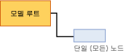

# 선형 회귀 모델에 대한 마이닝 모델 콘텐츠(Analysis Services - 데이터 마이닝)
[!INCLUDE[ssas-appliesto-sqlas](../../includes/ssas-appliesto-sqlas.md)]이 설명 하는 사용 하는 모델만 마이닝 모델 콘텐츠에 [!INCLUDE[msCoName](../../includes/msconame-md.md)] 선형 회귀 알고리즘입니다. 모든 모델 유형에 적용되는 마이닝 모델 콘텐츠에 대한 일반적인 설명은 [마이닝 모델 콘텐츠&#40;Analysis Services - 데이터 마이닝&#41;](../../analysis-services/data-mining/mining-model-content-analysis-services-data-mining.md)를 참조하세요.  
  
## 선형 회귀 모델의 구조 이해  
 선형 회귀 모델의 구조는 매우 단순합니다. 각 모델에는 모델과 해당 메타데이터를 나타내는 단일 부모 노드와 예측 가능한 각 특성의 회귀 수식이 포함된 회귀 트리 노드(NODE_TYPE = 25)가 있습니다.  
  
   
  
 선형 회귀 모델에서는 [!INCLUDE[msCoName](../../includes/msconame-md.md)] 의사 결정 트리와 동일한 알고리즘을 사용하지만 트리를 제한하는 데는 다른 매개 변수를 사용하며 입력으로는 연속 특성만 사용할 수 있습니다. 그러나 선형 회귀 모델은 [!INCLUDE[msCoName](../../includes/msconame-md.md)] 의사 결정 트리 알고리즘을 기반으로 하므로 선형 회귀 모델을 표시하는 데는 [!INCLUDE[msCoName](../../includes/msconame-md.md)] 의사 결정 트리 뷰어가 사용됩니다. 자세한 내용은 [Microsoft 트리 뷰어를 사용하여 모델 찾아보기](../../analysis-services/data-mining/browse-a-model-using-the-microsoft-tree-viewer.md)를 참조하세요.  
  
 다음 섹션에서는 회귀 수식 노드의 정보를 해석하는 방법을 설명합니다. 이 정보는 선형 회귀 모델뿐 아니라 트리의 일부분에 회귀가 포함된 의사 결정 트리 모델에도 적용됩니다.  
  
## 선형 회귀 모델에 대한 모델 콘텐츠  
 이 섹션에서는 선형 회귀와 특별히 관련된 마이닝 모델 콘텐츠 열에 대한 세부 정보 및 예만 제공합니다.  
  
 스키마 행 집합의 범용 열에 대한 자세한 내용은 [마이닝 모델 콘텐츠&#40;Analysis Services - 데이터 마이닝&#41;](../../analysis-services/data-mining/mining-model-content-analysis-services-data-mining.md)를 참조하세요.  
  
 MODEL_CATALOG  
 모델이 저장되는 데이터베이스의 이름입니다.  
  
 MODEL_NAME  
 모델의 이름입니다.  
  
 ATTRIBUTE_NAME  
 **루트 노드:** 비어 있습니다.  
  
 **회귀 노드:** 예측 가능한 특성의 이름입니다.  
  
 NODE_NAME  
 항상 NODE_UNIQUE_NAME과 같습니다.  
  
 NODE_UNIQUE_NAME  
 모델 내의 노드에 대한 고유 식별자입니다. 이 값은 변경할 수 없습니다.  
  
 NODE_TYPE  
 선형 회귀 모델이 출력하는 노드 유형은 다음과 같습니다.  
  
|노드 유형 ID|형식|Description|  
|------------------|----------|-----------------|  
|25|회귀 트리 루트|입력 및 출력 변수 간의 관계를 설명하는 수식을 포함합니다.|  
  
 NODE_CAPTION  
 노드에 연결된 레이블 또는 캡션입니다. 이 속성은 주로 표시용으로 사용됩니다.  
  
 **루트 노드:** 비어 있습니다.  
  
 **회귀 노드:** 모든 항목을 포함합니다.  
  
 CHILDREN_CARDINALITY  
 노드에 있는 예상 자식 수입니다.  
  
 **루트 노드:** 회귀 노드의 수를 나타냅니다. 모델의 예측 가능한 각 특성에 대해 하나씩의 회귀 노드가 만들어집니다.  
  
 **회귀 노드:** 항상 0입니다.  
  
 PARENT_UNIQUE_NAME  
 노드 부모의 고유한 이름입니다. 루트 수준의 모든 노드에 대해서 NULL이 반환됩니다.  
  
 NODE_DESCRIPTION  
 노드에 대한 설명입니다.  
  
 **루트 노드:** 비어 있습니다.  
  
 **회귀 노드:** 모든 항목을 포함합니다.  
  
 NODE_RULE  
 선형 회귀 모델에는 사용되지 않습니다.  
  
 MARGINAL_RULE  
 선형 회귀 모델에는 사용되지 않습니다.  
  
 NODE_PROBABILITY  
 이 노드와 관련된 확률입니다.  
  
 **루트 노드:** 0입니다.  
  
 **회귀 노드:** 1입니다.  
  
 MARGINAL_PROBABILITY  
 부모 노드에서 해당 노드에 도달할 확률입니다.  
  
 **루트 노드:** 0입니다.  
  
 **회귀 노드:** 1입니다.  
  
 NODE_DISTRIBUTION  
 노드의 값에 대한 통계를 제공하는 중첩 테이블입니다.  
  
 **루트 노드:** 0입니다.  
  
 **회귀 노드:** 회귀 수식을 작성하는 데 사용된 요소가 들어 있는 테이블입니다. 회귀 노드에는 다음과 같은 값 유형이 들어 있습니다.  
  
|VALUETYPE|  
|---------------|  
|1(누락)|  
|3(연속)|  
|7(계수)|  
|8(득점)|  
|9(통계)|  
|11(절편)|  
  
 NODE_SUPPORT  
 이 노드를 지지하는 사례 수입니다.  
  
 **루트 노드:** 0입니다.  
  
 **회귀 노드:** 학습 사례의 수입니다.  
  
 MSOLAP_MODEL_COLUMN  
 예측 가능한 특성의 이름입니다.  
  
 MSOLAP_NODE_SCORE  
 NODE_PROBABILITY와 같습니다.  
  
 MSOLAP_NODE_SHORT_CAPTION  
 표시용 레이블입니다.  
  
## 주의  
 [!INCLUDE[msCoName](../../includes/msconame-md.md)] 선형 회귀 알고리즘을 사용하여 모델을 만드는 경우 데이터 마이닝 엔진은 의사 결정 트리 모델의 특수한 인스턴스를 만들고 단일 노드의 모든 학습 데이트를 포함하도록 트리를 제한하는 매개 변수를 제공합니다. 모든 연속 입력은 잠재적인 회귀 변수로 플래그가 지정되고 계산되지만 최종 모델에서는 데이터에 맞는 회귀 변수만 회귀 변수로 유지됩니다. 분석에서는 각 회귀 변수에 대해 회귀 수식이 하나씩 생성되거나 회귀 수식이 전혀 생성되지 않습니다.  
  
 **Microsoft 트리 뷰어**의 **(All)** 노드를 클릭하여 [마이닝 범례](../../analysis-services/data-mining/browse-a-model-using-the-microsoft-tree-viewer.md)에서 전체 회귀 수식을 볼 수 있습니다.  
  
 또한 예측 가능한 연속 특성을 포함하는 의사 결정 트리 모델을 만들 때 일부 경우에는 트리에 회귀 트리 노드의 속성을 공유하는 회귀 노드가 포함됩니다.  
  
##   연속 특성의 노드 배포  
 회귀 노드의 중요한 정보는 대부분 NODE_DISTRIBUTION 테이블에 들어 있습니다. 다음 예에서는 NODE_DISTRIBUTION 테이블의 레이아웃을 보여 줍니다. 이 예에서 Targeted Mailing 마이닝 구조는 연령별 고객 수입을 예측하는 선형 회귀 모델을 만드는 데 사용되었습니다. 이 모델은 기존의 [!INCLUDE[ssSampleDBnormal](../../includes/sssampledbnormal-md.md)] 예제 데이터 및 마이닝 구조를 사용하여 쉽게 작성할 수 있는 것으로, 여기에는 단지 설명을 위해 포함되었습니다.  
  
|ATTRIBUTE_NAME|ATTRIBUTE_VALUE|SUPPORT|PROBABILITY|VARIANCE|VALUETYPE|  
|---------------------|----------------------|-------------|-----------------|--------------|---------------|  
|Yearly Income|Missing|0|0.000457142857142857|0|1|  
|Yearly Income|57220.8876687257|17484|0.999542857142857|1041275619.52776|3|  
|Age|471.687717702463|0|0|126.969442359327|7|  
|Age|234.680904692439|0|0|0|8|  
|Age|45.4269617936399|0|0|126.969442359327|9|  
||35793.5477381267|0|0|1012968919.28372|11|  
  
 NODE_DISTRIBUTION 테이블에는 여러 행이 각각 변수별로 그룹화되어 들어 있습니다. 처음 두 개의 행은 값 유형이 항상 1과 3이며 대상 특성을 설명합니다. 그 이후 행은 특정 *회귀 변수*의 수식에 대한 정보를 제공합니다. 회귀 변수는 출력 변수와 선형 관계가 있는 입력 변수입니다. 여러 회귀 변수를 사용할 수 있으며 각 회귀 변수에는 계수(VALUETYPE = 7), 득점(VALUETYPE = 8) 및 통계(VALUETYPE = 9)에 대한 별도의 행이 있습니다. 마지막으로 테이블에는 수식의 절편(VALUETYPE = 11)이 포함된 행이 있습니다.  
  
### 회귀 수식의 요소  
 NODE_DISTRIBUTION 중첩 테이블의 개별 행에는 회귀 수식의 각 요소가 들어 있습니다. 예의 결과에 있는 처음 두 개의 데이터 행에는 종속 변수를 모델링하는 예측 가능한 특성 **Yearly Income**에 대한 정보가 들어 있습니다. SUPPORT 열에는 이 특성의 두 가지 상태( **Yearly Income** 값이 사용 가능함, 또는 **Yearly Income** 값이 누락됨)를 지원하는 사례 수가 표시됩니다.  
  
 VARIANCE 열은 예측 가능한 특성의 계산된 분산을 알려 줍니다. *분산* 은 샘플의 값이 예상 분포를 기준으로 얼마나 넓게 분산되어 있는지를 측정한 것입니다. 분산은 평균과의 제곱 편차에 대한 평균을 사용하여 계산됩니다. 분산의 제곱근을 표준 편차라고도 합니다. [!INCLUDE[ssASnoversion](../../includes/ssasnoversion-md.md)] 에서는 표준 편차를 제공하지 않지만 표준 편차도 쉽게 계산할 수 있습니다.  
  
 각 회귀 변수에 대해 세 개씩의 행이 출력됩니다. 이 세 행에는 계수, 득점 및 회귀 변수 통계가 포함됩니다.  
  
 마지막으로 테이블에는 수식의 절편을 제공하는 행이 들어 있습니다.  
  
#### 계수  
 각 회귀 변수에 대해 계수(VALUETYPE = 7)가 계산됩니다. 계수 자체는 ATTRIBUTE_VALUE 열에 나타나지만 VARIANCE 열은 계수의 분산을 알려 줍니다. 계수는 선형성을 최대화하도록 계산됩니다.  
  
#### 득점  
 각 회귀 변수의 득점(VALUETYPE = 8)은 특성의 흥미도 점수를 나타냅니다. 이 값을 사용하여 여러 회귀 변수의 유용성을 예상할 수 있습니다.  
  
#### 통계  
 회귀 변수 통계(VALUETYPE = 9)는 값이 있는 사례의 특성에 대한 평균입니다. ATTRIBUTE_VALUE 열에는 평균 자체가 들어 있지만 VARIANCE 열에는 평균과의 편차에 대한 합계가 들어 있습니다.  
  
#### 가로채기  
 일반적으로 회귀 수식의 *절편* (VALUETYPE = 11) 또는 *나머지* 는 입력 특성이 0인 지점의 예측 가능한 특성 값을 알려 줍니다. 대부분의 경우 입력 특성은 0일 수 없으며 0일 경우에는 예상치 않은 결과가 발생할 수 있습니다.  
  
 예를 들어 연령별 수입을 예측하는 모델에서 연령이 0일 때의 수입을 확인하는 것은 의미가 없습니다. 실제 상황에서는 대개 평균값을 기준으로 선의 동작에 대해 알아보는 것이 더욱 유용합니다. 따라서 [!INCLUDE[ssNoVersion](../../includes/ssnoversion-md.md)] [!INCLUDE[ssASnoversion](../../includes/ssasnoversion-md.md)] 에서는 절편을 수정하여 각 회귀 변수를 평균과의 관계로 표현합니다.  
  
 이러한 조정은 마이닝 모델 콘텐츠에서는 보기 어렵지만 **Microsoft 트리 뷰어** 의 **마이닝 범례**에서 전체 수식을 볼 경우에는 분명하게 나타납니다. 회귀 수식은 0 지점에서 평균을 나타내는 지점으로 이동합니다. 이는 현재 데이터를 보다 직관적으로 보여 줍니다.  
  
 따라서 평균 연령이 45세라고 간주하면 회귀 수식의 절편(VALUETYPE = 11)은 평균 수입을 알려 줍니다.  
  
## 관련 항목:  
 [마이닝 모델 콘텐츠&#40;Analysis Services - 데이터 마이닝&#41;](../../analysis-services/data-mining/mining-model-content-analysis-services-data-mining.md)   
 [Microsoft 선형 회귀 알고리즘](../../analysis-services/data-mining/microsoft-linear-regression-algorithm.md)   
 [Microsoft 선형 회귀 알고리즘 기술 참조](../../analysis-services/data-mining/microsoft-linear-regression-algorithm-technical-reference.md)   
 [선형 회귀 모델 쿼리 예제](../../analysis-services/data-mining/linear-regression-model-query-examples.md)  
  
  
