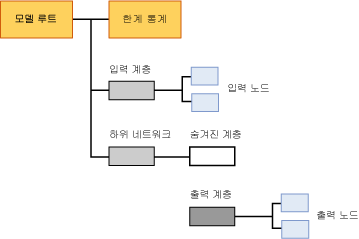

# 로지스틱 회귀 모델에 대한 모델 콘텐츠
  이 항목에서는 Microsoft 로지스틱 회귀 알고리즘을 사용하는 모델만의 마이닝 모델 콘텐츠에 대해 설명합니다. 모든 모델 유형에서 공유하는 통계 및 구조를 해석하는 방법에 대한 설명은 [마이닝 모델 콘텐츠&#40;Analysis Services - 데이터 마이닝&#41;](../../analysis-services/data-mining/mining-model-content-analysis-services-data-mining.md)를 참조하세요.  
  
## 로지스틱 회귀 모델의 구조 이해  
 로지스틱 회귀 모델은 Microsoft 신경망 알고리즘과 숨겨진 노드를 제거하도록 모델을 제한하는 매개 변수를 사용하여 만듭니다. 따라서 로지스틱 회귀 모델의 전체 구조는 신경망 모델의 구조와 거의 동일합니다. 즉, 각 모델에는 모델 및 해당 메타데이터를 나타내는 단일 부모 노드와 모델에 사용된 입력에 대한 기술 통계를 제공하는 특수한 한계 통계 노드(NODE_TYPE = 24)가 있습니다.  
  
 또한 모델에는 예측 가능한 각 특성에 대한 하위 네트워크(NODE_TYPE = 17)가 포함되어 있습니다. 신경망 모델에서와 마찬가지로 각 하위 네트워크에는 항상 두 개의 분기가 포함됩니다. 하나는 입력 계층에 대한 분기이고 숨겨진 계층(NODE_TYPE = 19) 및 출력 계층(NODE_TYPE = 20)이 포함된 다른 분기는 네트워크에 대한 분기입니다. 여러 특성이 예측 전용으로 지정된 경우 이들 특성에 동일한 하위 네트워크를 사용할 수 있습니다. 예측 가능한 특성이면서 동시에 입력 특성이기도 한 특성은 동일한 하위 네트워크에 나타나지 않을 수 있습니다.  
  
 그러나 로지스틱 회귀 모델에서는 숨겨진 계층을 나타내는 노드가 비어 있으며 자식이 없습니다. 따라서 모델에는 개별 출력(NODE_TYPE = 23) 및 개별 입력(NODE_TYPE = 21)을 나타내는 노드만 있고 숨겨진 개별 노드는 없습니다.  
  
   
  
 기본적으로 로지스틱 회귀 모델은 **Microsoft 신경망 뷰어**에 표시됩니다. 이 사용자 지정 뷰어를 사용하면 입력 특성과 해당 값을 필터링하고 이러한 항목이 출력에 주는 영향을 그래픽으로 볼 수 있습니다. 뷰어의 도구 설명에는 각 입력 및 출력 값 쌍과 연결된 확률 및 리프트가 표시됩니다. 자세한 내용은 [Microsoft 신경망 뷰어를 사용하여 모델 찾아보기](../../analysis-services/data-mining/browse-a-model-using-the-microsoft-neural-network-viewer.md)를 참조하세요.  
  
 입력 및 하위 네트워크의 구조를 탐색하고 자세한 통계를 보려면 Microsoft 일반 콘텐츠 트리 뷰어를 사용합니다. 임의의 노드를 클릭하여 확장한 후 자식 노드를 보거나 노드에 포함된 가중치 및 기타 통계를 볼 수 있습니다.  
  
## 로지스틱 회귀 모델에 대한 모델 콘텐츠  
 이 섹션에서는 로지스틱 회귀와 특별히 관련된 마이닝 모델 콘텐츠 열에 대한 세부 정보 및 예만 제공합니다. 로지스틱 회귀 모델 콘텐츠는 신경망 모델 콘텐츠와 거의 동일하지만 편의상 신경망 모델에 적용되는 설명이 이 표에서 반복될 수 있습니다.  
  
 MODEL_CATALOG와 MODEL_NAME을 비롯하여 여기에 설명되지 않은 스키마 행 집합의 범용 열에 대한 자세한 내용 또는 마이닝 모델 용어에 대한 자세한 내용은 [마이닝 모델 콘텐츠&#40;Analysis Services - 데이터 마이닝&#41;](../../analysis-services/data-mining/mining-model-content-analysis-services-data-mining.md)를 참조하세요.  
  
 MODEL_CATALOG  
 모델이 저장되는 데이터베이스의 이름입니다.  
  
 MODEL_NAME  
 모델의 이름입니다.  
  
 ATTRIBUTE_NAME  
 이 노드에 해당하는 특성의 이름입니다.  
  
|노드|콘텐츠|  
|----------|-------------|  
|모델 루트|비어 있음|  
|한계 통계|비어 있음|  
|입력 계층|비어 있음|  
|입력 노드|입력 특성 이름|  
|숨겨진 계층|비어 있음|  
|출력 계층|비어 있음|  
|출력 노드|출력 특성 이름|  
  
 NODE_NAME  
 노드 이름입니다. 현재 이 열은 NODE_UNIQUE_NAME과 동일한 값을 포함하지만 이는 이후 릴리스에서 변경될 수 있습니다.  
  
 NODE_UNIQUE_NAME  
 노드의 고유한 이름입니다.  
  
 이름과 ID가 모델에 대한 구조 정보를 반영하는 방식에 대한 자세한 내용은 [노드 이름 및 ID 사용](#bkmk_NodeIDs)섹션을 참조하세요.  
  
 NODE_TYPE  
 로지스틱 회귀 모델이 출력하는 노드 유형은 다음과 같습니다.  
  
|노드 유형 ID|Description|  
|------------------|-----------------|  
|1.|모델|  
|17|하위 네트워크의 구성 도우미 노드|  
|18|입력 계층의 구성 도우미 노드|  
|19|숨겨진 계층의 구성 도우미 노드. 숨겨진 계층은 비어 있습니다.|  
|20|출력 계층의 구성 도우미 노드|  
|21|입력 특성 노드|  
|23|출력 특성 노드|  
|24|한계 통계 노드|  
  
 NODE_CAPTION  
 노드와 연결된 레이블 또는 캡션입니다. 로지스틱 회귀 모델에서는 항상 비어 있습니다.  
  
 CHILDREN_CARDINALITY  
 노드에 있는 예상 자식 수입니다.  
  
|노드|콘텐츠|  
|----------|-------------|  
|모델 루트|한 개 이상의 네트워크, 한 개의 필수 한계 노드 및 한 개의 필수 입력 계층을 포함하는 자식 노드의 수를 나타냅니다. 예를 들어 값이 5인 경우 3개의 하위 네트워크가 있습니다.|  
|한계 통계|항상 0입니다.|  
|입력 계층|모델에 사용된 입력 특성-값 쌍의 수를 나타냅니다.|  
|입력 노드|항상 0입니다.|  
|숨겨진 계층|로지스틱 회귀 모델에서는 항상 0입니다.|  
|출력 계층|출력 값의 수를 나타냅니다.|  
|출력 노드|항상 0입니다.|  
  
 PARENT_UNIQUE_NAME  
 노드 부모의 고유한 이름입니다. 루트 수준의 모든 노드에 대해서 NULL이 반환됩니다.  
  
 이름과 ID가 모델에 대한 구조 정보를 반영하는 방식에 대한 자세한 내용은 [노드 이름 및 ID 사용](#bkmk_NodeIDs)섹션을 참조하세요.  
  
 NODE_DESCRIPTION  
 노드에 대한 알기 쉬운 설명입니다.  
  
|노드|콘텐츠|  
|----------|-------------|  
|모델 루트|비어 있음|  
|한계 통계|비어 있음|  
|입력 계층|비어 있음|  
|입력 노드|입력 특성 이름|  
|숨겨진 계층|비어 있음|  
|출력 계층|비어 있음|  
|출력 노드|출력 특성이 연속 특성인 경우 출력 특성의 이름을 포함합니다.   출력 특성이 불연속 또는 불연속화된 특성인 경우 특성 이름 및 값을 포함합니다.|  
  
 NODE_RULE  
 노드에 포함된 규칙에 대한 XML 설명입니다.  
  
|노드|콘텐츠|  
|----------|-------------|  
|모델 루트|비어 있음|  
|한계 통계|비어 있음|  
|입력 계층|비어 있음|  
|입력 노드|NODE_DESCRIPTION 열과 동일한 정보가 들어 있는 XML 조각입니다.|  
|숨겨진 계층|비어 있음|  
|출력 계층|비어 있음|  
|출력 노드|NODE_DESCRIPTION 열과 동일한 정보가 들어 있는 XML 조각입니다.|  
  
 MARGINAL_RULE  
 로지스틱 회귀 모델의 경우 항상 비어 있습니다.  
  
 NODE_PROBABILITY  
 이 노드와 관련된 확률입니다. 로지스틱 회귀 모델의 경우 항상 0입니다.  
  
 MARGINAL_PROBABILITY  
 부모 노드에서 해당 노드에 도달할 확률입니다. 로지스틱 회귀 모델의 경우 항상 0입니다.  
  
 NODE_DISTRIBUTION  
 노드에 대한 통계 정보가 들어 있는 중첩 테이블입니다. 각 노드 유형과 관련해서 이 테이블에 포함되는 내용에 대한 자세한 내용은 [신경망 모델에 대한 마이닝 모델 콘텐츠&#40;Analysis Services - 데이터 마이닝&#41;](../../analysis-services/data-mining/mining-model-content-for-neural-network-models-analysis-services-data-mining.md)를 참조하세요.  
  
 NODE_SUPPORT  
 로지스틱 회귀 모델의 경우 항상 0입니다.  
  
> [!NOTE]  
>  이 모델 유형의 출력은 확률적이 아니므로 지지도 확률은 항상 0입니다. 이 알고리즘에 의미 있는 유일한 항목은 가중치이므로 이 알고리즘은 확률, 지지도 또는 분산을 계산하지 않습니다.  
  
 특정 값에 대한 학습 사례의 지지도에 관한 정보를 보려면 한계 통계 노드를 참조하세요.  
  
 MSOLAP_MODEL_COLUMN  
 |노드|콘텐츠|  
|----------|-------------|  
|모델 루트|비어 있음|  
|한계 통계|비어 있음|  
|입력 계층|비어 있음|  
|입력 노드|입력 특성 이름|  
|숨겨진 계층|비어 있음|  
|출력 계층|비어 있음|  
|출력 노드|입력 특성 이름|  
  
 MSOLAP_NODE_SCORE  
 로지스틱 회귀 모델에서는 항상 0입니다.  
  
 MSOLAP_NODE_SHORT_CAPTION  
 로지스틱 회귀 모델에서는 항상 비어 있습니다.  
  
##   노드 이름 및 ID 사용  
 로지스틱 회귀 모델의 노드 이름은 모델에 있는 노드 간의 관계에 대한 추가 정보를 제공합니다. 다음 표에서는 각 계층의 노드에 할당되는 ID의 규칙을 보여 줍니다.  
  
|노드 유형|노드 ID의 규칙|  
|---------------|----------------------------|  
|모델 루트(1)|00000000000000000.|  
|한계 통계 노드(24)|10000000000000000|  
|입력 계층(18)|30000000000000000|  
|입력 노드(21)|60000000000000000에서 시작|  
|하위 네트워크(17)|20000000000000000|  
|숨겨진 계층(19)|40000000000000000|  
|출력 계층(20)|50000000000000000|  
|출력 노드(23)|80000000000000000에서 시작|  
  
 이러한 ID를 통해 출력 노드의 NODE_DISTRIBUTION 테이블을 보고 출력 특성과 특정 입력 계층 특성 간의 관계를 파악할 수 있습니다. 해당 테이블의 각 행에는 다시 특정 입력 특성 노드를 가리키는 ID가 들어 있습니다. NODE_DISTRIBUTION 테이블에는 해당 입력-출력 쌍에 대한 계수도 들어 있습니다.  
  
## 관련 항목:  
 [Microsoft 로지스틱 회귀 알고리즘](../../analysis-services/data-mining/microsoft-logistic-regression-algorithm.md)   
 [신경망 모델 &#40;에 대 한 마이닝 모델 콘텐츠 Analysis Services-데이터 마이닝 &#41;](../../analysis-services/data-mining/mining-model-content-for-neural-network-models-analysis-services-data-mining.md)   
 [로지스틱 회귀 모델 쿼리 예제](../../analysis-services/data-mining/logistic-regression-model-query-examples.md)   
 [Microsoft 로지스틱 회귀 알고리즘 기술 참조](../../analysis-services/data-mining/microsoft-logistic-regression-algorithm-technical-reference.md)  
  
  

