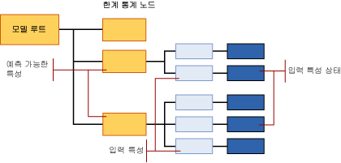

# <a name="mining-model-content-for-naive-bayes-models-analysis-services---data-mining"></a>Naive Bayes 모델에 대한 마이닝 모델 콘텐츠(Analysis Services - 데이터 마이닝)
[!INCLUDE[ssas-appliesto-sqlas](../../includes/ssas-appliesto-sqlas.md)]
  이 항목에서는 [!INCLUDE[msCoName](../../includes/msconame-md.md)] Naive Bayes 알고리즘을 사용하는 모델만의 마이닝 모델 콘텐츠에 대해 설명합니다. 모든 모델 유형에서 공유하는 통계 및 구조를 해석하는 방법에 대한 설명은 [마이닝 모델 콘텐츠&#40;Analysis Services - 데이터 마이닝&#41;](../../analysis-services/data-mining/mining-model-content-analysis-services-data-mining.md)를 참조하세요.  
  
## <a name="understanding-the-structure-of-a-naive-bayes-model"></a>Naive Bayes 모델의 구조 이해  
 Naive Bayes 모델에는 모델 및 해당 메타데이터를 나타내는 단일 부모 노드가 있으며 이 부모 노드 아래에는 사용자가 선택한 예측 가능 특성을 나타내는 여러 개의 독립적인 트리가 있습니다. 특성에 대한 트리 외에도 각 모델에는 학습 사례 집합에 대한 기술 통계를 제공하는 하나의 한계 통계 노드(NODE_TYPE = 26)가 포함됩니다. 자세한 내용은 [한계 통계 노드의 정보](#bkmk_margstats)를 참조하십시오.  
  
 예측 가능한 각 특성 및 값에 대해 이 모델은 다양한 입력 열이 특정 예측 가능 항목의 결과에 미친 영향을 설명하는 정보가 들어 있는 트리를 출력합니다. 각 트리에는 예측 가능한 특성 및 해당 값이 포함된 다음(NODE_TYPE = 9) 입력 특성을 나타내는 일련의 노드가 포함됩니다(NODE_TYPE = 10). 입력 특성에는 일반적으로 여러 개의 값이 있으므로 각 입력 특성(NODE_TYPE = 10)에는 각각 특성의 특정 상태를 나타내는 여러 개의 자식 노드(NODE_TYPE = 11)가 있을 수 있습니다.  
  
> [!NOTE]  
>  Naive Bayes 모델은 연속 데이터 형식을 허용하지 않으므로 입력 열의 모든 값은 불연속 또는 분할된 열로 처리됩니다. 값이 분할되는 방식은 사용자가 지정할 수 있습니다. 자세한 내용은 [마이닝 모델에서 열의 불연속화 변경](../../analysis-services/data-mining/change-the-discretization-of-a-column-in-a-mining-model.md)을 참조하세요.  
  
   
  
## <a name="model-content-for-a-naive-bayes-model"></a>Naive Bayes 모델에 대한 모델 콘텐츠  
 이 섹션에서는 Naive Bayes 모델과 특별히 관련된 마이닝 모델 콘텐츠 열에 대한 세부 정보 및 예만 제공합니다.  
  
 MODEL_CATALOG와 MODEL_NAME을 비롯하여 여기에 설명되지 않은 스키마 행 집합의 범용 열에 대한 자세한 내용 또는 마이닝 모델 용어에 대한 자세한 내용은 [마이닝 모델 콘텐츠&#40;Analysis Services - 데이터 마이닝&#41;](../../analysis-services/data-mining/mining-model-content-analysis-services-data-mining.md)를 참조하세요.  
  
 MODEL_CATALOG  
 모델이 저장되는 데이터베이스의 이름입니다.  
  
 MODEL_NAME  
 모델의 이름입니다.  
  
 ATTRIBUTE_NAME  
 이 노드에 해당하는 특성의 이름입니다.  
  
 **모델 루트** 예측 가능한 특성의 이름입니다.  
  
 **한계 통계** 해당 사항이 없습니다.  
  
 **예측 가능한 특성** 예측 가능한 특성의 이름입니다.  
  
 **입력 특성** 입력 특성의 이름입니다.  
  
 **입력 특성 상태** 입력 특성의 이름입니다. 상태를 가져오려면 MSOLAP_NODE_SHORT_CAPTION을 사용합니다.  
  
 NODE_NAME  
 노드 이름입니다.  
  
 이 열에는 NODE_UNIQUE_NAME과 동일한 값이 포함됩니다.  
  
 노드 명명 규칙에 대한 자세한 내용은 [노드 이름 및 ID 사용](#bkmk_nodenames)을 참조하십시오.  
  
 NODE_UNIQUE_NAME  
 노드의 고유한 이름입니다. 고유한 이름은 노드 간의 관계에 대한 정보를 제공하는 규칙에 따라 할당됩니다. 노드 명명 규칙에 대한 자세한 내용은 [노드 이름 및 ID 사용](#bkmk_nodenames)을 참조하십시오.  
  
 NODE_TYPE  
 Naive Bayes 모델이 출력하는 노드 유형은 다음과 같습니다.  
  
|노드 유형 ID|Description|  
|------------------|-----------------|  
|26(NaiveBayesMarginalStatNode)|모델의 전체 학습 사례 집합을 설명하는 통계를 포함합니다.|  
|9(예측 가능한 특성)|예측 가능한 특성의 이름을 포함합니다.|  
|10(입력 특성)|입력 특성 열의 이름을 포함하며 특성 값이 있는 자식 노드를 포함합니다.|  
|11(입력 특성 상태)|특정 출력 특성과 연결된 모든 입력 특성의 값 또는 분할된 값을 포함합니다.|  
  
 NODE_CAPTION  
 노드와 연결된 레이블 또는 캡션입니다. 이 속성은 주로 표시용으로 사용됩니다.  
  
 **모델 루트** 비어 있습니다.  
  
 **한계 통계** 비어 있습니다.  
  
 **예측 가능한 특성** 예측 가능한 특성의 이름입니다.  
  
 **입력 특성** 예측 가능한 특성 및 현재 입력 특성의 이름입니다. 예를 들면 다음과 같습니다.  
  
 Bike Buyer -> Age  
  
 **입력 특성 상태** 예측 가능한 특성 및 현재 입력 특성의 이름에 입력 값을 추가한 것입니다. 예를 들면 다음과 같습니다.  
  
 Bike Buyer -> Age = Missing  
  
 CHILDREN_CARDINALITY  
 노드에 있는 자식 수입니다.  
  
 **모델 루트** 모델에 있는 예측 가능한 특성 수에 한계 통계 노드에 해당하는 1을 더한 것입니다.  
  
 **한계 통계** 정의에 따르면 자식이 없습니다.  
  
 **예측 가능한 특성**  현재 예측 가능한 특성과 관련된 입력 특성의 수입니다.  
  
 **입력 특성** 현재 입력 특성에 대한 불연속 또는 불연속화된 값의 수입니다.  
  
 **입력 특성 상태** 항상 0입니다.  
  
 PARENT_UNIQUE_NAME  
 부모 노드의 고유한 이름입니다. 관련 부모 및 자식 노드에 대한 자세한 내용은 [노드 이름 및 ID 사용](#bkmk_nodenames)을 참조하십시오.  
  
 NODE_DESCRIPTION  
 노드 캡션과 같습니다.  
  
 NODE_RULE  
 노드 캡션의 XML 표현입니다.  
  
 MARGINAL_RULE  
 노드 규칙과 같습니다.  
  
 NODE_PROBABILITY  
 이 노드와 관련된 확률입니다.  
  
 **모델 루트** 항상 0입니다.  
  
 **한계 통계** 항상 0입니다.  
  
 **예측 가능한 특성**  항상 1입니다.  
  
 **입력 특성** 항상 1입니다.  
  
 **입력 특성 상태** 현재 값의 확률을 나타내는 10진수입니다. 부모 입력 특성 노드 아래에 있는 모든 입력 특성 상태의 값을 더하면 1이 됩니다.  
  
 MARGINAL_PROBABILITY  
 노드 확률과 같습니다.  
  
 NODE_DISTRIBUTION  
 노드의 확률 히스토그램을 포함하는 테이블입니다. 자세한 내용은 [NODE_DISTRIBUTION 테이블](#bkmk_nodedist)을 참조하세요.  
  
 NODE_SUPPORT  
 이 노드를 지지하는 사례 수입니다.  
  
 **모델 루트** 학습 데이터의 모든 사례 수입니다.  
  
 **한계 통계** 항상 0입니다.  
  
 **예측 가능한 특성** 학습 데이터의 모든 사례 수입니다.  
  
 **입력 특성** 학습 데이터의 모든 사례 수입니다.  
  
 **입력 특성 상태** 학습 데이터에서 이 특정 값만 포함된 사례 수입니다.  
  
 MSOLAP_MODEL_COLUMN  
 표시용 레이블입니다. 일반적으로 ATTRIBUTE_NAME과 같습니다.  
  
 MSOLAP_NODE_SCORE  
 모델 내에 있는 특성 또는 값의 중요도를 나타냅니다.  
  
 **모델 루트** 항상 0입니다.  
  
 **한계 통계** 항상 0입니다.  
  
 **예측 가능한 특성**  항상 0입니다.  
  
 **입력 특성** 현재 예측 가능한 특성과 관련된 현재 입력 특성의 흥미도 점수입니다.  
  
 **입력 특성 상태** 항상 0입니다.  
  
 MSOLAP_NODE_SHORT_CAPTION  
 열의 이름 또는 값을 나타내는 텍스트 문자열입니다.  
  
 **모델 루트** 비어 있습니다.  
  
 **한계 통계** 비어 있습니다.  
  
 **예측 가능한 특성**  예측 가능한 특성의 이름입니다.  
  
 **입력 특성** 입력 특성의 이름입니다.  
  
 **입력 특성 상태** 입력 특성의 값 또는 불연속화된 값입니다.  
  
##  <a name="bkmk_nodenames"></a> 노드 이름 및 ID 사용  
 Naive Bayes 모델의 노드 이름은 노드 유형에 대한 추가 정보를 제공하므로 이를 통해 모델에 있는 정보 간의 관계를 쉽게 이해할 수 있습니다. 다음 표에서는 다른 노드 유형에 할당되는 ID의 규칙을 보여 줍니다.  
  
|노드 유형|노드 ID의 규칙|  
|---------------|----------------------------|  
|모델 루트(1)|항상 0입니다.|  
|한계 통계 노드(26)|임의의 ID 값입니다.|  
|예측 가능한 특성(9)|10000000으로 시작하는 16진수입니다.<br /><br /> 예제: 100000001, 10000000b|  
|입력 특성(10)|두 부분으로 이루어진 16진수입니다. 첫 번째 부분은 항상 20000000이고, 두 번째 부분은 관련된 예측 가능한 특성의 16진수 식별자로 시작합니다.<br /><br /> 예제: 20000000b00000000<br /><br /> 이 경우 관련된 예측 가능한 특성은 10000000b입니다.|  
|입력 특성 상태(11)|세 부분으로 이루어진 16진수입니다. 첫 번째 부분은 항상 30000000이고, 두 번째 부분은 관련된 예측 가능한 특성의 16진수 식별자로 시작하며, 세 번째 부분은 값의 식별자를 나타냅니다.<br /><br /> 예제: 30000000b00000000200000000<br /><br /> 이 경우 관련된 예측 가능한 특성은 10000000b입니다.|  
  
 ID를 사용하여 입력 특성 및 상태를 예측 가능한 특성과 연결할 수 있습니다. 예를 들어 다음 쿼리는 `TM_NaiveBayes`모델에 대한 입력 특성과 예측 가능한 특성의 가능한 조합을 나타내는 노드의 이름과 캡션을 반환합니다.  
  
```  
SELECT NODE_NAME, NODE_CAPTION  
FROM TM_NaiveBayes.CONTENT  
WHERE NODE_TYPE = 10  
```  
  
 예상 결과:  
  
|NODE_NAME|NODE_CAPTION|  
|----------------|-------------------|  
|20000000000000001|Bike Buyer -> Commute Distance|  
|20000000000000002|Bike Buyer -> English Education|  
|20000000000000003|Bike Buyer -> English Occupation|  
|20000000000000009|Bike Buyer -> Marital Status|  
|2000000000000000a|Bike Buyer -> Number Children At Home|  
|2000000000000000b|Bike Buyer -> Region|  
|2000000000000000c|Bike Buyer -> Total Children|  
  
 그런 다음 부모 노드의 ID를 사용하여 자식 노드를 검색할 수 있습니다. 다음 쿼리는 `Marital Status` 특성의 값이 포함된 노드를 각 노드의 확률과 함께 검색합니다.  
  
```  
SELECT NODE_NAME, NODE_CAPTION, NODE_PROBABILITY  
FROM TM_NaiveBayes.CONTENT  
WHERE NODE_TYPE = 11  
AND [PARENT_UNIQUE_NAME] = '20000000000000009'  
```  
  
> [!NOTE]  
>  PARENT_UNIQUE_NAME 열의 이름은 대괄호로 묶어 동일한 이름의 예약 키워드와 구분해야 합니다.  
  
 예상 결과:  
  
|NODE_NAME|NODE_CAPTION|NODE_PROBABILITY|  
|----------------|-------------------|-----------------------|  
|3000000000000000900000000|Bike Buyer -> Marital Status = Missing|0|  
|3000000000000000900000001|Bike Buyer -> Marital Status = S|0.457504004|  
|3000000000000000900000002|Bike Buyer -> Marital Status = M|0.542495996|  
  
##  <a name="bkmk_nodedist"></a> NODE_DISTRIBUTION 테이블  
 중첩 테이블 열 NODE_DISTRIBUTION은 일반적으로 노드의 값 배포에 대한 통계를 포함합니다. Naive Bayes 모델에서 이 테이블은 다음 노드에 대해서만 채워집니다.  
  
|노드 유형|중첩 테이블의 내용|  
|---------------|-----------------------------|  
|모델 루트(1)|비어 있습니다.|  
|한계 통계 노드(24)|전체 학습 데이터 집합에 대한 모든 예측 가능한 특성 및 입력 특성의 요약 정보를 포함합니다.|  
|예측 가능한 특성(9)|비어 있습니다.|  
|입력 특성(10)|비어 있습니다.|  
|입력 특성 상태(11)|예측 가능한 값 및 입력 특성 값의 이 특정 조합에 대해 학습 데이터의 값 분포를 설명하는 통계를 포함합니다.|  
  
 노드 ID 또는 노드 캡션을 사용하여 높은 수준의 세부 정보를 검색할 수 있습니다. 예를 들어 다음 쿼리는 NODE_DISTRIBUTION 테이블에서 `'Marital Status = S'`값과 관련된 입력 특성 노드에 대한 특정 열만 검색합니다.  
  
```  
SELECT FLATTENED NODE_CAPTION,  
(SELECT ATTRIBUTE_NAME, ATTRIBUTE_VALUE, [SUPPORT], [PROBABILITY], VALUETYPE  
FROM NODE_DISTRIBUTION) as t  
FROM TM_NaiveBayes.content  
WHERE NODE_TYPE = 11  
AND NODE_CAPTION = 'Bike Buyer -> Marital Status = S'  
```  
  
 예상 결과:  
  
|NODE_CAPTION|t.ATTRIBUTE_NAME|t.ATTRIBUTE_VALUE|t.SUPPORT|t.PROBABILITY|t.VALUETYPE|  
|-------------------|-----------------------|------------------------|---------------|-------------------|-----------------|  
|Bike Buyer -> Marital Status = S|Bike Buyer|Missing|0|0|1.|  
|Bike Buyer -> Marital Status = S|Bike Buyer|0|3783|0.472934117|4|  
|Bike Buyer -> Marital Status = S|Bike Buyer|1.|4216|0.527065883|4|  
  
 이러한 결과에서 SUPPORT 열의 값은 자전거를 구매한 고객 수를 결혼 여부와 함께 알려 줍니다. PROBABILITY 열에는 이 노드에 대해서만 계산되는 각 특성 값의 확률이 포함됩니다. NODE_DISTRIBUTION 테이블에서 사용되는 용어의 일반적인 정의는 [마이닝 모델 콘텐츠&#40;Analysis Services - 데이터 마이닝&#41;](../../analysis-services/data-mining/mining-model-content-analysis-services-data-mining.md)를 참조하세요.  
  
###  <a name="bkmk_margstats"></a> 한계 통계 노드의 정보  
 Naive Bayes 모델에서 한계 통계 노드의 중첩 테이블에는 전체 학습 데이터 집합의 값 분포가 포함됩니다. 예를 들어 다음 표에서는 `TM_NaiveBayes`모델에 대한 NODE_DISTRIBUTION 중첩 테이블의 통계 목록을 일부 보여 줍니다.  
  
|ATTRIBUTE_NAME|ATTRIBUTE_VALUE|SUPPORT|PROBABILITY|VARIANCE|VALUETYPE|  
|---------------------|----------------------|-------------|-----------------|--------------|---------------|  
|Bike Buyer|Missing|0|0|0|1.|  
|Bike Buyer|0|8869|0.507263784|0|4|  
|Bike Buyer|1.|8615|0.492736216|0|4|  
|Marital Status|Missing|0|0|0|1.|  
|Marital Status|S|7999|0.457504004|0|4|  
|Marital Status|M|9485|0.542495996|0|4|  
|Total Children|Missing|0|0|0|1.|  
|Total Children|0|4865|0.278254404|0|4|  
|Total Children|3|2093|0.119709449|0|4|  
|Total Children|1.|3406|0.19480668|0|4|  
  
 한계 통계 노드는 항상 예측 가능한 특성 및 해당 특성의 가능한 값에 대한 설명을 포함하므로 [Bike Buyer] 열이 포함됩니다. 나열된 다른 모든 열은 입력 특성을 모델에 사용된 값과 함께 나타냅니다. 값은 Missing, Discrete 또는 Discretized만 될 수 있습니다.  
  
 Naive Bayes 모델에는 연속 특성이 있을 수 없으므로 모든 숫자 데이터는 Discrete(VALUE_TYPE = 4) 또는 Discretized(VALUE_TYPE = 5)로 표현됩니다.  
  
 **Missing** 값(VALUE_TYPE = 1)은 모든 입력 및 출력 특성에 추가되어 학습 데이터에 없었던 잠재적인 값을 나타냅니다. 문자열 "missing"과 기본 **Missing** 값을 주의해서 구별해야 합니다. 자세한 내용은 [누락 값&#40;Analysis Services - 데이터 마이닝&#41;](../../analysis-services/data-mining/missing-values-analysis-services-data-mining.md)을 참조하세요.  
  
## <a name="see-also"></a>관련 항목:  
 [마이닝 모델 콘텐츠 & #40; Analysis Services-데이터 마이닝 & #41;](../../analysis-services/data-mining/mining-model-content-analysis-services-data-mining.md)   
 [데이터 마이닝 모델 뷰어](../../analysis-services/data-mining/data-mining-model-viewers.md)   
 [데이터 마이닝 쿼리](../../analysis-services/data-mining/data-mining-queries.md)   
 [Microsoft Naive Bayes 알고리즘](../../analysis-services/data-mining/microsoft-naive-bayes-algorithm.md)  
  
  
