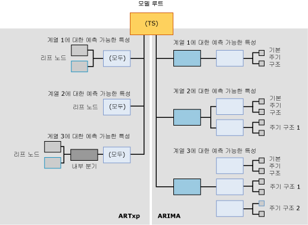

# <a name="mining-model-content-for-time-series-models-analysis-services---data-mining"></a>시계열 모델에 대한 마이닝 모델 콘텐츠(Analysis Services - 데이터 마이닝)
[!INCLUDE[ssas-appliesto-sqlas](../../includes/ssas-appliesto-sqlas.md)]
  모든 마이닝 모델은 동일한 구조를 사용하여 콘텐츠를 저장합니다. 이 구조는 데이터 마이닝 콘텐츠 스키마 행 집합에 따라 정의됩니다. 그러나 해당 표준 구조 내에서 정보를 포함하는 노드는 다양한 종류의 트리를 나타내기 위해 서로 다른 방법으로 정렬됩니다. 이 항목에서는 [!INCLUDE[msCoName](../../includes/msconame-md.md)] 시계열 알고리즘을 기반으로 하는 마이닝 모델에 대해 노드가 구성되는 방법과 각 노드의 의미에 대해 설명합니다.  
  
 모든 모델 유형에 적용되는 일반 마이닝 모델 콘텐츠에 대한 설명은 [마이닝 모델 콘텐츠&#40;Analysis Services - 데이터 마이닝&#41;](../../analysis-services/data-mining/mining-model-content-analysis-services-data-mining.md)를 참조하세요.  
  
 이 항목을 검토할 때 시계열 모델의 콘텐츠를 탐색하면서 진행하면 도움이 됩니다. 기본 데이터 마이닝 자습서를 완료하여 시계열 모델을 만들 수 있습니다. 이 자습서에서 만드는 모델은 ARIMA 및 ARTXP 알고리즘을 모두 사용하여 데이터를 학습하는 혼합 모델입니다. 마이닝 모델의 콘텐츠를 보는 방법은 [데이터 마이닝 모델 뷰어](../../analysis-services/data-mining/data-mining-model-viewers.md)를 참조하세요.  
  
## <a name="understanding-the-structure-of-a-time-series-model"></a>시계열 모델의 구조 이해  
 시계열 모델에는 모델 및 해당 메타데이터를 나타내는 단일 부모 노드가 있습니다. 이 부모 노드 아래에는 모델을 만드는 데 사용한 알고리즘에 따라 하나 또는 두 개의 시계열 트리가 있습니다.  
  
 혼합 모델을 만들 경우 각각 ARIMA와 ARTXP에 대한 두 개의 별도 트리가 모델에 추가됩니다. ARTXP 알고리즘만 사용하거나 ARIMA 알고리즘만 사용하도록 선택할 경우 해당 알고리즘에 해당하는 단일 트리가 추가됩니다. FORECAST_METHOD 매개 변수를 설정하여 사용할 알고리즘을 지정합니다. ARTXP, ARIMA 또는 혼합 모델 중 어느 것을 사용할지에 대한 자세한 내용은 [Microsoft 시계열 알고리즘](../../analysis-services/data-mining/microsoft-time-series-algorithm.md)을 참조하세요.  
  
 다음 다이어그램에는 혼합 모델을 만들기 위해 기본 설정을 사용하여 만든 시계열 데이터 마이닝 모델의 예가 나와 있습니다. 두 모델 간의 차이를 보다 쉽게 비교할 수 있도록 여기서 ARTXP 모델은 다이어그램의 왼쪽에 있고 ARIMA 모델은 다이어그램의 오른쪽에 있습니다.  ARTXP가 더 작은 분기로 분할되는 트리와 같은 구조인데 반하여 ARIMA 알고리즘으로 만든 구조는 더 작은 구성 요소를 기반으로 작성된 피라미드와 같습니다.  
  
   
  
 이때 ARIMA 및 ARTXP 트리 내에서 정보가 완전히 다른 방법으로 정렬된다는 사실을 기억해야 합니다. 두 트리는 루트 노드에서만 관련되어 있습니다. 이러한 두 표현은 편의상 한 모델로 제공되지만 두 개의 독립적인 모델로 처리해야 합니다. ARTXP는 실제 트리 구조를 나타내지만 ARIMA는 그렇지 않습니다.  
  
 Microsoft 일반 모델 콘텐츠 트리 뷰어를 사용하여 ARIMA 및 ARTXP를 모두 사용하는 모델을 보는 경우 ARTXP 및 ARIMA 모델의 노드는 모두 부모 시계열 모델의 자식 노드로 나타납니다. 그러나 노드에 적용되는 레이블로 이러한 노드를 쉽게 구별할 수 있습니다.  
  
-   첫 번째 노드 집합에는 (All)이라는 레이블이 지정되며 이는 ARTXP 알고리즘의 분석 결과를 나타냅니다.  
  
-   두 번째 노드 집합에는 ARIMA라는 레이블이 지정되며 이는 ARIMA 알고리즘의 분석 결과를 나타냅니다.  
  
> [!WARNING]  
>  ARTXP 트리에서 (All)이라는 이름은 이전 버전과의 호환성을 위해서만 유지됩니다. SQL Server 2008 이전 버전에서는 시계열 알고리즘 분석에 ARTXP 알고리즘이라는 단일 알고리즘을 사용했습니다.  
  
 다음 섹션에서는 이러한 각 모델 유형 내에 노드가 정렬되는 방식에 대해 설명합니다.  
  
### <a name="structure-of-an-artxp-model"></a>ARTXP 모델의 구조  
 ARTXP 알고리즘은 의사 결정 트리 모델과 비슷한 모델을 만듭니다. 이 알고리즘은 예측 가능한 특성을 그룹화하고 큰 차이가 발견될 때마다 이러한 특성을 분할합니다. 따라서 각 ARTXP 모델은 각 예측 가능한 특성에 대해 별도의 분기를 포함합니다. 예를 들어 기본 데이터 마이닝 자습서에서는 여러 지역의 판매 금액을 예측하는 모델을 만듭니다. 이 경우 **[Amount]** 가 예측 가능한 특성이고 각 지역에 대해 별도의 분기가 만들어집니다. 두 개의 예측 가능한 특성인 **[Amount]** 및 **[Quantity]** 가 있을 경우 각 특성 및 지역의 조합에 대해 별도의 분기가 만들어집니다.  
  
 ARTXP 분기의 최상위 노드는 의사 결정 트리 루트 노드에 있는 것과 동일한 정보를 포함합니다. 여기에는 해당 노드의 자식 수(CHILDREN_CARDINALITY), 이 노드의 조건을 충족하는 사례 수(NODE_SUPPORT) 및 다양한 설명 통계(NODE_DISTRIBUTION)가 포함됩니다.  
  
 노드에 자식이 없는 경우 사례를 추가 하위 그룹으로 구분해야 하는 중요한 조건이 발견되지 않은 것입니다. 분기는 이 지점에서 끝나고 노드는 *리프 노드*가 됩니다. 리프 노드는 ARTXP 수식의 구성 블록인 특성, 계수 및 값을 포함합니다.  
  
 일부 분기에는 의사 결정 트리 모델과 비슷하게 추가 분할이 있을 수 있습니다. 예를 들어 유럽 지역의 판매를 나타내는 트리의 분기가 두 개의 분기로 분할될 수 있습니다. 두 그룹 간에 큰 차이를 일으키는 조건이 있을 경우 분할이 발생합니다. 부모 노드는 분할을 발생시킨 특성의 이름(예: [Amount])과 부모 노드에 있는 사례 수를 알려줍니다. 리프 노드는 특성 값(예: [Sales] > 10,000 및 [Sales] < 10,000), 각 조건을 지원하는 사례 수 및 ARTxp 수식과 같은 세부 정보를 제공합니다.  
  
> [!NOTE]  
>  수식을 보려는 경우 완전한 회귀 수식을 리프 노드 수준에서 찾을 수 있지만 중간 또는 루트 노드에서는 찾을 수 없습니다.  
  
### <a name="structure-of-an-arima-model"></a>ARIMA 모델의 구조  
 ARIMA 알고리즘은 데이터 계열(예: **[Region]**) 및 예측 가능한 특성(예: **[Sales Amount]**)의 각 조합에 대해 단일 정보를 만들며 이 정보는 예측 가능한 특성의 시간에 따른 변경을 설명하는 수식입니다.  
  
 각 계열에 대한 수식은 데이터에서 발견되는 각 주기 구조에 대해 하나씩 여러 구성 요소에서 파생됩니다. 예를 들어 매월 수집되는 판매 데이터가 있는 경우 알고리즘은 월별, 분기별 또는 연도별 주기 구조를 검색할 수 있습니다.  
  
 알고리즘은 발견되는 각 주기성에 대해 별도의 부모 및 자식 노드 집합을 출력합니다. 기본 주기성은 단일 시간 조각을 나타내는 1이며 모든 모델에 자동으로 추가됩니다. PERIODICITY_HINT 매개 변수에 여러 값을 입력하여 가능한 여러 주기 구조를 지정할 수 있습니다. 그러나 알고리즘이 주기 구조를 검색하지 못하면 해당 힌트에 대한 결과를 출력하지 않습니다.  
  
 모델 콘텐츠에서 출력되는 각 주기 구조는 다음과 같은 구성 요소 노드를 포함합니다.  
  
-   AR( *자동 회귀 순서* )에 대한 노드  
  
-   MA( *이동 평균* )에 대한 노드  
  
 이러한 용어의 의미에 대한 자세한 내용은 [Microsoft 시계열 알고리즘](../../analysis-services/data-mining/microsoft-time-series-algorithm.md)을 참조하세요.  
  
 *차수* 는 수식의 중요한 부분이며 수식에 표시됩니다. 차이 순서가 사용되는 방법은 [Microsoft 시계열 알고리즘 기술 참조](../../analysis-services/data-mining/microsoft-time-series-algorithm-technical-reference.md)를 참조하세요.  
  
## <a name="model-content-for-time-series"></a>시계열에 대한 모델 콘텐츠  
 이 섹션에서는 시계열 모델과 특별히 관련된 마이닝 모델 콘텐츠 열에 대한 세부 정보 및 예만 제공합니다.  
  
 MODEL_CATALOG와 MODEL_NAME을 비롯하여 스키마 행 집합의 범용 열에 대한 자세한 내용 또는 마이닝 모델 용어에 대한 자세한 내용은 [마이닝 모델 콘텐츠&#40;Analysis Services - 데이터 마이닝&#41;](../../analysis-services/data-mining/mining-model-content-analysis-services-data-mining.md)를 참조하세요.  
  
 MODEL_CATALOG  
 모델이 저장되는 데이터베이스의 이름입니다.  
  
 MODEL_NAME  
 모델의 이름입니다.  
  
 ATTRIBUTE_NAME  
 노드에 표시된 데이터 계열에 대한 예측 가능한 특성입니다. MSOLAP_MODEL_COLUMN과 값이 동일합니다.  
  
 NODE_NAME  
 노드 이름입니다.  
  
 현재 이 열은 NODE_UNIQUE_NAME과 동일한 값을 포함하지만 이는 이후 릴리스에서 변경될 수 있습니다.  
  
 NODE_UNIQUE_NAME  
 노드의 고유한 이름입니다. 모델 부모 노드의 이름은 항상 **TS**입니다.  
  
 **ARTXP:** 각 노드는 TS 다음에 16진수 숫자 값이 오는 형식으로 표시됩니다. 노드의 순서는 중요하지 않습니다.  
  
 예를 들어 TS 트리 바로 아래에 있는 ARTXP 노드의 번호는 TS00000001-TS0000000b로 매겨집니다.  
  
 **ARIMA:** ARIMA 트리의 각 노드는 TA 다음에 16진수 숫자 값이 오는 형식으로 표시됩니다. 자식 노드에는 고유한 부모 노드 이름이 포함되고 그 뒤에 노드 내의 시퀀스를 나타내는 또 다른 16진수가 나옵니다.  
  
 모든 ARIMA 트리의 구조는 동일합니다. 각 루트는 다음 표의 예와 같은 노드 및 명명 규칙을 포함합니다.  
  
|ARIMA 노드 ID 및 유형|노드 이름 예|  
|----------------------------|--------------------------|  
|ARIMA 루트(27)|TA0000000b|  
|ARIMA 주기 구조(28)|TA0000000b00000000|  
|ARIMA 자동 회귀(29)|TA0000000b000000000|  
|ARIMA 이동 평균(30)|TA0000000b000000001|  
  
 NODE_TYPE  
 시계열 모델은 알고리즘에 따라 다음 노드 유형을 출력합니다.  
  
 **ARTXP:**  
  
|노드 유형 ID|Description|  
|------------------|-----------------|  
|1(모델)|시계열|  
|3(내부)|ARTXP 시계열 트리 내의 내부 분기를 나타냅니다.|  
|16(시계열 트리)|예측 가능한 특성 및 계열에 해당하는 ARTXP 트리의 루트입니다.|  
|15(시계열)|ARTXP 트리의 리프 노드입니다.|  
  
 **ARIMA:**  
  
|노드 유형 ID|Description|  
|------------------|-----------------|  
|27(ARIMA 루트)|ARIMA 트리의 최상위 노드입니다.|  
|28(ARIMA 주기 구조)|단일 주기 구조를 설명하는 ARIMA 트리의 구성 요소입니다.|  
|29(ARIMA 자동 회귀)|단일 주기 구조의 계수를 포함합니다.|  
|30(ARIMA 이동 평균)|단일 주기 구조의 계수를 포함합니다.|  
  
 NODE_CAPTION  
 노드에 연결된 레이블 또는 캡션입니다.  
  
 이 속성은 주로 표시용으로 사용됩니다.  
  
 **ARTXP:** 특성 및 값 범위의 조합으로 표시되는 노드의 분할 조건을 포함합니다.  
  
 **ARIMA:** ARIMA 수식의 약식 표현을 포함합니다.  
  
 ARIMA 수식의 형식에 대한 자세한 내용은 [ARIMA의 마이닝 범례](#bkmk_ARIMA_2)를 참조하십시오.  
  
 CHILDREN_CARDINALITY  
 노드에 있는 직계 자식의 수입니다.  
  
 PARENT_UNIQUE_NAME  
 노드 부모의 고유한 이름입니다. 루트 수준의 모든 노드에 대해서 NULL이 반환됩니다.  
  
 NODE_DESCRIPTION  
 현재 노드의 규칙, 분할 또는 수식에 대한 텍스트 설명입니다.  
  
 **ARTXP:** 자세한 내용은 [ARTXP 트리 이해](#bkmk_ARTXP_1)를 참조하세요.  
  
 **ARIMA:** 자세한 내용은 [ARIMA 트리 이해](#bkmk_ARIMA_1)를 참조하세요.  
  
 NODE_RULE  
 현재 노드의 규칙, 분할 또는 수식에 대한 XML 설명입니다.  
  
 **ARTXP:** NODE_RULE은 일반적으로 NODE_CAPTION에 해당합니다.  
  
 **ARIMA:** 자세한 내용은 [ARIMA 트리 이해](#bkmk_ARIMA_1)를 참조하세요.  
  
 MARGINAL_RULE  
 해당 노드와 관련된 분할 또는 콘텐츠에 대한 XML 설명입니다.  
  
 **ARTXP:** MARGINAL_RULE은 일반적으로 NODE_DESCRIPTION에 해당합니다.  
  
 **ARIMA:** 항상 비어 있습니다. 대신 NODE_RULE을 사용하세요.  
  
 NODE_PROBABILITY  
 **ARTXP:** 트리 노드의 경우 항상 1입니다. 리프 노드의 경우 모델 루트 노드에서 해당 노드에 도달할 확률입니다.  
  
 **ARIMA:** 항상 0입니다.  
  
 MARGINAL_PROBABILITY  
 **ARTXP:** 트리 노드의 경우 항상 1입니다. 리프 노드의 경우 중간 부모 노드에서 해당 노드에 도달할 확률입니다.  
  
 **ARIMA:** 항상 0입니다.  
  
 NODE_DISTRIBUTION  
 노드의 확률 히스토그램을 포함하는 테이블입니다. 시계열 모델에서 이 중첩 테이블은 실제 회귀 수식을 조합하는 데 필요한 모든 구성 요소를 포함합니다.  
  
 ARTXP 트리의 노드 배포 테이블에 대한 자세한 내용은 [ARTXP 트리 이해](#bkmk_ARTXP_1)를 참조하십시오.  
  
 ARIMA 트리의 노드 배포 테이블에 대한 자세한 내용은 [ARIMA 트리 이해](#bkmk_ARIMA_1)를 참조하십시오.  
  
 읽을 수 있는 형식으로 작성된 모든 상수 및 기타 구성 요소를 보려면 [시계열 뷰어](../../analysis-services/data-mining/browse-a-model-using-the-microsoft-time-series-viewer.md)를 사용하여 노드를 클릭하고 **마이닝 범례**를 엽니다.  
  
 NODE_SUPPORT  
 이 노드를 지지하는 사례 수입니다.  
  
 **ARTXP:** **(All)** 노드의 경우 분기에 포함된 총 시간 조각 수를 나타냅니다.  
  
 터미널 노드의 경우 NODE_CAPTION에 설명된 범위에 포함된 시간 조각 수를 나타냅니다. 터미널 노드의 시간 조각 수는 항상 분기 **(All)** 노드의 NODE_SUPPORT 값에 대한 합계입니다.  
  
 **ARIMA:** 현재 주기 구조를 지원하는 사례의 수입니다. 지지도 값은 현재 주기 구조의 모든 노드에서 반복됩니다.  
  
 MSOLAP_MODEL_COLUMN  
 노드에 표시된 데이터 계열에 대한 예측 가능한 특성입니다. ATTRIBUTE_NAME과 값이 동일합니다.  
  
 MSOLAP_NODE_SCORE  
 트리 또는 분할의 정보 값에 대한 특징을 결정하는 숫자 값입니다.  
  
 **ARTXP:** 분할이 없는 노드의 경우 값은 항상 0.0입니다. 분할이 있는 노드의 경우 값은 분할의 흥미성 점수를 나타냅니다.  
  
 이러한 점수 매기기 방법은 [기능 선택&#40;데이터 마이닝&#41;](../../analysis-services/data-mining/feature-selection-data-mining.md)을 참조하세요.  
  
 **ARIMA:** ARIMA 모델의 BIC(Bayesian Information Criterion) 점수입니다. 수식과 관련된 모든 ARIMA 노드에서 동일한 점수가 설정됩니다.  
  
 MSOLAP_NODE_SHORT_CAPTION  
 **ARTXP:**  NODE_DESCRIPTION과 동일한 정보입니다.  
  
 **ARIMA:** NODE_CAPTION과 동일한 정보입니다. 즉, ARIMA 수식의 약식 표현입니다.  
  
##  <a name="bkmk_ARTXP_1"></a> ARTXP 트리 이해  
 ARTXP 모델은 선형인 데이터 영역과 일부 다른 요인에 의해 분할되는 데이터 영역을 분명하게 구분합니다. 예측 가능한 특성의 변경 사항을 독립 변수의 함수로 직접 표현할 수 있는 모든 경우에는 해당 관계를 나타내기 위해 회귀 수식이 계산됩니다.  
  
 예를 들어 대부분의 데이터 계열에 대한 시간 및 판매 사이에 직접 상관 관계가 존재할 경우 각 데이터 계열에 대한 자식 노드가 없고 회귀 수식만 있는 시계열 트리(NODE_TYPE = 16) 내에 각 계열이 포함됩니다. 그러나 관계가 선형이 아닐 경우 ARTXP 시계열 트리는 의사 결정 트리 모델과 같이 조건에 따라 자식 노드로 분할될 수 있습니다. **Microsoft 일반 콘텐츠 트리 뷰어** 에서 모델 콘텐츠를 보면 분할이 발생한 위치와 이러한 분할이 추세 선에 주는 영향을 볼 수 있습니다.  
  
 이 동작을 더 잘 이해하려면 [기본 데이터 마이닝 자습서](http://msdn.microsoft.com/library/6602edb6-d160-43fb-83c8-9df5dddfeb9c)에서 만든 시계열 모델을 검토합니다. AdventureWorks 데이터 웨어하우스 기반의 이 모델은 특히 복잡한 데이터를 사용하지 않습니다. 따라서 ARTXP 트리에는 분할이 많지 않습니다. 그러나 상대적으로 간단한 이 모델도 세 가지 다른 종류의 분할을 보여 줍니다.  
  
-   Pacific 지역에 대한 [Amount] 추세 선은 시간 키에 따라 분할됩니다. 시간 키에 따른 분할은 특정 시점에 추세에 변화가 있다는 것을 의미합니다. 추세 선은 특정 지점까지만 선형이며 그 다음에는 다른 셰이프를 그리는 곡선입니다. 예를 들어 하나의 시계열이 2002년 8월 6일까지 계속되고 또 다른 시계열이 해당 날짜 이후에 시작될 수 있습니다.  
  
-   North America 지역에 대한 [Amount] 추세 선은 다른 변수에 따라 분할됩니다. 이 경우 North America 지역의 추세는 Europe 지역에 있는 동일한 모델의 값을 기반으로 분할됩니다. 즉, Europe의 값이 변경되면 North America의 값도 변경된다는 사실을 알고리즘에서 검색했습니다.  
  
-   Europe 지역에 대한 추세 선은 자체에서 분할됩니다.  
  
 각 분할의 의미는 무엇일까요? 모델 콘텐츠가 나타내는 정보를 해석하는 것은 데이터와 비즈니스 컨텍스트에서 해당 데이터가 갖는 의미에 대한 심층적 이해가 필요한 기술입니다.  
  
-   North America 및 Europe 지역의 추세가 서로 분명하게 연결된다는 사실은 Europe의 데이터 계열에 더 많은 Entropy가 있으므로 North America의 추세가 더 약하게 나타난다는 것만을 의미할 수 있습니다. 또는 단순히 North America를 계산하기 전에 Europe을 계산했기 때문에 두 추세의 점수에 큰 차이가 없으며 상관 관계가 우연한 것일 수 있습니다. 그러나 데이터를 검토하여 상관 관계가 거짓인지 여부를 확인하거나 다른 기타 요인이 관련되었는지 확인하는 것이 필요할 수 있습니다.  
  
-   시간 키에 따른 분할은 선의 그라데이션에서 통계적으로 중요한 변화가 있다는 것을 의미합니다. 이는 분할에 필요한 Entropy의 계산이나 각 범위에 대한 지지도와 같은 수학적 요인 때문일 수 있습니다. 따라서 이 분할은 실제 상황에서 모델의 의미와 관련하여 흥미성이 떨어질 수 있습니다. 그러나 분할에 표시된 기간을 검토할 경우 해당 시간에 시작했으며 데이터에 영향을 주었을 수 있는 판매 홍보 또는 기타 이벤트와 같은 데이터에 표시되지 않은 흥미로운 상관 관계를 발견할 수 있습니다.  
  
 데이터에 다른 특성이 포함된 경우 트리의 분기는 더 흥미로워집니다. 예를 들어 날씨 정보를 추적했고 해당 정보를 특성으로 사용하여 분석한 경우 판매와 날씨의 복잡한 상호 작용을 나타내는 여러 분할을 트리에서 볼 수 있습니다.  
  
 즉, 데이터 마이닝은 잠재적으로 흥미로운 현상이 발생할 수 있는 항목에 대한 힌트를 제공하는 데 유용하지만 정보의 가치를 컨텍스트와 관련하여 정확하게 해석하려면 비즈니스 사용자가 추가적인 조사를 실행하고 전문 지식을 사용해야 합니다.  
  
### <a name="elements-of-the-artxp-time-series-formula"></a>ARTXP 시계열 수식의 요소  
 ARTXP 트리 또는 분기에 대한 전체 수식을 보려면 읽을 수 있는 형식으로 모든 상수를 제공하는 **Microsoft 시계열 뷰어** 의 [마이닝 범례](../../analysis-services/data-mining/browse-a-model-using-the-microsoft-time-series-viewer.md)를 사용하는 것이 좋습니다.  
  
-   [시계열 모델에 대한 수식 보기&#40;데이터 마이닝&#41;](../../analysis-services/data-mining/view-the-formula-for-a-time-series-model-data-mining.md)  
  
 다음 섹션에서는 예제 수식을 제공하고 기본 항에 대해 설명합니다.  
  
#### <a name="mining-legend-for-an-artxp-formula"></a>ARTXP 수식의 마이닝 범례  
 다음 예에서는 **마이닝 범례**에 표시된 대로 모델의 한 부분에 대한 ARTXP 수식을 보여 줍니다. 이 수식을 보려면 기본 데이터 마이닝 자습서에서 만든 [Forecasting] 모델을 Microsoft 시계열 뷰어에서 열고 **모델** 탭을 클릭한 다음 R250: Europe 데이터 계열에 대한 트리를 선택합니다.  
  
 이 예에 사용된 수식을 보려면 2003년 5월 7일 또는 이날 이후의 날짜 계열을 나타내는 노드를 클릭합니다.  
  
 트리 노드 수식 예:  
  
 `Quantity = 21.322 -0.293 * Quantity(R250 North America,-7) + 0.069 * Quantity(R250 Europe,-1) + 0.023 * Quantity(R250 Europe,-3) -0.142 * Quantity(R750 Europe,-8)`  
  
 이 경우 21.322 값은 다음 수식 요소의 함수로 Quantity에 대해 예측된 값을 나타냅니다.  
  
 예를 들어 `Quantity(R250 North America,-7)`요소의 경우 이 표기는 현재 시간 조각에서 7개 시간 조각 전 또는 `t-7`에서 North America 지역의 수량을 의미합니다. 이 데이터 계열의 값에 계수 -0.293을 곱합니다. 각 요소의 계수는 학습 프로세스 중 파생되며 데이터의 추세를 기반으로 합니다.  
  
 Europe 지역의 R250 모델 수량이 여러 다른 데이터 계열의 값에 종속되는 것으로 모델에서 계산했으므로 이 수식에는 요소가 여러 개 있습니다.  
  
#### <a name="model-content-for-an-artxp-formula"></a>ARTXP 수식에 대한 모델 콘텐츠  
 다음 표에서는 [Microsoft 일반 콘텐츠 트리 뷰어&#40;데이터 마이닝&#41;](http://msdn.microsoft.com/library/751b4393-f6fd-48c1-bcef-bdca589ce34c)에 표시된 대로 관련 노드의 콘텐츠를 사용하여 수식에 대한 동일한 정보를 보여 줍니다.  
  
|ATTRIBUTE_NAME|ATTRIBUTE_VALUE|SUPPORT|PROBABILITY|VARIANCE|VALUETYPE|  
|---------------------|----------------------|-------------|-----------------|--------------|---------------|  
|Quantity(R250 Europe,y-intercept)|21.3223433563772|11|0|1.65508795539661|11(절편)|  
|Quantity(R250 Europe,-1)|0.0691694140876526|0|0|0|7(계수)|  
|Quantity(R250 Europe,-1)|20.6363635858123|0|0|182.380682874818|9(통계)|  
|Quantity(R750 Europe,-8)|-0.1421203048299|0|0|0|7(계수)|  
|Quantity(R750 Europe,-8)|22.5454545333019|0|0|104.362130048408|9(통계)|  
|Quantity(R250 Europe,-3)|0.0234095979448281|0|0|0|7(계수)|  
|Quantity(R250 Europe,-3)|24.8181818883176|0|0|176.475304989169|9(통계)|  
|Quantity(R250 North America,-7)|-0.292914186039869|0|0|0|7(계수)|  
|Quantity(R250 North America,-7)|10.36363640433|0|0|701.882534898676|9(통계)|  
  
 이러한 예를 비교하여 알 수 있듯이 마이닝 모델 콘텐츠는 **마이닝 범례**에서 사용할 수 있는 것과 동일한 정보를 포함하지만 *분산* 및 *지지도*에 대한 추가 열을 포함합니다. 지지도 값은 이 수식에 설명된 추세를 지원하는 사례의 수를 나타냅니다.  
  
### <a name="using-the-artxp-time-series-formula"></a>ARTXP 시계열 수식 사용  
 대부분의 비즈니스 사용자에게 ARTXP 모델 콘텐츠의 가치는 ARTXP 모델 콘텐츠가 데이터의 선형 표현과 트리 뷰를 모두 제공한다는 데에 있습니다.  
  
-   예측 가능한 특성의 변경 사항을 독립 변수의 선형 함수로 나타낼 수 있는 경우 알고리즘에서는 회귀 수식을 자동으로 계산하고 해당 계열을 별도의 노드에 출력합니다.  
  
-   관계를 선형 상관 관계로 표현할 수 없는 경우 시계열은 항상 의사 결정 트리와 같이 분기됩니다.  
  
 [Microsoft 시계열 뷰어](../../analysis-services/data-mining/browse-a-model-using-the-microsoft-time-series-viewer.md) 에서 모델 콘텐츠를 탐색하면 분할이 발생한 위치와 이러한 분할이 추세 선에 주는 영향을 볼 수 있습니다.  
  
 데이터 계열의 임의 부분에 대한 시간 및 판매 사이에 직접 상관 관계가 존재할 경우 수식을 얻는 가장 간단한 방법은 **마이닝 범례**에서 수식을 복사한 다음 모델을 설명하는 데 도움이 되도록 문서 또는 프레젠테이션에 붙여넣는 것입니다. 또는 해당 트리에 대한 NODE_DISTRIBUTION 테이블에서 평균, 계수 및 기타 정보를 추출하여 추세의 확장을 계산하는 데 사용할 수 있습니다. 전체 계열에서 일관된 선형 관계가 나타날 경우 수식은 (All) 노드에 포함됩니다. 트리에 분기가 있는 경우 수식은 리프 노드에 포함됩니다.  
  
 다음 쿼리는 수식을 포함하는 중첩 테이블 NODE_DISTRIBUTION과 함께 마이닝 모델의 모든 ARTXP 리프 노드를 반환합니다.  
  
```  
SELECT MODEL_NAME, ATTRIBUTE_NAME, NODE_NAME,  
NODE_CAPTION,   
(SELECT ATTRIBUTE_NAME, ATTRIBUTE_VALUE, [VARIANCE], VALUETYPE  
FROM NODE_DISTRIBUTION) as t  
FROM Forecasting.CONTENT  
WHERE NODE_TYPE = 15  
```  
  
##  <a name="bkmk_ARIMA_1"></a> ARIMA 트리 이해  
 ARIMA 모델의 각 구조는 *주기성* 또는 *주기 구조*에 해당합니다. 주기 구조는 데이터 계열 전체에서 반복되는 데이터 패턴입니다. 통계적 한도 내에서 약간의 패턴 변형이 허용됩니다. 주기성은 학습 데이터에 사용된 기본 시간 단위에 따라 측정됩니다. 예를 들어 학습 데이터가 각 날에 대한 판매 데이터를 제공할 경우 기본 시간 단위는 1일이고 모든 주기 구조는 지정된 일 수로 정의됩니다.  
  
 알고리즘으로 검색되는 각 기간에는 고유한 구조 노드가 지정됩니다. 예를 들어 일일 판매 데이터를 분석하는 경우 모델은 주를 나타내는 주기 구조를 검색할 수 있습니다. 이 경우 알고리즘은 완성된 모델에서 두 개의 주기 구조, 즉 {1}로 표시된 기본 일일 기간에 대한 주기 구조와 {7}로 표시된 주에 대한 주기 구조를 만듭니다.  
  
 예를 들어 다음 쿼리는 마이닝 모델의 모든 ARIMA 구조를 반환합니다.  
  
```  
SELECT MODEL_NAME, ATTRIBUTE_NAME, NODE_NAME, NODE_CAPTION  
FROM Forecasting.CONTENT  
WHERE NODE_TYPE = 27  
```  
  
 예제 결과:  
  
|MODEL_NAME|ATTRIBUTE_NAME|NODE_NAME|NODE_TYPE|NODE_CAPTION|  
|-----------------|---------------------|----------------|----------------|-------------------|  
|Forecasting|M200 Europe:Quantity|TA00000000|27|ARIMA (1,0,1)|  
|Forecasting|M200 North America:Quantity|TA00000001|27|ARIMA (1,0,4) X (1,1,4)(6)|  
|Forecasting|M200 Pacific:Quantity|TA00000002|27|ARIMA (2,0,8) X (1,0,0)(4)|  
|Forecasting|M200 Pacific:Quantity|TA00000002|27|ARIMA (2,0,8) X (1,0,0)(4)|  
|Forecasting|R250 Europe:Quantity|TA00000003|27|ARIMA (1,0,7)|  
|Forecasting|R250 North America:Quantity|TA00000004|27|ARIMA (1,0,2)|  
|Forecasting|R250 Pacific:Quantity|TA00000005|27|ARIMA (2,0,2) X (1,1,2)(12)|  
|Forecasting|R750 Europe:Quantity|TA00000006|27|ARIMA (2,1,1) X (1,1,5)(6)|  
|Forecasting|T1000 Europe:Quantity|TA00000009|27|ARIMA (1,0,1)|  
|Forecasting|T1000 North America:Quantity|TA0000000a|27|ARIMA (1,1,1)|  
|Forecasting|T1`000 Pacific:Quantity|TA0000000b|27|ARIMA (1,0,3)|  
  
 [Microsoft 일반 콘텐츠 트리 뷰어&#40;데이터 마이닝&#41;](http://msdn.microsoft.com/library/751b4393-f6fd-48c1-bcef-bdca589ce34c)를 사용하여 탐색할 수도 있는 이러한 결과를 통해 완전히 선형인 계열, 주기 구조가 여러 개인 계열 및 검색된 주기성을 한눈에 알 수 있습니다.  
  
 예를 들어 M200 Europe 계열에 대한 ARIMA 수식의 약식 표현을 통해 기본값인 일일 주기만 검색되었다는 사실을 알 수 있습니다. 수식의 약식 표현은 NODE_CAPTION 열에 제공됩니다.  
  
 그러나 M200 North America 계열의 경우 추가 주기 구조가 검색됩니다. 노드 TA00000001에는 수식 (1,0,4)와 수식 (1,1,4)(6)에 대해 하나씩 두 개의 자식 노드가 있습니다. 이러한 수식은 부모 노드에서 연결 및 표시됩니다.  
  
 또한 각 주기 구조에 대해 모델 콘텐츠는 *차수* 및 *이동 평균* 을 자식 노드로 제공합니다. 예를 들어 다음 쿼리는 이전 예에 나열된 노드 중 하나의 자식 노드를 검색합니다. 열 PARENT_UNIQUE_NAME은 대괄호로 묶어 동일한 이름의 예약 키워드와 구분해야 합니다.  
  
```  
SELECT *   
FROM Forecasting.CONTENT  
WHERE [PARENT_UNIQUE_NAME] = ' TA00000001'  
```  
  
 이는 ARTXP 트리가 아니라 ARIMA 트리이므로 [IsDescendant&#40;DMX&#41;](../../dmx/isdescendant-dmx.md) 함수를 사용하여 이 주기 구조의 자식 노드를 반환할 수 없습니다. 대신 특성 및 노드 유형을 사용하여 결과를 필터링하고 이동 평균 및 차수를 비롯하여 수식이 작성된 방법에 대한 세부 정보를 제공하는 자식 노드를 반환할 수 있습니다.  
  
```  
SELECT MODEL_NAME, ATTRIBUTE_NAME, NODE_UNIQUE_NAME,  
NODE_TYPE,  NODE_CAPTION  
FROM Forecasting.CONTENT  
WHERE [MSOLAP_MODEL_COLUMN] ='M200 North America:Quantity'  
AND (NODE_TYPE = 29 or NODE_TYPE = 30)  
```  
  
 예제 결과:  
  
|MODEL_NAME|ATTRIBUTE_NAME|NODE_UNIQUE_NAME|NODE_TYPE|NODE_CAPTION|  
|-----------------|---------------------|------------------------|----------------|-------------------|  
|Forecasting|M200 North America:Quantity|TA00000001000000010|29|ARIMA {1,0.961832044807041}|  
|Forecasting|M200 North America:Quantity|TA00000001000000011|30|ARIMA {1,-3.51073103693271E-02,2.15731642954099,-0.220314343327742,-1.33151478258758}|  
|Forecasting|M200 North America:Quantity|TA00000001000000000|29|ARIMA {1,0.643565911081657}|  
|Forecasting|M200 North America:Quantity|TA00000001000000001|30|ARIMA {1,1.45035399809581E-02,-4.40489283927752E-02,-0.19203901352577,0.242202497643993}|  
  
 이러한 예에서는 ARIMA 트리로 드릴다운할수록 세부 정보가 더 많이 제공되지만 중요한 정보는 부모 노드에서도 결합 및 표시된다는 것을 보여 줍니다.  
  
### <a name="time-series-formula-for-arima"></a>ARIMA에 대한 시계열 수식  
 임의 ARIMA 노드에 대한 전체 수식을 보려면 이미 일관된 형식으로 작성된 자동 회귀 차수, 이동 평균 및 수식의 기타 요소를 제공하는 **Microsoft 시계열 뷰어** 의 [마이닝 범례](../../analysis-services/data-mining/browse-a-model-using-the-microsoft-time-series-viewer.md)를 사용하는 것이 좋습니다.  
  
-   [시계열에 대 한 수식을 보려면 모델 & #40; 데이터 마이닝 & #41;](../../analysis-services/data-mining/view-the-formula-for-a-time-series-model-data-mining.md)  
  
 이 섹션에서는 예제 수식을 제공하고 기본 항에 대해 설명합니다.  
  
####  <a name="bkmk_ARIMA_2"></a> ARIMA 수식의 마이닝 범례  
 다음 예에서는 마이닝 범례에 표시된 대로 모델의 한 부분에 대한 ARIMA 수식을 보여 줍니다. 이 수식을 보려면 **Microsoft 시계열 뷰어** 를 사용하여 **Forecasting**모델을 열고 **모델** 탭을 클릭한 다음 **R250: Europe** 데이터 계열에 대한 트리를 선택합니다. 그런 다음 2003년 7월 5일 또는 이날 이후의 데이터 계열을 나타내는 노드를 클릭합니다. 마이닝 범례는 다음 예와 같이 읽을 수 있는 형식으로 모든 상수를 작성합니다.  
  
 ARIMA 수식:  
  
`ARIMA ({1,1},0,{1,1.49791920964142,1.10640053499397,0.888873034670339,-5.05429403071953E-02,-0.905265316720334,-0.961908900643379,-0.649991020901922}) Intercept:56.8888888888889`  
  
 이 수식은 계수 및 절편의 값을 포함하는 긴 ARIMA 형식입니다. 이 수식의 약식 표현이 것 {1,0,7}, 여기서 1은 시간 조각 수로 기간, 0은 항 차수를 나타냅니다. 및 7 계수 수를 나타냅니다.  
  
> [!NOTE]  
>  상수는 Analysis Services에서 분산 계산을 위해 계산되지만 상수 자체는 사용자 인터페이스에 표시되지 않습니다. 그러나 **차트** 뷰에서 **편차 표시** 를 선택할 경우 계열의 임의 지점에 대한 분산을 이 상수의 함수로 볼 수 있습니다. 각 데이터 계열에 대한 도구 설명에는 예측된 특정 지점에 대한 분산이 표시됩니다.  
  
#### <a name="model-content-for-arima-formula"></a>ARIMA 수식에 대한 모델 콘텐츠  
 ARIMA 모델은 다른 유형의 노드에 다른 정보가 포함되는 표준 구조를 따릅니다. ARIMA 모델에 대한 모델 콘텐츠를 보려면 뷰어를 **Microsoft 일반 콘텐츠 트리 뷰어**로 변경한 다음 특성 이름이 **R250 Europe: Quantity**인 노드를 확장합니다.  
  
 데이터 계열에 대한 ARIMA 모델은 응용 프로그램에 따라 선택할 수 있는 네 개의 서로 다른 형식으로 된 기본 주기 수식을 포함합니다.  
  
 **NODE_CAPTION:** 수식을 약식으로 표시합니다. 약식 표현을 통해 표시되는 주기 구조 수 및 이러한 주기 구조에 있는 계수 수를 알 수 있습니다. 예를 들어 수식의 약식 표현이 `{4,0,6}`인 경우 노드는 계수가 6개인 하나의 주기 구조를 나타냅니다. 약식 표현이 `{2,0,8} x {1,0,0}(4)`와 같은 경우 노드는 두 개의 주기 구조를 포함합니다.  
  
 **NODE DESCRIPTION:** **마이닝 범례**에 표시되는 수식의 형태이기도 한 긴 수식 형식을 표시합니다. 긴 형태의 수식은 실제 계수 값이 계산되는 대신 표시된다는 점을 제외하고 약식 표현과 비슷합니다.  
  
 **NODE_RULE:** 수식의 XML 표현을 표시합니다. 노드 유형에 따라 XML 표현은 하나 또는 여러 개의 주기 구조를 포함할 수 있습니다. 다음 표에서는 XML 노드가 ARIMA 모델의 상위 수준으로 롤업되는 방법을 보여 줍니다.  
  
|노드 유형|XML 콘텐츠|  
|---------------|-----------------|  
|27(ARIMA 루트)|데이터 계열에 대한 모든 주기 구조와 각 주기 구조에 대한 모든 자식 노드의 콘텐츠를 포함합니다.|  
|28(ARIMA 주기 구조)|해당 자동 회귀 항 노드 및 이동 평균 계수를 포함하여 단일 주기 구조를 정의합니다.|  
|29(ARIMA 자동 회귀)|단일 주기 구조의 항을 나열합니다.|  
|30(ARIMA 이동 평균)|단일 주기 구조의 계수를 나열합니다.|  
  
 **NODE_DISTRIBUTION:** 특정 항을 가져오기 위해 쿼리할 수 있는 중첩 테이블의 수식 항을 표시합니다. 노드 배포 테이블은 XML 규칙과 동일한 계층 구조를 따릅니다. 즉, ARIMA 계열의 루트 노드(NODE_TYPE = 27)는 여러 주기성을 포함할 수 있는 완전한 수식에 대한 절편 값 및 주기성을 포함하는데 반해 자식 노드는 특정 주기 구조 또는 해당 주기 구조의 자식 노드에 대한 정보만 포함합니다.  
  
|노드 유형|Attribute|값 유형|  
|---------------|---------------|----------------|  
|27(ARIMA 루트)|가로채기<br /><br /> 주기성|11|  
|28(ARIMA 주기 구조)|주기성<br /><br /> 자동 회귀 차수<br /><br /> 차수<br /><br /> 이동 평균 순서|12<br /><br /> 13<br /><br /> 15<br /><br /> 14|  
|29(ARIMA 자동 회귀)|계수<br /><br /> (계수의 보수)|7|  
|30(ARIMA 이동 평균)|t의 값<br /><br /> t-1의 값<br /><br /> …<br /><br /> t-n의 값|7|  
  
 *이동 평균 차수* 의 값은 계열의 이동 평균 수를 나타냅니다. 계열에 `n-1` 개의 항이 있는 경우 일반적으로 이동 평균은 `n` 번 계산되지만 계산이 보다 쉽도록 해당 숫자를 줄일 수 있습니다.  
  
 *자동 회귀 차수* 의 값은 자동 회귀 계열 수를 나타냅니다.  
  
 *차수* 의 값은 계열이 비교 또는 차별화되는 횟수를 나타냅니다.  
  
 열거된 가능한 값 유형을 보려면 <xref:Microsoft.AnalysisServices.AdomdServer.MiningValueType>를 참조하세요.  
  
### <a name="using-the-arima-tree-information"></a>ARIMA 트리 정보 사용  
 비즈니스 솔루션에 ARIMA 알고리즘을 기반으로 하는 예측을 사용할 경우 예측을 수행하는 데 사용된 방법을 보여 주기 위해 수식을 보고서에 붙여넣을 수 있습니다. 캡션을 사용하여 약식 표현으로 수식을 표시하거나 설명을 사용하여 긴 표현으로 수식을 표시할 수 있습니다.  
  
 시계열 예측을 사용하는 응용 프로그램을 개발하는 경우 모델 콘텐츠에서 ARIMA 수식을 가져온 다음 고유한 예측을 수행하는 것이 유용할 수 있습니다. 특정 출력을 위한 ARIMA 수식을 가져오려면 이전 예와 같이 해당 특정 특성에 대한 ARIMA 루트를 직접 쿼리합니다.  
  
 원하는 계열을 포함하는 노드의 ID를 알고 있는 경우 다음 두 가지 옵션을 통해 수식의 구성 요소를 검색할 수 있습니다.  
  
-   중첩 테이블 형식: DMX 쿼리를 사용하거나 OLEDB 클라이언트를 통해 쿼리합니다.  
  
-   XML 표현: XML 쿼리를 사용합니다.  
  
## <a name="remarks"></a>주의  
 각 분할에 대한 정보가 트리 내의 서로 다른 위치에 있으므로 ARTXP 트리의 정보를 검색하기 어려울 수 있습니다. 따라서 ARTXP 모델을 사용할 경우 모든 부분을 가져온 다음 완전한 수식을 다시 구성하기 위해 약간의 처리 작업을 수행해야 합니다. ARIMA 모델에서 수식을 검색할 경우에는 트리 전체에서 수식을 사용할 수 있으므로 검색 작업이 보다 쉽습니다. 쿼리를 만들어 이 정보를 검색하는 방법은 [시계열 모델 쿼리 예제](../../analysis-services/data-mining/time-series-model-query-examples.md)를 참조하세요.  
  
## <a name="see-also"></a>관련 항목:  
 [마이닝 모델 콘텐츠 & #40; Analysis Services-데이터 마이닝 & #41;](../../analysis-services/data-mining/mining-model-content-analysis-services-data-mining.md)   
 [Microsoft 시계열 알고리즘](../../analysis-services/data-mining/microsoft-time-series-algorithm.md)   
 [시계열 모델 쿼리 예제](../../analysis-services/data-mining/time-series-model-query-examples.md)   
 [Microsoft 시계열 알고리즘 기술 참조](../../analysis-services/data-mining/microsoft-time-series-algorithm-technical-reference.md)  
  
  
