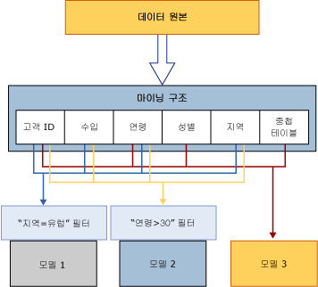

# 마이닝 구조(Analysis Services - 데이터 마이닝)
[!INCLUDE[ssas-appliesto-sqlas](../../includes/ssas-appliesto-sqlas.md)]
  마이닝 구조는 마이닝 모델을 작성하는 데이터, 즉 원본 데이터 뷰, 열 유형과 수, 학습 및 테스트 집합으로의 선택적 분할을 정의합니다. 하나의 마이닝 구조는 같은 도메인을 공유하는 여러 개의 마이닝 모델을 지원할 수 있습니다. 다음 다이어그램에서는 데이터 마이닝 구조와 이를 구성하는 데이터 마이닝 모델 및 데이터 원본 간의 관계를 보여 줍니다.  
  
   
  
 다이어그램의 마이닝 구조는 CustomerID 필드에 조인된 여러 개의 테이블 또는 뷰가 들어 있는 데이터 원본을 기반으로 합니다. 한 테이블에는 지리적 영역, 나이, 수입 및 성별과 같은 고객에 대한 정보가 들어 있고, 관련된 중첩 테이블에는 고객이 구매한 제품과 같은 각 고객에 대한 추가 정보가 여러 행으로 들어 있습니다. 이 다이어그램에서는 한 마이닝 구조에서 여러 개의 모델이 만들어질 수 있으며 각 모델이 구조에서 사용하는 열이 서로 다를 수 있다는 것을 보여 줍니다.  
  
 **모델 1** CustomerID, Income, Age, Region을 사용하고 Region의 데이터를 필터링합니다.  
  
 **모델 2** CustomerID, Income, Age, Region을 사용하고 Age의 데이터를 필터링합니다.  
  
 **모델 3** CustomerID, Age, Gender 및 중첩 테이블을 사용하고 필터는 적용하지 않습니다.  
  
 각 모델에서는 입력에 서로 다른 열을 사용하고 두 개의 모델에서는 추가적으로 필터를 적용하여 모델에 사용되는 데이터를 제한하므로 세 모델이 모두 동일한 데이터를 기반으로 함에도 불구하고 결과는 매우 다를 수 있습니다. 사례 키로 사용할 수 있는 열은 CustomerID 열뿐이므로 모든 모델에서 이 열이 필요합니다.  
  
 이 섹션에서는 데이터 마이닝 구조의 기본 아키텍처, 즉 마이닝 구조를 정의하고 정의된 마이닝 구조에 데이터를 채우고 마이닝 구조를 사용하여 모델을 만드는 방법에 대해 설명합니다. 기존 데이터 마이닝 구조를 관리하거나 내보내는 방법에 대한 자세한 내용은 [데이터 마이닝 솔루션 및 개체 관리](../../analysis-services/data-mining/management-of-data-mining-solutions-and-objects.md)를 참조하세요.  
  
## 마이닝 구조 정의  
 마이닝 구조 설정은 다음과 같은 단계로 구성됩니다.  
  
-   데이터 원본을 정의합니다.  
  
-   구조에 포함할 데이터의 열을 선택(모델에 모든 열을 추가할 필요는 없음)하고 키를 정의합니다.  
  
-   해당될 경우 bested 테이블의 키를 포함하여 구조에 대한 키를 정의합니다.  
  
-   학습 집합 및 테스트 집합에 별도의 원본 데이터를 설정할지 여부를 지정합니다. 이 단계는 선택 사항입니다.  
  
-   구조를 처리합니다.  
  
 각 단계에 대해서는 다음 섹션에서 자세하게 설명합니다.  
  
### 마이닝 구조를 위한 데이터 원본  
 마이닝 구조를 정의할 때는 기존 데이터 원본 뷰에서 제공하는 열을 사용합니다. 데이터 원본 뷰는 여러 데이터 원본을 결합하여 단일 원본으로 사용할 수 있는 공유 개체입니다. 원래의 데이터 원본은 클라이언트 애플리케이션에서 볼 수 없으며, 데이터 원본 뷰의 속성을 사용하여 데이터 유형을 수정하거나 집계를 만들거나 열의 별칭을 지정할 수 있습니다.  
  
 동일한 마이닝 구조에서 여러 마이닝 모델을 만드는 경우 각 모델은 구조의 서로 다른 열을 사용할 수 있습니다. 예를 들어 단일 구조를 만든 다음, 이를 통해 각기 다른 열을 사용하고 다른 특성을 예측하는 별도의 의사 결정 트리 및 클러스터링 모델을 만들 수 있습니다.  
  
 또한 각 모델에서 구조의 열을 서로 다른 방식으로 사용할 수도 있습니다. 예를 들어 데이터 원본 뷰에 Income 열을 포함한 후 각 모델에서 서로 다른 방식으로 이 열을 바인딩할 수 있습니다.  
  
 데이터 마이닝 구조에는 데이터 원본 및 열에 대한 정의가 원본 데이터에 대한 *바인딩* 형식으로 저장됩니다. 데이터 원본 바인딩에 대한 자세한 내용은 [데이터 원본 및 바인딩&#40;SSAS 다차원&#41;](../../analysis-services/multidimensional-models/data-sources-and-bindings-ssas-multidimensional.md)을 참조하세요. DMX [CREATE MINING STRUCTURE&#40;DMX&#41;](../../dmx/create-mining-structure-dmx.md) 문을 사용하여 특정 데이터 원본에 바인딩하지 않고 데이터 마이닝 구조를 만들 수도 있습니다.  
  
### 마이닝 구조 열  
 마이닝 구조의 빌드 블록은 데이터 원본에 포함된 데이터를 설명하는 마이닝 구조 열입니다. 이러한 열에는 데이터 형식, 내용 유형, 데이터 배포 방법 등의 정보가 포함됩니다. 마이닝 구조는 특정 마이닝 모델의 열 사용 방법이나 모델 작성 시 사용되는 알고리즘 유형에 대한 정보를 포함하지 않습니다. 이 정보는 마이닝 모델에서 정의됩니다.  
  
 마이닝 구조는 중첩 테이블을 포함할 수도 있습니다. 중첩 테이블은 사례 엔터티 및 관련 특성 간의 일 대 다 관계를 나타냅니다. 예를 들어 고객을 설명하는 정보가 한 테이블에 있고 이 고객의 구매 내용이 다른 테이블에 있으면 중첩 테이블을 사용하여 정보를 단일 사례로 결합할 수 있습니다. 고객 식별자는 엔터티이고 구매 내용은 관련 특성입니다. 중첩 테이블을 사용하는 경우에 대한 자세한 내용은 [중첩 테이블&#40;Analysis Services - 데이터 마이닝&#41;](../../analysis-services/data-mining/nested-tables-analysis-services-data-mining.md)을 참조하세요.  
  
 [!INCLUDE[ssBIDevStudioFull](../../includes/ssbidevstudiofull-md.md)]에서 데이터 마이닝 모델을 만들려면 먼저 데이터 마이닝 구조를 만들어야 합니다. 데이터 마이닝 마법사는 마이닝 구조를 만들고 데이터를 선택하고 마이닝 모델을 추가하는 과정을 안내해 줍니다.  
  
 DMX(Data Mining Extensions)를 사용하여 마이닝 모델을 만드는 경우 모델과 해당 모델의 열을 지정할 수 있으며 DMX에서는 필요한 마이닝 구조를 자동으로 만듭니다. 자세한 내용은 [CREATE MINING MODEL&#40;DMX&#41;](../../dmx/create-mining-model-dmx.md)을 참조하세요.  
  
 자세한 내용은 [Mining Structure Columns](../../analysis-services/data-mining/mining-structure-columns.md)을 참조하세요.  
  
### 데이터를 학습 집합 및 테스트 집합으로 분할  
 마이닝 구조를 위한 데이터를 정의할 때 학습 및 테스트에 사용될 몇 가지 데이터도 지정할 수 있습니다. 따라서 데이터 마이닝 구조를 만들기 전에 데이터를 분리할 필요가 없습니다. 대신 모델을 만들 때 특정 데이터 비율을 테스트용으로 지정하고 나머지는 학습용으로 지정하거나, 특정 사례 수를 테스트 데이터 집합으로 사용하도록 지정할 수 있습니다. 학습 및 테스트 데이터 집합에 대한 정보가 마이닝 구조와 함께 캐시되므로, 이 구조를 기반으로 하는 모든 모델에서 동일한 테스트 집합을 사용할 수 있습니다.  
  
 자세한 내용은 [Training and Testing Data Sets](../../analysis-services/data-mining/training-and-testing-data-sets.md)을 참조하세요.  
  
### 드릴스루 사용  
 특정 마이닝 모델에서 열을 사용할 계획이 없더라도 마이닝 구조에 해당 열을 추가할 수 있습니다. 예를 들어 클러스터링 모델에서는 고객의 전자 메일 주소를 검색하지만 분석 프로세스에서는 전자 메일 주소를 사용하지 않을 경우 이 기능이 매우 유용합니다. 분석 및 예측 단계에서 특정 열을 무시하려면 구조에 열을 추가한 후 해당 열을 사용하도록 지정하지 않거나 사용 플래그를 무시로 지정하면 됩니다. 마이닝 모델에 드릴스루가 사용되도록 설정되어 있고 적절한 권한이 있을 경우 이와 같이 플래그가 지정된 데이터도 쿼리에 사용될 수 있습니다. 예를 들어 전체 고객에 대한 분석 결과로 생성된 클러스터를 검토한 다음, 드릴스루 쿼리를 사용하여 특정 클러스터에서 모델을 만들 때 사용하도록 설정하지 않은 고객의 이름과 전자 메일 주소 데이터를 가져올 수 있습니다.  
  
 자세한 내용은 [드릴스루 쿼리&#40;데이터 마이닝&#41;](../../analysis-services/data-mining/drillthrough-queries-data-mining.md)를 참조하세요.  
  
### 마이닝 구조 처리  
 마이닝 구조는 처리되기 전까지는 단순한 메타데이터 컨테이너입니다. 마이닝 구조를 처리할 때 [!INCLUDE[ssASnoversion](../../includes/ssasnoversion-md.md)] 에서는 데이터에 대한 통계, 연속 특성을 불연속화하는 방법 및 나중에 마이닝 모델에서 사용되는 기타 정보를 저장하는 캐시를 만듭니다. 마이닝 모델은 이 요약 정보를 저장하지 않지만, 대신 마이닝 구조가 처리될 때 캐시된 요약 정보를 참조합니다. 따라서 기존 구조에 새 모델을 추가할 때마다 구조를 다시 처리할 필요가 없으며 해당 모델만 처리하면 됩니다.  
  
 캐시가 매우 큰 경우 또는 세부 데이터를 제거하려는 경우에는 캐시를 처리 후에 삭제하도록 지정할 수 있습니다. 데이터를 캐시하지 않으려면 마이닝 구조의 **CacheMode** 속성을 **ClearAfterProcessing**으로 변경하면 됩니다. 이렇게 하면 모델이 처리된 후 캐시가 삭제됩니다. **CacheMode** 속성을 **ClearAfterProcessing** 으로 설정하면 마이닝 모델에서 드릴스루 기능을 사용할 수 없게 됩니다.  
  
 그러나 캐시를 삭제한 후에는 마이닝 구조에 새 모델을 추가할 수 없습니다. 구조에 새 마이닝 모델을 추가하거나 기존 모델의 속성을 변경하려면 먼저 마이닝 구조를 다시 처리해야 합니다. 자세한 내용은 [처리 요구 사항 및 고려 사항&#40;데이터 마이닝&#41;](../../analysis-services/data-mining/processing-requirements-and-considerations-data-mining.md)을 참조하세요.  
  
### 마이닝 구조 보기  
 뷰어를 사용하여 마이닝 구조의 데이터를 탐색할 수 있습니다. [!INCLUDE[ssBIDevStudioFull](../../includes/ssbidevstudiofull-md.md)]에서는 데이터 마이닝 디자이너의 **마이닝 구조** 탭을 사용하여 구조 열 및 해당 정의를 볼 수 있습니다. 자세한 내용은 [Data Mining Designer](../../analysis-services/data-mining/data-mining-designer.md)을(를) 참조하세요.  
  
 마이닝 구조의 데이터를 검토하려면 DMX(Data Mining Extensions)를 사용하여 쿼리를 만들면 됩니다. 예를 들어 `SELECT * FROM <structure>.CASES` 문은 마이닝 구조의 모든 데이터를 반환합니다. 이 정보를 검토하려면 먼저 마이닝 구조가 처리되어 있고 처리 결과가 캐시되어 있어야 합니다.  
  
 `SELECT * FROM <model>.CASES` 문은 이와 동일하지만 해당 모델의 사례에 대한 열만 반환합니다. 자세한 내용은 [SELECT FROM &#60;structure&#62;.CASES](../../dmx/select-from-structure-cases.md) 및 [SELECT FROM &#60;model&#62;.CASES&#40;DMX&#41;](../../dmx/select-from-model-cases-dmx.md)를 참조하세요.  
  
## 마이닝 구조에서 데이터 마이닝 모델 사용  
 데이터 마이닝 모델은 마이닝 구조가 나타나는 데이터에 마이닝 모델 알고리즘을 적용합니다. 마이닝 모델은 특정 마이닝 구조에 속하는 개체로서, 마이닝 구조에서 정의한 속성의 모든 값을 상속받습니다. 모델은 마이닝 구조에 포함된 모든 열이나 이 열의 하위 집합을 사용할 수 있습니다. 하나의 구조에 여러 구조 열 복사본을 추가할 수 있습니다. 또한 하나의 모델에 여러 구조 열 복사본을 추가한 다음 모델의 각 구조 열에 다른 이름이나 *별칭*을 할당할 수 있습니다. 구조 열의 별칭을 지정하는 방법에 대한 자세한 내용은 [모델 열의 별칭 만들기](../../analysis-services/data-mining/create-an-alias-for-a-model-column.md) 및 [마이닝 모델 속성](../../analysis-services/data-mining/mining-model-properties.md)을 참조하세요.  
  
 데이터 마이닝 모델의 아키텍처에 대한 자세한 내용은 [마이닝 모델&#40;Analysis Services - 데이터 마이닝&#41;](../../analysis-services/data-mining/mining-models-analysis-services-data-mining.md)를 참조하세요.  
  
## 관련 작업  
 마이닝 구조에 대한 정의, 관리 및 사용 방법에 대한 자세한 내용을 보려면 아래 링크를 참조하십시오.  
  
|태스크|링크|  
|-----------|-----------|  
|관계형 마이닝 구조 작업|[새 관계형 마이닝 구조 만들기](../../analysis-services/data-mining/create-a-new-relational-mining-structure.md)   [마이닝 구조에 중첩된 테이블 추가](../../analysis-services/data-mining/add-a-nested-table-to-a-mining-structure.md)|  
|OLAP 큐브 기반의 마이닝 구조 작업|[새 OLAP 마이닝 구조 만들기](../../analysis-services/data-mining/create-a-new-olap-mining-structure.md)|  
|마이닝 구조의 열에 대한 작업|[마이닝 구조에 열 추가](../../analysis-services/data-mining/add-columns-to-a-mining-structure.md)   [마이닝 구조에서 열 제거](../../analysis-services/data-mining/remove-columns-from-a-mining-structure.md)|  
|마이닝 구조 속성 및 데이터의 변경 또는 쿼리|[마이닝 구조 속성 변경](../../analysis-services/data-mining/change-the-properties-of-a-mining-structure.md)|  
|기본 데이터 원본 작업 및 원본 데이터 업데이트|[마이닝 구조에 사용 되는 데이터 원본 뷰 편집](../../analysis-services/data-mining/edit-the-data-source-view-used-for-a-mining-structure.md)   [마이닝 구조 처리](../../analysis-services/data-mining/process-a-mining-structure.md)|  
  
## 관련 항목  
 [데이터베이스 개체&#40;Analysis Services - 다차원 데이터&#41;](../../analysis-services/multidimensional-models/olap-logical/database-objects-analysis-services-multidimensional-data.md)   
 [마이닝 모델 & #40; Analysis Services-데이터 마이닝 & #41;](../../analysis-services/data-mining/mining-models-analysis-services-data-mining.md)  
  
  
