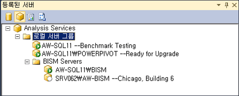

# 서버 그룹에 Analysis Services 등록
  Analysis Services 서버 인스턴스의 수가 많은 경우 Management Studio에서 서버 그룹을 만들어 서버 관리 작업을 손쉽게 수행할 수 있습니다. 서버 그룹의 용도는 관리 작업 영역 내에서 서로 관련이 있는 서버를 하나의 그룹으로 묶는 데 있습니다. 예를 들어 Analysis Services 인스턴스 10개를 관리하는 업무를 맡았다고 가정해 보겠습니다. 서버 모드, 가동 시간 기준 또는 부서나 영역별로 인스턴스를 그룹화하면 특성이 동일한 인스턴스를 더 쉽게 확인하고 인스턴스에 연결할 수 있습니다. 또한 서버 사용 방식을 쉽게 기억할 수 있도록 설명 정보를 추가할 수 있습니다.  
  
   
  
 계층 구조로 서버 그룹을 만들 수 있습니다. 로컬 서버 그룹이 루트 노드입니다. 이 노드에는 항상 로컬 컴퓨터에서 실행되는 Analysis Services 인스턴스가 포함됩니다. 원격 서버는 로컬 그룹을 포함하여 모든 그룹에 추가할 수 있습니다.  
  
 서버 그룹을 만든 후에는 등록된 서버 창에서 멤버 서버를 확인하고 멤버 서버에 연결해야 합니다. 이 창에는 SQL Server 인스턴스가 서버 유형(데이터베이스 엔진, Analysis Services, Reporting Services, Integration Services)별로 필터링됩니다. 서버 유형을 클릭하여 해당 서버 유형으로 만들어진 서버 그룹을 확인할 수 있습니다. 그룹 내의 특정 서버에 연결하려면 그룹에서 서버를 두 번 클릭합니다.  
  
 서버 이름을 포함하여 서버에 대해 정의된 연결 정보는 서버 등록과 함께 유지됩니다. 따라서 연결 정보를 수정할 수 없으며, 다른 도구를 사용하여 서버에 연결할 때 등록된 이름을 사용할 수 없습니다.  
  
## 서버 그룹을 만들고 등록된 서버 추가  
  
1.  Management Studio에서 보기 메뉴의 등록된 서버를 클릭하여 등록된 서버 창을 작업 영역에서 엽니다. 기본적으로 로컬 서버 그룹은 이미 만들어져 있습니다. 로컬 서버에서 실행 중인 모든 Analysis Services는 이 그룹의 멤버입니다.  
  
2.  로컬 서버 그룹을 마우스 오른쪽 단추로 클릭하고 새 서버 그룹을 선택한 다음 그룹 이름을 지정합니다.  
  
3.  서버 그룹을 마우스 오른쪽 단추로 클릭한 다음 새 서버 등록을 선택합니다. 서버가 명명된 인스턴스로 설치된 경우 인스턴스 이름을 포함하여 로컬 또는 원격 서버의 네트워크 이름을 입력합니다. 필요에 따라 등록된 서버에 표시되는 등록된 서버 이름을 제공할 수 있습니다. 이 이름은 등록된 서버에서만 사용됩니다. 이 이름은 서버 이름을 바꾸는 데 사용하거나 연결 문자열에서는 사용할 수 없습니다. 등록된 서버 이름은 실제 서버 이름보다 서버에 대해 잘 설명하거나 서버를 다른 서버와 손쉽게 구분할 수 있는 특성을 포함하고 있습니다.  
  
  

