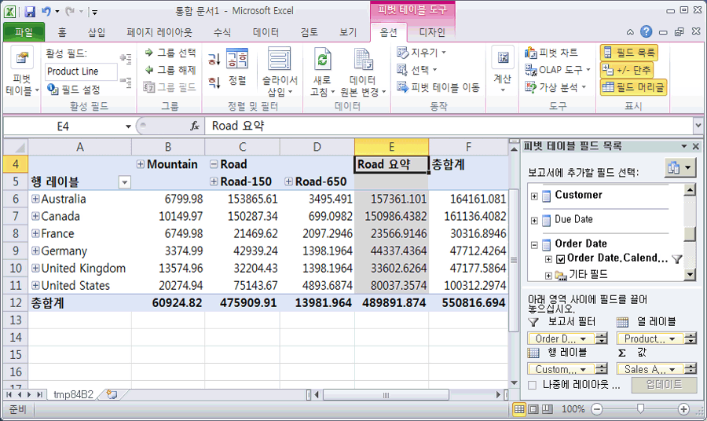

# 단원 3-5-배포 된 큐브 찾아보기
다음 태스크에서는 [!INCLUDE[ssASnoversion](../includes/ssasnoversion-md.md)] Tutorial 큐브를 찾아봅니다. 분석할 때 여러 차원 간에 측정값을 비교하므로 Excel 피벗 테이블을 사용하여 데이터를 찾습니다. 피벗 테이블을 사용하면 Internet Sales가 특정 기간, 고객 인구 통계 및 제품 라인에 표시될 때 어떻게 변경되는지 볼 수 있도록 고객, 날짜 및 제품 정보를 각각 다른 축에 배치할 수 있습니다.  
  
### 배포된 큐브를 찾아보려면  
  
1.  [!INCLUDE[ssBIDevStudio](../includes/ssbidevstudio-md.md)]의 큐브 디자이너로 전환하려면 솔루션 탐색기의 **[!INCLUDE[ssASnoversion](../includes/ssasnoversion-md.md)] 큐브** 폴더에서 **Tutorial** 큐브를 두 번 클릭합니다.  
  
2.  **브라우저** 탭을 연 다음 디자이너 도구 모음에서 **다시 연결** 단추를 클릭합니다.  
  
3.  Excel 아이콘을 클릭하여 작업 영역 데이터베이스를 데이터 원본으로 사용하여 Excel을 시작합니다. 데이터 연결을 사용하도록 설정할지를 묻는 메시지가 표시되면 **사용**을 클릭합니다.  
  
4.  피벗 테이블 필드 목록에서 **Internet Sales**를 확장한 다음 **Sales Amount** 측정값을 **값** 영역으로 끌어옵니다.  
  
5.  피벗 테이블 필드 목록에서 **Product**를 확장합니다.  
  
6.  **Product Model Lines** 사용자 계층을 **열** 영역으로 끌어옵니다.  
  
7.  피벗 테이블 필드 목록에서 **Customer**를 확장하고 **Location**을 확장한 다음 Customer 차원의 위치 표시 폴더에서 **Customer Geography** 계층을 **행** 영역으로 끌어옵니다.  
  
8.  피벗 테이블 필드 목록에서 **Order Date**를 확장한 다음 **Order Date.Calendar Date** 계층을 **Report Filter** 영역으로 끌어옵니다.  
  
9. 데이터 창의 **Order Date.Calendar Date** 필터에서 오른쪽 화살표를 클릭하고 **(모두)** 수준 확인란의 선택을 취소한 다음 **2006**, **H1 CY 2006**, **Q1 CY 2006**을 차례로 확장합니다. 그런 다음 **February 2006**확인란을 선택하고 **확인**을 클릭합니다.  
  
    다음 그림에 표시된 것처럼 2006년 2월의 지역별 인터넷 판매와 제품 라인이 나타납니다.  
  
      
  
## 다음 단원  
[4단원: 고급 특성 및 차원 속성 정의](../analysis-services/lesson-4-defining-advanced-attribute-and-dimension-properties.md)  
  
  
  
