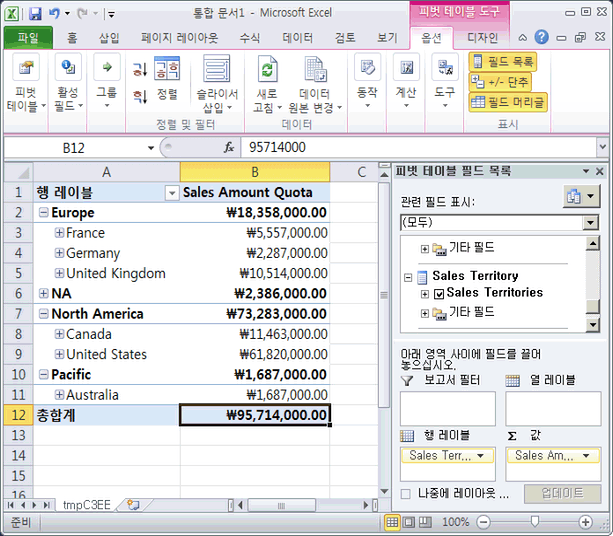
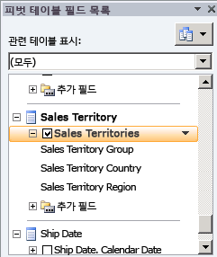
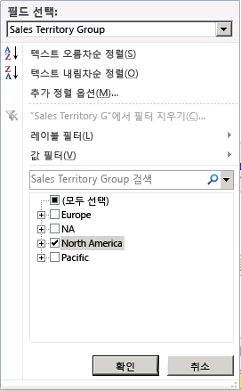
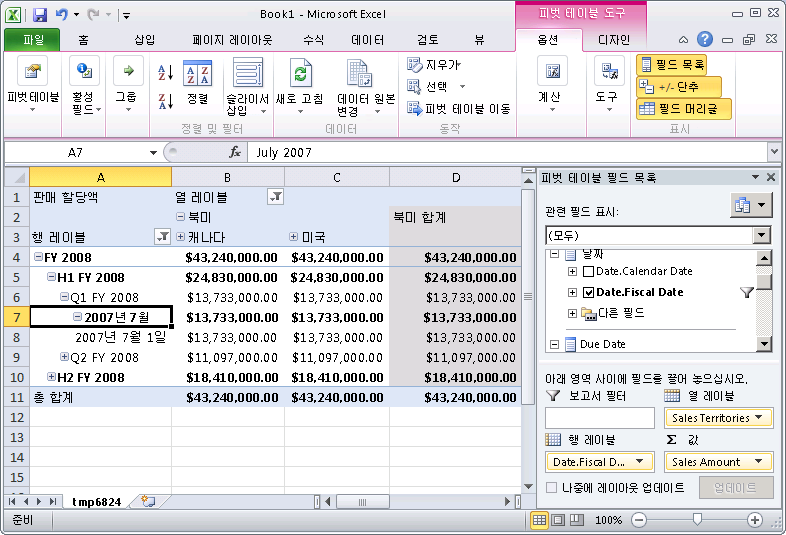
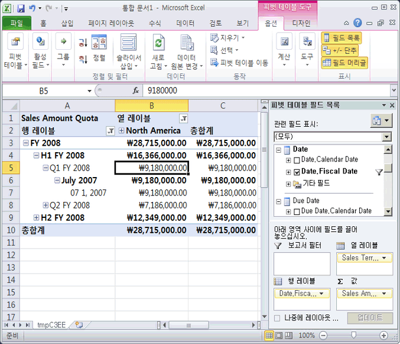

# Lesson 5-4-측정값 그룹 내에서 차원 세분성 정의
[!INCLUDE[ssas-appliesto-sqlas](../includes/ssas-appliesto-sqlas.md)]

사용자는 다양한 목적에 맞게 팩트 데이터의 차원을 세밀하게 또는 구체적으로 구분할 수 있습니다. 예를 들어 대리점이나 인터넷 판매의 판매 데이터는 매일 기록하고 판매 할당량 정보는 월별 또는 분기별로 기록할 수 있습니다. 이러한 시나리오에서 사용자는 서로 다른 팩트 테이블 각각에 대해 수준이 다양한 시간 차원을 사용할 수 있습니다. 새 데이터베이스 차원을 이러한 다른 수준을 가진 시간 차원으로 정의할 수 있지만 [!INCLUDE[ssASnoversion](../includes/ssasnoversion-md.md)]에서는 더 쉬운 방법이 있습니다.  
  
기본적으로 [!INCLUDE[ssASnoversion](../includes/ssasnoversion-md.md)]에서 측정값 그룹에 차원을 사용하면 해당 차원의 데이터 수준은 차원의 키 특성을 기반으로 합니다. 예를 들어 시간 차원이 측정값 그룹 내에 포함되어 있고 시간 차원의 기본 수준이 매일이면 측정값 그룹에서 해당 차원의 기본 수준은 매일이 됩니다. 이 자습서의 **Internet Sales** 및 **Reseller Sales** 측정값 그룹과 같은 많은 경우에 이 수준이 적절하게 사용됩니다. 그러나 차원이 Sales Quotas 또는 Budget 측정값 그룹과 같은 다른 종류의 측정값 그룹에 포함되어 있을 때는 일반적으로 월별 또는 분기별 수준이 보다 적절합니다.  
  
큐브 차원에 기본 수준 이외의 수준을 지정하려면 큐브 디자이너의 **차원 용도** 탭에서 특정 측정값 그룹에 사용된 대로 큐브 차원 세분성 특성을 수정합니다. 특정 측정값 그룹 내 차원의 수준을 해당 차원의 키 특성이 아닌 특성으로 변경하면 측정값 그룹의 모든 다른 특성이 직접 또는 간접적으로 새 세분성 특성에 관련되도록 해야 합니다. 다른 모든 특성과 측정값 그룹의 세분성 특성으로 지정된 특성 간 특성 관계를 지정하여 이 작업을 수행합니다. 이 경우에는 특성 관계를 이동하는 대신에 추가 특성 관계를 정의합니다. 세분성 특성으로 지정된 특성이 차원의 나머지 특성을 위해 측정값 그룹에서 사실상 키 특성이 됩니다. 특성 관계를 적절하게 지정하지 않으면 이 항목의 태스크에서 설명된 대로 [!INCLUDE[ssASnoversion](../includes/ssasnoversion-md.md)] 에서는 값을 제대로 집계할 수 없습니다.  
  
자세한 내용은 [차원 관계](../analysis-services/multidimensional-models-olap-logical-cube-objects/dimension-relationships.md), [일반 관계 및 일반 관계 속성 정의](../analysis-services/multidimensional-models/define-a-regular-relationship-and-regular-relationship-properties.md)를 참조하세요.  
  
이 항목의 태스크에서는 Sales Quotas 측정값 그룹을 추가하고 이 측정값 그룹의 Date 차원 세분성이 월별이 되도록 정의한 다음 월 특성과 다른 차원 특성 간 특성 관계를 정의하여 [!INCLUDE[ssASnoversion](../includes/ssasnoversion-md.md)] 에서 값을 제대로 집계하도록 하는 방법에 대해 설명합니다.  
  
## 테이블 추가 및 Sales Quotas 측정값 그룹 정의  
  
1.  **Adventure Works DW 2012** 데이터 원본 뷰로 전환합니다.  
  
2.  **다이어그램 구성 도우미** 창을 마우스 오른쪽 단추로 클릭하고 **새 다이어그램**을 클릭한 다음 **Sales Quotas**다이어그램의 이름을 지정합니다.  
  
3.  **Employee**, **Sales Territory**및 **Date** 테이블을 **테이블** 창에서 **다이어그램** 창으로 끌어옵니다.  
  
4.  **다이어그램** 창을 마우스 오른쪽 단추로 클릭하고 **테이블 추가/제거** 를 선택하여 **FactSalesQuota** 테이블을 **다이어그램**창에 추가합니다.  
  
    **SalesTerritory** 테이블은 **Employee** 테이블을 통해 **FactSalesQuota** 테이블에 연결되어 있습니다.  
  
5.  **FactSalesQuota** 테이블의 열을 검토한 다음 이 테이블의 데이터를 탐색합니다.  
  
    이 테이블의 데이터 수준은 FactSalesQuota 테이블의 최하위 수준인 분기입니다.  
  
6.  데이터 원본 뷰 디자이너에서 **FactSalesQuota** 테이블의 **FriendlyName** 속성을 **SalesQuotas**로 변경합니다.  
  
7.  [!INCLUDE[ssASnoversion](../includes/ssasnoversion-md.md)] Tutorial 큐브로 전환한 다음 **큐브 구조** 탭을 클릭합니다.  
  
8.  **측정값** 창을 마우스 오른쪽 단추로 클릭하고 **새 측정값 그룹**을 클릭한 다음 **새 측정값 그룹** 대화 상자에서 **SalesQuotas** , **확인**을 차례로 클릭합니다.  
  
    **Sales Quotas** 측정값 그룹이 **측정값** 창에 나타납니다. **차원** 창에는 **Date** 데이터베이스 차원을 기반으로 새 **Date** 큐브 차원도 정의되어 있습니다. [!INCLUDE[ssASnoversion](../includes/ssasnoversion-md.md)] 에서는 Sales Quotas 측정값 그룹의 기반이 되는 **FactSalesQuota** 팩트 테이블의 **DateKey** 열과 관련된 기존 시간 관련 큐브 차원을 인식하지 못하므로 새 시간 관련 큐브 차원이 정의됩니다. 이 항목의 다른 태스크에서 이 큐브 차원을 변경합니다.  
  
9. **Sales Quotas** 측정값 그룹을 확장합니다.  
  
10. **측정값** 창에서 **Sales Amount Quota**를 선택한 다음 속성 창에서 **FormatString** 속성 값을 **Currency** 로 설정합니다.  
  
11. **Sales Quotas Count** 측정값을 선택한 다음 속성 창에서 **FormatString** 속성 값으로 **#,#** 을 입력합니다.  
  
12. **Sales Quotas** 측정값 그룹에서 **Calendar Quarter** 측정값을 삭제합니다.  
  
    [!INCLUDE[ssASnoversion](../includes/ssasnoversion-md.md)] 에서는 Calendar Quarter 측정값의 기반이 되는 열을 측정값이 포함된 열로 감지합니다. 그러나 이 열과 CalendarYear 열은 이 항목의 뒷부분에서 Sales Quotas 측정값 그룹을 Date 차원에 연결하는 데 사용할 값을 포함합니다.  
  
13. **측정값** 창에서 **Sales Quotas** 측정값 그룹을 마우스 오른쪽 단추로 클릭한 다음 **새 측정값**을 클릭합니다.  
  
    **합계** 사용 유형을 사용하는 측정값에 사용 가능한 원본 열이 포함되어 있는 **새 측정값**대화 상자가 열립니다.  
  
14. **새 측정값** 대화 상자의 **사용법** 목록에서 **고유 카운트** 를 선택하고 **원본 테이블** 목록에 **SalesQuotas** 가 선택되어 있는지 확인하고 **원본 열** 목록에서 **EmployeeKey** 를 선택한 다음 **확인**을 클릭합니다.  
  
    **Sales Quotas 1**이라는 새 측정값 그룹에 측정값이 생성됩니다. [!INCLUDE[ssNoVersion](../includes/ssnoversion-md.md)] 의 고유 카운트 측정값이 자체 측정값 그룹에 생성되므로 처리 성능을 극대화합니다.  
  
15. **Employee Key Distinct Count** 측정값의 **Name** 속성 값을 **Sales Person Count**로 변경한 다음 **FormatString** 속성 값으로 **#,#** 을 입력합니다.  
  
## Sales Quota 측정값 그룹에서 날짜별로 측정값 찾아보기  
  
1.  **빌드** 메뉴에서 **Analysis Services Tutorial 배포**를 클릭합니다.  
  
2.  배포가 성공적으로 완료되면 **Tutorial 큐브에 대한 큐브 디자이너에서** 브라우저 [!INCLUDE[ssASnoversion](../includes/ssasnoversion-md.md)] 탭을 클릭한 다음 **다시 연결**단추를 클릭합니다.  
  
3.  Excel 바로 가기를 클릭한 다음 **사용**을 클릭합니다.  
  
4.  피벗 테이블 필드 목록에서 **Sales Quotas** 측정값 그룹을 확장한 다음 **Sales Amount Quota** 측정값을 값 영역으로 끌어옵니다.  
  
5.  **Sales Territory** 차원을 확장한 다음 **Sales Territories** 사용자 정의 계층을 행 레이블로 끌어옵니다.  
  
    다음 이미지에서와 같이 Sales Territory 큐브 차원은 Fact Sales Quota 테이블에 직접 또는 간접적으로 관련되어 있지 않습니다.  
  
      
  
    이 항목의 다음과 같은 일련의 단계에서는 이 차원과 이 팩트 테이블 간 참조 차원 관계를 정의합니다.  
  
6.  **Sales Territories** 사용자 계층을 행 레이블 영역에서 열 레이블 영역으로 이동합니다.  
  
7.  피벗 테이블 필드 목록에서 **Sales Territories** 사용자 정의 계층을 선택한 다음 오른쪽의 아래쪽 화살표를 클릭합니다.  
  
      
  
8.  필터에서 모두 선택 확인란을 클릭하여 모든 선택 항목의 선택을 취소한 다음 **North America**만 선택합니다.  
  
      
  
9. 피벗 테이블 필드 목록에서 **Date**를 확장합니다.  
  
10. **Date.Fiscal Date** 사용자 계층을 행 레이블로 끌어옵니다.  
  
11. 피벗 테이블에서 행 레이블 옆에 있는 아래쪽 화살표를 클릭합니다. **FY 2008**을 제외한 모든 연도를 선택 취소합니다.  
  
    **월** 수준의 **2007년 7월** , **2007년 8월**및 **2007년 9월**멤버 대신 **월** 수준의 **2007년 7월** 멤버만 나타나고 31일이 모두 나타나는 대신 **날짜** 수준의 **2007년 7월 1일** 멤버만 나타납니다. 이 동작은 팩트 테이블의 데이터 수준이 분기이고 **Date** 차원의 수준이 매일이기 때문에 발생합니다. 이 항목의 다음 태스크에서는 이 동작을 변경하는 방법에 대해 설명합니다.  
  
    월 및 일 수준의 **Sales Amount Quota** 값도 분기 수준의 값과 같은 $13,733,000.00가 됩니다. Sales Quotas 측정값 그룹의 데이터 최하위 수준이 분기 수준이기 때문입니다. 6단원에서는 이 동작을 변경하는 방법을 설명합니다.  
  
    다음 그림에서는 **Sales Amount Quota**의 값을 보여 줍니다.  
  
      
  
## Sales Quotas 측정값 그룹의 차원 용도 속성 정의  
  
1.  **Employee** 차원에 대한 차원 디자이너를 열고 **데이터 원본 뷰** 창에서 **SalesTerritoryKey** 를 마우스 오른쪽 단추로 클릭한 다음 **열의 새 특성**을 클릭합니다.  
  
2.  **특성** 창에서 **SalesTerritoryKey**를 선택한 후 속성 창에서 **AttributeHierarchyVisible** 속성을 **False** 로, **AttributeHierarchyOptimizedState** 속성을 **NotOptimized**로, **AttributeHierarchyOrdered** 속성을 **False**로 설정합니다.  
  
    **Sales Territory** 차원을 **Sales Quotas** 및 **Sales Quotas 1** 측정값 그룹에 참조 차원으로 연결하려면 이 특성이 필요합니다.  
  
3.  [!INCLUDE[ssASnoversion](../includes/ssasnoversion-md.md)] Tutorial 큐브에 대한 큐브 디자이너에서 **차원 용도** 탭을 클릭한 다음 **Sales Quotas** 및 **Sales Quotas 1** 측정값 그룹에서 차원 용도를 검토합니다.  
  
    **Employee** 및 **Date** 큐브 차원은 일반 관계를 통해 **Sales Quotas 및 Sales Quotas 1** 측정값 그룹에 연결되어 있습니다. **Sales Territory** 큐브 차원은 이러한 측정값 그룹에 연결되어 있지 않습니다.  
  
4.  **Sales Territory** 차원과 **Sales Quotas** 측정값 그룹의 교집합에서 셀을 클릭한 다음 찾아보기 단추(**…**)를 클릭합니다. **관계 정의** 대화 상자가 열립니다.  
  
5.  **관계 유형 선택** 목록에서 **참조**를 선택합니다.  
  
6.  **중간 차원** 목록에서 **Employee**를 선택합니다.  
  
7.  **참조 차원 특성** 목록에서 **Sales Territory Region**을 선택합니다.  
  
8.  **중간 차원 특성** 목록에서 **Sales Territory Key**를 선택합니다. Sales Territory Region 특성의 키 열은 SalesTerritoryKey 열입니다.  
  
9. **구체화** 확인란이 선택되어 있는지 확인합니다.  
  
10. **확인**을 클릭합니다.  
  
11. **Sales Territory** 차원과 **Sales Quotas 1** 측정값 그룹의 교집합에서 셀을 클릭한 다음 찾아보기 단추(**…**)를 클릭합니다. **관계 정의** 대화 상자가 열립니다.  
  
12. **관계 유형 선택** 목록에서 **참조**를 선택합니다.  
  
13. **중간 차원** 목록에서 **Employee**를 선택합니다.  
  
14. **참조 차원 특성** 목록에서 **Sales Territory Region**을 선택합니다.  
  
15. **중간 차원 특성** 목록에서 **Sales Territory Key**를 선택합니다. Sales Territory Region 특성의 키 열은 SalesTerritoryKey 열입니다.  
  
16. **구체화** 확인란이 선택되어 있는지 확인합니다.  
  
17. **확인**을 클릭합니다.  
  
18. **Date** 큐브 차원을 삭제합니다.  
  
    판매 할당량 차원을 구분할 날짜로 4개의 시간 관련 큐브 차원이 아니라 **Sales Quotas** 측정값 그룹의 **Order Date** 큐브 차원을 사용합니다. 또한 이 큐브 차원을 큐브의 주 날짜 차원으로 사용합니다.  
  
19. **차원** 목록에서 **Order Date** 큐브 차원의 이름을 **Date**로 바꿉니다.  
  
    **Order Date** 큐브 차원 이름을 **Date** 로 변경하면 사용자가 이 차원의 역할을 이 큐브의 주 날짜 차원으로 쉽게 이해할 수 있습니다.  
  
20. **Sales Quotas**측정값 그룹과 **Date** 차원의 교집합에서 셀의 찾아보기 단추( **…** )를 클릭합니다.  
  
21. **관계 정의** 대화 상자의 **관계 유형 선택** 목록에서 **일반** 을 선택합니다.  
  
22. **세분성 특성** 목록에서 **Calendar Quarter**를 선택합니다.  
  
    세분성 특성으로 키가 아닌 특성을 선택했으므로 모든 다른 특성을 멤버 속성으로 지정하여 해당 특성이 직접 또는 간접적으로 세분성 특성에 관련되도록 해야 함을 알리는 경고가 나타납니다.  
  
23. **관계 정의** 대화 상자의 **관계** 영역에서 Date 큐브 차원의 기반이 되는 테이블의 **CalendarYear** 및 **CalendarQuarter** 차원 열을 Sales Quota 측정값 그룹의 기반이 되는 테이블의 **CalendarYear** 및 **CalendarQuarter** 열에 연결한 다음 **확인**을 클릭합니다.  
  
    > [!NOTE]  
    > Sales Quotas 측정값 그룹의 Date 큐브 차원에 대한 세분성 특성은 Calendar Quarter로 정의되지만 Internet Sales 및 Reseller Sales 측정값 그룹의 세분성 특성에는 Date 특성이 계속 사용됩니다.  
  
24. **Sales Quotas 1** 측정값 그룹에 대해 이전 네 단계를 반복합니다.  
  
## Date 차원의 Calendar Quarter 특성과 다른 차원 특성 간의 특성 관계 정의  
  
1.  **Date** 차원에 대한 **차원 디자이너** 로 전환한 다음 **특성 관계** 탭을 클릭합니다.  
  
    **Calendar Year** 는 **Calendar Semester** 특성을 통해 **Calendar Quarter** 에 연결되지만 회계 달력 특성은 서로 간에만 연결됩니다. 회계 달력 특성은 **Calendar Quarter** 특성에 연결되지 않으므로 **Sales Quotas** 측정값 그룹에서 제대로 집계되지 않습니다.  
  
2.  다이어그램에서 **Calendar Quarter** 특성을 마우스 오른쪽 단추로 클릭한 다음 **새 특성 관계**를 선택합니다.  
  
3.  **특성 관계 만들기** 대화 상자에서 **원본 특성** 은 **Calendar Quarter**입니다. **관련 특성** 을 **Fiscal Quarter**로 설정합니다.  
  
4.  **확인**을 클릭합니다.  
  
    **Date** 차원에 하나 이상의 중복 특성 관계가 포함되어 있으므로 키가 아닌 특성이 세분성 특성으로 사용될 경우 데이터가 집계되지 못할 수도 있다는 경고 메시지가 나타납니다.  
  
5.  **Month Name** 특성과 **Fiscal Quarter** 특성 간의 특성 관계를 삭제합니다.  
  
6.  **파일** 메뉴에서 **모두 저장**을 클릭합니다.  
  
## Sales Quota 측정값 그룹에서 날짜별로 측정값 찾아보기  
  
1.  **빌드** 메뉴에서 **Analysis Services Tutorial 배포**를 클릭합니다.  
  
2.  배포가 성공적으로 완료되면 **Tutorial 큐브에 대한 큐브 디자이너에서** 브라우저 [!INCLUDE[ssASnoversion](../includes/ssasnoversion-md.md)] 탭을 클릭한 다음 **다시 연결**을 클릭합니다.  
  
3.  Excel 바로 가기를 클릭한 다음 **사용**을 클릭합니다.  
  
4.  **Sales Amount Quota** 측정값을 값 영역으로 끌어옵니다.  
  
5.  **Sales Territories** 사용자 계층을 열 레이블로 끌어온 다음 **North America**를 필터링합니다.  
  
6.  **Date.FiscalDate** 사용자 계층을 행 레이블로 끌어간 다음 피벗 테이블에서 **행 레이블** 옆의 아래쪽 화살표를 클릭하고 **FY 2008**을 제외한 모든 확인란의 선택을 취소하여 2008 회계 연도만 표시합니다.  
  
7.  확인을 클릭합니다.  
  
8.  **FY 2008**, **H1 FY 2008**, **Q1 FY 2008**을 차례로 확장합니다.  
  
    다음 그림에서는 Sales Quota 측정값 그룹의 차원이 올바르게 구분되어 있는 [!INCLUDE[ssASnoversion](../includes/ssasnoversion-md.md)] Tutorial 큐브에 대한 피벗 테이블을 보여 줍니다.  
  
    회계 분기 수준의 각 멤버 값이 분기 수준 값과 동일합니다. **Q1 FY 2008** 을 예로 사용하면 **Q1 FY 2008** 의 할당량인 $9,180,000.00가 각 해당 멤버의 값이기도 합니다. 이 동작은 팩트 테이블의 데이터 수준이 분기이고 Date 차원의 수준도 분기이기 때문에 발생합니다. 6단원에서는 분기별 판매량을 각 월에 비례하게 할당하는 방법을 설명합니다.  
  
      
  
## 다음 단원  
[6 단원: 계산 정의](../analysis-services/lesson-6-defining-calculations.md)  
  
## 관련 항목:  
[차원 관계](../analysis-services/multidimensional-models-olap-logical-cube-objects/dimension-relationships.md)  
[일반 관계 및 일반 관계 속성 정의](../analysis-services/multidimensional-models/define-a-regular-relationship-and-regular-relationship-properties.md)  
[데이터 원본 뷰 디자이너에서의 다이어그램 작업&#40;Analysis Services&#41;](../analysis-services/multidimensional-models/work-with-diagrams-in-data-source-view-designer-analysis-services.md)  
  
  
  
