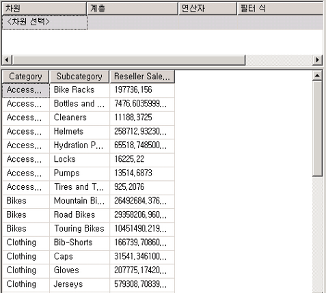
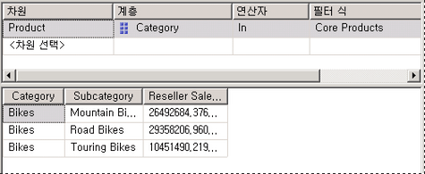
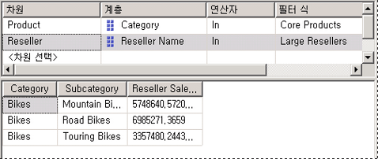

# <a name="lesson-6-2---defining-named-sets"></a>단원 2-6-명명 된 집합 정의
명명된 집합은 차원 멤버 집합을 반환하는 MDX(Multidimensional Expressions) 식입니다. 명명된 집합을 정의한 후 큐브 정의의 일부로 저장할 수 있습니다. 또한 클라이언트 응용 프로그램에서도 명명된 집합을 만들 수 있습니다. 큐브 데이터, 산술 연산자, 숫자 및 함수를 조합하여 명명된 집합을 만들 수 있습니다. 명명된 집합을 클라이언트 응용 프로그램의 MDX 쿼리에서 사용할 수 있으며 하위 큐브의 집합을 정의하는 데도 사용할 수 있습니다. 하위 큐브는 큐브 공간을 후속 문에 대해 정의된 하위 공간으로 제한하는 크로스 조인된 집합 컬렉션입니다. 제한된 큐브 공간을 정의하는 것은 MDX 스크립팅에 대한 기본 개념에 해당합니다.  
  
명명된 집합은 MDX 쿼리를 단순화하며 일반적으로 사용되는 복합 집합 식에 대한 유용한 별칭을 제공합니다. 예를 들어 가장 많은 직원이 포함된 멤버 집합이 들어 있는 대형 대리점이라는 명명된 집합을 대리점 차원에 정의할 수 있습니다. 그러면 최종 사용자가 쿼리에서 대형 대리점의 명명된 집합을 사용하거나, 이 명명된 집합을 사용하여 하위 큐브의 집합을 정의할 수 있습니다. 명명된 집합 정의는 큐브 에저장되지만, 값은 메모리에만 존재합니다. 명명된 집합을 만들려면 큐브 디자이너의 **계산** 탭에 있는 **새 명명된 집합** 명령을 사용합니다. 자세한 내용은 [계산](../analysis-services/multidimensional-models-olap-logical-cube-objects/calculations.md), [명명된 집합 만들기](../analysis-services/multidimensional-models/create-named-sets.md)를 참조하세요.  
  
이 항목의 태스크에서는 핵심 제품 명명된 집합과 대형 대리점 명명된 집합 등 두 개의 명명된 집합을 정의합니다.  
  
## <a name="defining-a-core-products-named-set"></a>Core Products 명명된 집합 정의  
  
1.  **Tutorial 큐브에 대한 큐브 디자이너의** 계산 [!INCLUDE[ssASnoversion](../includes/ssasnoversion-md.md)] 탭으로 전환한 후 도구 모음에서 **폼 보기** 를 클릭합니다.  
  
2.  **스크립트 구성 도우미** 창에서 **[Total Sales Ratio to All Products]** 를 클릭한 후 **계산** 탭의 도구 모음에서 **새 명명된 집합** 을 클릭합니다.  
  
    **계산** 탭에서 새 계산을 정의할 때 계산은 **스크립트 구성 도우미** 창에 나타나는 순서대로 수행된다는 사실에 유의하세요. 새 계산을 만들 때 해당 창 내의 포커스에 따라 계산 실행 순서가 결정됩니다. 즉, 새로운 계산은 포커스된 계산 바로 다음에 정의됩니다.  
  
3.  **이름** 상자에서 새 명명된 집합의 이름을 **[Core Products]**로 변경합니다.  
  
    **스크립트 구성 도우미** 창에는 스크립트 명령이나 계산 멤버에서 명명된 집합을 구분할 수 있는 고유 아이콘이 표시됩니다.  
  
4.  **계산 도구** 창의 **메타데이터** 탭에서 **Product**, **Category**, **Members**, **All Products**를 차례로 확장합니다.  
  
    > [!NOTE]  
    > **계산 도구** 창에 메타데이터가 표시되지 않으면 도구 모음에서 **다시 연결** 을 클릭합니다. 이 옵션을 사용할 수 없으면 큐브를 처리하거나 [!INCLUDE[ssASnoversion](../includes/ssasnoversion-md.md)]인스턴스를 시작해야 할 수 있습니다.  
  
5.  **Bikes** 를 **식** 상자로 끌어옵니다.  
  
    이제 Product 차원의 Bike 범주에 있는 멤버 집합을 반환하는 집합 식이 생성되었습니다.  
  
## <a name="defining-a-large-resellers-named-set"></a>Large Resellers 명명된 집합 정의  
  
1.  **스크립트 구성 도우미** 창에서 **[Core Products]** 를 마우스 오른쪽 단추로 클릭한 후 **새 명명된 집합**을 클릭합니다.  
  
2.  **이름** 상자에서 이 명명된 집합의 이름을 **[Large Resellers]**로 변경합니다.  
  
3.  **식** 상자에 **Exists()**를 입력합니다.  
  
    Exists 함수를 사용하여 직원 수 특성 계층에서 직원 수가 가장 많은 멤버 집합과 공통되는 Reseller Name 특성 계층의 멤버 집합을 반환합니다.  
  
4.  **계산 도구** 창의 **메타데이터** 탭에서 **Reseller** 차원을 확장한 후 **Reseller Name** 특성 계층을 확장합니다.  
  
5.  **Reseller Name** 수준을 Exists 집합 식에 대한 괄호 안으로 끌어 옵니다.  
  
    Members 함수를 사용하여 이 집합의 모든 멤버를 반환합니다. 자세한 내용은 [Members&#40;Set&#41; &#40;MDX&#41;](../mdx/members-set-mdx.md)를 참조하세요.  
  
6.  부분 집합 식 다음에 마침표를 입력한 후 Members 함수를 추가합니다. 식은 다음과 같아야 합니다.  
  
    ```  
    Exists([Reseller].[Reseller Name].[Reseller Name].Members)  
    ```  
  
    이제 Exists 집합 식에 대한 첫 번째 집합을 정의했으므로 직원 수가 가장 많은 대리점 차원의 멤버 집합을 추가할 수 있습니다.  
  
7.  **계산 도구** 창의 **메타데이터** 탭에서 Reseller 차원의 **Number of Employees** 를 확장한 후 **Members**, **All Resellers**를 차례로 확장합니다.  
  
    이 특성 계층의 멤버는 그룹화되지 않습니다.  
  
8.  **Reseller** 차원에 대한 차원 디자이너를 열고 **특성** 창에서 **Number of Employees** 를 클릭합니다.  
  
9. 속성 창에서 **DiscretizationMethod** 속성을 **Automatic**으로 변경하고 **DiscretizationBucketCount** 속성을 **5**로 변경합니다. 자세한 내용은 [특성 멤버 그룹화&#40;불연속화&#41;](../analysis-services/multidimensional-models/attribute-properties-group-attribute-members.md)를 참조하세요.  
  
10. [!INCLUDE[ssBIDevStudioFull](../includes/ssbidevstudiofull-md.md)]의 **빌드** 메뉴에서 **Analysis Services Tutorial 배포**를 클릭합니다.  
  
11. 배포가 성공적으로 완료되면 [!INCLUDE[ssASnoversion](../includes/ssasnoversion-md.md)] Tutorial 큐브에 대한 큐브 디자이너로 전환한 후 **계산** 탭의 도구 모음에서 **다시 연결** 을 클릭합니다.  
  
12. **계산 도구** 창의 **메타데이터** 탭에서 **Reseller** 차원의 **Number of Employees** 를 확장한 후 **Members**, **All Resellers**를 차례로 확장합니다.  
  
    이제 이 특성 계층의 멤버는 0번부터 4번까지의 5개 그룹에 포함됩니다. 그룹 번호를 확인하려면 해당 그룹 위에 포인터를 잠시 올려놓고 정보 팁을 봅니다. `2 -17`범위의 정보 팁에는 `[Reseller].[Number of Employees].&[0]`가 포함되어야 합니다.  
  
    DiscretizationBucketCount 속성이 **5** 로, DiscretizationMethod 속성이 **Automatic**으로 설정되어 있으므로 이 특성 계층의 멤버는 그룹화됩니다.  
  
13. **식** 상자의 Exists 집합 식에서 Members 함수 뒤, 닫는 괄호 앞에 쉼표를 추가한 후 **메타데이터** 창에서 **83 - 100** 을 끌어다 쉼표 뒤에 놓습니다.  
  
    이제 Large Resellers 명명된 집합을 축 위에 놓았을 때 지정된 두 집합, 즉 모든 대리점의 집합 및 직원 수가 83명에서 100명 사이인 대리점의 집합과 공통되는 멤버 집합을 반환하는 Exists 집합 식이 완성되었습니다.  
  
    다음 그림에서는 **[Large Resellers]** 명명된 집합에 대한 **계산 식** 창을 보여 줍니다.  
  
    ![[Large Resellers]에 대 한 계산 식 창](../analysis-services/media/l6-named-set-02.gif "[Large Resellers]에 대 한 계산 식 창")  
  
14. **계산** 탭의 도구 모음에서 **스크립트 보기**를 클릭하고 계산 스크립트에 방금 추가한 두 개의 명명된 집합을 검토합니다.  
  
15. 계산 스크립트에서 첫 번째 CREATE SET 명령 바로 앞에 새 줄을 추가한 후 다음 텍스트를 별도의 줄로 스크립트에 추가합니다.  
  
    ```  
    /* named sets */  
    ```  
  
    두 개의 명명된 집합이 정의되었으며 이러한 명명된 집합은 **스크립트 구성 도우미** 창에 표시됩니다. 이제 이러한 명명된 집합을 배포한 후 [!INCLUDE[ssASnoversion](../includes/ssasnoversion-md.md)] Tutorial 큐브에서 해당 측정값을 검색할 수 있습니다.  
  
## <a name="browsing-the-cube-by-using-the-new-named-sets"></a>새 명명된 집합을 사용하여 큐브 찾아보기  
  
1.  **의** 빌드 [!INCLUDE[ssBIDevStudio](../includes/ssbidevstudio-md.md)]메뉴에서 **Analysis Services Tutorial 배포**를 클릭합니다.  
  
2.  배포가 성공적으로 완료되면 **브라우저** 탭을 클릭한 다음 **다시 연결**을 클릭합니다.  
  
3.  데이터 창에서 표를 지웁니다.  
  
4.  데이터 영역에 **Reseller Sales-Sales Amount** 측정값을 추가합니다.  
  
5.  다음 그림에 표시된 것처럼 Product 차원을 확장한 다음 Category 및 Subcategory를 행 영역에 추가합니다.  
  
      
  
6.  **메타데이터** 창의 **Product** 차원에서 **Core Products** 를 필터 영역으로 끌어옵니다.  
  
    **Category** 특성의 **Bike** 멤버와 **Bike** 하위 범주의 멤버만 큐브에 그대로 남아 있습니다. **Core Products** 명명된 집합이 하위 큐브를 정의하는 데 사용되기 때문입니다. 다음 그림에 표시된 것처럼 이 하위 큐브는 하위 큐브 내의 **Product** 차원에 포함된 **Category** 특성의 멤버를 **Core Product** 명명된 집합의 멤버로 제한합니다.  
  
      
  
7.  **메타데이터** 창에서 **Reseller**를 확장하고 필터 영역에 **Large Resellers** 를 추가합니다.  
  
    데이터 창의 Reseller Sales Amount 측정값은 자전거를 판매하는 대형 대리점의 판매액만 표시합니다. 또한 필터 창에는 다음 그림에 표시된 것처럼 이러한 특정 하위 큐브를 정의하는 데 사용되는 두 개의 명명된 집합을 표시합니다.  
  
      
  
## <a name="next-lesson"></a>다음 단원  
[7단원: KPI&#40;핵심 성과 지표&#41; 정의](../analysis-services/lesson-7-defining-key-performance-indicators-kpis.md)  
  
## <a name="see-also"></a>관련 항목:  
[새 명명된 집합](../analysis-services/multidimensional-models-olap-logical-cube-objects/calculations.md)  
[명명된 집합 만들기](../analysis-services/multidimensional-models/create-named-sets.md)  
  
  
  

