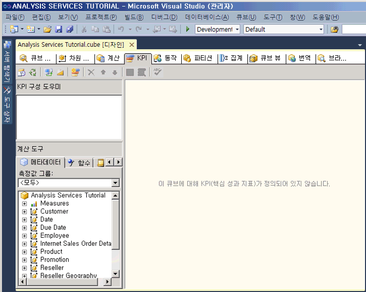
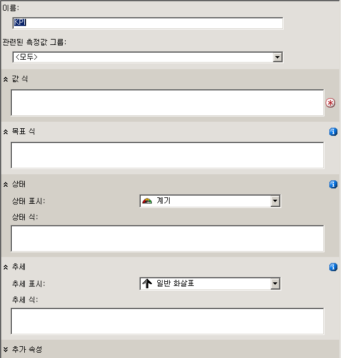

# <a name="lesson-7-1---defining-and-browsing-kpis"></a>단원 7-1-Kpi 정의 및 찾아보기
[!INCLUDE[ssas-appliesto-sqlas](../includes/ssas-appliesto-sqlas.md)]

KPI(핵심 성과 지표)를 정의하려면 먼저 KPI 이름 및 KPI와 연관된 측정값 그룹을 정의합니다. KPI는 모든 측정값 그룹 또는 단일 측정값 그룹과 연관될 수 있습니다. 그런 후 KPI의 다음 요소를 정의합니다.  
  
-   값 식  
  
    값 식은 매출액과 같은 물리적 측정값, 수익과 같은 계산 측정값 또는 MDX(Multidimensional Expressions) 식을 사용하여 KPI 내에 정의되는 계산입니다.  
  
-   목표 식  
  
    목표 식은 값 식이 정의하는 측정값의 목표를 정의하는 값 또는 값으로 해석되는 MDX 식입니다. 예를 들어 회사의 비즈니스 관리자가 늘리려는 매출액이나 수익 금액이 바로 목표 식이 될 수 있습니다.  
  
-   상태 식  
  
    상태 식은 목표 식과 비교하여 값 식의 현재 상태를 평가하기 위해 [!INCLUDE[ssASnoversion](../includes/ssasnoversion-md.md)] 에서 사용하는 MDX 식입니다. 목표 식은 -1과 +1 사이의 정규화된 값으로, 여기에서 -1은 매우 불량, +1은 매우 양호를 나타냅니다. 상태 식은 목표 식과 비교한 값 식의 상태를 쉽게 판단할 수 있도록 그래픽을 표시합니다.  
  
-   추세 식  
  
    추세 식은 목표 식과 비교하여 값 식의 현재 추세를 평가하기 위해 [!INCLUDE[ssASnoversion](../includes/ssasnoversion-md.md)] 에서 사용하는 MDX 식입니다. 추세 식을 사용하면 비즈니스 사용자는 값 식이 목표 식과 비교하여 더 나아지는지, 아니면 더 나빠지는지를 신속하게 판단할 수 있습니다. 여러 그래픽 중 하나를 추세 식과 연결하여 비즈니스 사용자가 추세를 빠르게 이해하도록 도울 수 있습니다.  
  
KPI에 대해 정의한 이러한 요소 외에 KPI의 속성을 추가로 정의할 수 있습니다. 이러한 속성으로는 표시 폴더, KPI가 다른 KPI로부터 계산될 경우 부모 KPI, 현재 시간 멤버(있는 경우), KPI의 가중치(있는 경우) 및 KPI에 대한 설명이 있습니다.  
  
> [!NOTE]  
> KPI의 추가 예는 **Adventure Works DW 2012** DW 샘플 데이터 웨어하우스에 있는 예나 계산 도구 창의 템플릿 탭에 있는 KPI 예를 참조하세요. 이 데이터베이스를 설치하는 방법에 대한 자세한 내용은 [Analysis Services 다차원 모델링 자습서에 사용할 샘플 데이터 및 프로젝트 설치](../analysis-services/install-sample-data-and-projects.md)를 참조하세요.  
  
이 단원의 태스크에서는 [!INCLUDE[ssASnoversion](../includes/ssasnoversion-md.md)] Tutorial 프로젝트에 KPI를 정의한 후 이 KPI를 사용하여 [!INCLUDE[ssASnoversion](../includes/ssasnoversion-md.md)] Tutorial 큐브를 탐색합니다. 다음과 같은 KPI를 정의합니다.  
  
-   Reseller Revenue  
  
    이 KPI는 실제 대리점 판매와 대리점 판매에 대한 판매 할당량을 비교한 결과, 판매액의 목표 근접 수준 및 목표 달성 추세를 측정하는 데 사용됩니다.  
  
-   Product Gross Profit Margin  
  
    이 KPI는 각 제품 범주의 매출이익률이 각 제품 범주의 지정된 목표에 얼마나 근접했는지 확인하고 이러한 목표 달성 추세를 파악하는 데 사용됩니다.  
  
## <a name="defining-the-reseller-revenue-kpi"></a>Reseller Revenue KPI 정의  
  
1.  [!INCLUDE[ssASnoversion](../includes/ssasnoversion-md.md)] Tutorial 큐브에 대한 큐브 디자이너를 열고 **KPI** 탭을 클릭합니다.  
  
    **KPI** 탭에는 여러 개의 창이 포함되어 있습니다. 이 탭 왼쪽에는 **KPI 구성 도우미** 창과 **계산 도구** 창이 있고 탭 중간의 표시 창에는 **KPI 구성 도우미** 창에서 선택한 KPI에 대한 세부 정보가 표시됩니다.  
  
    다음 그림에서는 큐브 디자이너의 **KPI** 탭을 보여 줍니다.  
  
      
  
2.  **KPI** 탭의 도구 모음에서 **새 KPI** 단추를 클릭합니다.  
  
    다음 그림에 표시된 것처럼 표시 창에 빈 KPI 템플릿이 나타납니다.  
  
      
  
3.  **이름** 상자에 **Reseller Revenue**를 입력하고 **관련된 측정값 그룹** 목록에서 **Reseller Sales** 를 선택합니다.  
  
4.  **계산 도구** 창의 **메타데이터** 탭에서 **Measures**, **Reseller Sales**를 차례로 확장한 후 **Reseller Sales-Sales Amount** 측정값을 **값 식** 상자로 끌어옵니다.  
  
5.  **계산 도구** 창의 **메타데이터** 탭에서 **Measures**, **Sales Quotas**를 차례로 확장한 후 **Sales Amount Quota** 측정값을 **목표 식** 상자로 끌어옵니다.  
  
6.  **상태 표시** 목록에서 **계기** 가 선택되어 있는지 확인한 후 **상태 식** 상자에 다음 MDX 식을 입력합니다.  
  
    ```  
    Case  
     When   
      KpiValue("Reseller Revenue")/KpiGoal("Reseller Revenue")>=.95  
       Then 1  
     When  
      KpiValue("Reseller Revenue")/KpiGoal("Reseller Revenue")<.95  
       And   
      KpiValue("Reseller Revenue")/KpiGoal("Reseller Revenue")>=.85  
       Then 0  
      Else-1  
    End  
    ```  
  
    이 MDX 식은 목표의 진행률 평가를 위한 기본 사항을 제공합니다. 이 MDX 식에서 실제 대리점 판매가 목표액의 85%보다 많으면 선택된 그래픽이 0으로 채워집니다. 계기는 선택된 그래픽이므로 계기의 포인터는 빈 상태와 꽉 찬 상태의 중간을 가리킵니다. 실제 대리점 판매가 90%보다 많으면 계기의 포인터는 빈 상태와 꽉 찬 상태의 3/4 위치를 가리킵니다.  
  
7.  **추세 표시** 목록에서 **일반 화살표** 가 선택되어 있는지 확인한 후 **추세 식** 상자에 다음 MDX 식을 입력합니다.  
  
    ```  
    Case  
     When IsEmpty  
      (ParallelPeriod  
       ([Date].[Calendar Date].[Calendar Year],1,  
           [Date].[Calendar Date].CurrentMember))  
      Then 0    
     When  (  
      KpiValue("Reseller Revenue") -   
       (KpiValue("Reseller Revenue"),   
        ParallelPeriod  
         ([Date].[Calendar Date].[Calendar Year],1,  
           [Date].[Calendar Date].CurrentMember))  
          /  
          (KpiValue ("Reseller Revenue"),  
           ParallelPeriod  
            ([Date].[Calendar Date].[Calendar Year],1,  
             [Date].[Calendar Date].CurrentMember)))  
           >=.02  
      Then 1  
       When(  
        KpiValue("Reseller Revenue") -   
         (KpiValue ( "Reseller Revenue" ),  
          ParallelPeriod  
           ([Date].[Calendar Date].[Calendar Year],1,  
            [Date].[Calendar Date].CurrentMember))  
           /  
            (KpiValue("Reseller Revenue"),  
             ParallelPeriod  
              ([Date].[Calendar Date].[Calendar Year],1,  
                [Date].[Calendar Date].CurrentMember)))  
            <=.02  
      Then -1  
       Else 0  
    End  
    ```  
  
    이 MDX 식은 정의한 목표 달성과 관련된 추세 평가를 위한 기본 사항을 제공합니다.  
  
## <a name="browsing-the-cube-by-using-the-reseller-revenue-kpi"></a>Reseller Revenue KPI를 사용하여 큐브 찾아보기  
  
1.  **의** 빌드 [!INCLUDE[ssBIDevStudioFull](../includes/ssbidevstudiofull-md.md)]메뉴에서 **Analysis Services Tutorial 배포**를 클릭합니다.  
  
2.  배포가 성공적으로 완료되면 **KPI** 탭의 도구 모음에서 **브라우저 보기** 단추를 클릭한 후 **다시 연결**을 클릭합니다.  
  
    **KPI 브라우저** 창에는 각 차원의 기본 멤버 값을 기반으로 하는 대리점 판매에 대한 상태 및 추세 계기와 해당 값 및 목표가 표시됩니다. 차원의 다른 어떤 멤버도 기본 멤버로 정의하지 않았으므로 각 차원의 기본 멤버는 All 수준의 All 멤버가 됩니다.  
  
3.  필터 창의 **차원** 목록에서 **Sales Territory** 를, **계층** 목록에서 **Sales Territories** 를, **연산자** 목록에서 **같음** 을, **필터 식** 목록에서 **North America** 확인란을 선택한 다음 **확인**을 클릭합니다.  
  
4.  **필터** 창의 다음 행에서는 **차원** 목록에서 **Date** 를, **계층** 목록에서 **Calendar Date** 를, **연산자** 목록에서 **같음** 을, **필터 식** 목록에서 **Q3 CY 2007** 확인란을 선택한 다음 **확인**을 클릭합니다.  
  
5.  **KPI 브라우저** 창을 클릭하여 **Reseller Revenue KPI**의 값을 업데이트합니다.  
  
    KPI의 **값**, **목표**및 **상태** 섹션은 새 기간에 대한 값을 반영합니다.  
  
## <a name="defining-the-product-gross-profit-margin-kpi"></a>Product Gross Profit Margin KPI 정의  
  
1.  **KPI** 탭의 도구 모음에서 **폼 보기** 단추를 클릭한 후 **새 KPI** 단추를 클릭합니다.  
  
2.  **이름** 상자에 **Product Gross Profit Margin**을 입력하고 **<All>** 관련된 측정값 그룹 **목록에** 가 나타나는지 확인합니다.  
  
3.  **계산 도구** 창의 **메타데이터** 탭에서 **Total GPM** 측정값을 **값 식** 상자로 끌어옵니다.  
  
4.  **목표 식** 상자에 다음 식을 입력합니다.  
  
    ```  
    Case  
        When [Product].[Category].CurrentMember Is  
          [Product].[Category].[Accessories]  
        Then .40                   
        When [Product].[Category].CurrentMember   
          Is [Product].[Category].[Bikes]  
        Then .12                  
        When [Product].[Category].CurrentMember Is  
          [Product].[Category].[Clothing]  
        Then .20  
        When [Product].[Category].CurrentMember Is  
          [Product].[Category].[Components]  
        Then .10  
        Else .12              
    End  
    ```  
  
5.  **상태 표시** 목록에서 **실린더**를 선택합니다.  
  
6.  **상태 식** 상자에 다음 MDX 식을 입력합니다.  
  
    ```  
    Case  
        When KpiValue( "Product Gross Profit Margin" ) /   
             KpiGoal ( "Product Gross Profit Margin" ) >= .90  
        Then 1  
        When KpiValue( "Product Gross Profit Margin" ) /   
             KpiGoal ( "Product Gross Profit Margin" ) <  .90  
             And   
             KpiValue( "Product Gross Profit Margin" ) /   
             KpiGoal ( "Product Gross Profit Margin" ) >= .80  
        Then 0  
        Else -1  
    End  
    ```  
  
    이 MDX 식은 목표의 진행률 평가를 위한 기본 사항을 제공합니다.  
  
7.  **추세 표시** 목록에서 **일반 화살표** 가 선택되어 있는지 확인한 후 **추세 식** 상자에 다음 MDX 식을 입력합니다.  
  
    ```  
    Case  
    When IsEmpty  
      (ParallelPeriod  
       ([Date].[Calendar Date].[Calendar Year],1,  
           [Date].[Calendar Date].CurrentMember))  
      Then 0    
       When VBA!Abs  
        (  
          KpiValue( "Product Gross Profit Margin" ) -   
           (  
             KpiValue ( "Product Gross Profit Margin" ),  
              ParallelPeriod  
              (   
                [Date].[ Calendar Date].[ Calendar Year],  
                1,  
                [Date].[ Calendar Date].CurrentMember  
              )  
            ) /  
            (  
              KpiValue ( "Product Gross Profit Margin" ),  
              ParallelPeriod  
              (   
                [Date].[ Calendar Date].[ Calendar Year],  
                1,  
                [Date].[ Calendar Date].CurrentMember  
              )  
            )    
          ) <=.02  
      Then 0  
      When KpiValue( "Product Gross Profit Margin" ) -   
           (  
             KpiValue ( "Product Gross Profit Margin" ),  
             ParallelPeriod  
             (   
               [Date].[ Calendar Date].[ Calendar Year],  
               1,  
               [Date].[ Calendar Date].CurrentMember  
             )  
           ) /  
           (  
             KpiValue ( "Product Gross Profit Margin" ),  
             ParallelPeriod  
             (   
               [Date].[Calendar Date].[Calendar Year],  
               1,  
               [Date].[Calendar Date].CurrentMember  
             )  
           )  >.02  
      Then 1  
      Else -1  
    End  
    ```  
  
    이 MDX 식은 정의한 목표 달성과 관련된 추세 평가를 위한 기본 사항을 제공합니다.  
  
## <a name="browsing-the-cube-by-using-the-total-gross-profit-margin-kpi"></a>Total Gross Profit Margin KPI를 사용하여 큐브 찾아보기  
  
1.  **빌드** 메뉴에서 **Analysis Services Tutorial 배포**를 클릭합니다.  
  
2.  배포가 성공적으로 완료되면 **KPI** 탭의 도구 모음에서 **브라우저 보기** 를 클릭한 후 **다시 연결**을 클릭합니다.  
  
    **Product Gross Profit Margin** KPI가 나타나며 **Q3 CY 2007** 및 **North America** 판매 지역에 대한 KPI 값이 표시됩니다.  
  
3.  **필터** 창의 **차원** 목록에서 **Product** 를, **계층** 목록에서 **Category** 를, **연산자** 목록에서 **같음** 을, **필터 식** 목록에서 **Bikes** 를 선택한 다음 **확인**을 클릭합니다.  
  
    North America의 대리점별로 Q3 CY 2007에 해당하는 Bikes 판매의 매출이익률이 표시됩니다.  
  
## <a name="next-lesson"></a>다음 단원  
[8 단원: 동작 정의](../analysis-services/lesson-8-defining-actions.md)  
  
