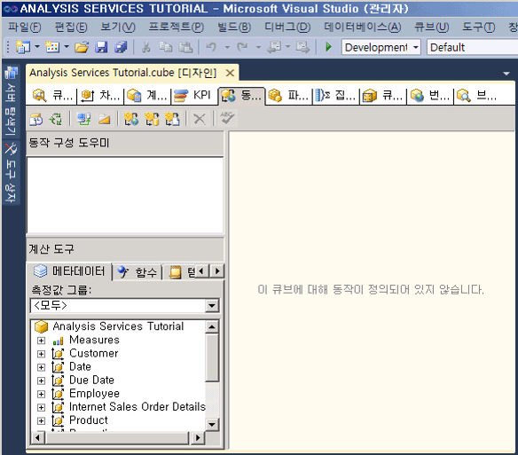
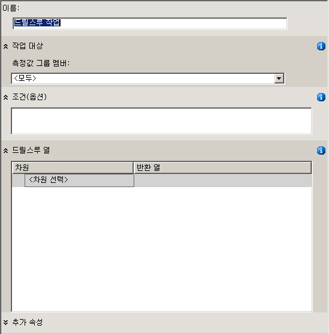
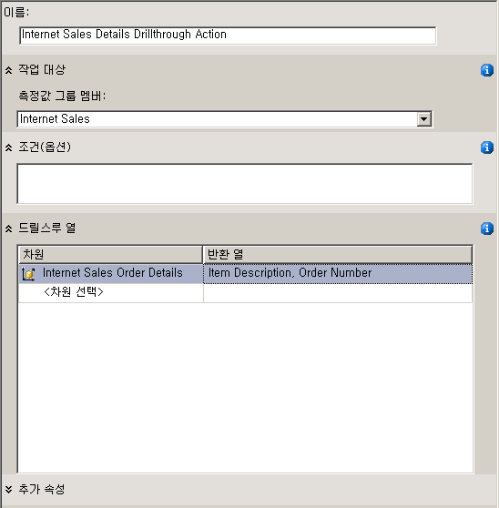
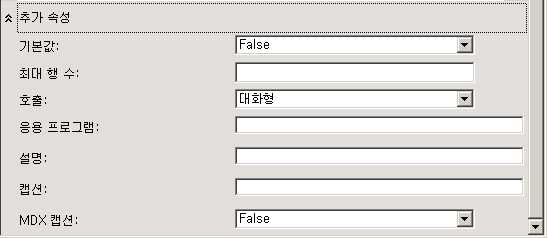
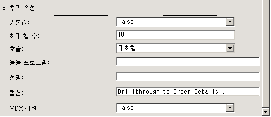
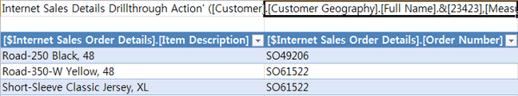
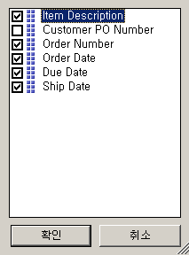
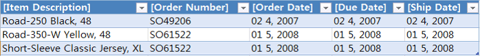

# 8-1-정의 하 고 드릴스루 동작을 사용 하 여 단원
[!INCLUDE[ssas-appliesto-sqlas](../includes/ssas-appliesto-sqlas.md)]

쿼리가 반환하는 데이터를 올바르게 필터링하지 않고 팩트 차원별로 팩트 데이터의 차원을 지정하면 쿼리 성능이 느려집니다. 이 문제를 방지하려면 반환되는 전체 행 수를 제한하는 드릴스루 동작을 정의하면 됩니다. 이렇게 하면 쿼리 성능이 대폭 향상됩니다.  
  
이 항목의 태스크에서는 인터넷을 통한 판매에 대한 세부 주문 정보를 반환하는 드릴스루 동작을 정의합니다.  
  
## 드릴스루 동작 속성 정의  
  
1.  [!INCLUDE[ssASnoversion](../includes/ssasnoversion-md.md)] Tutorial 큐브에 대한 큐브 디자이너에서 **동작** 탭을 클릭합니다.  
  
    **동작** 탭에는 여러 개의 창이 포함되어 있습니다. 이 탭 왼쪽에는 **동작 구성 도우미** 창과 **계산 도구** 창이 있고 이러한 두 창의 오른쪽에는 **동작 구성 도우미** 창에서 선택한 동작의 세부 정보가 표시되는 **표시** 창이 있습니다.  
  
    다음 그림에서는 큐브 디자이너의 **동작** 탭을 보여 줍니다.  
  
      
  
2.  **동작** 탭의 도구 모음에서 **새 드릴스루 동작** 단추를 클릭합니다.  
  
    표시 창에 빈 동작 템플릿이 표시됩니다.  
  
      
  
3.  **이름** 상자에서 이 동작의 이름을 **Internet Sales Details Drillthrough Action**으로 변경합니다.  
  
4.  **측정값 그룹 멤버** 목록에서 **Internet Sales**를 선택합니다.  
  
5.  **드릴스루 열** 상자의 **차원** 목록에서 **Internet Sales Order Details** 를 선택합니다.  
  
6.  **반환 열** 목록에서 **Item Description** 및 **Order Number** 확인란을 선택하고 **확인**을 클릭합니다. 다음 그림에서는 이 절차의 현재 시점에 표시되어야 하는 동작 템플릿의 모습을 보여 줍니다.  
  
      
  
7.  다음 그림에 표시된 것처럼 **추가 속성** 상자를 확장합니다.  
  
      
  
8.  **최대 행 수** 상자에 **10**을 입력합니다.  
  
9. **캡션** 상자에 **Drillthrough to Order Details…**를 입력합니다.  
  
    이렇게 설정하면 반환되는 행 수가 제한되며 클라이언트 응용 프로그램 메뉴에 표시되는 캡션이 지정됩니다. 다음 그림에서는 **추가 속성** 상자에서 지정하는 이러한 설정을 보여 줍니다.  
  
      
  
## 드릴스루 동작 사용  
  
1.  **빌드** 메뉴에서 **Analysis Services Tutorial 배포**를 클릭합니다.  
  
2.  배포가 성공적으로 완료되면 **Tutorial 큐브에 대한 큐브 디자이너에서** 브라우저 [!INCLUDE[ssASnoversion](../includes/ssasnoversion-md.md)] 탭을 클릭한 다음 **다시 연결** 단추를 클릭합니다.  
  
3.  Excel을 시작합니다.  
  
4.  값 영역에 **Internet Sales-Sales Amount** 측정값을 추가합니다.  
  
5.  **Customer** 차원의 **Location** 폴더에서 **Customer Geography** 사용자 정의 계층을 **보고서 필터** 영역에 추가합니다.  
  
6.  피벗 테이블의 **Customer Geography**에 단일 고객을 선택하는 필터를 추가합니다. **All Customers**, **Australia**, **Queensland**, **Brisbane**및 **4000**을 차례로 확장한 후 **Adam Powell**에 대한 확인란을 선택하고 **확인**을 클릭합니다.  
  
    [!INCLUDE[ssSampleDBCoFull](../includes/sssampledbcofull-md.md)] 에서 Adam Powell에게 판매한 총 제품 판매액이 데이터 영역에 표시됩니다.  
  
7.  판매액을 마우스 오른쪽 단추로 클릭하고 **추가 동작**을 가리킨 다음 **Drillthrough to Order Details**를 클릭합니다.  
  
    다음 그림에 표시된 것처럼 Adam Powell에게 운송된 주문에 대한 세부 정보가 **데이터 샘플 뷰어**에 표시됩니다. 그러나 주문일, 기한 및 운송일과 같은 일부 추가 세부 정보가 도움이 될 수도 있습니다. 다음 절차에서는 이러한 세부 정보를 추가합니다.  
  
      
  
8.  Excel 닫기  
  
## 드릴스루 동작 수정  
  
1.  **Internet Sales Order Details** 차원에 대한 차원 디자이너를 엽니다.  
  
    이 차원에 대해 특성이 세 개만 정의되어 있습니다.  
  
2.  **데이터 원본 뷰** 창에서 열린 영역을 마우스 오른쪽 단추로 클릭한 다음 **모든 테이블 표시**를 클릭합니다.  
  
3.  **서식** 메뉴에서 **자동 레이아웃** 을 가리킨 다음 **다이어그램**을 클릭합니다.  
  
4.  **데이터 원본 뷰** 창의 열린 영역을 마우스 오른쪽 단추로 클릭하여 **InternetSales (dbo.FactInternetSales)** 테이블을 찾습니다. 그런 다음 **테이블 찾기** , **InternetSales** , **확인**을 차례로 클릭합니다.  
  
5.  다음 열을 기반으로 새 특성을 만듭니다.  
  
    -   OrderDateKey  
  
    -   DueDateKey  
  
    -   ShipDateKey  
  
6.  **Order Date Key** 특성의 **Name** 속성을 **Order Date** 로 변경합니다. 그런 다음 **Name Column** 속성의 찾아보기 단추를 클릭하고 **Name Column** 대화 상자에서 원본 테이블로 **Date** 를, 원본 열로 SimpleDate를 선택합니다. [!INCLUDE[clickOK](../includes/clickok-md.md)]  
  
7.  **Due Date Key** 특성의 **Name** 속성을 **Due Date**로 변경한 후 **Order Date Key** 특성에서와 같은 방법을 사용하여 이 특성의 **Name Column** 속성을 **Date.SimpleDate (WChar)**로 변경합니다.  
  
8.  **Ship Date Key** 특성의 **Name** 속성을 **Ship Date**로 변경한 후 이 특성의 **Name Column** 속성을 **Date.SimpleDate (WChar)**로 변경합니다.  
  
9. **Tutorial 큐브에 대한 큐브 디자이너의** 동작 [!INCLUDE[ssASnoversion](../includes/ssasnoversion-md.md)] 탭으로 전환합니다.  
  
10. **드릴스루 열** 상자에서 확인란을 선택하여 **반환 열** 목록에 다음 열을 추가한 후 **확인**을 클릭합니다.  
  
    -   Order Date  
  
    -   Due Date  
  
    -   Ship Date  
  
    다음 그림에서는 이러한 열이 선택된 모습을 보여 줍니다.  
  
      
  
## 수정된 드릴스루 동작 검토  
  
1.  **빌드** 메뉴에서 **Analysis Services Tutorial 배포**를 클릭합니다.  
  
2.  배포가 성공적으로 완료되면 **Tutorial 큐브에 대한 큐브 디자이너에서** 브라우저 [!INCLUDE[ssASnoversion](../includes/ssasnoversion-md.md)] 탭으로 전환한 다음 **다시 연결** 단추를 클릭합니다.  
  
3.  Excel을 시작합니다.  
  
4.  값 영역의 **Internet Sales-Sales Amount** 와 보고서 필터의 **Customer Geography** 를 사용하여 피벗 테이블을 다시 만듭니다.  
  
    **All Customers**, **Australia**, **Queensland**, **Brisbane**, **4000**, **Adam Powell**에서 선택하는 필터를 추가합니다.  
  
5.  **Internet Sales-Sales Amount** 데이터 셀을 클릭하고 **추가 동작**을 가리킨 다음 **Drillthrough to Order Details**를 클릭합니다.  
  
    Adam Powell에게 운송된 이 주문에 대한 세부 정보가 임시 워크시트에 표시됩니다. 다음 그림에 표시된 것처럼 여기에는 항목에 대한 설명, 주문 번호, 주문 날짜, 기한 및 운송 날짜 정보가 포함됩니다.  
  
      
  
## 다음 단원  
[9 단원: Defining Perspectives and Translations](../analysis-services/lesson-9-defining-perspectives-and-translations.md)  
  
## 관련 항목:  
[동작&#40;Analysis Services - 다차원 데이터&#41;](../analysis-services/multidimensional-models/actions-analysis-services-multidimensional-data.md)  
[다차원 모델의 동작](../analysis-services/multidimensional-models/actions-in-multidimensional-models.md)  
[차원 관계](../analysis-services/multidimensional-models-olap-logical-cube-objects/dimension-relationships.md)  
[팩트 관계 정의](../analysis-services/lesson-5-2-defining-a-fact-relationship.md)  
[팩트 관계 및 팩트 관계 속성 정의](../analysis-services/multidimensional-models/define-a-fact-relationship-and-fact-relationship-properties.md)  
  
  
  
