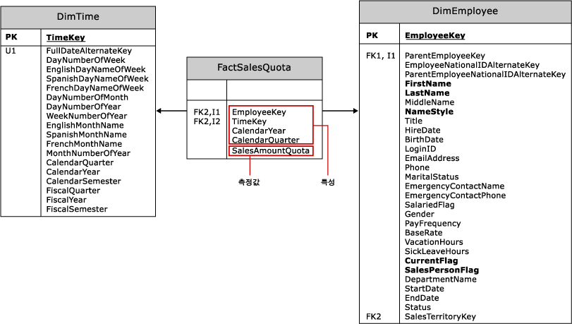

# 다차원 모델의 측정값 및 측정값 그룹 만들기
  *측정값* 은 합계, 개수, 최소값, 최대값, 평균 또는 사용자가 만드는 사용자 지정 MDX 식과 같은 숫자 데이터 값의 집계입니다. *측정값 그룹* 은 하나 이상의 측정이 포함된 컨테이너입니다. 모든 측정값은 측정값이 하나만 있더라도 측정값 그룹에 포함됩니다. 큐브는 하나 이상의 측정값과 측정값 그룹을 포함해야 합니다.  
  
 이 항목은 다음과 같은 섹션으로 구성됩니다.  
  
-   [측정값 만들기 접근 방식](#bkmk_create)  
  
-   [측정값의 구성 요소](#bkmk_comps)  
  
-   [팩트 및 팩트 테이블의 측정값 및 측정값 그룹 모델링](#bkmk_modeling)  
  
-   [측정값 그룹의 세분성](#bkmk_grain)  
  
##   측정값 만들기 접근 방식  
 측정값은 디자인 타임에 만들어지는 큐브의 정적 요소일 수 있으며, 큐브가 액세스될 때마다 항상 존재합니다. 그러나 MDX를 사용해 측정값을 *계산 멤버* 로 정의하여 큐브의 다른 측정값을 기반으로 측정값에 계산된 값을 제공할 수도 있습니다. 계산 멤버는 범위를 세션 또는 사용자로 지정할 수 있습니다.  
  
 측정값 또는 측정값 그룹을 만들려면 다음 접근 방식 중 하나를 사용합니다.  
  
|||  
|-|-|  
|큐브 마법사|[!INCLUDE[ssBIDevStudioFull](../../includes/ssbidevstudiofull-md.md)] 에서 큐브 마법사를 실행하여 큐브를 만듭니다.   솔루션 탐색기에서 **큐브**를 마우스 오른쪽 단추로 클릭하고 **새 큐브**를 선택합니다. 이러한 단계에 대한 도움이 필요하면 [다차원 모델링&#40;Adventure Works 자습서&#41;](../../analysis-services/multidimensional-modeling-adventure-works-tutorial.md)을 참조하세요.   기존 데이터 웨어하우스의 테이블을 기반으로 큐브를 만드는 경우 측정값 및 측정값 그룹에 대한 정의는 큐브 만들기 프로세스의 일부로 구체화됩니다. 마법사에서 큐브의 측정값 및 측정값 그룹 개체의 기초로 사용할 팩트 및 팩트 테이블을 선택합니다.|  
|새 측정값 대화 상자|큐브가 이미 [!INCLUDE[ssBIDevStudioFull](../../includes/ssbidevstudiofull-md.md)]에 있다고 가정하고 솔루션 탐색기에서 큐브 이름을 두 번 클릭하여 큐브 디자이너에서 엽니다. 측정값 창에서 맨 위 노드를 마우스 오른쪽 단추로 클릭하여 새 측정값 그룹을 만들거나 원본 테이블, 열 및 집계 유형을 지정하여 새 측정값을 만듭니다. 이 접근 방식을 사용하려면 미리 작성된 함수의 고정 목록에서 집계 방법을 선택해야 합니다. 일반적으로 사용되는 집계에 대한 자세한 내용은 [Use Aggregate Functions](../../analysis-services/multidimensional-models/use-aggregate-functions.md) 을 참조하세요.|  
|계산 멤버|사용자가 계산 멤버가 만들어지는 시기와 방식을 제어할 수 있으므로 계산 멤버는 [!INCLUDE[ssASnoversion](../../includes/ssasnoversion-md.md)] 에서 큐브에 유연성과 분석 기능을 추가합니다. 사용자 세션 기간 동안이나 조사의 일환으로 Management Studio에서 일시적으로 측정값 하나만 필요한 경우가 있습니다.   [!INCLUDE[ssBIDevStudioFull](../../includes/ssbidevstudiofull-md.md)]에서 계산 탭을 열어 새 계산 멤버를 만듭니다.   측정값의 기반이 MDX 식인 경우 이 접근 방식을 선택합니다. 자세한 내용은 [MDX로 측정값 만들기](../../analysis-services/multidimensional-models/mdx/mdx-building-measures.md), [계산](../../analysis-services/multidimensional-models-olap-logical-cube-objects/calculations.md), [다차원 모델의 계산](../../analysis-services/multidimensional-models/calculations-in-multidimensional-models.md) 및 [MDX 스크립팅 기본 사항&#40;Analysis Services&#41;](../../analysis-services/multidimensional-models/mdx/mdx-scripting-fundamentals-analysis-services.md) 항목을 참조하세요.|  
|MDX 또는 XMLA|SQL Server Management Studio에서 MDX 또는 XMLA를 실행하여 새 계산 멤버를 포함하도록 데이터베이스를 변경할 수 있습니다. 이 접근 방식은 솔루션이 서버에 배포된 후 데이터의 임시 테스트에 유용합니다. [Document and Script an Analysis Services Database](../../analysis-services/multidimensional-models/document-and-script-an-analysis-services-database.md)을 참조하세요.|  
  
##   측정값의 구성 요소  
 측정값은 속성이 포함된 개체입니다. 해당 이름 외에 측정값은 집계 유형 및 원본 열 또는 데이터가 포함된 측정값을 로드하는 데 사용되는 식을 포함해야 합니다. 해당 속성을 설정하여 측정값 정의를 수정할 수 있습니다.  
  
|||  
|-|-|  
|**원본(source)**|대부분의 측정값은 AdventureWorks 데이터 웨어하우스에 있는 Internet Sales 및 Reseller Sales 테이블의 Sales Amount 열과 같이 외부 데이터 웨어하우스에 있는 팩트 테이블의 숫자 열에서 가져오지만 전적으로 사용자가 정의한 계산을 기반으로 새 측정값을 만들 수도 있습니다.   차원 테이블의 특성 열을 사용하여 측정값을 정의할 수도 있지만 이러한 측정값은 일반적으로 집계 동작 면에서 반가산적이거나 비가산적입니다. 반가산적 동작에 대한 자세한 내용은 [반가산적 동작 정의](../../analysis-services/multidimensional-models/define-semiadditive-behavior.md)를 참조하세요.|  
|**집계(aggregation)**|기본적으로 측정값이 각 차원에 따라 합계되지만 그러나 **AggregateFunction** 속성을 사용하여 이 동작을 수정할 수 있습니다. 목록은 [Use Aggregate Functions](../../analysis-services/multidimensional-models/use-aggregate-functions.md) 을 참조하세요.|  
|**속성**|추가 속성 설명은 [Configure Measure Properties](../../analysis-services/multidimensional-models/configure-measure-properties.md) 을 참조하세요.|  
  
##   팩트 및 팩트 테이블의 측정값 및 측정값 그룹 모델링  
 마법사를 실행하기 전에 측정값 정의의 근간이 되는 모델링 원칙을 이해하는 것이 좋습니다.  
  
 측정값 및 측정값 그룹은 외부 데이터 웨어하우스의 팩트 및 팩트 테이블을 나타내는 다차원 개체입니다. 대부분의 경우 측정값 및 측정값 그룹은 데이터 원본 뷰의 개체를 기반으로 하며, 이는 기본 데이터 웨어하우스에서 만들어집니다.  
  
 다음 다이어그램에서는 **FactSalesQuota** 팩트 테이블과 이 테이블에 연결된 두 개의 차원 테이블인 **DimTime** 및 **DimEmployee**를 보여 줍니다. Adventure Works 샘플 큐브에서 이러한 테이블은 Sales Quotas 측정값 그룹과 Time 및 Employee 차원의 기초로 사용됩니다.  
  
   
  
 팩트 테이블에는 특성과 측정값이라는 두 가지 기본 열이 있습니다.  
  
-   특성 열은 차원 테이블에 포함된 데이터로 측정값 열의 측정 가능한 데이터를 구성할 수 있도록 차원 테이블과의 외래 키 관계를 만드는 데 사용됩니다. 특성 열은 팩트 테이블 및 해당 측정값 그룹의 세분성을 정의하는 데도 사용됩니다.  
  
-   측정값 열은 측정값 그룹에 포함된 측정값을 정의합니다.  
  
 큐브 마법사를 실행하면 외래 키가 필터링되어 제외됩니다. 선택할 수 있는 나머지 열 목록에 측정값 열과 외래 키로 식별되지 않은 특성 열이 표시됩니다. **FactSalesQuote** 예에서 마법사는 **SalesAmountQuota** 외에도 **CalendarYear** 및 **CalendarQuarter**를 제공합니다. **SalesAmountQuota** 측정값 열에서만 다차원 모델에 대한 작업 가능한 측정값이 발생합니다. 다른 날짜 기반 열은 각 할당액을 정규화하기 위해 존재합니다. 다른 **CalendarYear** 및 **CalendarQuarter**열은 큐브 마법사의 측정값 목록에서 제외하거나 나중에 디자이너의 측정값 그룹에서 제거해야 합니다.  
  
 이 설명에서 알아야 할 사항은 마법사가 제공하는 모든 열이 측정값으로 유용한 것은 아니라는 점입니다. 데이터와 측정값으로 사용할 열을 결정할 때 이러한 데이터가 어떻게 사용되는지에 대한 이해 내용을 바탕으로 하세요. 데이터 원본 뷰에서 테이블을 마우스 오른쪽 단추로 클릭하여 데이터를 탐색할 수 있으며, 이렇게 하면 측정값으로 사용할 열을 식별하는 데 도움이 될 수 있습니다. 자세한 내용은 [데이터 원본 뷰에서 데이터 탐색&#40;Analysis Services&#41;](../../analysis-services/multidimensional-models/explore-data-in-a-data-source-view-analysis-services.md)을 참조하세요.  
  
> [!NOTE]  
>  모든 측정값이 팩트 테이블의 열에 저장된 값에서 직접 파생되는 것은 아닙니다. 예를 들어 Adventure Works 샘플 큐브의 **판매 할당량** 측정값 그룹에 정의된 **영업 사원 카운트** 측정값은 실제로 **FactSalesQuota** 팩트 테이블의 **EmployeeKey** 열에 있는 고유한 값의 카운트(고유 카운트)를 기반으로 합니다.  
  
##   측정값 그룹의 세분성  
 측정값 그룹에는 팩트 테이블에서 지원하는 정보 수준을 나타내는 연결된 세분성이 있습니다. 세분성은 차원에 대한 외래 키 관계를 통해 설정됩니다.  
  
 예를 들어 **FactSalesQuota** 팩트 테이블에는 **DimEmployee** 테이블과의 외래 키 관계가 포함되어 있으며 **FactSalesQuota** 테이블의 각 레코드는 한 명의 직원과 관련되므로, Employee 차원에서 볼 때 측정값 그룹의 세분성은 개별 직원 수준에 있습니다.  
  
 측정값 그룹의 세분성을 측정값 그룹을 보는 차원의 최하위 수준보다 미세하게 설정할 수 없지만 추가 특성을 사용하여 세분성을 성기게 만들 수는 있습니다. 예를 들어 **FactSalesQuota** 팩트 테이블은 **TimeKey**, **CalendarYear**, **CalendarQuarter**의 3개의 열을 사용하여 **DimTime** 테이블과의 관계 세분성을 설정합니다. 따라서 Time 차원에서 볼 때 측정값 그룹의 세분성은 Time 차원의 최하위 수준인 날짜가 아닌 사분기가 됩니다.  
  
 큐브 디자이너의 **차원 용도** 탭을 통해 특정 차원과 관련하여 측정값 그룹의 세분성을 지정할 수 있습니다. 차원 관계에 대한 자세한 내용은 [Dimension Relationships](../../analysis-services/multidimensional-models-olap-logical-cube-objects/dimension-relationships.md)를 참조하세요.  
  
## 관련 항목:  
 [다차원 모델의 큐브](../../analysis-services/multidimensional-models/cubes-in-multidimensional-models.md)   
 [측정값 및 측정값 그룹](../../analysis-services/multidimensional-models/measures-and-measure-groups.md)  
  
  

