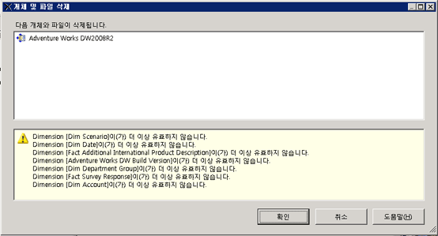

# 데이터 원본 뷰 삭제(Analysis Services)
  OLAP 프로젝트에서 DSV(데이터 원본 뷰)를 더 이상 사용하지 않으려는 경우 [!INCLUDE[ssBIDevStudioFull](../../includes/ssbidevstudiofull-md.md)]의 프로젝트에서 해당 뷰를 삭제할 수 있습니다.  
  
 DSV 삭제는 영구적입니다. 삭제한 DSV는 [!INCLUDE[ssASnoversion](../../includes/ssasnoversion-md.md)] 프로젝트나 데이터베이스로 복원할 수 없습니다.  
  
 다른 개체가 종속된 DSV는 [!INCLUDE[ssASnoversion](../../includes/ssasnoversion-md.md)] 에서 온라인 모드로 열린 [!INCLUDE[ssBIDevStudioFull](../../includes/ssbidevstudiofull-md.md)] 데이터베이스에서 삭제할 수 없습니다. 서버에서 실행하는 데이터베이스에 연결된 프로젝트에서 DSV를 삭제하려면 DSV 자체를 삭제하기 전에 먼저 해당 DSV에 종속된 [!INCLUDE[ssASnoversion](../../includes/ssasnoversion-md.md)] 데이터베이스의 개체를 모두 삭제해야 합니다.  
  
 DSV를 삭제하면 이 뷰에 종속된 다른 [!INCLUDE[ssASnoversion](../../includes/ssasnoversion-md.md)] 개체도 무효화되므로 DSV를 삭제하기 전에 DSV를 제거할 경우 무효화될 개체 목록이 표시됩니다. 이 목록을 신중하게 검토하여 계속 사용할 개체가 목록에 포함되지 않는지 확인합니다.  
  
   
  
## 관련 항목:  
 [다차원 모델의 데이터 원본 뷰](../../analysis-services/multidimensional-models/data-source-views-in-multidimensional-models.md)   
 [데이터 원본 뷰에서 속성 변경&#40;Analysis Services&#41;](../../analysis-services/multidimensional-models/change-properties-in-a-data-source-view-analysis-services.md)  
  
  
