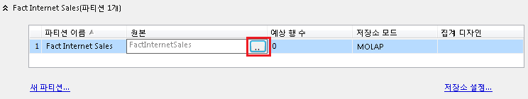

# 파티션 편집 또는 삭제(Analyisis Services - 다차원)
[!INCLUDE[ssas-appliesto-sqlas](../../includes/ssas-appliesto-sqlas.md)]
큐브 파티션은 **에서 큐브 디자이너의** 파티션 [!INCLUDE[ssBIDevStudio](../../includes/ssbidevstudio-md.md)]탭을 사용하여 수정됩니다. **파티션** 탭에서는 큐브에 있는 모든 측정값 그룹의 파티션을 나열합니다. 또한 쓰기 저장(writeback)이 설정된 쓰기 저장 파티션을 나열합니다.  
  
 측정값 그룹의 파티션을 편집하려면 **파티션** 탭에서 해당 측정값 그룹을 확장합니다. 측정값 그룹의 파티션은 다음 표에 나열된 열과 함께 테이블 형식의 서수 번호 순으로 나열됩니다.  
  
 연결된 측정값 그룹에 대한 설정은 원본 큐브에서 편집해야 합니다.  
  
 대상 파티션에 원본 파티션을 병합하면 파티션이 자동으로 삭제됩니다. 원본으로 지정된 파티션은 병합이 완료된 후 삭제됩니다. [!INCLUDE[ssManStudioFull](../../includes/ssmanstudiofull-md.md)] 에서 또는 [!INCLUDE[ssBIDevStudio](../../includes/ssbidevstudio-md.md)]의 파티션 탭에서 수동으로 파티션을 삭제할 수도 있습니다. 마우스 오른쪽 단추를 클릭한 다음 **삭제**를 선택합니다. 파티션을 삭제하면 데이터와 집계도 삭제됩니다. 예방 조치로, 나중에 이 단계를 되돌려야 하는 경우에 대비하여 데이터베이스의 최신 백업을 가지고 있어야 합니다.  
  
> [!NOTE]  
>  또는 파티션 빌드, 병합 및 삭제 태스크를 자동화하는 XMLA 스크립트를 사용할 수 있습니다. [!INCLUDE[ssManStudioFull](../../includes/ssmanstudiofull-md.md)]에서 또는 예약된 태스크로 실행되는 사용자 지정 SSIS 패키지에서 XMLA 스크립트를 만들고 실행할 수 있습니다. 자세한 내용은 [SSIS를 사용하여 Analysis Services 관리 태스크 자동화](../../analysis-services/instances/automate-analysis-services-administrative-tasks-with-ssis.md)를 참조하세요.  
  
## 파티션 원본  
 파티션의 원본 테이블 또는 명명된 쿼리를 지정합니다. 원본 테이블을 변경하려면 셀을 클릭한 다음 찾아보기 (**...**) 단추를 클릭합니다.  
  
   
  
 파티션이 쿼리를 기반으로 하는 경우 찾아보기 (**...**) 단추를 클릭하여 쿼리를 편집합니다. 이렇게 하면 파티션의 **원본** 속성이 편집됩니다. 자세한 내용은 [다른 팩트 테이블을 사용하도록 파티션 원본 변경](../../analysis-services/multidimensional-models/change-a-partition-source-to-use-a-different-fact-table.md)을 참조하세요.  
  
 데이터가 검색되는 외부 데이터 원본의 원래 원본 테이블과 동일한 구조를 가진 데이터 원본 뷰의 테이블을 지정할 수 있습니다. 원본은 큐브 데이터베이스의 모든 데이터 원본 또는 데이터 원본 뷰에 있을 수 있습니다.  
  
## 저장소 설정  
 큐브 디자이너의 파티션 탭에서 **저장소 설정** 을 클릭하여 MOLAP, ROLAP 또는 HOLAP 저장소에 대한 표준 설정 중 하나를 선택하거나 저장소 모드 및 자동 관리 캐싱에 대한 사용자 지정 설정을 구성할 수 있습니다. MOLAP가 가장 빠른 쿼리 성능을 제공하기 때문에 기본값은 MOLAP입니다. 각 설정에 대한 자세한 내용은 [파티션 저장소 설정&#40;Analysis Services - 다차원&#41;](../../analysis-services/multidimensional-models/set-partition-storage-analysis-services-multidimensional.md)을 참조하세요.  
  
 큐브에 있는 각 측정값 그룹의 각 파티션에 대해 저장소를 별도로 구성할 수 있습니다. 큐브 또는 측정값 그룹에 대한 기본 저장소 설정을 구성할 수도 있습니다. 저장소는 큐브 마법사의 **파티션** 탭에서 구성합니다.  
  
## 관련 항목:  
 [만들기 및 관리 로컬 파티션에 &#40; Analysis Services &#41;](../../analysis-services/multidimensional-models/create-and-manage-a-local-partition-analysis-services.md)   
 [집계 &#40; 디자인 Analysis Services-다차원 &#41;](../../analysis-services/multidimensional-models/designing-aggregations-analysis-services-multidimensional.md)   
 [Analysis Services &#40;의 파티션 병합 SSAS-다차원 데이터 &#41;](../../analysis-services/multidimensional-models/merge-partitions-in-analysis-services-ssas-multidimensional.md)  
  
  
