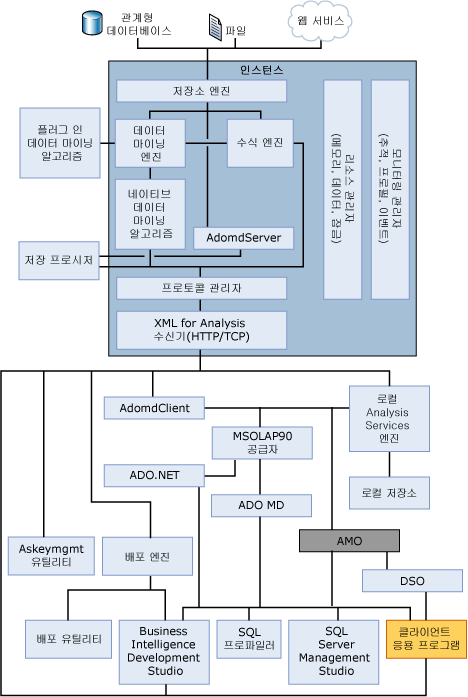

# OLAP 엔진 서버 구성 요소
[!INCLUDE[ssas-appliesto-sqlas](../../../includes/ssas-appliesto-sqlas.md)]
  서버 구성 요소 [!INCLUDE[msCoName](../../../includes/msconame-md.md)] [!INCLUDE[ssNoVersion](../../../includes/ssnoversion-md.md)] [!INCLUDE[ssASnoversion](../../../includes/ssasnoversion-md.md)] 는 **msmdsrv.exe** 응용 프로그램을 Windows 서비스로 실행 됩니다. 이 애플리케이션은 보안 구성 요소, XMLA(XML for Analysis) 수신기 구성 요소, 쿼리 프로세서 구성 요소 및 다음 기능을 수행하는 다른 많은 내부 구성 요소로 이루어집니다.  
  
-   클라이언트로부터 수신한 문 구문 분석  
  
-   메타데이터 관리  
  
-   트랜잭션 처리  
  
-   계산 처리  
  
-   차원 및 셀 데이터 저장  
  
-   집계 생성  
  
-   쿼리 일정 예약  
  
-   개체 캐싱  
  
-   서버 리소스 관리  
  
## 아키텍처 다이어그램  
 [!INCLUDE[ssASnoversion](../../../includes/ssasnoversion-md.md)] 인스턴스는 독립 실행형 서비스로 실행되며 서비스와의 통신은 HTTP 또는 TCP를 사용하는 XMLA(XML for Analysis)를 통해 이루어집니다. AMO는 사용자 응용 프로그램과 [!INCLUDE[ssASnoversion](../../../includes/ssasnoversion-md.md)] 인스턴스 사이에 있는 계층으로, [!INCLUDE[ssASnoversion](../../../includes/ssasnoversion-md.md)] 관리 개체에 대한 액세스를 제공합니다. AMO는 클라이언트 애플리케이션에서 명령을 가져와서 이 명령을 [!INCLUDE[ssASnoversion](../../../includes/ssasnoversion-md.md)] 인스턴스에 대한 XMLA 메시지로 변환하는 클래스 라이브러리이며, 명령을 실행하는 메서드 멤버 및 [!INCLUDE[ssASnoversion](../../../includes/ssasnoversion-md.md)] 개체에 대한 데이터를 포함하는 속성 멤버와 함께 [!INCLUDE[ssASnoversion](../../../includes/ssasnoversion-md.md)] 인스턴스 개체를 최종 사용자에게 클래스로 표시합니다.  
  
 다음 그림은 [!INCLUDE[ssASnoversion](../../../includes/ssasnoversion-md.md)] 인스턴스 내에서 실행되는 모든 주요 요소와 이 인스턴스와 상호 작용하는 모든 사용자 구성 요소를 비롯한 [!INCLUDE[ssASnoversion](../../../includes/ssasnoversion-md.md)] 구성 요소 아키텍처를 보여 줍니다. 또한 HTTP 또는 TCP를 사용하는 XMLA(XML for Analysis) 수신기를 통해서만 이 인스턴스에 액세스할 수 있음을 보여 줍니다.  
  
   
  
## XMLA 수신기  
 XMLA 수신기 구성 요소는 [!INCLUDE[ssASnoversion](../../../includes/ssasnoversion-md.md)] 와 클라이언트 간의 모든 XMLA 통신을 처리합니다. msmdsrv.ini 파일의 [!INCLUDE[ssASnoversion](../../../includes/ssasnoversion-md.md)] **포트** 구성 설정을 사용하여 [!INCLUDE[ssASnoversion](../../../includes/ssasnoversion-md.md)] 인스턴스가 수신하는 포트를 지정할 수 있습니다. 이 파일의 값이 0이면 [!INCLUDE[ssASnoversion](../../../includes/ssasnoversion-md.md)] 는 기본 포트에서 수신합니다. 달리 지정하지 않는 한 [!INCLUDE[ssASnoversion](../../../includes/ssasnoversion-md.md)] 에서는 다음 기본 TCP 포트를 사용합니다.  
  
|포트|Description|  
|----------|-----------------|  
|2383| [!INCLUDE[ssNoVersion](../../../includes/ssnoversion-md.md)] [!INCLUDE[ssASnoversion](../../../includes/ssasnoversion-md.md)]의 기본 인스턴스|  
|2382| [!INCLUDE[ssNoVersion](../../../includes/ssnoversion-md.md)] [!INCLUDE[ssASnoversion](../../../includes/ssasnoversion-md.md)]의 다른 인스턴스에 대한 리디렉터|  
|서버 시작 시 동적으로 할당됩니다.| [!INCLUDE[ssNoVersion](../../../includes/ssnoversion-md.md)] [!INCLUDE[ssASnoversion](../../../includes/ssasnoversion-md.md)]의 명명된 인스턴스|  
  
 참조 [Analysis Services 액세스를 허용 하도록 Windows 방화벽을 구성](../../../analysis-services/instances/configure-the-windows-firewall-to-allow-analysis-services-access.md) 내용을 확인 합니다.  
  
## 관련 항목:  
 [개체 명명 규칙 &#40;Analysis Services&#41;](../../../analysis-services/multidimensional-models/olap-physical/object-naming-rules-analysis-services.md)   
 [물리적 아키텍처 &#40;Analysis Services-다차원 데이터&#41;](../../../analysis-services/multidimensional-models/olap-physical/understanding-microsoft-olap-physical-architecture.md)   
 [논리적 아키텍처 &#40;Analysis Services-다차원 데이터&#41;](../../../analysis-services/multidimensional-models/olap-logical/understanding-microsoft-olap-logical-architecture.md)  
  
  
