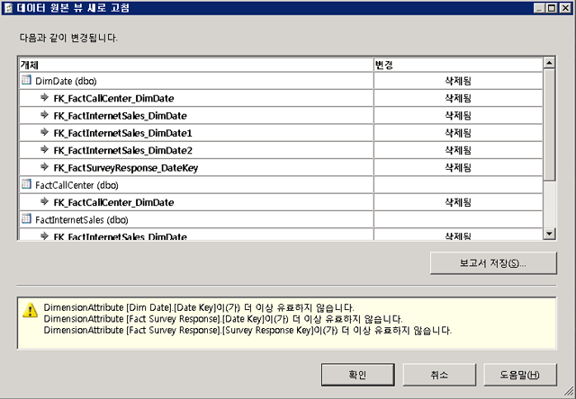

# 데이터 원본 뷰에서 스키마 새로 고침(Analysis Services)
[!INCLUDE[ssas-appliesto-sqlas](../../includes/ssas-appliesto-sqlas.md)]
  [!INCLUDE[ssASnoversion](../../includes/ssasnoversion-md.md)] 프로젝트나 데이터베이스에 데이터 원본 뷰(DSV)를 정의한 후 기본 데이터 원본의 스키마가 변경될 수 있습니다. 이러한 변경 내용은 배포 프로젝트에서 자동으로 감지되거나 업데이트되지 않습니다. 또한 프로젝트를 서버에 배포했을 경우 Analysis Services에서 더 이상 외부 데이터 원본에 연결할 수 없다는 처리 오류가 발생하게 됩니다.  
  
 외부 데이터 원본과 일치하도록 DSV를 업데이트하려면 BIDS(Business Intelligence Development Studio)에서 DSV를 새로 고치면 됩니다. DSV를 새로 고치면 DSV가 기반으로 하는 외부 데이터 원본에 대한 변경 내용이 검색되어 외부 데이터 원본의 추가 및 삭제를 열거하는 변경 목록이 작성됩니다. 이 변경 내용 집합을 기본 데이터 원본과 맞게 다시 조정할 DSV에 적용하면 됩니다. 추가 작업 시 프로젝트에서 해당 DSV를 사용하는 큐브와 차원을 추가로 업데이트해야 하는 경우가 많습니다.  
  
 이 항목은 다음과 같은 섹션으로 구성됩니다.  
  
 [새로 고침에서 지원 변경](#bkmk_changlist)  
  
 [SQL Server Data Tools에서 DSV 새로 고침](#bkmk_DSVrefresh)  
  
##   새로 고침에서 지원 변경  
 DSV 새로 고침에는 다음과 같은 동작이 포함됩니다.  
  
-   테이블, 열 및 관계 삭제  
  
-   DSV에 이미 포함된 테이블에 적용된 대로 열 및 관계 추가  
  
-   UNIQUE 제약 조건 새로 추가. DSV의 테이블에 논리적 기본 키가 있는 경우 데이터 원본의 테이블에 물리적 키를 추가하면 논리적 키가 제거되고 물리적 키로 바뀝니다.  
  
 새로 고침은 DSV에 새 테이블을 추가하지 않습니다. 새 테이블을 추가하려면 수동으로 추가해야 합니다. 자세한 내용은 [데이터 원본 뷰에서 테이블이나 뷰 추가 또는 제거&#40;Analysis Services&#41;](../../analysis-services/multidimensional-models/adding-or-removing-tables-or-views-in-a-data-source-view-analysis-services.md)를 참조하세요.  
  
##   SQL Server Data Tools에서 DSV 새로 고침  
 DSV를 새로 고치려면 솔루션 탐색기에서 DSV를 두 번 클릭 [!INCLUDE[ssBIDevStudioFull](../../includes/ssbidevstudiofull-md.md)]합니다.  DSV 디자이너를 시작합니다.  그런 다음 디자이너에서 데이터 원본 뷰 새로 고침 단추를 클릭 하거나 선택 **새로 고침** 데이터 원본 뷰 메뉴에서 합니다.  
  
 새로 고침 작업을 수행하는 동안 [!INCLUDE[ssASnoversion](../../includes/ssasnoversion-md.md)] 에서는 기본 관계형 데이터 원본을 모두 쿼리하여 DSV에 포함된 테이블/뷰에 변경 내용이 있었는지 여부를 확인합니다. 모든 기본 데이터 원본에 연결할 수 있으며 변경 내용이 있는 경우 **데이터 원본 뷰 새로 고침** 대화 상자에 해당 내용이 표시됩니다.  
  
   
  
 이 대화 상자에는 DSV에서 삭제 또는 추가될 테이블, 열, 제약 조건 및 관계를 나열되며 성공적으로 준비할 수 없는 명명된 쿼리 또는 계산도 나열합니다. 영향을 받는 개체는 트리 뷰로 나열되며 테이블에 열 및 관계가 중첩되고 변경 유형(삭제 또는 추가)이 각 개체에 대해 표시됩니다. 영향을 받는 개체 유형은 표준 데이터 원본 뷰 개체 아이콘으로 표시됩니다.  
  
 새로 고침은 전적으로 원본 개체의 이름을 기반으로 하기 때문에 데이터 원본에서 원본 개체의 이름을 바꾸면 데이터 원본 뷰 디자이너가 이름이 변경된 이러한 개체를 두 개의 별도 작업, 즉 삭제와 추가로 처리합니다. 이러한 경우 이름을 바꾼 개체를 데이터 원본 뷰에 수동으로 다시 추가해야 할 수 있습니다. 관계 또는 논리적 기본 키를 다시 만들어야 할 수도 있습니다.  
  
> [!IMPORTANT]  
>  데이터 원본에서 테이블 이름이 바꼈다는 사실을 인지한 경우 데이터 원본 뷰를 새로 고치기 전에 **테이블 바꾸기** 명령을 사용하여 테이블을 이름이 변경된 테이블로 바꾸는 것이 좋습니다. 자세한 내용은 [데이터 원본 뷰의 테이블 또는 명명된 쿼리 바꾸기&#40;Analysis Services&#41;](../../analysis-services/multidimensional-models/replace-a-table-or-a-named-query-in-a-data-source-view-analysis-services.md)를 참조하세요.  
  
 보고서를 확인한 후 변경 내용을 적용하거나 업데이트를 취소하여 변경 내용을 거부할 수 있습니다. 모든 변경 내용은 함께 수락하거나 거부해야 합니다. 목록에서 개별 항목을 선택할 수 없습니다. 변경 내용에 대한 보고서를 저장할 수도 있습니다.  
  
## 관련 항목:  
 [다차원 모델의 데이터 원본 뷰](../../analysis-services/multidimensional-models/data-source-views-in-multidimensional-models.md)  
  
  
