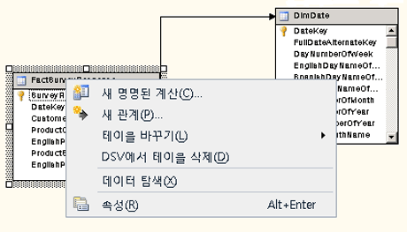

# 데이터 원본 뷰 디자이너에서의 다이어그램 작업(Analysis Services)
  데이터 원본 뷰(DSV) 다이어그램은 DSV 개체를 시각적으로 표현합니다. 다이어그램에서 대화형 작업을 통해 특정 개체를 추가, 숨기기, 삭제 또는 수정할 수 있습니다. 한 DSV에서 개체의 특정 하위 집합에 초점을 맞춘 다이어그램을 여러 개 만들 수도 있습니다.  
  
 다이어그램 창에 표시할 다이어그램 영역을 변경하려면 창의 오른쪽 아래 모퉁이에서 십자형 화살표를 클릭하여 다이어그램 창에 표시할 영역이 선택될 때까지 선택 상자를 축소판 다이어그램 위로 끕니다.  
  
 이 항목은 다음과 같은 섹션으로 구성됩니다.  
  
 [다이어그램 추가](#bkmk_add)  
  
 [다이어그램 편집 또는 삭제](#bkmk_edit)  
  
 [다이어그램에서 테이블 찾기](#bkmk_findtables)  
  
 [다이어그램에서 개체 정렬](#bkmk_arrangeobjects)  
  
 [개체 배열 유지](#bkmk_preserve)  
  
##   다이어그램 추가  
 DSV를 만들면 자동으로 DSV 다이어그램이 생성됩니다. 기존의 DSV에서 다이어그램을 추가하거나 특정 개체를 숨겨 DSV의 표현을 보다 관리하기 쉽게 만들 수도 있습니다.  
  
 새 다이어그램을 만들려면 **다이어그램 구성 도우미** 창을 마우스 오른쪽 단추로 클릭하고 **새 다이어그램**을 클릭합니다.  
  
 처음에 Analysis Services 프로젝트에서 데이터 원본 뷰(DSV)를 정의할 때 데이터 원본 뷰에 추가한 모든 테이블과 뷰는 \<모든 테이블> 다이어그램에 추가됩니다. 이 다이어그램은 데이터 원본 뷰 디자이너의 다이어그램 구성 도우미 창에 나타나고 이 다이어그램의 테이블 및 해당 열과 관계는 테이블 창에 나열되며 스키마 창에 그래픽으로 표시됩니다. 그러나 \<모든 테이블> 다이어그램에 테이블, 뷰 및 명명된 쿼리를 추가하면 특히 여러 개의 팩트 테이블을 다이어그램에 추가하고 차원 테이블이 여러 개의 팩트 테이블과 관련이 있는 경우 이 다이어그램의 개체 수가 너무 많아 관계를 시각화하기가 어렵습니다.  
  
 데이터 원본 뷰에서 테이블의 하위 집합만 보려는 경우 시각적으로 복잡하지 않도록 데이터 원본 뷰에서 선택한 하위 집합의 테이블, 뷰 및 명명된 쿼리로 구성된 하위 다이어그램(간단하게 다이어그램이라고 함)을 정의할 수 있습니다. 다이어그램을 사용하여 비즈니스 또는 솔루션 요구에 따라 데이터 원본 뷰의 항목을 그룹화할 수 있습니다.  
  
 비즈니스를 목적으로 그리고 많은 테이블, 뷰 및 명명된 쿼리가 포함된 데이터 원본 뷰를 보다 쉽게 이해할 수 있도록 관련 테이블 및 명명된 쿼리를 별도의 다이어그램에 그룹화할 수 있습니다. 동일한 테이블 또는 명명된 쿼리가 \<모든 테이블> 다이어그램을 제외한 여러 다이어그램에 포함될 수 있습니다. \<모든 테이블> 다이어그램에서는 데이터 원본 뷰에 포함된 모든 개체가 한 번만 표시됩니다.  
  
##   다이어그램 편집 또는 삭제  
 다이어그램으로 작업할 경우 개체를 추가 및 삭제하는 데 사용되는 명령에 특히 주의해야 합니다. 예를 들어 다이어그램에서 개체를 삭제하면 DSV에서도 해당 개제가 삭제됩니다. 다이어그램에서만 삭제하려면 **테이블 숨기기** 명령을 사용해야 합니다.  
  
   
  
 개체를 개별적으로 숨길 수 있지만, 숨겨진 개체를 관련 테이블 표시 명령을 사용하여 다시 표시하면 관련된 모든 개체가 다이어그램에 반환됩니다. 작업 영역에 원하는 개체만 반환되게 하려면 테이블 창에서 직접 끌어 와야 합니다.  
  
##   다이어그램에서 테이블 찾기  
 스키마가 큰 경우 **다이어그램** 창에서 특정 테이블을 찾아 스크롤하기가 어려울 수 있습니다. 그러나 다음 도구를 사용하면 다이어그램에서 테이블을 쉽게 찾을 수 있습니다.  
  
-   **테이블** 창에서 테이블 목록을 스크롤합니다.  
  
     현재 표시된 다이어그램에 테이블을 포함하려면 **테이블** 창에서 다이어그램 창으로 테이블을 끌어 옵니다.  
  
     이미 다이어그램에 포함된 테이블을 가운데에 표시하려면 **테이블** 창에서 해당 테이블을 선택합니다.  
  
-   **다이어그램** 창의 테이블 로케이터 - 테이블 로케이터는 **다이어그램** 창의 오른쪽 아래 모퉁이에서 세로 및 가로 스크롤 막대가 교차하는 지점에 있는 4방향 화살표 아이콘입니다. 테이블 로케이터는 다이어그램 창에 축소판 그림으로 표현된 현재 다이어그램을 엽니다. 이 축소판 그림을 사용하여 다이어그램 창의 시점을 다이어그램의 임의의 위치로 이동할 수 있습니다.  
  
-   **테이블 찾기** 대화 상자 사용 - 다이어그램 창의 열린 영역을 마우스 오른쪽 단추로 클릭한 다음 **테이블 찾기**를 클릭합니다. 또는 도구 모음 또는 **데이터 원본 뷰** 메뉴에서 **테이블 찾기** 명령을 클릭합니다.  
  
     필터 입력란에 문자열 및 와일드카드 문자를 입력하여 다이어그램에 있는 테이블의 하위 집합을 볼 수 있습니다.  
  
##   다이어그램에서 개체 정렬  
 데이터 원본 뷰 디자이너에서 여러 다이어그램을 정의하여 DSV를 이해하기 쉽게 만들 수 있지만 많은 테이블을 포함하는 다이어그램은 읽기 어려울 수 있으며 수동으로 테이블 레이아웃을 다시 정렬해야 할 경우 시간이 오래 걸릴 수 있습니다. 데이터 원본 뷰 디자이너에서는 현재 다이어그램에 있는 테이블간 관계를 기반으로 사각형 또는 대각선 레이아웃을 사용하여 현재 다이어그램에서 테이블을 자동으로 다시 정렬할 수 있습니다.  
  
-   사각형 레이아웃에서 관계선은 열 사이 대신 테이블 사이에 그려집니다. 테이블 사이에서는 관계선이 가로와 세로로 그려집니다.  
  
-   대각선 레이아웃에서 관계선은 테이블의 관련 열 사이에서 가능한 직선으로 그려집니다. 여러 열에 대한 관계는 테이블의 첫 번째 관련 열에 연결됩니다. 테이블의 열이 표시되지 않는 경우 선은 테이블의 맨 위에 그려집니다.  
  
##   개체 배열 유지  
 원하는 방식으로 테이블을 수동 정렬한 후 다이어그램에 테이블을 추가하면 다이어그램 새로 고침이 발생하여 개체 레이아웃에 대한 최근 수정 내용이 모두 제거될 수 있습니다.  
  
 이 동작은 테이블을 추가하여 다이어그램 구성 도우미가 새 테이블을 수용하기 위해 다른 테이블을 이동할 때 발생할 가능성이 높습니다. 그런 후 모든 테이블 및 연결 선이 올바르게 표시되도록 다이어그램을 다시 그립니다. 이 시점에서 수동으로 조정한 특정 개체의 배치가 손실될 수 있습니다.  
  
 이 문제를 방지하려면 마지막으로 조정하기 전에 먼저 모든 테이블을 추가하십시오. 나중에 다이어그램을 다시 열 경우 개체는 다이어그램에서 위치를 유지해야 합니다.  
  
## 관련 항목:  
 [다차원 모델의 데이터 원본 뷰](../../analysis-services/multidimensional-models/data-source-views-in-multidimensional-models.md)   
 [데이터 원본 뷰 디자이너&#40;Analysis Services - 다차원 데이터&#41;](../Topic/Data%20Source%20View%20Designer%20\(Analysis%20Services%20-%20Multidimensional%20Data\).md)  
  
  