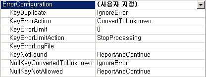
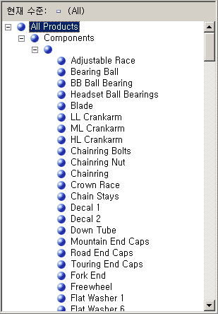
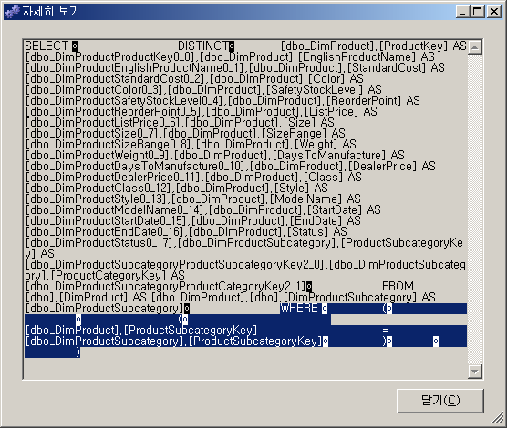
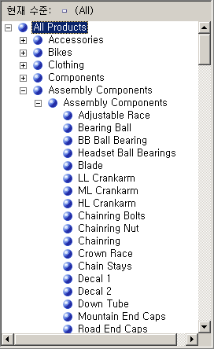

# 단원 4-7-알 수 없는 멤버 및 Null 처리 속성 정의
[!INCLUDE[ssas-appliesto-sqlas](../../includes/ssas-appliesto-sqlas.md)]

[!INCLUDE[ssASnoversion](../../includes/ssasnoversion-md.md)] 에서 차원을 처리하는 경우 데이터 원본 뷰의 뷰나 테이블의 기본 열에 있는 모든 고유 값이 차원의 특성을 채웁니다. [!INCLUDE[ssASnoversion](../../includes/ssasnoversion-md.md)] 에서 처리 도중에 Null 값이 발생할 경우 기본적으로 이 Null은 숫자 열의 경우 0으로 변환되고 문자열 열의 경우 빈 문자열로 변환됩니다. 기본 관계형 데이터 웨어하우스의 추출, 변환 및 로드 프로세스(있을 경우)에서 이러한 기본 설정을 수정하거나 Null 값을 변환할 수 있습니다. 또한 3개의 속성을 구성하여 [!INCLUDE[ssASnoversion](../../includes/ssasnoversion-md.md)] 에서 Null 값을 지정된 값으로 변환하도록 할 수 있습니다. 이러한 속성은 차원에 대한 **UnknownMember** 및 **UnknownMemberName** 속성과 차원의 키 특성에 대한 **NullProcessing** 속성입니다.  
  
차원 마법사와 큐브 마법사는 차원의 키 특성이 Null을 허용하는지 또는 눈송이 차원의 루트 특성이 Null 허용 열을 기반으로 하는지 여부에 따라서 이러한 속성을 설정합니다. 이러한 경우에 키 특성의 **NullProcessing** 속성은 **UnknownMember** 로 설정되고 **UnknownMember** 속성은 **Visible**로 설정됩니다.  
  
그러나 이 자습서에서 Product 차원의 경우처럼 눈송이 차원을 증분식으로 작성하거나 차원 디자이너를 사용하여 차원을 정의한 다음 이러한 기존 차원을 큐브에 통합할 경우 **UnknownMember** 및 **NullProcessing** 속성을 수동으로 설정해야 할 수 있습니다.  
  
이 항목의 태스크에서는 [!INCLUDE[ssSampleDBCoShort](../../includes/sssampledbcoshort-md.md)] DW 데이터 원본 뷰에 추가할 눈송이 테이블의 Product 차원에 Product Categories 및 Product Subcategory 특성을 추가합니다. 그런 다음 Product 차원에 대해 **UnknownMember** 속성을 설정하고 **어셈블리 구성 요소** 를 **UnknownMemberName** 속성 값으로 지정하며 **Subcategory** 및 **Category** 특성을 Product Name 특성과 연결한 후 눈송이 테이블을 연결하는 멤버 키 특성에 대해 사용자 지정 오류 처리를 정의합니다.  
  
> [!NOTE]  
> 큐브 마법사를 사용하여 [!INCLUDE[ssASnoversion](../../includes/ssasnoversion-md.md)] Tutorial 큐브를 처음 정의할 때 Subcategory 및 Category 특성을 추가한 경우 이러한 단계는 자동으로 수행됩니다.  
  
## Product 차원의 오류 처리 및 알 수 없는 멤버 속성 검토  
  
1.  **Product** 차원의 차원 디자이너로 전환하고 **차원 구조** 탭을 클릭한 후 **특성** 창의 **Product** 를 선택합니다.  
  
    이렇게 하면 차원 자체의 속성을 보고 수정할 수 있습니다.  
  
2.  속성 창에서 **UnknownMember** 및 **UnknownMemberName** 속성을 검토합니다.  
  
    해당 값이 **Visible** 또는 **Hidden** 대신 **None** 으로 설정되어 있고 **UnknownMemberName**속성에 대해 지정된 이름이 없으므로 **UnknownMember** 속성이 설정되지 않습니다.  
  
3.  속성 창의 **ErrorConfiguration** 속성 셀에서 **(사용자 지정)** 을 선택한 후 **ErrorConfiguration** 속성 컬렉션을 확장합니다.  
  
    **ErrorConfiguration** 속성을 **(사용자 지정)** 으로 설정하면 기본 오류 구성 설정을 볼 수 있습니다. 이로 인해 설정이 변경되지는 않습니다.  
  
4.  키 및 Null 키 오류 구성 속성을 검토만 하고 변경하지 마십시오.  
  
    기본적으로 Null 키가 알 수 없는 멤버로 변환되는 경우 이 변환과 연관된 처리 오류는 무시됩니다.  
  
    다음 이미지는 **ErrorConfiguration** 속성 컬렉션의 속성 설정을 보여 줍니다.  
  
      
  
5.  **브라우저** 탭을 클릭하고 **계층** 목록에 **Product Model Lines** 가 선택되어 있는지 확인한 후 **All Products**를 확장합니다.  
  
    Product Line 수준의 5개 멤버가 표시됩니다.  
  
6.  **Components**를 확장한 후 레이블이 없는 **Model Name** 수준의 멤버를 확장합니다.  
  
    이 수준에는 다음 이미지에 표시된 것처럼 다른 구성 요소를 작업할 때 사용되는 어셈블리 구성 요소가 들어 있으며 **Adjustable Race** 제품으로 시작합니다.  
  
      
  
## 눈송이 테이블 및 제품 범주 사용자 정의 계층의 특성 정의  
  
1.  [!INCLUDE[ssSampleDBCoShort](../../includes/sssampledbcoshort-md.md)] DW 데이터 원본 뷰의 데이터 원본 뷰 디자이너를 열고 **다이어그램 구성 도우미** 창에서 **Reseller Sales** 를 선택한 후 **의** 데이터 원본 뷰 **메뉴에서** 개체 추가/제거 [!INCLUDE[ssBIDevStudioFull](../../includes/ssbidevstudiofull-md.md)]를 클릭합니다.  
  
    **테이블 추가/제거** 대화 상자가 열립니다.  
  
2.  **포함된 개체** 목록에서 **DimProduct (dbo)** 를 선택한 후 **관련 테이블 추가**를 클릭합니다.  
  
    **DimProductSubcategory (dbo)** 및 **FactProductInventory (dbo)** 가 둘 다 추가됩니다. **DimProductSubcategory (dbo)** 테이블만 **포함된 개체** 목록에 추가되도록 **FactProductInventory (dbo)** 를 제거합니다.  
  
3.  **DimProductSubcategory (dbo)** 테이블이 가장 최근에 추가된 테이블로 기본적으로 선택된 상태에서 **관련 테이블 추가** 를 다시 클릭합니다.  
  
    **DimProductCategory (dbo)** 테이블이 **포함된 개체** 목록에 추가됩니다.  
  
4.  **확인**을 클릭합니다.  
  
5.  **의** 서식 [!INCLUDE[ssBIDevStudio](../../includes/ssbidevstudio-md.md)]메뉴에서 **자동 레이아웃**을 가리킨 후 **다이어그램**을 클릭합니다.  
  
    **DimProductSubcategory (dbo)** 테이블 및 **DimProductCategory (dbo)** 테이블은 서로 연결되어 있으며 **Product** 테이블을 통해 **ResellerSales** 테이블과도 연결되어 있습니다.  
  
6.  **Product** 차원의 차원 디자이너로 전환한 다음 **차원 구조** 탭을 클릭합니다.  
  
7.  **데이터 원본 뷰** 창의 어느 곳이든 마우스 오른쪽 단추로 클릭한 다음 **모든 테이블 표시**를 클릭합니다.  
  
8.  **데이터 원본 뷰** 창에서 **DimProductCategory** 테이블을 찾아 해당 테이블의 **ProductCategoryKey** 를 마우스 오른쪽 단추로 클릭한 다음 **열의 새 특성**을 클릭합니다.  
  
9. **특성** 창에서 이 새 특성의 이름을 **Category**로 변경합니다.  
  
10. 속성 창에서 클릭 하 여 **NameColumn** 속성 필드를 클릭 한 다음 ( **...** ) 버튼을 클릭 하 여 **이름 열** 대화 상자.  
  
11. **원본 열** 목록에서 **EnglishProductCategoryName** 을 선택하고 **확인**을 클릭합니다.  
  
12. **데이터 원본 뷰** 창에서 **DimProductSubcategory** 테이블을 찾아 해당 테이블의 **ProductSubcategoryKey** 를 마우스 오른쪽 단추로 클릭한 다음 **열의 새 특성**을 클릭합니다.  
  
13. **특성** 창에서 이 새 특성의 이름을 **Subcategory**로 변경합니다.  
  
14. 속성 창에서 클릭 하 여 **NameColumn** 속성 필드를 클릭 한 다음 **(...)**  버튼을 클릭 하 여 **이름 열** 대화 상자.  
  
15. **원본 열** 목록에서 **EnglishProductSubcategoryName** 을 선택하고 **확인**을 클릭합니다.  
  
16. 라는 새 사용자 정의 계층 만들기 **Product Categories** 위쪽에서 아래쪽 순서로 수준을 사용 하 여: **범주**, **Subcategory**, 및 **Product Name**합니다.  
  
17. **All Products** 를 Product Categories 사용자 정의 계층 구조의 **AllMemberName** 속성에 대한 값으로 지정합니다.  
  
## Product 차원에서 사용자 정의 계층 찾아보기  
  
1.  **Product** 차원에 대한 **차원 디자이너** 의 **차원 구조** 탭에 있는 도구 모음에서 **처리**를 클릭합니다.  
  
2.  해당 프로젝트를 작성 및 배포하려면 **예** 를 클릭한 후 **실행** 을 클릭하여 **Product** 차원을 처리합니다.  
  
3.  처리가 성공하면 **처리 진행률** 대화 상자의 **차원 'Product' 처리가 완료되었습니다.** , **차원 특성 'Product Name' 처리가 완료되었습니다.** 및 **SQL 쿼리 1**을 차례로 확장합니다.  
  
4.  SELECT DISTINCT 쿼리를 클릭한 후 **자세히 보기**를 클릭합니다.  
  
    다음 이미지에 표시된 것처럼 ProductSubcategoryKey 열에 값이 없는 제품을 제거하는 SELECT DISTINCT 절에 WHERE 절이 추가되었습니다.  
  
      
  
5.  **닫기** 를 3번 클릭하여 처리 중인 대화 상자를 모두 닫습니다.  
  
6.  **Product** 차원의 차원 디자이너에서 **브라우저** 탭을 클릭한 후 **다시 연결**을 클릭합니다.  
  
7.  **계층** 목록에 **Product Model Lines** 가 표시되는지 확인하고 **All Products**를 확장한 후 **Components**를 확장합니다.  
  
8.  **계층** 목록에서 **Product Categories** 를 선택하고 **All Products**를 확장한 후 **Components**를 확장합니다.  
  
    어셈블리 구성 요소가 나타나지 않습니다.  
  
이전 태스크에서 설명한 동작을 수정하려면 Product 차원의 **UnknownMember** 속성을 활성화하고 **UnknownMemberName** 속성 값을 설정하고 **Subcategory** 및 **Model Name** 특성의 **NullProcessing** 속성을 **UnknownMember**로 설정하고 **Category** 특성을 **Subcategory** 특성의 관련 특성으로 정의한 후 **Product Line** 특성을 **Model Name** 특성의 관련 특성으로 정의합니다. 이러한 절차를 수행하면 [!INCLUDE[ssASnoversion](../../includes/ssasnoversion-md.md)] 는 다음 태스크에서 볼 수 있는 바와 같이 **SubcategoryKey** 열의 값이 없는 각 제품에 대해 알 수 없는 멤버 이름 값을 사용합니다.  
  
## 알 수 없는 멤버 활성화, 특성 관계 정의 및 Null에 대한 사용자 지정 프로세싱 속성 지정  
  
1.  **Product** 차원의 차원 디자이너에서 **차원 구조** 탭을 클릭한 후 **특성** 창의 **Product** 를 선택합니다.  
  
2.  **속성** 창에서 **UnknownMember** 속성을 **Visible**로 변경한 후 **UnknownMemberName** 속성 값을 **Assembly Components**로 변경합니다.  
  
    **UnknownMember** 속성을 **Visible** 또는 **Hidden** 으로 변경하면 차원에 대한 **UnknownMember** 속성이 활성화됩니다.  
  
3.  **특성 관계** 탭을 클릭합니다.  
  
4.  다이어그램에서 **Subcategory** 특성을 마우스 오른쪽 단추로 클릭한 다음 **새 특성 관계**를 선택합니다.  
  
5.  **특성 관계 만들기** 대화 상자에서 **원본 특성** 은 **Subcategory**입니다. **관련 특성** 을 **Category**로 설정합니다. 관계 유형 설정은 **고정**으로 둡니다.  
  
6.  [!INCLUDE[clickOK](../../includes/clickok-md.md)]  
  
7.  **특성** 창에서 **Subcategory**를 선택합니다.  
  
8.  속성 창에서 **KeyColumns** 속성을 확장한 후 **DimProductSubcategory.ProductSubcategoryKey (Integer)** 속성을 확장합니다.  
  
9. **NullProcessing** 속성을 **UnknownMember**로 변경합니다.  
  
10. **특성** 창에서 **Model Name**을 선택합니다.  
  
11. 속성 창에서 **KeyColumns** 속성을 확장한 후 **Product.ModelName (WChar)** 속성을 확장합니다.  
  
12. **NullProcessing** 속성을 **UnknownMember**로 변경합니다.  
  
    이러한 변경으로 인해 처리 도중 [!INCLUDE[ssASnoversion](../../includes/ssasnoversion-md.md)] 에서 **Subcategory** 특성 또는 **Model Name** 특성에 대해 Null 값이 발생하면 알 수 없는 멤버 값이 키 값으로 대체되어 사용자 정의 계층이 올바르게 만들어집니다.  
  
## Product 차원 다시 찾아보기  
  
1.  **빌드** 메뉴에서 **Analysis Services Tutorial 배포**를 클릭합니다.  
  
2.  배포가 성공적으로 완료되면 **Product** 차원에 대한 차원 디자이너에서 **브라우저** 탭을 클릭한 후 **다시 연결**을 클릭합니다.  
  
3.  **계층** 목록에서 **Product Categories** 가 선택되어 있는지 확인한 다음 **All Products**를 확장합니다.  
  
    Assembly Components가 Category 수준의 새 멤버로 나타납니다.  
  
4.  **Category** 수준의 **Assembly Components** 멤버를 확장한 후 **Subcategory** 수준의 **Assembly Components** 멤버를 확장합니다.  
  
    다음 그림에 표시된 것처럼 이제 모든 어셈블리 구성 요소가 **Product Name** 수준에 나타납니다.  
  
      
  
## 다음 단원  
[5단원: 차원과 측정값 그룹 간의 관계를 정의합니다.](lesson-5-defining-relationships-between-dimensions-and-measure-groups.md)  
  
  
  
