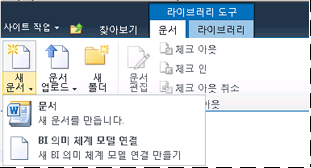

# 라이브러리에 BI 의미 체계 모델 연결 콘텐츠 형식 추가
[!INCLUDE[ssas-appliesto-sqlas](../../includes/ssas-appliesto-sqlas.md)]
  BI 의미 체계 모델 연결은 SharePoint에서 만들어지며 네트워크 서버의 [!INCLUDE[ssGemini](../../includes/ssgemini-md.md)] 통합 문서 또는 Analysis Services 테이블 형식 모델 데이터베이스에 있는 비즈니스 인텔리전스 의미 체계 모델 데이터에 대한 리디렉션을 제공합니다. SharePoint에서 BI 의미 체계 모델 연결을 만들려면 .bism 파일을 만들 수 있도록 문서 라이브러리를 확장해야 합니다. 이 단계는 각 라이브러리에 대해 한 번만 수행해야 하지만 .bism 파일을 만들려는 모든 라이브러리에 대해 반복해서 수행해야 합니다. 한 곳에서 사용 권한을 관리할 수 있도록 .bism 파일을 저장하기 위한 중앙 집중식 라이브러리를 만드는 것이 좋습니다.  
  
> [!NOTE]  
>  이미 SharePoint 데이터 연결 라이브러리를 사용하는 경우 BI 의미 체계 모델 연결 콘텐츠 형식이 해당 라이브러리 템플릿에 자동으로 추가됩니다. 이미 새 BI 의미 체계 모델 연결 문서를 만들 수 있게 하는 데이터 연결 라이브러리를 사용하는 경우에는 이 섹션의 단계를 건너뛸 수 있습니다.  
  
##   문서 라이브러리에 콘텐츠 형식 추가  
 콘텐츠 형식을 추가하고 구성하려면 최소한 목록 관리 권한이 있어야 합니다. 이 권한은 디자인 권한 수준 이상에 포함되어 있습니다.  
  
 문서 라이브러리가 포함된 사이트에서는 SharePoint용 [!INCLUDE[ssGemini](../../includes/ssgemini-md.md)] 에 대한 기능이 활성화되어 있어야 합니다. 자세한 내용은 [중앙 관리에서 사이트 모음에 대해 파워 피벗 기능 통합 활성화](../../analysis-services/power-pivot-sharepoint/activate-power-pivot-integration-for-site-collections-in-ca.md)을(를) 참조하세요.  
  
1.  BI 의미 체계 모델 연결 콘텐츠 형식을 사용하도록 설정할 문서 라이브러리를 엽니다.  
  
2.  SharePoint 리본의 라이브러리 도구에서 **라이브러리**를 클릭합니다.  
  
3.  **라이브러리 설정**을 클릭합니다.  
  
4.  일반 설정에서 **고급 설정**을 클릭합니다.  
  
5.  콘텐츠 형식의 "콘텐츠 형식 관리를 허용하시겠습니까?" 섹션에서 **예**를 클릭합니다.  
  
6.  **확인**을 클릭합니다.  
  
7.  콘텐츠 형식 섹션에서 **기존 사이트 콘텐츠 형식에서 추가**를 클릭합니다. 이 페이지가 표시되지 않는 경우 사이트로 돌아가서 라이브러리 도구에서 **라이브러리** 를 클릭한 다음 **라이브러리 설정**을 클릭합니다.  
  
8.  콘텐츠 형식에서 **기존 사이트 콘텐츠 형식에서 추가**를 클릭합니다.  
  
9. 사이트 콘텐츠 형식 선택에서 **비즈니스 인텔리전스**를 선택합니다.  
  
10. 사용 가능한 사이트 콘텐츠 형식에서 **BI 의미 체계 모델 연결 파일**을 클릭한 다음 **추가** 를 클릭하여 목록을 추가할 콘텐츠 형식으로 선택한 콘텐츠 형식을 이동합니다.  
  
11. **확인**을 클릭합니다.  
  
12. 콘텐츠 형식을 추가했는지 확인하려면 라이브러리로 돌아가서 라이브러리 리본 메뉴의 문서 영역에서 **새 문서** 를 클릭합니다. 새 문서 목록에 **BI 의미 체계 모델 연결 파일** 이 표시되어야 합니다.  
  
       
  
 라이브러리에 대한 BI 의미 체계 모델 연결 콘텐츠 형식을 사용하도록 설정한 후 Excel 또는 [!INCLUDE[ssCrescent](../../includes/sscrescent-md.md)] 보고서에 사용할 수 있는 비즈니스 의미 체계 모델 데이터에 대한 리디렉션을 제공하는 연결을 만들 수 있습니다. 이 다음 단계에 대해 자세히 알아보려면 다음 링크를 선택하십시오.  
  
 [Power Pivot 통합 문서에 대한 BI 의미 체계 모델 연결 만들기](../../analysis-services/power-pivot-sharepoint/create-a-bi-semantic-model-connection-to-a-power-pivot-workbook.md)  
  
 [테이블 형식 모델 데이터베이스에 대한 BI 의미 체계 모델 연결 만들기](../../analysis-services/power-pivot-sharepoint/create-a-bi-semantic-model-connection-to-a-tabular-model-database.md)  
  
## 관련 항목:  
 [파워 피벗 BI 의미 체계 모델 연결&#40;.bism&#41;](../../analysis-services/power-pivot-sharepoint/power-pivot-bi-semantic-model-connection-bism.md)   
 [Excel 또는 Reporting Services에서 BI 의미 체계 모델 연결을 사용 하 여](../../analysis-services/power-pivot-sharepoint/use-a-bi-semantic-model-connection-in-excel-or-reporting-services.md)  
  
  
