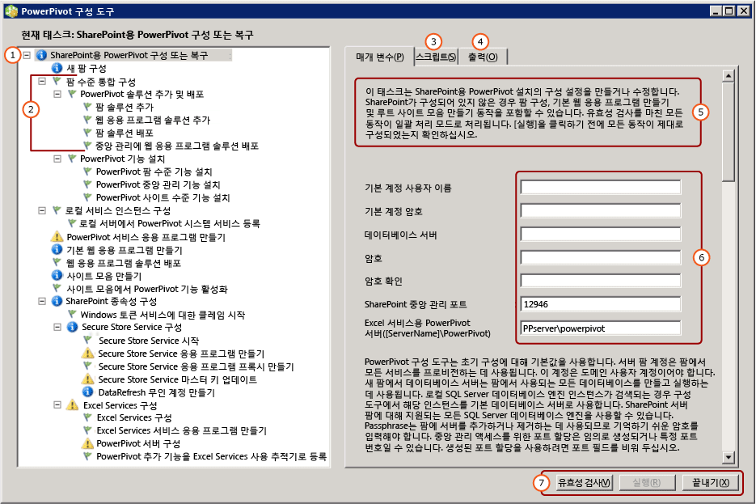

# <a name="configure-or-repair-power-pivot-for-sharepoint-2013"></a>구성 또는 SharePoint 2013 용 Powerpivot을 복구
[!INCLUDE[ssas-appliesto-sqlas](../../includes/ssas-appliesto-sqlas.md)]
  SharePoint 2013용 [!INCLUDE[ssCurrent](../../includes/sscurrent-md.md)][!INCLUDE[ssGemini](../../includes/ssgemini-md.md)] 의 설치를 구성하거나 복구하려면 SharePoint용 [!INCLUDE[ssGemini](../../includes/ssgemini-md.md)] 구성 도구를 사용합니다. 구성 도구는 시스템 검색으로 시작한 다음 설치를 완료하거나 복구하는 데 필요한 동작 목록을 반환합니다. [!INCLUDE[ssCurrent](../../includes/sscurrent-md.md)] 설치 마법사는 SharePoint 2013용 [!INCLUDE[ssGemini](../../includes/ssgemini-md.md)] 구성 도구뿐만 아니라 SharePoint 2010용 [!INCLUDE[ssGemini](../../includes/ssgemini-md.md)] 구성 도구를 설치합니다. 이 항목에서는 SharePoint 2013용 [!INCLUDE[ssGemini](../../includes/ssgemini-md.md)] 구성 도구에 대해 설명합니다. SharePoint 2010에 대한 자세한 내용은 [SharePoint 2010용 파워 피벗 구성 또는 복구(파워 피벗 구성 도구)](http://msdn.microsoft.com/d61f49c5-efaa-4455-98f2-8c293fa50046)를 참조하세요.  
  
 **[!INCLUDE[applies](../../includes/applies-md.md)]**  SharePoint 2013  
  
 **항목 내용**  
  
 [시작하기 전 주의 사항](#bkmk_before)  
  
 [SharePoint 2013용 파워 피벗 구성 도구를 사용하려면](#bkmk_using)  
  
 [구성 단계](#bkmk_steps)  
  
 [서버를 구성하는 데 사용된 입력 값](#bkmk_input)  
  
 [다음 단계](#bkmk_nextsteps)  
  
##  <a name="bkmk_before"></a> 시작하기 전 주의 사항  
 SharePoint 2013용 [!INCLUDE[ssGemini](../../includes/ssgemini-md.md)] 구성 도구는 프로그램 파일, 레지스트리 설정 및 사용 가능한 포트를 검색합니다. 이 도구를 최대한 이용하려면 다음 정보를 검토하십시오.  
  
-   구성 도구, [Power Pivot Configuration Tools](../../analysis-services/power-pivot-sharepoint/power-pivot-configuration-tools.md)실행을 위한 일반 요구 사항.  
  
-   [!INCLUDE[ssGemini](../../includes/ssgemini-md.md)] 은 클레임 기반 인증에 대해 구성된 웹 응용 프로그램을 선호합니다. SharePoint 2013용 [!INCLUDE[ssGemini](../../includes/ssgemini-md.md)] 구성 도구에서 애플리케이션을 만드는 경우 클레임 기반의 Windows 인증을 사용하도록 애플리케이션이 구성됩니다. 인증 요구 사항에 대한 자세한 내용은 [Power Pivot Authentication and Authorization](../../analysis-services/power-pivot-sharepoint/power-pivot-authentication-and-authorization.md)를 참조하십시오.  
  
-   SharePoint 2013용[!INCLUDE[ssGemini](../../includes/ssgemini-md.md)] 구성 도구에서 웹 애플리케이션을 만드는 데 포트 80을 사용할 수 있어야 합니다.  
  
##  <a name="bkmk_using"></a> SharePoint 2013용 파워 피벗 구성 도구를 사용하려면  
 도구의 첫 페이지에서는 SharePoint 팜을 구성하는 데 사용할 입력 값의 요약을 제공합니다. 사용자가 제공하는 입력 값 외에도 기본값이 시스템을 구성하는 데 사용됩니다. 기본 이름이 서비스 애플리케이션, 서비스 애플리케이션 데이터베이스 및 서비스 애플리케이션 속성에 사용됩니다.  
  
> [!TIP]  
>  구성 도구가 컴퓨터를 검색한 후 왼쪽 창에 빈 작업 목록을 반환하면 구성할 기능이나 설정이 검색되지 않은 것입니다. SharePoint 또는 [!INCLUDE[ssGemini](../../includes/ssgemini-md.md)] 구성을 수정하려면 SharePoint 중앙 관리에서 Windows PowerShell 또는 관리 페이지를 사용합니다. 자세한 내용은 [중앙 관리에서 파워 피벗 서버 관리 및 구성](../../analysis-services/power-pivot-sharepoint/power-pivot-server-administration-and-configuration-in-central-administration.md)을 참조하세요.  
  
 서비스 계정의 값은 여러 서비스에 사용됩니다. 예를 들어 구성 도구는 첫 페이지의 기본 계정을 사용하여 모든 애플리케이션 풀 ID를 설정합니다. 나중에 중앙 관리에서 서비스 애플리케이션 속성을 수정하여 이 계정을 변경할 수 있습니다.  
  
 이 도구는 매개 변수 입력, Windows PowerShell 스크립트 및 상태 메시지가 포함된 탭 인터페이스를 제공합니다.  
  
 이 도구는 Windows PowerShell을 사용하여 서버를 구성합니다. **스크립트** 탭을 클릭하여 도구가 서버를 구성하는 데 사용하는 Windows PowerShell 스크립트를 검토할 수 있습니다.  
  
   
  
||Description|  
|-|-----------------|  
|**(1)**|작업 목록 창|  
|**(2)**|개별 동작|  
|**(3)**|구성 도구로 만든 Windows PowerShell 스크립트|  
|**(4)**|유효성 검사를 시작하거나 동작을 실행할 때 생성된 로그 메시지|  
|**(5)**|페이지에 대한 설명|  
|**(6)**|입력 매개 변수|  
|**(7)**|**실행** 단추는 작업의 유효성을 검사 한 후 사용할 수 있습니다.|  
  
##  <a name="bkmk_steps"></a> 구성 단계  
 구성 도구 링크는 SharePoint 2013용 [!INCLUDE[ssGemini](../../includes/ssgemini-md.md)] 이 로컬 서버에 설치된 경우에만 표시됩니다.  
  
1.  **시작** 메뉴에서 **모든 프로그램**을 가리키고 [!INCLUDE[ssCurrentUI](../../includes/sscurrentui-md.md)], **구성 도구**및 **[!INCLUDE[ssGemini](../../includes/ssgemini-md.md)] 구성**을 차례로 클릭합니다.  
  
2.  **SharePoint용 [!INCLUDE[ssGemini](../../includes/ssgemini-md.md)] 구성 또는 복구**를 클릭합니다.  
  
3.  창을 전체 크기로 확장합니다. 창 아래쪽에 **유효성 검사**, **실행**및 **끝내기** 명령이 포함된 단추 모음이 표시됩니다.  
  
4.  **기본 계정:** 매개 변수 탭에 대 한 도메인 사용자 계정을 입력 합니다 **기본 계정 사용자 이름**합니다. 이 계정은 [!INCLUDE[ssGemini](../../includes/ssgemini-md.md)] 서비스 애플리케이션 풀을 포함한 필수 서비스를 프로비전하는 데 사용됩니다. 네트워크 서비스, 로컬 시스템 등의 기본 제공 계정을 지정하지 마세요. 이 도구는 기본 제공 계정을 지정하는 구성을 차단합니다.  
  
     **암호:** 암호를 입력합니다. 새 SharePoint 팜인 경우 새 서버 또는 애플리케이션을 SharePoint 팜에 추가할 때마다 암호가 사용됩니다. 팜이 있는 경우 서버 애플리케이션을 팜에 추가할 수 있는 암호를 입력합니다.  
  
5.  **포트:** 필요에 따라 중앙 관리 웹 응용 프로그램에 연결하는 데 사용되는 포트 번호를 입력하거나 임의로 생성되는 제공된 번호를 사용합니다. 구성 도구는 번호를 옵션으로 제공하기 전에 해당 번호가 사용 가능한지를 확인합니다.  
  
6.  주 페이지에서 SharePoint 모드로 실행 중인 [!INCLUDE[ssCurrent](../../includes/sscurrent-md.md)][!INCLUDE[ssGemini](../../includes/ssgemini-md.md)] 서버의 이름을 입력합니다.  
  
7.  필요에 따라 각 동작을 완료하는 데 사용되는 나머지 입력 값을 검토합니다. 각각에 대한 자세한 내용은 이 항목의 [서버를 구성하는 데 사용된 입력 값](#bkmk_input) 을(를) 참조하세요.  
  
8.  필요에 따라 처리하지 않으려는 동작을 제거합니다. 예를 들어, Secure Store Service를 나중에 구성하려는 경우 **Secure Store Service 구성**을 클릭한 다음 **태스크 목록에 이 동작 포함**확인란의 선택을 취소합니다.  
  
9. **유효성 검사** 를 클릭하여 목록에서 동작을 처리할 수 있는 충분한 정보가 도구에 있는지 여부를 확인합니다.  
  
10. **실행** 을 클릭하여 태스크 목록에 있는 모든 동작을 처리합니다. 동작의 유효성을 검사한 후에 **실행** 버튼을 사용할 수 있습니다. **실행** 이 활성화되지 않으면 먼저 **유효성 검사** 를 클릭합니다.  
  
     다음과 유사한 오류 메시지가 나타나는 경우 SQL Server 데이터베이스 인스턴스가 시작되었는지 확인합니다.  
  
    ```  
    Cannot connect to the database server instance  
    ```  
  
11. [Verify a Power Pivot for SharePoint Installation](../../analysis-services/instances/install-windows/verify-a-power-pivot-for-sharepoint-installation.md)입니다.  
  
##  <a name="bkmk_input"></a> 서버를 구성하는 데 사용된 입력 값  
 [!INCLUDE[ssGemini](../../includes/ssgemini-md.md)] 구성 도구는 사용자가 입력하는 입력 값과 도구에서 검색하거나 자동으로 사용하는 기본값의 조합을 사용합니다.  
  
 구성 도구에서 표시하는 작업 목록은 SharePoint 팜의 현재 구성에 따라 달라집니다. 예를 들어, SharePoint 팜을 이미 구성한 경우 팜을 구성하거나 웹 애플리케이션을 만드는 동작이 표시되지 않습니다. 언제든지 이 도구를 사용하여 구성 오류를 구성, 복구 또는 검색할 수 있습니다. Excel 서비스 또는 Secure Store Service와 같은 필수 서비스가 팜에서 실행되지 않는 경우 이 도구는 누락된 서비스를 검색하여 활성화할 수 있는 옵션을 제공합니다. 동작이 필요 없는 경우 태스크 목록은 비어 있습니다.  
  
 다음 표에서는 서버를 구성하는 데 사용되는 값에 대해 설명합니다.  
  
|호출|입력 값|원본|Description|  
|----------|-----------------|------------|-----------------|  
|**SharePoint용 [!INCLUDE[ssGemini](../../includes/ssgemini-md.md)] 구성 또는 복구**|기본 계정|현재 사용자|기본 계정은 팜에서 공유 서비스를 프로비전하는 데 사용되는 도메인 Windows 사용자 계정입니다. 다음을 프로비전하는 데 사용됩니다.|  
||||-<br />                    [!INCLUDE[ssGemini](../../includes/ssgemini-md.md)] 서비스 응용 프로그램|  
||||- 보안 저장소 서비스|  
||||- Excel Services|  
||||- 웹 애플리케이션 풀 ID|  
||||- 사이트 모음 관리자|  
||||- [!INCLUDE[ssGemini](../../includes/ssgemini-md.md)] 무인 데이터 새로 고침 계정.|  
||||기본적으로 현재 사용자의 도메인 계정이 사용됩니다.<br /><br /> 참고: 평가 및 비프로덕션용으로 서버를 구성하는 경우 이외에는 기본값을 바꾸는 것이 좋습니다.<br /><br /> 중앙 관리를 사용하여 구성 또는 복구 후에 서비스 ID를 변경할 수 있습니다.<br /><br /> 필요에 따라 [!INCLUDE[ssGemini](../../includes/ssgemini-md.md)] 구성 도구에서 다음에 대한 전용 계정을 지정합니다.|  
||||- 웹 애플리케이션( **기본 웹 애플리케이션 만들기** 페이지 사용). 도구가 팜에 대한 웹 애플리케이션을 만든다고 가정합니다.|  
||||-<br />                    [!INCLUDE[ssGemini](../../includes/ssgemini-md.md)] 무인 데이터 새로 고침 계정(이 도구의 **데이터 새로 고침 무인 계정 만들기** 페이지 사용)|  
||데이터베이스 서버|사용 가능한 경우 로컬 [!INCLUDE[ssGemini](../../includes/ssgemini-md.md)] 명명된 인스턴스|데이터베이스 엔진 인스턴스가 [!INCLUDE[ssGemini](../../includes/ssgemini-md.md)] 명명된 인스턴스로 설치되는 경우 이 도구는 데이터베이스 서버 필드를 이 인스턴스 이름으로 채웁니다. 데이터베이스 엔진을 설치하지 않은 경우 이 필드는 비어 있습니다.<br /><br /> **데이터베이스 서버**  는 필수 매개 변수입니다. 인스턴스는 SharePoint 팜에 대해 지원되는 모든 버전 또는 에디션의 SQL Server일 수 있습니다.|  
||암호|사용자 입력|새 팜을 만드는 경우 사용자가 입력하는 암호는 팜의 암호가 됩니다. 기존 팜에 SharePoint용 [!INCLUDE[ssGemini](../../includes/ssgemini-md.md)] 을 추가하는 경우 기존 팜 암호를 입력합니다.|  
||SharePoint 중앙 관리 포트|필요한 경우 기본값|팜이 구성되지 않은 경우 이 도구는 중앙 관리에 대한 HTTP 엔드포인트 만들기를 포함하여 팜을 만들 수 있는 옵션을 제공합니다. 이 도구는 사용 중이 아닌 임의로 생성된 포트 번호를 선택합니다.|  
||[!INCLUDE[ssGemini](../../includes/ssgemini-md.md)] Excel Services([ServerName]\ [!INCLUDE[ssGemini](../../includes/ssgemini-md.md)])|사용자 입력|Excel Services에서 핵심 [!INCLUDE[ssGemini](../../includes/ssgemini-md.md)] 기능을 사용하려면 [!INCLUDE[ssGemini](../../includes/ssgemini-md.md)] 서버가 필요합니다. 이 페이지에 입력하는 서버 이름은 **[!INCLUDE[ssGemini](../../includes/ssgemini-md.md)] 서버 구성** 페이지의 목록에도 추가됩니다.|  
|**새 팜 구성**|데이터베이스 서버<br /><br /> 팜 계정<br /><br /> 암호<br /><br /> SharePoint 중앙 관리 포트|필요한 경우 기본값|메인 페이지에 입력한 내용을 기본 설정으로 사용합니다.|  
|**[!INCLUDE[ssGemini](../../includes/ssgemini-md.md)] 서비스 응용 프로그램 만들기**|서비스 애플리케이션 이름|Default|[!INCLUDE[ssGemini](../../includes/ssgemini-md.md)] 서비스 응용 프로그램 이름입니다. 기본 이름은 **기본값 [!INCLUDE[ssGemini](../../includes/ssgemini-md.md)] Service Application**를 참조하세요. 도구에서 다른 값을 바꿀 수 있습니다.|  
||데이터베이스 서버|Default|[!INCLUDE[ssGemini](../../includes/ssgemini-md.md)] 서비스 응용 프로그램 데이터베이스를 호스팅할 데이터베이스 서버입니다. 기본 서버 이름은 팜에 사용되는 데이터베이스 서버와 같습니다. 기본 서버 이름이 아닌 다른 값으로 바꿀 수 있습니다.|  
||데이터베이스 이름|Default|[!INCLUDE[ssGemini](../../includes/ssgemini-md.md)] 서비스 응용 프로그램 데이터베이스에 대해 만들려는 데이터베이스의 이름입니다. 기본 데이터베이스 이름은 서비스 애플리케이션 이름을 기반으로 하며 고유의 이름을 GUID가 뒤에 나옵니다. 도구에서 다른 값을 바꿀 수 있습니다.|  
|**기본 웹 응용 프로그램 만들기**|웹 애플리케이션 이름|필요한 경우 기본값|웹 애플리케이션이 없는 경우 도구에서 만들어집니다. 웹 애플리케이션이 클래식 모드 인증에 대해 구성되고 포트 80에서 수신합니다. 최대 파일 업로드 크기는 SharePoint에서 허용되는 최대값인 2047로 설정됩니다. 더 큰 파일 업로드 크기는 서버에 업로드되는 큰 [!INCLUDE[ssGemini](../../includes/ssgemini-md.md)] 파일을 수용하기 위한 것입니다.|  
||URL|필요한 경우 기본값|도구는 SharePoint와 동일한 파일 명명 규칙을 사용하여 서버 이름을 기반으로 URL을 만듭니다.|  
||애플리케이션 풀|필요한 경우 기본값|이 도구는 IIS에서 기본 애플리케이션 풀을 만듭니다.|  
||애플리케이션 풀 계정 및 암호|필요한 경우 기본값|애플리케이션 풀 계정은 기본 계정을 기반으로 하지만 도구에서 계정을 재정의할 수 있습니다.|  
||데이터베이스 서버|필요한 경우 기본값|기본 데이터베이스 인스턴스는 애플리케이션 콘텐츠 데이터베이스를 저장하기 위해 미리 선택되지만 도구에서 다른 SQL Server 인스턴스를 지정할 수 있습니다.|  
||데이터베이스 이름|필요한 경우 기본값|애플리케이션 데이터베이스의 이름입니다. 데이터베이스 이름은 SharePoint의 파일 명명 규칙을 기반으로 하지만 다른 이름을 선택할 수 있습니다.|  
|**웹 응용 프로그램 솔루션 배포**|URL|필요한 경우 기본값|기본 URL은 기본 웹 애플리케이션에서 가져옵니다.|  
||최대 파일 크기(MB)|필요한 경우 기본값|기본 설정은 2047입니다. SharePoint 문서 라이브러리에도 최대 크기가 있으며 [!INCLUDE[ssGemini](../../includes/ssgemini-md.md)] 설정은 문서 라이브러리 설정을 초과할 수 없습니다. 자세한 내용은 [최대 파일 업로드 크기 구성&#40;SharePoint용 파워 피벗&#41;](../../analysis-services/power-pivot-sharepoint/configure-maximum-file-upload-size-power-pivot-for-sharepoint.md)을 참조하세요.|  
|**사이트 모음 만들기**|사이트 관리자|필요한 경우 기본값|도구는 기본 계정을 사용합니다. **사이트 모음 만들기** 페이지에서 계정을 재정의할 수 있습니다.|  
||담당자 전자 메일|필요한 경우 기본값|서버에 Microsoft Outlook이 구성된 경우 도구는 현재 사용자의 전자 메일 주소를 사용합니다. 그렇지 않으면 자리 표시자 값이 사용됩니다.|  
||사이트 URL|필요한 경우 기본값|이 도구는 SharePoint와 동일한 URL 명명 규칙을 사용하여 사이트 URL을 만듭니다.|  
||SiteTitle|필요한 경우 기본값|이 도구는 **[!INCLUDE[ssGemini](../../includes/ssgemini-md.md)] 사이트** 를 기본 제목으로 추가합니다.|  
|**사이트 모음에서 [!INCLUDE[ssGemini](../../includes/ssgemini-md.md)] 기능 활성화**|사이트 URL||[!INCLUDE[ssGemini](../../includes/ssgemini-md.md)] 기능을 활성화할 사이트 모음의 URL입니다.|  
||이 사이트에 대한 고급 기능을 사용합니다.||SharePoint 사이트 기능 "premiumsite"을 사용을 사용 하도록 설정 합니다.|  
|**Secure Store Service 응용 프로그램 만들기**|서비스 애플리케이션 이름|필요한 경우 기본값|Secure Store Service 애플리케이션의 이름을 입력합니다.|  
||데이터베이스 서버|사용자 입력|Secure Store Service 애플리케이션에 사용할 데이터베이스 서버의 이름을 입력합니다.|  
|**Secure Store Service 응용 프로그램 프록시 만들기**|서비스 애플리케이션 이름|필요한 경우 기본값|이전 페이지에서 입력한 Secure Store Service 애플리케이션의 이름을 입력합니다.|  
||서비스 애플리케이션 프록시|필요한 경우 기본값|Secure Store Service 애플리케이션 프록시의 이름을 입력합니다. 이름은 애플리케이션을 SharePoint 콘텐츠 웹 애플리케이션에 연결하는 기본 연결 그룹에 표시됩니다.|  
|**Secure Store Service 마스터 키 업데이트**|서비스 애플리케이션 프록시|필요한 경우 기본값|이전 페이지에서 입력한 Secure Store Service 애플리케이션 프록시의 이름을 입력합니다.|  
||암호|사용자 입력|데이터 암호화에 사용되는 마스터 키입니다. 기본적으로 키 생성에 사용되는 암호는 팜에서 새 서버를 프로비전하는 데 사용되는 암호와 같습니다. 기본 암호를 고유한 암호로 바꿀 수 있습니다.|  
|**DataRefresh 무인 계정 만들기**|대상 애플리케이션 ID|필요한 경우 기본값|무인 [!INCLUDE[ssGemini](../../includes/ssgemini-md.md)] 데이터 새로 고침용 자격 증명을 저장할 대상 애플리케이션을 만듭니다.<br /><br /> 애플리케이션 ID는 설명 텍스트일 수 있습니다.|  
||대상 애플리케이션의 이름|필요한 경우 기본값||  
||무인 계정 사용자 이름 및 암호|필요한 경우 기본값|대상 애플리케이션에서 무인 데이터 새로 고침을 실행하는 데 사용하는 Windows 사용자 계정의 자격 증명을 입력합니다. 자세한 내용은 [SharePoint Server 2013에서 무인된 서비스 계정을 사용 하 여 Excel Services 구성 데이터 새로 고침](http://technet.microsoft.com/library/hh525344\(office.15\).aspx) (http://technet.microsoft.com/library/hh525344(office.15).aspx)합니다.|  
||사이트 URL|필요한 경우 기본값|대상 애플리케이션과 연결된 사이트 모음의 사이트 URL을 입력합니다. 사이트 모음을 추가로 연결하려면 SharePoint 중앙 관리를 사용합니다.|  
|**Excel Services 서비스 응용 프로그램 만들기**|서비스 애플리케이션 이름|필요한 경우 기본값|서비스 애플리케이션 이름을 입력합니다. 동일한 이름의 서비스 응용 프로그램 데이터베이스를 SharePoint 팜의 데이터베이스 서버에 만들어집니다.|  
|**[!INCLUDE[ssGemini](../../includes/ssgemini-md.md)] 서버 구성**|서비스 애플리케이션 이름|필요한 경우 기본값|이전 페이지에서 입력한 서비스 애플리케이션 이름입니다.|  
||[!INCLUDE[ssGemini](../../includes/ssgemini-md.md)] 서버 이름||등록된 [!INCLUDE[ssGemini](../../includes/ssgemini-md.md)] 서버의 목록입니다.<br /><br /> 주 페이지에서 입력한 서버 이름이 이 페이지에 자동으로 추가됩니다.|  
|**[!INCLUDE[ssGemini](../../includes/ssgemini-md.md)] 추가 기능을 Excel Services 사용 추적기로 등록**|서비스 애플리케이션 이름||이전 페이지에서 입력한 서비스 애플리케이션 이름입니다.|  
|||||  
  
 SharePoint 2013용 [!INCLUDE[ssGemini](../../includes/ssgemini-md.md)] 구성 도구에서 팜을 만드는 경우 이 도구는 SharePoint와 동일한 파일 명명 규칙을 사용하여 데이터베이스 서버에 필요한 데이터베이스를 만듭니다. 팜 데이터베이스 이름을 변경할 수 없습니다.  
  
 도구에서 사이트 모음을 만드는 경우 이 도구는 SharePoint와 동일한 파일 명명 규칙을 사용하여 데이터베이스 서버에 콘텐츠 데이터베이스를 만듭니다. 콘텐츠 데이터베이스 이름을 변경할 수 없습니다.  
  
## <a name="verify-the-configuration"></a>구성 확인  
 참조는 "확인 하십시오 [!INCLUDE[ssGemini](../../includes/ssgemini-md.md)] 구성" 섹션 [파워 피벗 구성 및 솔루션 배포 &#40;SharePoint 2013&#41;](../../analysis-services/instances/install-windows/configure-power-pivot-and-deploy-solutions-sharepoint-2013.md)합니다.  
  
##  <a name="bkmk_nextsteps"></a> 다음 단계  
 서버 설치를 마친 후 다음과 같은 몇 가지 설치 후 태스크를 수행해야 합니다.  
  
-   개인 및 그룹에 SharePoint 사용 권한을 부여합니다. 사이트 및 콘텐츠에 액세스하려면 이 태스크를 수행해야 합니다.  
  
-   다른 계정에서 실행하려면 서비스 애플리케이션 풀 ID를 변경합니다. 안전한 배포를 위해 서비스와 애플리케이션에 대해 다른 ID를 지정하는 것이 좋습니다.  
  
-   Excel Services에 신뢰할 수 있는 사이트를 추가로 만들어 [!INCLUDE[ssGemini](../../includes/ssgemini-md.md)] 데이터 액세스에 가장 적합한 권한 및 구성 설정을 다양하게 구성할 수 있습니다.  
  
-   일반적으로 사용되는 데이터 공급자를 설치하여 서버 쪽 데이터 새로 고침을 활성화합니다.  
  
### <a name="grant-sharepoint-permissions-to-workbook-users"></a>통합 문서 사용자에게 SharePoint 사용 권한 부여  
 통합 문서를 게시하거나 보려는 사용자에게는 SharePoint 사용 권한이 필요합니다. 게시된 통합 문서를 보려는 사용자에게는 **보기** 권한을 부여하고, 통합 문서를 게시 또는 관리하는 사용자에게는 **참가** 권한을 부여합니다. 사용 권한을 부여하려면 사이트 컬렉션 관리자여야 합니다.  
  
1.  SharePoint 2013 사이트에서 설정 아이콘을 클릭  을 클릭 한 다음 **사이트 설정**합니다.  
  
2.  **사용자 및 사용 권한** 그룹에서 **사이트 사용 권한** 을 클릭합니다.  
  
3.  **참가** 권한 사용자 그룹 및 **보기** 권한만 있는 다른 사용자 그룹 등 필요에 따라 그룹을 만듭니다.  
  
4.  그룹에서 멤버 자격이 있어야 하는 Windows 도메인 사용자 또는 그룹 계정을 입력합니다. 앞서 수행한 단계와 마찬가지로 애플리케이션이 기본 인증용으로 구성된 경우에는 전자 메일 주소 또는 메일 그룹을 사용하지 마십시오.  
  
### <a name="install-data-providers-used-in-data-refresh-and-check-user-permissions"></a>데이터 새로 고침 및 사용자 권한 확인에 사용된 데이터 공급자 설치  
 서버 쪽 데이터 새로 고침을 사용하면 사용자가 무인 모드에서 자신의 통합 문서로 업데이트된 데이터를 다시 가져올 수 있습니다. 데이터 새로 고침이 성공하려면 SharePoint 모드로 Analysis Services를 실행 중인 서버에 원래 데이터를 가져오는 데 사용된 것과 동일한 데이터 공급자가 있어야 합니다. 또한 데이터 새로 고침이 실행되는 사용자 계정에도 외부 데이터 원본에 대한 읽기 권한이 필요한 경우가 많습니다. 성공적인 결과를 얻기 위해서는 데이터 새로 고침 설정 및 구성에 대한 요구 사항을 확인해야 합니다. 자세한 내용은 [SharePoint 2010에서 파워 피벗 데이터 새로 고침](http://msdn.microsoft.com/01b54e6f-66e5-485c-acaa-3f9aa53119c9)을 참조하세요.  
  
> [!NOTE]
>  SharePoint 2013용 [!INCLUDE[ssCurrent](../../includes/sscurrent-md.md)][!INCLUDE[ssGemini](../../includes/ssgemini-md.md)] 의 경우 **spPowerPivot.msi** 설치 관리자와 SharePoint 2013용 [!INCLUDE[ssGemini](../../includes/ssgemini-md.md)] 구성 도구를 실행할 때 데이터 공급자가 설치됩니다. 자세한 내용은 [SharePoint용 파워 피벗 추가 기능 설치 또는 제거&#40;SharePoint 2013&#41;](../../analysis-services/instances/install-windows/install-or-uninstall-the-power-pivot-for-sharepoint-add-in-sharepoint-2013.md)를 참조하세요.  
  
### <a name="change-application-pool-and-service-identities-in-sharepoint"></a>SharePoint에서 애플리케이션 풀 및 서비스 ID 변경  
 [!INCLUDE[ssGemini](../../includes/ssgemini-md.md)] 구성 도구는 단일 계정에서 실행할 팜 기능, 응용 프로그램 및 서비스를 프로비전합니다. 따라서 설치가 간편해지지만 배포에서 SharePoint 팜의 보안 요구 사항이 충족되지는 않습니다. 보다 강력한 배포를 작성하려면 설치가 완료된 후 애플리케이션 풀과 서비스 ID가 각각 다른 계정에서 실행되도록 변경합니다. 자세한 내용은 [파워 피벗 서비스 계정 구성](../../analysis-services/power-pivot-sharepoint/configure-power-pivot-service-accounts.md)을 참조하세요.  
  
### <a name="create-additional-trusted-sites-in-excel-services"></a>Excel 서비스에서 신뢰할 수 있는 사이트 추가로 만들기  
 신뢰할 수 있는 사이트를 Excel Services에 추가하여 Excel 통합 문서 및 [!INCLUDE[ssGemini](../../includes/ssgemini-md.md)] 데이터를 제공하는 사이트에 대한 권한 및 구성 설정을 다양하게 구성할 수 있습니다. 자세한 내용은 [Create a trusted location for Power Pivot sites in Central Administration](../../analysis-services/power-pivot-sharepoint/create-a-trusted-location-for-power-pivot-sites-in-central-administration.md)을 참조하세요.  
  
### <a name="build-a-includessgeminiincludesssgemini-mdmd-workbook"></a>[!INCLUDE[ssGemini](../../includes/ssgemini-md.md)] 통합 문서 작성  
 팜에 서버 구성 요소를 설치한 후에는 포함된 [!INCLUDE[ssGemini](../../includes/ssgemini-md.md)] 데이터를 사용하는 첫 번째 Excel 2013 통합 문서를 만들어 SharePoint 라이브러리에 게시할 수 있습니다. 또는 샘플 [!INCLUDE[ssGemini](../../includes/ssgemini-md.md)] 통합 문서를 업로드하거나 게시하여 SharePoint에서 [!INCLUDE[ssGemini](../../includes/ssgemini-md.md)] 데이터 액세스를 확인할 수 있습니다. 자세한 내용은 다음 항목을 참조하세요.  
  
-   [Power Pivot 도움말](https://support.office.com/en-us/article/Power-Pivot-Help-241aac41-92e3-4e46-ae58-2f2cd7dbcf4f) (https://support.office.com/en-us/article/Power-Pivot-Help-241aac41-92e3-4e46-ae58-2f2cd7dbcf4f)합니다.  
  
-   [Excel 2013 추가 기능에서 파워 피벗을 시작할](http://office.microsoft.com/excel-help/start-powerpivot-in-excel-2013-add-in-HA102837097.aspx?CTT=5&origin=HA102837110) (http://office.microsoft.com/excel-help/start-powerpivot-in-excel-2013-add-in-HA102837097.aspx?CTT=5&origin=HA102837110)합니다.  
  
### <a name="add-additional-analysis-services-servers-in-sharepoint-mode"></a>SharePoint 모드의 Analysis Services 서버 추가  
 이후에 데이터 스토리지와 처리 능력이 추가로 필요하다고 판단되는 경우 팜에 SharePoint 모드의 Analysis Services를 실행하는 서버를 더 추가할 수 있습니다. SharePoint 2013용 [!INCLUDE[ssCurrent](../../includes/sscurrent-md.md)][!INCLUDE[ssGemini](../../includes/ssgemini-md.md)] 의 경우 SharePoint 모드에서 새 [!INCLUDE[ssASnoversion](../../includes/ssasnoversion-md.md)] 서버를 설치하고 Excel Services를 구성합니다. 자세한 내용은의 "그 이상 단일 서버 설치" 섹션을 참조 하세요. [파워 피벗 모드에서 Analysis Services 설치](../../analysis-services/instances/install-windows/install-analysis-services-in-power-pivot-mode.md)합니다.  
  
## <a name="additional-resources"></a>추가 리소스  
  [SQL Server 사용자 의견을 통해 사용자 의견 및 담당자 정보 제출](https://feedback.azure.com/forums/908035-sql-server)합니다.  
  
## <a name="see-also"></a>관련 항목  
 [SharePoint용 파워 피벗 추가 기능 설치 또는 제거&#40;SharePoint 2013&#41;](../../analysis-services/instances/install-windows/install-or-uninstall-the-power-pivot-for-sharepoint-add-in-sharepoint-2013.md)   
 [Power Pivot Configuration Tools](../../analysis-services/power-pivot-sharepoint/power-pivot-configuration-tools.md)   
 [중앙 관리에서 파워 피벗 서버 관리 및 구성](../../analysis-services/power-pivot-sharepoint/power-pivot-server-administration-and-configuration-in-central-administration.md)   
 [통합 문서 업그레이드 및 예약된 데이터 새로 고침&#40;SharePoint 2013&#41;](../../analysis-services/instances/install-windows/upgrade-workbooks-and-scheduled-data-refresh-sharepoint-2013.md)  
  
  
