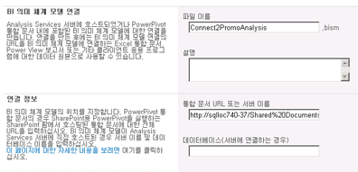

# 파워 피벗 통합 문서에 대한 BI 의미 체계 모델 연결 만들기
  이 항목의 정보를 참조하여 동일한 팜의 [!INCLUDE[ssGemini](../../includes/ssgemini-md.md)] 통합 문서로 리디렉션되는 BI 의미 체계 모델 연결을 설정할 수 있습니다.  
  
 BI 의미 체계 모델 연결을 만들고 SharePoint 사용 권한을 구성한 후에는 이 연결을 Excel 또는 [!INCLUDE[ssCrescent](../../includes/sscrescent-md.md)] 보고서에 데이터 원본으로 사용할 수 있습니다.  
  
 이 항목은 다음과 같은 섹션으로 구성됩니다. 지정된 순서로 각 태스크를 수행하십시오.  
  
 [필수 구성 요소 검토](#bkmk_prereq)  
  
 [연결 만들기](#bkmk_create)  
  
 [BI 의미 체계 모델 연결에 대한 SharePoint 사용 권한 구성](#bkmk_permissions)  
  
 [통합 문서에 대한 SharePoint 사용 권한 구성](#bkmk_userdb)  
  
 [다음 단계](#bkmk_next)  
  
##   필수 구성 요소 검토  
 BI 의미 체계 모델 연결 파일을 만들려면 참가 권한 이상이 있어야 합니다.  
  
 BI 의미 체계 모델 연결 콘텐츠 형식을 지원하는 라이브러리가 있어야 합니다. 자세한 내용은 [라이브러리에 BI 의미 체계 모델 연결 콘텐츠 형식 추가&#40;SharePoint용 파워 피벗&#41;](../../analysis-services/power-pivot-sharepoint/add-bi-semantic-model-connection-content-type-to-library.md)를 참조하세요.  
  
 URL을 알고 있어야는 [!INCLUDE[ssGemini](../../includes/ssgemini-md.md)] 통합 문서를 설정 하는 BI 의미 체계 모델 연결 (예를 들어 `http://adventure-works/shared documents/myworkbook.xlsx`). 통합 문서는 동일한 팜에 있어야 합니다.  
  
 연결 시퀀스에 참가하는 모든 컴퓨터 및 사용자는 동일한 도메인이나 트러스트된 도메인(양방향 신뢰)에 있어야 합니다.  
  
##   연결 만들기  
  
1.  BI 의미 체계 모델 연결이 포함될 라이브러리의 SharePoint 리본에서 **문서** 를 클릭합니다. 새 문서에서 아래쪽 화살표를 클릭하고 **BISM 연결 파일** 을 선택하여 새 BI 의미 체계 모델 연결 페이지를 엽니다.  
  
       
  
2.  설정의 **서버** 속성의 SharePoint URL을는 [!INCLUDE[ssGemini](../../includes/ssgemini-md.md)] 통합 문서 (예를 들어 `http://mysharepoint/shared documents/myWorkbook.xlsx`합니다. SharePoint용 [!INCLUDE[ssGemini](../../includes/ssgemini-md.md)] 배포에서는 팜의 모든 서버에 데이터를 로드할 수 있습니다. 그러므로 [!INCLUDE[ssGemini](../../includes/ssgemini-md.md)] 데이터에 대한 데이터 원본 연결은 통합 문서의 경로만 지정합니다. [!INCLUDE[ssGemini](../../includes/ssgemini-md.md)] 시스템 서비스가 데이터를 로드하는 서버를 결정합니다.  
  
     **데이터베이스** 속성은 사용하지 마세요. 이 속성은 [!INCLUDE[ssGemini](../../includes/ssgemini-md.md)] 통합 문서의 위치를 지정할 때 사용되지 않습니다.  
  
     페이지는 다음 그림과 비슷해야 합니다.  
  
       
  
     통합 문서에 대한 SharePoint 사용 권한이 있는 경우 추가 유효성 검사 단계도 수행하여 위치가 올바른지 확인합니다. 데이터에 액세스할 권한이 없는 경우 유효성 검사 응답 없이 BI 의미 체계 모델 연결을 저장할 수 있는 옵션이 제공됩니다.  
  
##   BI 의미 체계 모델 연결에 대한 SharePoint 사용 권한 구성  
 BI 의미 체계 모델 연결을 Excel 통합 문서 또는 Reporting Services 보고서의 데이터 원본으로 사용하려면 SharePoint 라이브러리의 BI 의미 체계 모델 연결 항목에 대해 **읽기** 권한이 있어야 합니다. 읽기 권한 수준에는 BI 의미 체계 모델 연결 정보를 Excel 데스크톱 응용 프로그램에 다운로드할 수 있는 **항목 열기** 권한이 포함되어 있습니다.  
  
 여러 가지 방법으로 SharePoint에서 사용 권한을 부여할 수 있습니다. 다음은 **읽기** 수준의 권한이 있는 **BISM Users** 라는 새 그룹을 만드는 방법을 설명하는 지침입니다.  
  
 사용 권한을 변경하려면 사이트 소유자여야 합니다.  
  
1.  사이트 작업에서 **사이트 사용 권한**을 클릭합니다.  
  
2.  **그룹 만들기** 를 클릭하고 새 그룹의 이름을 **BISM Users**로 지정합니다.  
  
3.  **읽기** 권한 수준을 선택한 다음 **만들기**를 클릭합니다.  
  
4.  사용자 및 그룹에서 **BISM Users** 를 선택합니다.  
  
5.  새로 만들기를 가리키고 **사용자 추가**를 클릭한 다음 사용자 또는 그룹 계정을 추가합니다.  
  
     이 사용자 및 그룹은 이제 사이트 수준에서 사용 권한을 상속하는 모든 라이브러리와 목록을 포함하여 사이트 전체에서 읽기 권한이 있습니다. 이 사용 권한이 너무 높은 경우 특정 라이브러리, 목록 또는 항목에서 이 그룹을 선택적으로 제거할 수 있습니다.  
  
 항목 수준에서 사용 권한을 선택적으로 제거하려면 다음을 수행합니다.  
  
1.  라이브러리에서 문서를 선택합니다. 오른쪽 아래 화살표를 클릭한 다음 **사용 권한 관리**를 클릭합니다.  
  
2.  기본적으로 항목은 사용 권한을 상속합니다. 이 라이브러리에서 개별 문서의 사용 권한을 변경하려면 **권한 상속 중지**를 클릭합니다.  
  
3.  **BISM Users**옆에 있는 확인란을 선택합니다.  
  
4.  **사용자의 사용 권한 제거**를 클릭합니다.  
  
##   통합 문서에 대한 SharePoint 사용 권한 구성  
 Excel 통합 문서 내에서 [!INCLUDE[ssGemini](../../includes/ssgemini-md.md)] 데이터베이스를 사용하는 경우 Excel 통합 문서에 대한 SharePoint 사용 권한에 따라 BI 의미 체계 모델 연결을 통한 데이터 액세스가 결정됩니다. 통합 문서를 외부 데이터 원본으로 사용하려면 통합 문서에 액세스하는 모든 사용자가 통합 문서에 대해 읽기 권한이 있어야 합니다.  
  
 통합 문서가 상속된 사용 권한을 사용한다고 가정하면 이전 섹션의 지침을 사용하여 **BISM Users** 그룹을 만든 경우 **BISM Users** 의 멤버인 사용자 및 그룹 계정에게는 통합 문서 및 BI 의미 체계 모델 연결 파일에 대해 충분한 사용 권한이 있습니다.  
  
##   다음 단계  
 BI 의미 체계 모델 연결을 만들고 확인한 후 데이터 원본으로 지정할 수 있습니다. 자세한 내용은 [Excel 또는 Reporting Services에서 BI 의미 체계 모델 연결 사용](../../analysis-services/power-pivot-sharepoint/use-a-bi-semantic-model-connection-in-excel-or-reporting-services.md)을 참조하세요.  
  
## 관련 항목:  
 [파워 피벗 BI 의미 체계 모델 연결&#40;.bism&#41;](../../analysis-services/power-pivot-sharepoint/power-pivot-bi-semantic-model-connection-bism.md)   
 [Excel 또는 Reporting Services에서 BI 의미 체계 모델 연결을 사용 하 여](../../analysis-services/power-pivot-sharepoint/use-a-bi-semantic-model-connection-in-excel-or-reporting-services.md)   
 [테이블 형식 model 데이터베이스에 대한 BI 의미 체계 모델 연결 만들기](../../analysis-services/power-pivot-sharepoint/create-a-bi-semantic-model-connection-to-a-tabular-model-database.md)  
  
  
