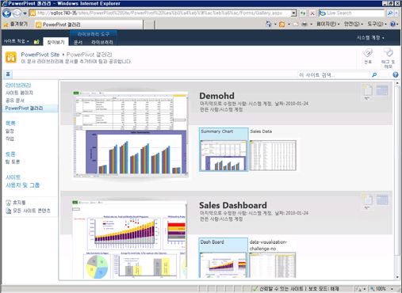

# Power Pivot 갤러리 만들기 및 사용자 지정
  [!INCLUDE[ssGemini](../../includes/ssgemini-md.md)] 갤러리는 [!INCLUDE[ssGemini](../../includes/ssgemini-md.md)] 데이터를 포함하는 게시된 Excel 통합 문서 및 Reporting Services 보고서에 대해 유용한 미리 보기와 문서 관리 기능을 제공합니다.  
  
##   항목 내용  
  
-   [필수 구성 요소](#prereq)  
  
-   [개요](#overview)  
  
-   [Power Pivot 갤러리 만들기](#createlib)  
  
-   [Power Pivot 갤러리 라이브러리 사용자 지정](#customize)  
  
-   [새로 고침 단추 사용 안 함 또는 숨기기](#bkmk_hide_refresh_button)  
  
-   [극장식 보기 또는 갤러리 보기로 전환](#switch)  
  
##   필수 구성 요소  
  
-   Silverlight가 있어야 합니다. Silverlight는 Microsoft Update를 통해 다운로드하여 설치할 수 있습니다. Silverlight가 없는 브라우저를 사용하여 [!INCLUDE[ssGemini](../../includes/ssgemini-md.md)] 갤러리 라이브러리를 보는 경우 페이지의 링크를 클릭하여 Silverlight를 설치합니다. 설치한 다음에는 브라우저를 닫은 후 다시 열어야 합니다.  
  
    > [!NOTE]  
    >  파워 피벗 갤러리에는 Microsoft Silverlight가 필요합니다.  Microsoft Edge 브라우저는 Silverlight를 지원하지 않습니다.   
    > Edge에서 라이브러리 콘텐츠를 보려면 파워 피벗 갤러리에서 **라이브러리** 탭을 클릭한 다음 문서 라이브러리 보기를 **모든 문서**로 변경합니다.    
    > 기본 보기를 변경하려면 **라이브러리** 탭을 클릭한 다음 보기 수정을 클릭합니다. "이 보기를 기본 보기로 만듭니다"를 클릭한 다음 확인을 클릭하여 기본 보기를 저장합니다.  
    >  Edge에서 지원하는 사항에 대한 자세한 내용은 Windows 블로그 [과거로부터의 완벽한 변화, 2부: ActiveX, VBScript의 종말...](http://blogs.windows.com/msedgedev/2015/05/06/a-break-from-the-past-part-2-saying-goodbye-to-activex-vbscript-attachevent/)(영문)을 참조하세요.  
  
-   라이브러리를 만들려면 사이트 소유자여야 합니다.  
  
-   파일을 게시하거나 업로드하려면 참가 사용 권한 이상이 있어야 합니다.  
  
-   [!INCLUDE[ssGemini](../../includes/ssgemini-md.md)] 갤러리는 제한된 사이트에 있을 수 없습니다. [!INCLUDE[ssGemini](../../includes/ssgemini-md.md)] 갤러리를 포함하는 상위 사이트는 신뢰할 수 있는 사이트나 로컬 인트라넷 영역에 추가되어야 합니다.  
  
-   [!INCLUDE[ssGemini](../../includes/ssgemini-md.md)] 웹 응용 프로그램 솔루션은 응용 프로그램에 사용할 수 있도록 배포되어 있어야 하고 사이트 모음에 대해 [!INCLUDE[ssGemini](../../includes/ssgemini-md.md)] 기능을 활성화해야 합니다. 자세한 내용은 [Deploy Power Pivot Solutions to SharePoint](../../analysis-services/power-pivot-sharepoint/deploy-power-pivot-solutions-to-sharepoint.md) 및[Activate Power Pivot Feature Integration for Site Collections in Central Administration](../../analysis-services/power-pivot-sharepoint/activate power pivot integration for site collections in ca.md)를 참조하세요.  
  
-   [!INCLUDE[ssGemini](../../includes/ssgemini-md.md)] 통합 문서를 기반으로 하는 Reporting Services 보고서를 만들거나 보려면 통합 문서와 보고서가 모두 같은 [!INCLUDE[ssGemini](../../includes/ssgemini-md.md)] 갤러리에 있어야 합니다. 이 보고서는 포함된 데이터가 들어 있는 [!INCLUDE[ssGemini](../../includes/ssgemini-md.md)] 통합 문서를 사용해야 합니다. 또는 통합 문서에 최대 하나의 외부 데이터 원본( [!INCLUDE[ssGemini](../../includes/ssgemini-md.md)] 통합 문서)이 들어 있어야 합니다.  
  
##   개요  
 [!INCLUDE[ssGemini](../../includes/ssgemini-md.md)] 갤러리는 SharePoint  서버에 [!INCLUDE[ssGeminiLong](../../includes/ssgeminilong-md.md)] 를 설치한 경우 제공되는 라이브러리 템플릿입니다. [!INCLUDE[ssGemini](../../includes/ssgemini-md.md)] 갤러리에는 파일 내용의 정확한 미리 보기와 문서 출처 관련 정보가 함께 포함되어 있습니다. 문서 작성자와 마지막으로 수정한 날짜를 즉시 확인할 수 있습니다. 미리 보기 이미지를 만들기 위해 [!INCLUDE[ssGemini](../../includes/ssgemini-md.md)] 갤러리는 [!INCLUDE[ssGemini](../../includes/ssgemini-md.md)] 데이터를 포함하는 Reporting Services 보고서 및 [!INCLUDE[ssGemini](../../includes/ssgemini-md.md)] 통합 문서를 읽을 수 있는 스냅숏 서비스를 사용합니다. 스냅숏 서비스가 읽을 수 없는 파일을 게시하면 해당 파일에 대한 미리 보기 이미지가 제공되지 않습니다.  
  
 미리 보기 이미지는 Excel 서비스가 통합 문서를 렌더링하는 방식을 기반으로 합니다. [!INCLUDE[ssGemini](../../includes/ssgemini-md.md)] 갤러리의 표현은 브라우저에 표시되는 [!INCLUDE[ssGemini](../../includes/ssgemini-md.md)] 통합 문서의 모양과 동일해야 합니다. 하지만 미리 보기의 화면 영역은 제한되어 있습니다. 따라서 사용 가능한 공간에 맞도록 통합 문서 또는 보고서의 일부가 잘릴 수 있습니다. 이 경우 통합 문서 또는 보고서를 열어 전체 문서를 봐야 할 수 있습니다.  
  
 [!INCLUDE[ssGemini](../../includes/ssgemini-md.md)] 갤러리에서는 외부 데이터 원본에서 [!INCLUDE[ssGemini](../../includes/ssgemini-md.md)] 통합 문서 데이터 새로 고침이 지원되지만 추가 구성이 필요합니다. 팜 또는 서비스 관리에서 [!INCLUDE[ssGemini](../../includes/ssgemini-md.md)] 갤러리를 Excel  서비스 신뢰할 수 있는 위치로 추가해야 합니다. 자세한 내용은 [Create a trusted location for Power Pivot sites in Central Administration](../../analysis-services/power-pivot-sharepoint/create-a-trusted-location-for-power-pivot-sites-in-central-administration.md)을 참조하세요.  
  
##   Power Pivot 갤러리 만들기  
 [!INCLUDE[ssGemini](../../includes/ssgemini-md.md)] 갤러리는 새 서버 설치 옵션을 사용하여 [!INCLUDE[ssGeminiLong](../../includes/ssgeminilong-md.md)] 를 설치하면 만들어집니다. [!INCLUDE[ssGeminiShort](../../includes/ssgeminishort-md.md)] 를 기존 팜에 추가한 경우 또는 추가 라이브러리가 필요한 경우 응용 프로그램이나 사이트에 대해 새로 만들 수 있습니다.  
  
1.  1.  **SharePoint 2010**: 사이트 홈 페이지의 왼쪽 상단에서 **사이트 작업** 을 클릭합니다.  
  
    2.  **기타 옵션**을 클릭합니다.  
  
    3.  라이브러리에서 **[!INCLUDE[ssGemini](../../includes/ssgemini-md.md)] 갤러리**를 클릭합니다.  
  
    1.  **SharePoint 2013**: 설정 아이콘 을 클릭합니다.  **사이트 콘텐츠**를 클릭합니다.  
  
    2.  **앱 추가**를 클릭합니다.  
  
    3.  **[!INCLUDE[ssGemini](../../includes/ssgemini-md.md)] 갤러리**를 클릭합니다.  
  
2.  라이브러리의 이름을 입력합니다. 사용자가 이 라이브러리를 [!INCLUDE[ssGemini](../../includes/ssgemini-md.md)] 통합 문서 및 Reporting Services 보고서에 대한 풍부한 미리 보기로 식별할 수 있도록 설명 정보를 포함하십시오.  
  
3.  **만들기**를 클릭합니다.  
  
4.  팜 또는 서비스 관리자에게 [!INCLUDE[ssGemini](../../includes/ssgemini-md.md)] 갤러리를 Excel  서비스의 신뢰할 수 있는 위치로 추가하도록 요청합니다. 이 단계는 사용자가 [!INCLUDE[ssGemini](../../includes/ssgemini-md.md)] 데이터 새로 고침에 대해 통합 문서를 구성하는 경우 오류 발생을 방지하기 위해 필요합니다. 자세한 내용은 [중앙 관리에서 파워 피벗 사이트에 대한 신뢰할 수 있는 위치 만들기](../../analysis-services/power-pivot-sharepoint/create-a-trusted-location-for-power-pivot-sites-in-central-administration.md)를 참조하세요.  
  
 [!INCLUDE[ssGemini](../../includes/ssgemini-md.md)] 갤러리 라이브러리에 대한 링크가 현재 사이트의 탐색 빠른 실행 창에 표시됩니다.  
  
 다른 사이트 모음이나 개별 사이트에 다른 사용 권한을 지정하는 경우 추가 [!INCLUDE[ssGemini](../../includes/ssgemini-md.md)] 갤러리 라이브러리를 만들 수 있습니다.  
  
##   Power Pivot 갤러리 라이브러리 사용자 지정  
 [!INCLUDE[ssGemini](../../includes/ssgemini-md.md)] 갤러리는 SharePoint  문서 라이브러리입니다. 따라서 SharePoint의 표준 라이브러리 도구를 사용하여 라이브러리 설정을 변경하거나 라이브러리의 개별 문서를 사용할 수 있습니다. 사용자가 만든 각 라이브러리를 독립적으로 사용자 지정하여 다른 보기나 라이브러리 설정을 사용할 수 있습니다.  
  
 정렬 순서 및 필터를 수정하여 통합 문서가 목록에 표시되는 위치를 변경할 수 있습니다. 기본적으로 문서는 추가된 순서로 나열되고, 게시된 마지막 문서가 목록 맨 아래에 표시됩니다. 문서가 게시되면 이 문서는 목록에서 해당 위치를 유지합니다. 문서를 업데이트하고 다시 게시하면 목록에서 해당 위치가 업데이트됩니다.  
  
 특정 문서에 대한 미리 보기를 활성화하거나 비활성화할 수 없습니다. 스냅숏 서비스는 모든 [!INCLUDE[ssGemini](../../includes/ssgemini-md.md)] 통합 문서 및 같은 라이브러리에 저장되어 있는 [!INCLUDE[ssGemini](../../includes/ssgemini-md.md)] 통합 문서를 기반으로 하는 Reporting Services 리포트에 대해 미리 보기 이미지를 생성합니다. 이러한 이미지는 문서에 대한 보기 권한이 있는 모든 사용자가 볼 수 있습니다.  
  
 다른 문서 유형에 대한 미리 보기를 제공하도록 [!INCLUDE[ssGemini](../../includes/ssgemini-md.md)] 갤러리를 확장할 수 없습니다. [!INCLUDE[ssGemini](../../includes/ssgemini-md.md)] 데이터를 포함하는 SQL  Server  2008  R2  Reporting  Services  보고서 또는 Excel  2010  통합 문서에 대해서만 미리 보기가 지원됩니다.  
  
 문서 출처 정보를 제어하는 설정을 변경할 수 없습니다. 통합 문서를 추가하거나 마지막으로 수정한 사람처럼 개별 문서에 대해 표시되는 정보는 수정할 수 없는 고정된 열 집합에 의해 결정됩니다.  
  
#### 정렬 순서 변경, 필터 추가 또는 문서 수 제한  
 [!INCLUDE[ssGemini](../../includes/ssgemini-md.md)] 갤러리에는 항상 '마지막으로 수정한 날짜'  및 '만든 사람'  값이 표시됩니다. 이러한 열을 비활성화할 수 없습니다. 라이브러리에 대해 다른 열을 활성화할 수 없습니다. 정렬 순서를 변경하거나, 필터를 추가하거나, 표시되는 문서 수를 제한하려면 다음 지침을 따르십시오.  
  
1.  SharePoint  사이트에서 [!INCLUDE[ssGemini](../../includes/ssgemini-md.md)] 갤러리를 엽니다.  
  
2.  리본에서 **라이브러리**를 클릭합니다.  
  
3.  **SharePoint 2010:** 사용자 지정 보기에서 **이 보기 수정**을 클릭합니다.  
  
     **SharePoint 2013:** **보기 관리**에서 **보기 수정**을 클릭합니다.  
  
4.  정렬에 통합 문서가 목록에 표시되는 방식을 결정하는 데 사용될 조건을 지정합니다. 기본적으로 문서는 추가된 순서로 나열됩니다.  
  
5.  필터에서 열에 설정된 조건 값을 기준으로 하여 통합 문서를 표시하거나 숨기는 데 사용될 조건을 지정합니다. 예를 들면 특정 날짜 이전에 만든 통합 문서를 모두 숨길 수 있습니다.  
  
6.  항목 제한에서 많은 문서가 포함된 [!INCLUDE[ssGemini](../../includes/ssgemini-md.md)] 갤러리 라이브러리에 유용한 옵션을 지정합니다. 목록에 표시되는 실제 항목 수나 표시 항목을 일괄적으로 제한할 수 있습니다.  
  
7.  **확인** 을 클릭하여 변경 내용을 저장합니다.  
  
####   새로 고침 단추 사용 안 함 또는 숨기기  
 **데이터 새로 고침 관리** 단추는 숨길 수 없습니다. 그러나 사용자가 권한이 없으면 단추를 사용할 수 없습니다.  
  
   
  
 통합 문서 소유자 또는 만든 이가 통합 문서에서 데이터 새로 고침을 예약하려면 **참가** 권한이 있어야 합니다. 참가 권한이 있는 사용자는 통합 문서의 데이터 새로 고침 구성 페이지를 열고 편집하여 데이터 새로 고침에 사용되는 자격 증명 및 일정 정보를 지정할 수 있습니다.  
  
 따라서 **보기** 또는 **읽기** 권한 수준만 있는 사용자는 새로 고침 단추에 액세스할 수 없습니다. 새로 고침 단추가 표시되기는 하지만 사용할 수 없습니다. 자세한 내용은 [SharePoint  2013의 사용자 권한 및 사용 권한 수준](http://technet.microsoft.com/library/cc721640.aspx)을 참조하세요.  
  
##   극장식 보기 또는 갤러리 보기로 전환  
 라이브러리의 보기를 구성한 방법에 따라 미리 보기가 달라집니다. 갤러리 보기에서는 통합 문서의 개별 워크시트 위로 마우스 포인터를 가져가면 미리 보기 영역에서 해당 시트에 포커스를 맞출 수 있습니다.  
  
   
  
 다음 표에서는 각 미리 보기 페이지의 축소판 그림 스케치를 표시하는 데 사용할 수 있는 여러 레이아웃을 설명합니다.  
  
|보기|Description|  
|----------|-----------------|  
|갤러리 보기(기본)|갤러리는 [!INCLUDE[ssGemini](../../includes/ssgemini-md.md)] 갤러리의 기본 보기입니다. 미리 보기가 왼쪽에 나타납니다. 미리 보기 옆에 각 워크시트에 대한 더 작은 축소판 그림이 왼쪽에서 오른쪽의 순서로 순차적으로 나타납니다.|  
|모든 문서|문서 라이브러리의 표준 레이아웃입니다. 이 보기를 선택하여 개별 문서를 관리하거나 라이브러리 내용을 목록 형식으로 볼 수 있습니다.   이 보기를 사용하여 속성을 편집하거나, 개별 문서를 삭제하거나 이동합니다.   버전 관리를 사용하는 경우 이 보기를 사용하여 라이브러리에서 문서를 체크 인 또는 체크 아웃해야 합니다.|  
|극장식 보기 및 회전식 보기|이 보기는 소수의 관련 문서를 특별하게 보여 주는 경우 가장 적합한 특수한 보기입니다. 축소판 그림의 전체 표시에는 라이브러리에 있는 모든 문서의 모든 페이지가 포함됩니다. 문서 수가 많은 경우 이러한 보기를 사용하여 특정 [!INCLUDE[ssGemini](../../includes/ssgemini-md.md)] 통합 문서를 찾거나 여는 것이 적합하지 않을 수 있습니다.   극장식 보기: 미리 보기 영역이 중앙에 있습니다. 각 워크시트에 대한 더 작은 축소판 그림이 페이지 아래의 양쪽에 나타납니다.   회전식 보기: 미리 보기 영역이 중앙에 있습니다. 현재 축소판 그림의 바로 앞과 뒤에 있는 축소판 그림이 미리 보기 영역에 인접하여 나타납니다.|  
  
### 다른 보기로 전환  
  
1.  SharePoint  사이트에서 [!INCLUDE[ssGemini](../../includes/ssgemini-md.md)] 갤러리를 엽니다.  
  
2.  리본에서 **라이브러리**를 클릭합니다.  
  
3.  보기 관리의 현재 보기 목록에서 사용할 보기를 선택합니다. 미리 정의된 보기에는 갤러리, 극장식 및 회전식 보기가 있습니다. 또는 라이브러리에서 문서를 이동, 삭제 또는 관리하려는 경우 모든 문서를 선택할 수도 있습니다.  
  
## 관련 항목:  
 [SharePoint용 파워 피벗 설치 문제 해결](../../analysis-services/troubleshoot-a-power-pivot-for-sharepoint-installation.md)   
 [파워 피벗 갤러리 사용](../../analysis-services/power-pivot-sharepoint/use-power-pivot-gallery.md)   
 [중앙 관리에서 파워 피벗 사이트에 대한 신뢰할 수 있는 위치 만들기](../../analysis-services/power-pivot-sharepoint/create-a-trusted-location-for-power-pivot-sites-in-central-administration.md)   
 [파워 피벗 갤러리 삭제](../../analysis-services/power-pivot-sharepoint/delete-power-pivot-gallery.md)  
  
  