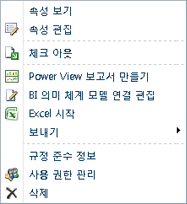
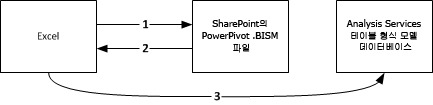
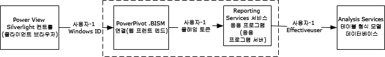

# 파워 피벗 BI 의미 체계 모델 연결(.bism)
  BI 의미 체계 모델 연결(.bism)은 Excel 또는 파워 뷰 보고서를 Analysis Services 테이블 형식 model 데이터베이스 또는 다차원 모드의 Analysis Services 인스턴스에 연결하는 이식 가능한 연결입니다. Office 데이터 연결(.odc) 파일에 대해 잘 알고 있다면 .bism 연결 파일을 정의하여 사용하는 것이 얼마나 간편한지를 알 수 있습니다.  
  
 BI 의미 체계 모델 연결은 SharePoint를 통해 만들고 액세스합니다. BI 의미 체계 모델 연결을 만들면 라이브러리에서 BI 의미 체계 모델 연결에 대한 빠른 시작 명령을 사용할 수 있습니다. 빠른 시작 명령은 새 Excel 통합 문서 또는 연결 파일 편집 옵션을 엽니다. Reporting Services가 설치되어 있는 경우 [!INCLUDE[ssCrescent](../../includes/sscrescent-md.md)] 보고서를 만드는 명령도 표시됩니다.  
  
   
  
##   지원되는 데이터베이스  
 BI 의미 체계 모델 연결은 테이블 형식 모델 데이터를 가리킵니다. 이 데이터의 원본은 다음 세 가지입니다.  
  
-   독립 실행형 Analysis Services 인스턴스에서 테이블 형식 서버 모드로 실행되는 테이블 형식 모델 데이터베이스. 독립 실행형 Analysis Services 인스턴스의 배포는 팜 외부에서 이루어집니다. 팜 외부의 데이터 원본에 액세스하려면 사용 권한이 추가로 필요합니다. 이에 대해서는 [Create a BI Semantic Model Connection to a Tabular Model Database](../../analysis-services/power-pivot-sharepoint/create-a-bi-semantic-model-connection-to-a-tabular-model-database.md)항목에서 설명합니다.  
  
-   [!INCLUDE[ssGemini](../../includes/ssgemini-md.md)] 통합 문서. Excel 통합 문서 안에 포함된 [!INCLUDE[ssGemini](../../includes/ssgemini-md.md)] 데이터베이스는 독립 실행형 Analysis Services 테이블 형식 모드 서버에서 실행되는 테이블 형식 model 데이터베이스에 해당합니다. 이미 [!INCLUDE[ssGemini](../../includes/ssgemini-md.md)] for Excel과 SharePoint용 [!INCLUDE[ssGemini](../../includes/ssgemini-md.md)] 을 사용하는 경우 SharePoint 라이브러리에서 [!INCLUDE[ssGemini](../../includes/ssgemini-md.md)] 통합 문서를 가리키는 BI 의미 체계 모델 연결을 정의하고 기존 [!INCLUDE[ssCrescent](../../includes/sscrescent-md.md)] 데이터를 사용하여 [!INCLUDE[ssGemini](../../includes/ssgemini-md.md)] 보고서를 작성할 수 있습니다.  SQL Server 2008 R2 또는 [!INCLUDE[ssSQL11](../../includes/sssql11-md.md)] 버전의 [!INCLUDE[ssGemini](../../includes/ssgemini-md.md)] for Excel에서 만든 통합 문서를 사용할 수 있습니다.  
  
-   Analysis Services 인스턴스의 다차원 데이터 모델  
  
 데이터 원본을 비교한 내용은 커뮤니티 콘텐츠 [SQL Server 2012 BISM(BI 의미 체계 모델) 이해](http://www.mssqltips.com/sqlservertip/2818/understanding-the-sql-server-2012-bi-semantic-model-bism/)를 참조하세요.  
  
## BI 의미 체계 연결에 대한 연결 시퀀스 이해  
 이 섹션에서는 Excel 데스크톱 응용 프로그램이나 SharePoint의 파워 뷰 보고 클라이언트와 같은 다양한 클라이언트 응용 프로그램과, SharePoint 팜 내부 또는 외부의 테이블 형식 모델 데이터베이스 간의 연결 동작을 설명합니다.  
  
 테이블 형식 모델 데이터베이스로의 모든 연결은 데이터를 요청하는 사용자의 자격 증명을 사용하여 이루어집니다. 하지만 해당 연결의 메커니즘은 연결이 팜 내 연결인지 단일 홉 또는 이중 홉 연결인지 그리고 Kerberos를 사용할 수 있는지 여부에 따라 다릅니다. SharePoint와 백 엔드 데이터 원본 간의 인증된 연결에 대한 자세한 내용은 [이중 홉 인증: NTLM은 실패하고 Kerberos는 작동하는 이유](http://go.microsoft.com/fwlink/?LinkId=237137)를 참조하세요.  
  
 **Excel에서 네트워크의 테이블 형식 데이터에 연결**  
  
 Excel 사용자가 BI 의미 체계 모델 연결을 데이터 원본으로 지정하면, .bism 파일 내부의 연결 정보가 클라이언트 응용 프로그램에 다운로드된 다음 Analysis Services의 테이블 형식 모델 데이터베이스로 직접 요청이 보내집니다. .bism 연결에 액세스하려면 Excel 사용자가 .bism 연결 파일에 대해 읽기 권한이 있는 SharePoint 사용자여야 합니다. 연결 정보가 다운로드되면 모든 후속 연결은 SharePoint를 무시하고 Excel에서 백 엔드 테이블 형식 모델 데이터베이스로 직접 이루어집니다.  
  
 다음 그림은 이 연결 시퀀스를 보여 줍니다. 연결 시퀀스는 .bism 연결에 대한 요청으로 시작 한 후 클라이언트에 연결 정보가 다운로드되고 마지막으로 데이터베이스에 단일 홉으로 연결됩니다. 이 연결은 Analysis Services 데이터베이스에 대해 읽기 권한이 있는 Excel 사용자의 Windows 자격 증명을 사용하여 이루어집니다. 이 연결은 단일 홉 연결이므로 Kerberos를 사용하더라도 이 시나리오에서는 필요하지 않습니다.  
  
   
  
 **파워 뷰에서 네트워크의 테이블 형식 데이터에 연결**  
  
 SharePoint 사용자가 문서 라이브러리의 BI 의미 체계 연결을 클릭하면 파워 뷰가 설치되어 있을 경우 파워 뷰가 즉시 시작하고 테이블 형식 모델 데이터베이스로의 연결을 엽니다.  
  
 파워 뷰와 테이블 형식 모델 데이터베이스 간의 연결은, 사용자 ID가 클라이언트에서 SharePoint로 전송된 다음 SharePoint에서 팜의 외부에서 실행되는 백 엔드 Analysis Services 테이블 형식 모델 데이터베이스로 전송되는 이중 홉 인증 시퀀스 후에 이루어집니다. 연결 요청을 처리하는 ADOMD.NET 클라이언트 라이브러리는 첫 번째 시도에서 항상 Kerberos를 사용하려고 시도합니다. Kerberos가 구성되어 있으면 사용자 ID는 테이블 형식 모델 데이터베이스로의 연결에 대해 가장하고 연결이 성공합니다.  
  
 Kerberos가 구성 되어 있지 않고 요청이 실패할 경우 Reporting Services는 두 번째 시도를 합니다. 이 시나리오에서 클라이언트 라이브러리는 Reporting Services서비스 ID 및 NTLM 인증을 사용하여 Analysis Services에 연결합니다. 파워 뷰 사용자 ID는 **effectiveusername** 매개 변수를 사용하여 연결 문자열에 전달됩니다.  
  
 Analysis Services 인스턴스의 시스템 관리자 역할 중 한 멤버만이 **effectiveusername** 매개 변수를 사용하여 연결할 권한을 가지며 서버 인스턴스의 또 다른 사용자를 가장합니다. 따라서 Reporting Services 공유 서비스의 실행 계정은 Analysis Services 인스턴스에 대한 관리 권한을 가져야 합니다.  서비스 계정에 관리 권한을 부여하는 방법에 대한 자세한 내용은 [테이블 형식 model 데이터베이스에 대한 BI 의미 체계 모델 연결 만들기](../../analysis-services/power-pivot-sharepoint/create-a-bi-semantic-model-connection-to-a-tabular-model-database.md)항목을 참조하세요.  
  
 다음 그림에서는 각 연결에 대해 동일한 Windows 사용자 ID를 사용하는 연결 시퀀스를 보여 줍니다. Analysis Services에 대한 마지막 연결에서 연결은 Reporting Services 서비스 응용 프로그램 ID를 통해 이루어지며 **effectiveusername**를 사용하여 Windows 사용자 ID가 전달됩니다.  
  
   
  
 **파워 뷰에서 SharePoint의 [!INCLUDE[ssGemini](../../includes/ssgemini-md.md)] 데이터에 연결**  
  
 SharePoint 사용자가 동일한 팜에 있는 [!INCLUDE[ssGemini](../../includes/ssgemini-md.md)] 통합 문서로 확인되는 BI 의미 체계 연결을 클릭하면 연결이 SharePoint 환경의 컨텍스트 내에서 이루어집니다. [!INCLUDE[ssGemini](../../includes/ssgemini-md.md)] 서비스 응용 프로그램이 연결 요청을 처리하여 동일한 컴퓨터의 Analysis Services 인스턴스로 전달합니다. Analysis Services 인스턴스는 통합 문서에서 [!INCLUDE[ssGemini](../../includes/ssgemini-md.md)] 데이터를 추출하여 로드합니다. 모든 후속 연결은 팜에 있는 [!INCLUDE[ssGemini](../../includes/ssgemini-md.md)] 서비스 응용 프로그램에 의해 관리됩니다.  
  
 이 시나리오에서는 모든 연결이 동일한 팜 내에서 이루어지므로 Kerberos나 제한 위임에 대한 요구 사항이 없습니다.  
  
##   관련 작업  
 [라이브러리에 BI 의미 체계 모델 연결 콘텐츠 형식 추가&#40;SharePoint용 파워 피벗&#41;](../../analysis-services/power-pivot-sharepoint/add-bi-semantic-model-connection-content-type-to-library.md)  
  
 [파워 피벗 통합 문서에 대한 BI 의미 체계 모델 연결 만들기](../../analysis-services/power-pivot-sharepoint/create-a-bi-semantic-model-connection-to-a-power-pivot-workbook.md)  
  
 [Create a BI Semantic Model Connection to a Tabular Model Database](../../analysis-services/power-pivot-sharepoint/create-a-bi-semantic-model-connection-to-a-tabular-model-database.md)  
  
 [Excel 또는 Reporting Services에서 BI 의미 체계 모델 연결 사용](../../analysis-services/power-pivot-sharepoint/use-a-bi-semantic-model-connection-in-excel-or-reporting-services.md)  
  
## 관련 항목:  
 [Analysis Services 인스턴스의 서버 모드 확인](../../analysis-services/instances/determine-the-server-mode-of-an-analysis-services-instance.md)   
 [Analysis Services에 연결](../../analysis-services/instances/connect-to-analysis-services.md)  
  
  
