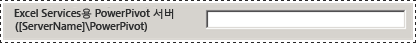
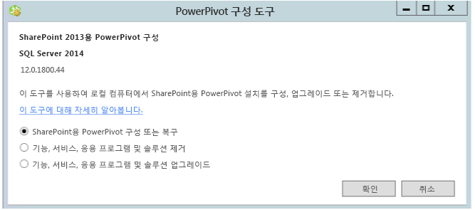

# Power Pivot Configuration Tools
[!INCLUDE[ssas-appliesto-sqlas](../../includes/ssas-appliesto-sqlas.md)]
[!INCLUDE[ssGemini](../../includes/ssgemini-md.md)] 구성 도구를 사용하여 [!INCLUDE[ssCurrent](../../includes/sscurrent-md.md)] [!INCLUDE[ssGeminiShort](../../includes/ssgeminishort-md.md)]을 구성, 복구 또는 제거합니다.  
  
 [!INCLUDE[ssCurrent](../../includes/sscurrent-md.md)] 설치 마법사는 SharePoint용 [!INCLUDE[ssGemini](../../includes/ssgemini-md.md)] 구성 도구를 설치하지 않습니다. 향후 [!INCLUDE[ssCurrent](../../includes/sscurrent-md.md)]릴리스에서는 구성 도구가 다운로드로 제공될 예정입니다.  
  
 이 항목에서는 [!INCLUDE[ssGemini](../../includes/ssgemini-md.md)] 도구의 일반적인 용도와 차이점에 대해 설명합니다.  
  
 **[!INCLUDE[applies](../../includes/applies-md.md)]**  SharePoint 2013  
  
 **항목 내용**  
  
-   [구성 도구를 사용하기 위한 요구 사항](#bkmk_requirements)  
  
-   [구성 도구의 두 가지 버전](#bkmk_twoversions)  
  
-   [파워 피벗 구성 도구 사용에 대한 개요](#bkmk_overview)  
  
-   [파워 피벗 구성 도구 중 하나 시작](#bmkm_start_tool)  
  
##   구성 도구를 사용하기 위한 요구 사항  
  
-   팜 관리자여야 합니다.  
  
-   Analysis Services 인스턴스의 서버 관리자여야 합니다(SharePoint 2010만 해당).  
  
-   팜 구성 데이터베이스에서 db_owner여야 합니다.  
  
-   구성 도구를 사용하기 위한 TCP/IP 포트 요구 사항은 없으므로 구성 도구를 수용하도록 방화벽을 구성할 필요가 없습니다. 구성 도구에는 웹 응용 프로그램이 필요하며 공유 서비스는 SharePoint 플랫폼의 일부로 사용할 수 있습니다. [!INCLUDE[ssASnoversion](../../includes/ssasnoversion-md.md)] 서버에 대한 방화벽을 구성해야 할 수 있습니다. 자세한 내용은 [Configure the Windows Firewall to Allow Analysis Services Access](../../analysis-services/instances/configure-the-windows-firewall-to-allow-analysis-services-access.md)을 참조하세요.  
  
##   구성 도구의 두 가지 버전  
 [!INCLUDE[ssCurrent](../../includes/sscurrent-md.md)] 설치 마법사는 SharePoint 2013용 [!INCLUDE[ssGemini](../../includes/ssgemini-md.md)] 구성 도구뿐만 아니라 SharePoint 2010용 [!INCLUDE[ssGemini](../../includes/ssgemini-md.md)] 구성 도구를 설치합니다.  
  
 이 도구는 [!INCLUDE[ssCurrent](../../includes/sscurrent-md.md)] 의 [!INCLUDE[ssSQL11SP1](../../includes/sssql11sp1-md.md)] 또는 [!INCLUDE[ssGeminiShort](../../includes/ssgeminishort-md.md)]인스턴스에만 사용할 수 있습니다. [!INCLUDE[ssKilimanjaro](../../includes/sskilimanjaro-md.md)] 설치에는 사용하지 마세요.  
  
|이름|지원되는 SharePoint 버전|세부적인 구성|  
|----------|-------------------------------------|----------------------------|  
|[!INCLUDE[ssGemini](../../includes/ssgemini-md.md)] 구성|SharePoint 2013|[SharePoint 2013용 파워 피벗 구성 또는 복구&#40;파워 피벗 구성 도구&#41;](../../analysis-services/power-pivot-sharepoint/configure-or-repair-power-pivot-for-sharepoint-2013.md)|  
|[!INCLUDE[ssGemini](../../includes/ssgemini-md.md)] 구성 도구|SharePoint 2010|[SharePoint 2010용 파워 피벗 구성 또는 복구(파워 피벗 구성 도구)](http://msdn.microsoft.com/en-us/d61f49c5-efaa-4455-98f2-8c293fa50046)|  
  
###   두 구성 도구의 차이점  
 두 가지 버전의 구성 도구는 유사하지만 두 개의 도구를 실행하는 구성 단계에는 차이점이 있습니다. 이와 같이 구성 단계가 다른 이유는 SharePoint 2013에서 SharePoint 2010의 기능이 변경되었기 때문입니다. 또한 SQL Server 2012 SP1 버전의 SharePoint용 [!INCLUDE[ssGemini](../../includes/ssgemini-md.md)] 및 이전 버전의 SharePoint용 [!INCLUDE[ssGemini](../../includes/ssgemini-md.md)] 은 아키텍처도 서로 다르기 때문입니다.  
  
 다음 표에서는 **[!INCLUDE[ssGemini](../../includes/ssgemini-md.md)] 구성** 도구의 새 기능과 변경된 기능에 대해 설명합니다. 또한 SharePoint 2013용 **[!INCLUDE[ssGemini](../../includes/ssgemini-md.md)] 구성 도구에는 없는** 구성 도구 [!INCLUDE[ssGemini](../../includes/ssgemini-md.md)] 의 기능도 설명합니다. 표의 행은 구성 도구의 탭과 동일한 순서로 표시됩니다.  
  
|[!INCLUDE[ssGemini](../../includes/ssgemini-md.md)] 구성|[!INCLUDE[ssGemini](../../includes/ssgemini-md.md)] 구성 도구|  
|--------------------------------------------------------------|-----------------------------------------------|  
|주 페이지에 **[!INCLUDE[ssGemini](../../includes/ssgemini-md.md)] 서버**의 새 옵션이 있습니다. SharePoint 팜 외부에서 실행되는 [!INCLUDE[ssASnoversion](../../includes/ssasnoversion-md.md)] 에 대해 새로운 아키텍처를 지원하는 옵션입니다. SharePoint 모드에서 실행 중인 [!INCLUDE[ssASnoversion](../../includes/ssasnoversion-md.md)] 서버를 하나 이상 사용하도록 Excel Services를 구성합니다.   ||  
||2010 도구에는 [!INCLUDE[ssASnoversion](../../includes/ssasnoversion-md.md)] 로컬 인스턴스를 구성하는 **로컬 서버에서 SQL Server Analysis Services([!INCLUDE[ssGemini](../../includes/ssgemini-md.md)]) 등록** 페이지가 있습니다. 이 페이지는 [!INCLUDE[ssASnoversion](../../includes/ssasnoversion-md.md)]로컬 인스턴스가 없기 때문에 2013 도구에 포함되지 않습니다.   |  
||**[!INCLUDE[ssGemini](../../includes/ssgemini-md.md)] 서비스 응용 프로그램 만들기** 페이지에 추가 옵션 **데이터 새로 고침을 사용하려면 통합 문서를 업그레이드하세요.**가 있습니다. 2013 도구에는 이 옵션이 제공되지 않습니다.   |  
|2013 도구에는 새로운 **[!INCLUDE[ssGemini](../../includes/ssgemini-md.md)] 서버 구성** 페이지가 있습니다. SharePoint 팜 외부에서 실행되는 [!INCLUDE[ssASnoversion](../../includes/ssasnoversion-md.md)] 의 새로운 아키텍처를 지원하는 페이지입니다. 기본적으로 주 페이지의 **Excel Services용 [!INCLUDE[ssGemini](../../includes/ssgemini-md.md)] 서버** 입력란에 입력한 서버 이름이 **[!INCLUDE[ssGemini](../../includes/ssgemini-md.md)] 서버 구성**에도 표시됩니다.   ||  
|2013 도구에는 새로운 **[!INCLUDE[ssGemini](../../includes/ssgemini-md.md)] 추가 기능을 Excel Services 사용 추적기로 등록** 페이지가 있습니다. SharePoint 2010 Excel Services는 [!INCLUDE[ssGemini](../../includes/ssgemini-md.md)]에 대한 사용 현황 데이터를 추적하지 않습니다.||  
||2010 도구에는 SharePoint 2010의 Excel Services가 **모델을 로드할 수 있도록 MSOLAP을 등록하는** MSOLAP.5를 신뢰할 수 있는 공급자로 추가 [!INCLUDE[ssGemini](../../includes/ssgemini-md.md)] 페이지가 있습니다. 이 페이지는 2013 도구에 포함되지 않습니다. SharePoint 2013 Excel Services에서는 모델을 로드하는 데 MSOLAP 공급자를 사용하지 않습니다.|  
  
##   파워 피벗 구성 도구 사용에 대한 개요  
 [!INCLUDE[ssGemini](../../includes/ssgemini-md.md)] 구성 도구 중 하나를 시작하면 도구는 기존 설치를 평가하여 적용 가능한 작업을 확인합니다. 새 설치에서는 구성 태스크만 사용할 수 있습니다. 서버가 구성된 후에는 제거 태스크가 나타납니다. [!INCLUDE[ssKilimanjaro](../../includes/sskilimanjaro-md.md)] 인스턴스로 시작한 경우 사용 가능한 태스크 목록에서 업그레이드도 사용할 수 있습니다.  
  
 중앙 관리 또는 Windows PowerShell에 익숙하지 않은 경우 대신 구성 도구를 사용하여 [!INCLUDE[ssGeminiShort](../../includes/ssgeminishort-md.md)] 설치를 완료할 수 있습니다.  
  
 또한 이 도구는 팜이 구성되었는지 또는 필수 기능이 누락되었는지 여부를 감지할 수 있습니다. SharePoint 프로그램 파일이 설치되었지만 팜이 구성되지 않은 경우 이 도구는 팜과 [!INCLUDE[ssGeminiShort](../../includes/ssgeminishort-md.md)] 설치를 모두 구성하기 위한 동작을 제공합니다.  
  
 Windows PowerShell을 사용하여 **및 SharePoint를 구성하는 방법을 배우고 이해하려는 경우** 스크립트 [!INCLUDE[ssGemini](../../includes/ssgemini-md.md)] 탭을 검토하면 됩니다. 자세한 내용은 다음 항목을 참조하세요.  
  
-   [Windows PowerShell을 사용하여 파워 피벗 구성](../../analysis-services/power-pivot-sharepoint/power-pivot-configuration-using-windows-powershell.md)  
  
-   [SharePoint용 파워 피벗에 대한 PowerShell 참조](../../analysis-services/powershell/powershell-reference-for-power-pivot-for-sharepoint.md)  
  
> [!NOTE]  
>  이 도구는 Reporting Services를 구성하지 않습니다. Reporting Services를 SharePoint 환경에 추가하는 경우 Reporting Services를 별도로 설치하고 구성해야 합니다. 자세한 내용은 다음 항목을 참조하세요.  
>   
>  -   [SharePoint 모드에서 첫 번째 보고서 서버 설치](../../reporting-services/install-windows/install-the-first-report-server-in-sharepoint-mode.md)  
> -   [SharePoint 2010용 Reporting Services SharePoint 모드 설치](http://msdn.microsoft.com/en-us/47efa72e-1735-4387-8485-f8994fb08c8c)  
  
##   파워 피벗 구성 도구 중 하나 시작  
  
1.  **시작** 화면에서 **powerpivot**입력  
  
     **시작** 화면에서 **powerpivot** 을 입력하거나 **시작** 메뉴에서 **모든 프로그램**, [!INCLUDE[ssCurrentUI](../../includes/sscurrentui-md.md)], **구성 도구**및 다음 중 하나를 차례로 클릭합니다.  
  
    -   **[!INCLUDE[ssGemini](../../includes/ssgemini-md.md)] 구성 도구**  
  
    -   **OR**  
  
    -   **[!INCLUDE[ssGemini](../../includes/ssgemini-md.md)] 구성**  
  
       
  
     **참고:** 이 도구는 [!INCLUDE[ssGeminiShort](../../includes/ssgeminishort-md.md)] 이 로컬 서버에 설치된 경우에만 사용할 수 있습니다.  
  
2.  시작 시 구성 도구는 설치 상태를 확인하고 설치에 유효한 태스크를 제공합니다.  
  
3.  설치의 현재 상태에 따라 다음 태스크 중 하나 이상을 수행할 수 있습니다.  
  
    1.  설치 후 태스크를 완료하거나 설치를 복구하려면 **SharePoint용 [!INCLUDE[ssGemini](../../includes/ssgemini-md.md)] 구성 또는 복구**를 클릭합니다.  
  
    2.  팜에서 기능과 솔루션을 제거하려면 **기능, 서비스, 응용 프로그램 및 솔루션 제거** 를 클릭합니다.  
  
    3.  이전 버전의 **을 사용하여 설치된 기능과 솔루션을 업그레이드하려면** 기능, 서비스, 응용 프로그램 및 솔루션 업그레이드 [!INCLUDE[ssGeminiShort](../../includes/ssgeminishort-md.md)]를 클릭합니다.  
  
     예를 들어 다음 이미지에는 SharePoint 2013용 [!INCLUDE[ssGemini](../../includes/ssgemini-md.md)] 구성 도구의 시작 페이지가 나와 있습니다.  
  
       
  
 각 태스크는 서버 구성의 일부 측면을 처리하는 개별 작업으로 구성됩니다. 예를 들어 구성 태스크에는 솔루션 배포, [!INCLUDE[ssGemini](../../includes/ssgemini-md.md)] 서비스 응용 프로그램 만들기, 기능 활성화, 데이터 새로 고침 구성 등의 동작이 포함됩니다. 동작 목록은 설치의 현재 상태에 따라 다릅니다. 동작이 필요하지 않은 경우 이 도구는 해당 동작을 태스크 목록에서 제외합니다.  
  
 실행을 클릭하면 이 도구는 모든 동작을 일괄 처리 모드로 처리합니다. 각 동작은 태스크 목록에 별도의 항목으로 표시되지만 태스크에 포함된 모든 동작이 함께 처리됩니다. 유효성 검사를 통과하는 동작만 처리됩니다. 유효성 검사를 통과하려면 일부 입력 값을 추가하거나 변경해야 할 수 있습니다.  
  
## 관련 내용  
 [Upgrade Power Pivot for SharePoint](../../database-engine/install-windows/upgrade-power-pivot-for-sharepoint.md) 팜에 이미 있는 기존 설치를 업그레이드하는 워크플로에 대해 설명합니다.  
  
 [SharePoint용 파워 피벗 제거](../../sql-server/install/uninstall-power-pivot-for-sharepoint.md) SharePoint용 [!INCLUDE[ssGemini](../../includes/ssgemini-md.md)] 서비스, 솔루션 및 응용 프로그램 페이지를 팜에서 제거하는 워크플로에 대해 설명합니다.  
  
 [Windows PowerShell을 사용하여 파워 피벗 구성](../../analysis-services/power-pivot-sharepoint/power-pivot-configuration-using-windows-powershell.md)  
  
 [중앙 관리에서 Power Pivot 서버 관리 및 구성](../../analysis-services/power-pivot-sharepoint/power-pivot-server-administration-and-configuration-in-central-administration.md)  
  
  
