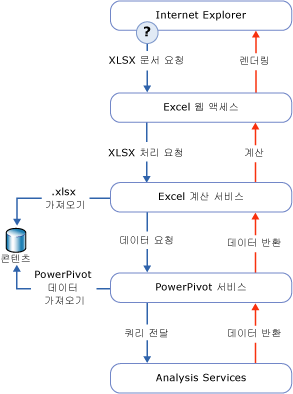

# 파워 피벗 데이터 액세스
[!INCLUDE[ssas-appliesto-sqlas](../../includes/ssas-appliesto-sqlas.md)]
  이 항목에서는 Sharepoint 라이브러리에 게시되는 [!INCLUDE[ssGemini](../../includes/ssgemini-md.md)] 통합 문서에서 데이터를 검색하는 방법을 설명합니다.  
  
 [!INCLUDE[ssGemini](../../includes/ssgemini-md.md)] 데이터는 Excel 통합 문서 내에 저장됩니다. 연결 문자열은 SharePoint 사이트에 있는 통합 문서에 대한 URL입니다.  
  
 [!INCLUDE[ssGemini](../../includes/ssgemini-md.md)] 데이터는 주로 데이터가 포함된 통합 문서에서 피벗 테이블 및 피벗 차트의 데이터로 사용됩니다. [!INCLUDE[ssGemini](../../includes/ssgemini-md.md)] 데이터를 외부 데이터 원본으로 사용할 수도 있습니다. 그러면 통합 문서, 대시보드 또는 보고서에서 SharePoint의 개별 Excel(.xlsx) 파일에 연결하여 나중에 사용할 데이터를 검색할 수 있습니다. 일반적으로 [!INCLUDE[ssGemini](../../includes/ssgemini-md.md)] 데이터를 사용하는 클라이언트 도구는 Excel, [!INCLUDE[ssCrescent](../../includes/sscrescent-md.md)], 기타 Reporting Services 보고서 및 PerformancePoint입니다.  
  
 데스크톱에서는 [!INCLUDE[ssGemini](../../includes/ssgemini-md.md)] 추가 기능이 AMO 및 ADOMD.NET을 사용하여 클라이언트 작업 영역에서 [!INCLUDE[ssGemini](../../includes/ssgemini-md.md)] 데이터를 생성, 처리 및 쿼리합니다.  
  
 SharePoint 팜에서는 Excel Services가 로컬 MSOLAP OLE DB Provider를 사용하여 [!INCLUDE[ssGemini](../../includes/ssgemini-md.md)] 데이터에 연결합니다. 공급자는 팜의 SharePoint용 [!INCLUDE[ssGemini](../../includes/ssgemini-md.md)] 서버에 연결 요청을 보냅니다. 서버는 데이터를 로드하고 쿼리를 실행한 다음 결과 집합을 반환합니다.  
  
##   SharePoint에서 파워 피벗 데이터 쿼리  
 SharePoint 라이브러리에서 [!INCLUDE[ssGemini](../../includes/ssgemini-md.md)] 통합 문서를 볼 때 통합 문서 내에 있는 [!INCLUDE[ssGemini](../../includes/ssgemini-md.md)] 데이터는 팜 내의 Analysis Services 서버 인스턴스에서 별도로 검색, 추출 및 처리됩니다. 반면 Excel Services는 표시 계층을 렌더링합니다. [!INCLUDE[ssGemini](../../includes/ssgemini-md.md)] 추가 기능이 있는 Excel 2010 데스크톱 응용 프로그램 또는 브라우저 창에서 완전히 처리된 통합 문서를 볼 수 있습니다.  
  
 다음 다이어그램에서는 쿼리 처리에 대한 요청이 팜을 통해 이동하는 방법을 보여 줍니다. [!INCLUDE[ssGemini](../../includes/ssgemini-md.md)] 데이터는 Excel 2010 통합 문서의 일부이므로 사용자가 SharePoint 라이브러리에서 Excel 통합 문서를 열고 [!INCLUDE[ssGemini](../../includes/ssgemini-md.md)] 데이터가 포함된 피벗 테이블이나 피벗 차트와 상호 작용하면 쿼리 처리 요청이 발생합니다.  
  
   
  
 Excel Services 및 SharePoint용 [!INCLUDE[ssGemini](../../includes/ssgemini-md.md)] 구성 요소는 동일한 통합 문서(.xlsx) 파일의 서로 다른 부분을 처리합니다. Excel Services는 팜의 [!INCLUDE[ssGemini](../../includes/ssgemini-md.md)] 서버에서 [!INCLUDE[ssGemini](../../includes/ssgemini-md.md)] 데이터 및 처리 요청을 검색합니다. [!INCLUDE[ssGemini](../../includes/ssgemini-md.md)] 서버는 콘텐츠 라이브러리의 통합 문서에서 데이터를 추출하고 데이터를 로드하는 [!INCLUDE[ssGeminiSrv](../../includes/ssgeminisrv-md.md)] 인스턴스에 요청을 할당합니다. 메모리에 저장되어 있는 데이터는 렌더링된 통합 문서에 다시 병합되고 브라우저 창에서 표시하기 위해 Excel 웹 액세스로 다시 전달됩니다.  
  
 [!INCLUDE[ssGemini](../../includes/ssgemini-md.md)] 통합 문서의 모든 데이터가 SharePoint용 [!INCLUDE[ssGemini](../../includes/ssgemini-md.md)] 에서 처리되는 것은 아닙니다. Excel 서비스는 워크시트의 테이블 및 셀 데이터를 처리합니다. [!INCLUDE[ssGemini](../../includes/ssgemini-md.md)] 데이터를 사용하는 피벗 테이블, 피벗 차트 및 슬라이서만 SharePoint용 [!INCLUDE[ssGemini](../../includes/ssgemini-md.md)] 에서 처리됩니다.  
  
## 관련 항목:  
 [Analysis Services에 연결](../../analysis-services/instances/connect-to-analysis-services.md)   
 [테이블 형식 모델 데이터 액세스](../../analysis-services/tabular-models/tabular-model-data-access.md)  
  
  
