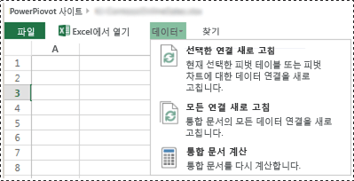
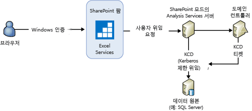
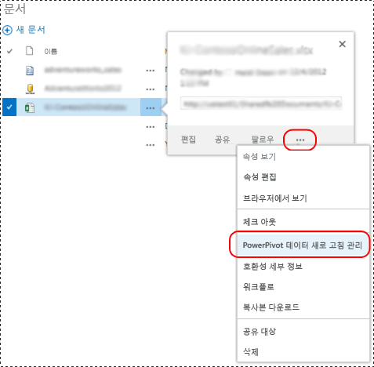
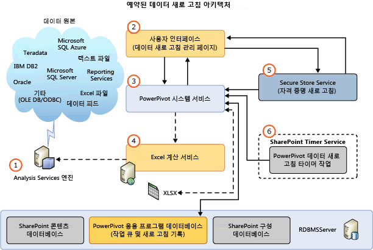
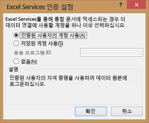

# SharePoint 2013에서 파워 피벗 데이터 새로 고침
  SharePoint 2013에서 [!INCLUDE[ssGemini](../../includes/ssgemini-md.md)] 데이터 모델을 새로 고치기 위한 디자인에서는 Excel Services를 기본 구성 요소로 사용하여 SharePoint 모드에서 실행 중인 [!INCLUDE[ssCurrent](../../includes/sscurrent-md.md)] [!INCLUDE[ssASnoversion](../../includes/ssasnoversion-md.md)] 인스턴스에서 데이터 모델을 로드하고 새로 고칩니다. [!INCLUDE[ssASnoversion](../../includes/ssasnoversion-md.md)] 서버는 SharePoint 팜 외부에서 실행됩니다. SharePoint 2013 Excel Services의 아키텍처는 **대화형 데이터 새로 고침** 과 **예약된 데이터 새로 고침**을 모두 지원합니다.  
  
 **[!INCLUDE[applies](../../includes/applies-md.md)]**  SharePoint 2013  
  
 **항목 내용**  
  
-   [Interactive Data Refresh](#bkmk_interactive_refresh)  
  
-   [통합 문서 데이터 연결 및 대화형 데이터 새로 고침을 사용하는 Windows 인증](#bkmk_windows_auth_interactive_data_refresh)  
  
-   [Scheduled Data Refresh](#bkmk_scheduled_refresh)  
  
-   [SharePoint 2013의 예약된 데이터 새로 고침 아키텍처](#bkmk_refresh_architecture)  
  
-   [인증에 대한 추가 고려 사항](#datarefresh_additional_authentication)  
  
-   [자세한 정보](#bkmk_moreinformation)  
  
## 배경  
 SharePoint Server 2013 Excel Services는 Excel 2013 통합 문서에 대한 데이터 새로 고침을 관리하고 SharePoint 모드에서 실행 중인 [!INCLUDE[ssCurrent](../../includes/sscurrent-md.md)] [!INCLUDE[ssASnoversion](../../includes/ssasnoversion-md.md)] 서버에서 데이터 모델 처리를 트리거합니다. Excel 2010 통합 문서의 경우 Excel Services에서 통합 문서와 데이터 모델의 로드 및 저장도 관리합니다. 그러나 Excel Services는 [!INCLUDE[ssGemini](../../includes/ssgemini-md.md)] 시스템 서비스를 사용하여 데이터 모델에 처리 명령을 보냅니다. 다음 표에는 통합 문서 버전에 따라 데이터 새로 고침에 대한 처리 명령을 보내는 구성 요소가 요약되어 있습니다. SharePoint 모드에서 실행 중인 [!INCLUDE[ssCurrent](../../includes/sscurrent-md.md)] 분석 서버를 사용하도록 SharePoint 2013 팜이 구성되어 있다고 가정합니다.  
  
||||  
|-|-|-|  
||Excel 2013 통합 문서|Excel 2010 통합 문서|  
|데이터 새로 고침 트리거|**대화형:** 인증된 사용자   **예약됨:** [!INCLUDE[ssGemini](../../includes/ssgemini-md.md)] 시스템 서비스|[!INCLUDE[ssGemini](../../includes/ssgemini-md.md)] 시스템 서비스|  
|콘텐츠 데이터베이스에서 통합 문서 로드|SharePoint 2013 및 Excel Services|SharePoint 2013 및 Excel Services|  
|Analysis Services 인스턴스의 데이터 모델 로드|SharePoint 2013 및 Excel Services|SharePoint 2013 및 Excel Services|  
|Analysis Services 인스턴스로 처리 명령 보내기|SharePoint 2013 및 Excel Services|[!INCLUDE[ssGemini](../../includes/ssgemini-md.md)] 시스템 서비스|  
|통합 문서 데이터 업데이트|SharePoint 2013 및 Excel Services|SharePoint 2013 및 Excel Services|  
|콘텐츠 데이터베이스에 통합 문서 및 데이터 모델 저장|**대화형:** 해당 없음   **예약:** SharePoint 2013 Excel Services|SharePoint 2013 및 Excel Services|  
  
 다음 표에는 SharePoint 모드에서 실행 중인 [!INCLUDE[ssCurrent](../../includes/sscurrent-md.md)] Analysis Server를 사용하도록 구성된 SharePoint 2013 팜에서 지원되는 새로 고침 기능이 요약되어 있습니다.  
  
|통합 문서 작성 환경|예약된 데이터 새로 고침|대화형 새로 고침|  
|-------------------------|----------------------------|-------------------------|  
|2008 R2 [!INCLUDE[ssGemini](../../includes/ssgemini-md.md)] for Excel|지원되지 않습니다. 통합 문서 업그레이드 **열기 메뉴\*)**|지원되지 않습니다. 통합 문서 업그레이드 **열기 메뉴\*)**|  
|Excel용 2012 [!INCLUDE[ssGemini](../../includes/ssgemini-md.md)]|지원됨|지원되지 않습니다. 통합 문서 업그레이드 **열기 메뉴\*)**|  
|Excel 2013|지원됨|지원됨|  
  
 **(\*)** 통합 문서 업그레이드에 대한 자세한 내용은 [통합 문서 업그레이드 및 예약된 데이터 새로 고침&#40;SharePoint 2013&#41;](../../analysis-services/instances/install-windows/upgrade-workbooks-and-scheduled-data-refresh-sharepoint-2013.md)을 참조하세요.  
  
##   Interactive Data Refresh  
 SharePoint Server 2013 Excel Services에서 대화형 또는 수동 데이터 새로 고침은 원래 데이터 원본의 데이터로 데이터 모델을 새로 고칠 수 있습니다. SharePoint 모드에서 실행 중인 [!INCLUDE[ssASnoversion](../../includes/ssasnoversion-md.md)] 서버를 등록하여 Excel Services 응용 프로그램을 구성한 후에 대화형 데이터 새로 고침을 사용할 수 있습니다. 자세한 내용은 [Excel Services 데이터 모델 설정 관리(SharePoint Server 2013)](http://technet.microsoft.com/library/jj219780.aspx) (http://technet.microsoft.com/library/jj219780.aspx)를 참조하세요.  
  
> [!NOTE]  
>  대화형 데이터 새로 고침은 Excel 2013에서 만든 통합 문서에만 사용할 수 있습니다. Excel 2010 통합 문서를 새로 고치려고 하면 “[!INCLUDE[ssGemini](../../includes/ssgemini-md.md)] 작업 실패: 이전 버전의 Excel에서 만든 통합 문서와 [!INCLUDE[ssGemini](../../includes/ssgemini-md.md)] 은 파일을 업그레이드해야 새로 고칠 수 있습니다.”와 비슷한 오류 메시지가 Excel Services에 표시됩니다. 통합 문서 업그레이드에 대한 자세한 내용은 [통합 문서 업그레이드 및 예약된 데이터 새로 고침&#40;SharePoint 2013&#41;](../../analysis-services/instances/install-windows/upgrade-workbooks-and-scheduled-data-refresh-sharepoint-2013.md)을 참조하세요.  
  
 **대화형 새로 고침의 핵심 사항**  
  
-   대화형 데이터 새로 고침은 현재 사용자 세션의 데이터만 새로 고칩니다. 데이터가 자동으로 SharePoint 콘텐츠 데이터베이스의 통합 문서 항목에 다시 저장되지는 않습니다.  
  
-   **자격 증명:** 대화형 데이터 새로 고침은 현재 로그온한 사용자의 ID를 자격 증명이나 저장된 자격 증명으로 사용하여 데이터 원본에 연결할 수 있습니다. 사용되는 자격 증명은 외부 데이터 원본에 대한 통합 문서 연결에 정의된 Excel Services 인증 설정에 따라 다릅니다.  
  
-   **지원되는 통합 문서:**  Excel 2013에서 만든 통합 문서  
  
 **데이터를 새로 고치려면**  
  
-   아래 그림을 참조하여 단계를 수행하세요.  
  
1.  브라우저에서 SharePoint 문서 라이브러리의 [!INCLUDE[ssGemini](../../includes/ssgemini-md.md)] 통합 문서를 엽니다.  
  
2.  브라우저 창에서 **데이터** 메뉴를 클릭하고 **선택한 연결 새로 고침** 또는 **모든 연결 새로 고침**을 클릭합니다.  
  
3.  Excel Services에서 [!INCLUDE[ssGemini](../../includes/ssgemini-md.md)] 데이터베이스를 로드하고 처리한 다음 쿼리하여 Excel 통합 문서 캐시를 새로 고칩니다.  
  
4.  **참고:** 업데이트된 통합 문서가 자동으로 문서 라이브러리에 다시 저장되지는 않습니다.  
  
   
  
###   통합 문서 데이터 연결 및 대화형 데이터 새로 고침을 사용하는 Windows 인증  
 Excel Services가 Analysis Services 서버에 사용자 계정을 가장하도록 지시하는 처리 명령을 보냅니다. 사용자 가장-위임 프로세스를 수행할 수 있는 시스템 권한을 얻으려면 Analysis Services 서비스 계정에 로컬 서버에 대한 **운영 체제의 일부로 작동** 권한이 필요합니다. 또한 Analysis Services 서버에서 데이터 원본에 사용자의 자격 증명을 위임할 수 있어야 합니다. 쿼리 결과는 Excel Services에 전송됩니다.  
  
 일반적인 사용자 환경: 고객이 [!INCLUDE[ssGemini](../../includes/ssgemini-md.md)] 모델을 포함하는 Excel 2013 통합 문서에서 "모든 연결 새로 고침"을 선택하면 다음과 비슷한 오류 메시지가 나타납니다.  
  
-   **외부 데이터 새로 고침 실패:** 통합 문서의 데이터 모델에서 작업하는 동안 오류가 발생했습니다. 다시 시도하세요. 이 통합 문서에서 하나 이상의 데이터 연결을 새로 고칠 수 없습니다.  
  
 사용하는 데이터 공급자에 따라 ULS 로그에 다음과 비슷한 메시지가 기록됩니다.  
  
 **SQL Native Client 사용 시**  
  
-   외부 연결을 만들거나 쿼리를 실행하지 못했습니다. 공급자 메시지: ID '20102481-39c8-4d21-bf63-68f583ad22bb'를 참조하는 아웃오브 라인 개체 'DataSource'가 지정되었지만 사용되지 않았습니다.  OLE DB 또는 ODBC 오류: SQL Server에 연결을 설정하는 중에 네트워크 또는 인스턴스 관련 오류가 발생했습니다. 서버를 찾을 수 없거나 액세스할 수 없습니다. 인스턴스 이름이 올바르고 SQL Server가 원격 연결을 허용하도록 구성되어 있는지 확인하세요. 자세한 내용은 SQL Server 온라인 설명서를 참조하세요.; 08001; SSL 공급자: 요청한 보안 패키지가 없습니다.; 08001; 클라이언트가 연결할 수 없습니다.; 08001; 클라이언트에서 암호화를 지원하지 않습니다.; 08001.  , ConnectionName: ThisWorkbookDataModel, 통합 문서: book1.xlsx.  
  
 **Microsoft OLE DB Provider for SQL Server 사용 시**  
  
-   외부 연결을 만들거나 쿼리를 실행하지 못했습니다. 공급자 메시지: ID '6e711bfa-b62f-4879-a177-c5dd61d9c242'를 참조하는 아웃오브 라인 개체 'DataSource'가 지정되었지만 사용되지 않았습니다. OLE DB 또는 ODBC 오류 , ConnectionName: ThisWorkbookDataModel, 통합 문서: OLEDB Provider.xlsx.  
  
 **.NET Framework Data Provider for SQL Server 사용 시**  
  
-   외부 연결을 만들거나 쿼리를 실행하지 못했습니다. 공급자 메시지: ID 'f5fb916c-3eac-4d07-a542-531524c0d44a'를 참조하는 아웃오브 라인 개체 'DataSource'가 지정되었지만 사용되지 않았습니다.  상위 수준 관계형 엔진에서 오류가 발생했습니다. 관리되는 IDbConnection 인터페이스를 사용하는 동안 다음 예외가 발생했습니다: 파일이나 어셈블리 'System.Transactions, Version=4.0.0.0, Culture=neutral, PublicKeyToken=b77a5c561934e089' 또는 여기에 종속되어 있는 파일이나 어셈블리 중 하나를 로드할 수 없습니다. 필요한 가장 수준이 제공되지 않았거나, 제공된 가장 수준이 올바르지 않습니다. HRESULT: 0x80070542에서 예외가 발생했습니다.  , ConnectionName: ThisWorkbookDataModel, 통합 문서: NETProvider.xlsx.  
  
 **구성 단계 요약** 로컬 서버에 대한 **운영 체제의 일부로 작동** 권한을 구성하려면  
  
1.  SharePoint 모드에서 실행 중인 Analysis Services 서버에서 "운영 체제의 일부로 작동" 권한에 Analysis Services 서비스 계정을 추가합니다.  
  
    1.  ”`secpol.msc`”를 실행합니다.  
  
    2.  **로컬 보안 정책**, **로컬 정책**및 **사용자 권한 할당**을 차례로 클릭합니다.  
  
    3.  서비스 계정을 추가합니다.  
  
2.  Excel Services를 다시 시작하고 Analysis Services 서버를 다시 부팅합니다.  
  
3.  Excel Services 서비스 계정이나 C2WTS(Windows 토큰 서비스에 대한 클레임)에서 Analysis Services 인스턴스로의 위임은 필요 없습니다. 따라서 Excel Services나 C2WTS에서 [!INCLUDE[ssGemini](../../includes/ssgemini-md.md)] AS 서비스로의 KCD 구성이 불필요합니다. 백 엔드 데이터 원본이 [!INCLUDE[ssASnoversion](../../includes/ssasnoversion-md.md)] 인스턴스와 같은 서버에 있는 경우 Kerberos 제한 위임이 필요 없습니다. 그러나 [!INCLUDE[ssASnoversion](../../includes/ssasnoversion-md.md)] 서비스 계정에 운영 체제의 일부로 작동 권한이 필요합니다.  
  
   
  
 자세한 내용은 [운영 체제의 일부로 작동](http://technet.microsoft.com/library/cc784323\(WS.10\).aspx) (http://technet.microsoft.com/library/cc784323(WS.10).aspx)을 참조하세요.  
  
##   Scheduled Data Refresh  
 **예약된 데이터 새로 고침의 핵심 사항**  
  
-   SharePoint용 [!INCLUDE[ssGemini](../../includes/ssgemini-md.md)] 추가 기능 배포가 필요합니다. 설치에 대한 자세한 내용은 [SharePoint용 PowerPivot 추가 기능 설치 또는 제거&#40;SharePoint 2013&#41;](../../analysis-services/instances/install-windows/install-or-uninstall-the-power-pivot-for-sharepoint-add-in-sharepoint-2013.md)를 참조하세요.  
  
-   사용자가 통합 문서에 대한 새로 고침 일정을 구성합니다. 예약된 시간에 [!INCLUDE[ssGemini](../../includes/ssgemini-md.md)] 시스템 서비스가 Excel Services에 다음 요청을 보냅니다.  
  
    -   [!INCLUDE[ssGemini](../../includes/ssgemini-md.md)] 데이터베이스 로드 및 처리  
  
    -   통합 문서 새로 고침  
  
    -   콘텐츠 데이터베이스에 통합 문서를 다시 저장합니다.  
  
-   **자격 증명:** 저장된 자격 증명을 사용합니다. 현재 사용자의 ID를 사용하지 않습니다.  
  
-   **지원되는 통합 문서:** Excel 2010용 [!INCLUDE[ssSQL11](../../includes/sssql11-md.md)][!INCLUDE[ssGemini](../../includes/ssgemini-md.md)] 추가 기능이나 Excel 2013을 사용하여 만든 통합 문서. [!INCLUDE[ssKilimanjaro](../../includes/sskilimanjaro-md.md)][!INCLUDE[ssGemini](../../includes/ssgemini-md.md)] 추가 기능을 사용하여 Excel 2010에서 만든 통합 문서는 지원되지 않습니다. 따라서 [!INCLUDE[ssSQL11](../../includes/sssql11-md.md)][!INCLUDE[ssGemini](../../includes/ssgemini-md.md)] 이상의 형식으로 통합 문서를 업그레이드해야 합니다. 통합 문서 업그레이드에 대한 자세한 내용은 [통합 문서 업그레이드 및 예약된 데이터 새로 고침&#40;SharePoint 2013&#41;](../../analysis-services/instances/install-windows/upgrade-workbooks-and-scheduled-data-refresh-sharepoint-2013.md)을 참조하세요.  
  
 **데이터 새로 고침 관리** 페이지를 표시하려면  
  
-   아래 그림을 참조하여 단계를 수행하세요.  
  
1.  SharePoint 문서 라이브러리에서 [!INCLUDE[ssGemini](../../includes/ssgemini-md.md)] 통합 문서에 대한 **열기 메뉴**(**...**)를 클릭합니다.  
  
2.  두 번째 **열기 메뉴**를 클릭하고 **[!INCLUDE[ssGemini](../../includes/ssgemini-md.md)] 데이터 새로 고침 관리**를 클릭합니다.  
  
3.  **데이터 새로 고침** 페이지에서 **사용** 을 클릭하고 새로 고침 일정을 구성합니다.  
  
4.  지정된 시간에 [!INCLUDE[ssGemini](../../includes/ssgemini-md.md)] 시스템 서비스가 Excel Services에 다음 요청을 보냅니다.  
  
    -   [!INCLUDE[ssGemini](../../includes/ssgemini-md.md)] 데이터 모델 로드 및 처리  
  
    -   통합 문서 새로 고침  
  
    -   콘텐츠 데이터베이스에 통합 문서를 다시 저장합니다.  
  
   
  
> [!TIP]  
>  SharePoint Online에서 통합 문서를 새로 고치는 방법에 대한 자세한 내용은 [SharePoint Online에서 파워 피벗 모델이 포함된 Excel 통합 문서 새로 고침(백서)](http://technet.microsoft.com/library/jj992650.aspx) (http://technet.microsoft.com/library/jj992650.aspx)을 참조하세요.  
  
##   SharePoint 2013의 예약된 데이터 새로 고침 아키텍처  
 다음 그림에는 SharePoint 2013과 SQL Server 2012 SP1의 데이터 새로 고침 아키텍처가 요약되어 있습니다.  
  
   
  
||Description||  
|-|-----------------|-|  
|**(1)**|Analysis Services 엔진|SharePoint 모드에서 실행 중인 [!INCLUDE[ssCurrent](../../includes/sscurrent-md.md)][!INCLUDE[ssASnoversion](../../includes/ssasnoversion-md.md)] 서버에서 데이터 모델 처리를 트리거합니다. 서버는 SharePoint 팜 외부에서 실행됩니다.|  
|**(2)**|사용자 인터페이스|사용자 인터페이스는 두 페이지로 구성됩니다. 하나는 일정을 정의하는 페이지이고, 다른 하나는 새로 고침 기록을 보는 페이지입니다. 이러한 페이지는 [!INCLUDE[ssGemini](../../includes/ssgemini-md.md)] 서비스 응용 프로그램 데이터베이스에 직접 액세스하지 않으며 [!INCLUDE[ssGemini](../../includes/ssgemini-md.md)] 시스템 서비스를 사용하여 데이터베이스에 액세스합니다.|  
|**(3)**|[!INCLUDE[ssGemini](../../includes/ssgemini-md.md)] 시스템 서비스|SharePoint용 [!INCLUDE[ssGemini](../../includes/ssgemini-md.md)] 추가 기능을 배포할 때 서비스가 설치됩니다.   서비스는 다음과 같은 용도로 사용됩니다.|  
|||이 서비스는 Excel 2013 통합 문서의 데이터 새로 고침을 위해 Excel Services API를 호출하는 새로 고침 예약 엔진을 호스팅합니다. Excel 2010 통합 문서의 경우 서비스가 직접 데이터 모델 처리를 수행하지만 데이터 모델 로그와 통합 문서 업데이트에는 Excel Services를 계속 사용합니다.|  
|||이 서비스를 통해 사용자 인터페이스 페이지 등의 구성 요소가 시스템 서비스와 통신할 수 있습니다.|  
|||[!INCLUDE[ssGemini](../../includes/ssgemini-md.md)] 웹 서비스를 통해 받은 데이터 원본으로 사용할 통합 문서에 대한 외부 액세스 요청을 관리합니다.|  
|||타이머 작업 및 구성 페이지에 대한 예약된 데이터 새로 고침 요청 관리. 서비스가 서비스 응용 프로그램 데이터베이스 내부와 외부에서 데이터 읽기 요청을 관리하고 Excel Services로 데이터 새로 고침을 트리거합니다.|  
|||사용 현황 처리 및 관련된 타이머 작업.|  
|**(4)**|Excel 계산 서비스|데이터 모델 로드를 담당합니다.|  
|**(5)**|보안 저장소 서비스|통합 문서의 인증 설정이 **인증된 사용자 계정 사용** 또는 **없음**으로 구성된 경우 Secure Store 대상 응용 프로그램 ID에 저장된 자격 증명이 데이터 새로 고침에 사용됩니다. 자세한 내용은 이 항목의 [인증에 대한 추가 고려 사항](#datarefresh_additional_authentication) 섹션을 참조하세요.|  
|**(6)**|[!INCLUDE[ssGemini](../../includes/ssgemini-md.md)] 데이터 새로 고침 타이머 작업|데이터 모델을 새로 고치기 위해 Excel Services와 연결하도록 [!INCLUDE[ssGemini](../../includes/ssgemini-md.md)] 시스템 서비스에 지시합니다.|  
  
 [!INCLUDE[ssASnoversion](../../includes/ssasnoversion-md.md)] 에는 적절한 데이터 공급자와 클라이언트 라이브러리가 필요하므로 SharePoint 모드의 [!INCLUDE[ssASnoversion](../../includes/ssasnoversion-md.md)] 서버가 데이터 원본에 액세스할 수 있습니다.  
  
> [!NOTE]  
>  [!INCLUDE[ssGemini](../../includes/ssgemini-md.md)] 시스템 서비스는 더 이상 [!INCLUDE[ssGemini](../../includes/ssgemini-md.md)] 모델을 로드하거나 저장하지 않기 때문에 응용 프로그램 서버에 모델을 캐시하는 대부분의 설정은 SharePoint 2013 팜에 적용되지 않습니다.  
  
## 데이터 새로 고침 로그 데이터  
 **사용 현황 데이터:** [!INCLUDE[ssGemini](../../includes/ssgemini-md.md)] 관리 대시보드에서 데이터 새로 고침 사용 현황 데이터를 볼 수 있습니다. 사용 현황 데이터를 보려면  
  
1.  SharePoint 중앙 관리의 **[!INCLUDE[ssGemini](../../includes/ssgemini-md.md)] 일반 응용 프로그램 설정** 그룹에서 **관리 대시보드** 를 클릭합니다.  
  
2.  대시보드 아래쪽에서 **데이터 새로 고침 - 최근 작업** 과 **데이터 새로 고침 - 최근 실패**를 봅니다.  
  
3.  사용 현황 데이터에 대한 자세한 내용과 사용 방법은 [Power Pivot Management Dashboard and Usage Data](../../analysis-services/power-pivot-sharepoint/power-pivot-management-dashboard-and-usage-data.md)를 참조하십시오.  
  
 **진단 로그 데이터:** 데이터 새로 고침과 관련된 SharePoint 진단 로그 데이터를 볼 수 있습니다. 먼저 SharePoint 중앙 관리 **[!INCLUDE[ssGemini](../../includes/ssgemini-md.md)] 모니터링** 페이지에서 **서비스** 에 대한 진단 로깅 구성을 확인합니다. 로깅할 “최소 중요 이벤트”에 대한 로깅 수준을 높여야 할 수 있습니다. 예를 들어, 값을 **자세히** 로 임시 설정한 다음 데이터 새로 고침 작업을 다시 실행하세요.  
  
 로그 항목에는 다음이 포함됩니다.  
  
-   **서비스** 의 **[!INCLUDE[ssGemini](../../includes/ssgemini-md.md)] 영역**  
  
-   **데이터 새로 고침**의 범주  
  
 **진단 로깅 구성**을 검토합니다. 자세한 내용은 [SharePoint 로그 파일과 진단 로깅 구성 및 보기&#40;SharePoint용 파워 피벗&#41;](../../analysis-services/power-pivot-sharepoint/configure-and-view-sharepoint-and-diagnostic-logging.md)를 참조하세요.
  
##   인증에 대한 추가 고려 사항  
 Excel 2013의 **Excel Services 인증 설정** 대화 상자 설정에 따라 Excel Services와 [!INCLUDE[ssASnoversion](../../includes/ssasnoversion-md.md)] 에서 데이터 새로 고침에 사용하는 Windows ID가 결정됩니다.  
  
-   **인증된 사용자 계정 사용**: Excel Services에서 현재 로그인한 사용자의 ID로 데이터 새로 고침을 수행합니다.  
  
-   **저장된 계정 사용**: Excel Services에서 사용자 이름과 암호를 검색하는 데 사용하는 SharePoint Secure Store Service 응용 프로그램 ID를 사용하여 데이터 새로 고침 인증을 수행합니다.  
  
-   **없음**: Excel Services **무인 서비스 계정** 이 사용됩니다. 서비스 계정이 Secure Store 프록시와 연결됩니다. **Excel Services 응용 프로그램 설정** 페이지의 **외부 데이터** 섹션에서 설정을 구성합니다.  
  
 인증 설정 대화 상자를 열려면  
  
1.  Excel 2013에서 **데이터** 탭을 클릭합니다.  
  
2.  리본 메뉴에서 **연결** 을 클릭합니다.  
  
3.  **통합 문서 연결**대화 상자에서 연결을 선택하고 **속성**을 클릭합니다.  
  
4.  In the **연결 속성** 대화 상자에서 **정의**를 클릭하고 **인증 설정…** 단추를 선택합니다.  
  
   
  
 데이터 새로 고침 인증 및 자격 증명 사용에 대한 자세한 내용은 [SharePoint 2013에서 파워 피벗 데이터 새로 고침](http://blogs.msdn.com/b/analysisservices/archive/2012/12/21/refreshing-powerpivot-data-in-sharepoint-2013.aspx)블로그 게시물을 참조하세요.  
  
##   자세한 정보  
 [파워 피벗 데이터 새로 고침 문제 해결](http://social.technet.microsoft.com/wiki/contents/articles/3870.troubleshooting-powerpivot-data-refresh.aspx).  
  
 [SharePoint 2013의 Excel Services](http://msdn.microsoft.com/library/sharepoint/jj164076\(v=office.15\)) (http://msdn.microsoft.com/library/sharepoint/jj164076(v=office.15)).  
  
## 관련 항목:  
 [파워 피벗 모드에서 Analysis Services 설치](../../analysis-services/instances/install-windows/install-analysis-services-in-power-pivot-mode.md)  
  
  

