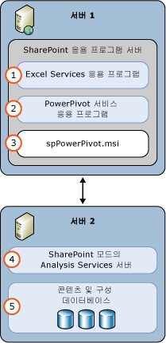

# SharePoint용 파워 피벗(SSAS)
  [!INCLUDE[ssASnoversion](../../includes/ssasnoversion-md.md)] 모드의 [!INCLUDE[ssGemini](../../includes/ssgemini-md.md)] 서버는 SharePoint 팜에서 [!INCLUDE[ssGemini](../../includes/ssgemini-md.md)] 데이터의 서버 호스팅을 제공합니다. [!INCLUDE[ssGemini](../../includes/ssgemini-md.md)] 데이터는 다음 중 하나를 사용하여 빌드하는 분석 데이터 모델입니다.  
  
-   Excel 2010용 [!INCLUDE[ssGemini](../../includes/ssgemini-md.md)] 추가 기능  
  
-   Excel 2013  
  
-   Excel 2016  
  
 **[!INCLUDE[applies](../../includes/applies-md.md)]**  [!INCLUDE[ssGeminiShort](../../includes/ssgeminishort-md.md)] 2016 | [!INCLUDE[ssGeminiShort](../../includes/ssgeminishort-md.md)] 2013  
  
 이 데이터의 서버 호스팅에는 SharePoint, Excel 서비스 및 SharePoint용 [!INCLUDE[ssGemini](../../includes/ssgemini-md.md)] 설치가 필요합니다. 데이터는 SharePoint용 [!INCLUDE[ssGemini](../../includes/ssgemini-md.md)] 인스턴스에 로드되며 여기서 서버가 Excel 2010 통합 문서용으로 제공하거나 [!INCLUDE[ssGemini](../../includes/ssgemini-md.md)]가 Excel 2013 및 2016 통합 문서용으로 제공하는 [!INCLUDE[ssGemini](../../includes/ssgemini-md.md)] 데이터 새로 고침 기능을 사용하여 예약된 간격으로 데이터를 새로 고칠 수 있습니다.  
  
## SharePoint 2016용 파워 피벗  
 [!INCLUDE[ssCurrent](../../includes/sscurrent-md.md)] [!INCLUDE[ssGeminiShort](../../includes/ssgeminishort-md.md)] 은 데이터 모델 및 [!INCLUDE[ssRSnoversion](../../includes/ssrsnoversion-md.md)] 파워 뷰 보고서를 포함하는 Excel 통합 문서의 [!INCLUDE[msCoName](../../includes/msconame-md.md)] SharePoint 2016 및 [!INCLUDE[offOnlineServer](../../includes/offonlineserver-md.md)] 사용을 지원합니다.  
  
 Excel에는 브라우저에서 [!INCLUDE[ssGemini](../../includes/ssgemini-md.md)] 통합 문서와 상호 작용할 수 있도록 데이터 모델 기능이 [!INCLUDE[offOnlineServer](../../includes/offonlineserver-md.md)] 내에 포함되어 있습니다. SharePoint 2016용 [!INCLUDE[ssGemini](../../includes/ssgemini-md.md)] 추가 기능을 팜에 배포하지 않아도 됩니다. [!INCLUDE[ssASnoversion](../../includes/ssasnoversion-md.md)] 서버를 [!INCLUDE[ssGemini](../../includes/ssgemini-md.md)] 모드에서 설치하고 [!INCLUDE[offOnlineServer](../../includes/offonlineserver-md.md)]과 함께 서버를 등록해야만 합니다.  
  
 SharePoint 2016용 [!INCLUDE[ssGemini](../../includes/ssgemini-md.md)] 추가 기능을 배포하면 추가 기능 및 SharePoint 팜의 기능을 사용할 수 있습니다. 추가 기능에는 [!INCLUDE[ssGemini](../../includes/ssgemini-md.md)] 갤러리 및 데이터 새로 고침 예약이 있습니다.  
  
   
  
## SharePoint 2013용 파워 피벗  
 [!INCLUDE[ssCurrent](../../includes/sscurrent-md.md)] [!INCLUDE[ssGeminiShort](../../includes/ssgeminishort-md.md)] 은 데이터 모델 및 [!INCLUDE[ssRSnoversion](../../includes/ssrsnoversion-md.md)] 파워 뷰 보고서를 포함하는 Excel 통합 문서의 [!INCLUDE[msCoName](../../includes/msconame-md.md)] SharePoint 2013 Excel Services 사용을 지원합니다.  
  
 SharePoint 2013의 Excel Services에는 브라우저에서 [!INCLUDE[ssGemini](../../includes/ssgemini-md.md)] 통합 문서와 상호 작용할 수 있도록 데이터 모델 기능이 포함되어 있습니다. SharePoint 2013용 [!INCLUDE[ssGemini](../../includes/ssgemini-md.md)] 추가 기능을 팜에 배포하지 않아도 됩니다. SharePoint 모드의 [!INCLUDE[ssASnoversion](../../includes/ssasnoversion-md.md)] 서버를 설치하고 Excel Services **데이터 모델** 설정 내에 서버를 등록해야 합니다.  
  
 SharePoint 2013용 [!INCLUDE[ssGemini](../../includes/ssgemini-md.md)] 추가 기능을 배포하면 추가 기능 및 SharePoint 팜의 기능을 사용할 수 있습니다. 추가 기능에는 [!INCLUDE[ssGemini](../../includes/ssgemini-md.md)] 갤러리, 데이터 새로 고침 예약 및 [!INCLUDE[ssGemini](../../includes/ssgemini-md.md)] 관리 대시보드가 있습니다.  
  
   
  
##   섹션 내용  
 [중앙 관리에서 파워 피벗 서버 관리 및 구성](../../analysis-services/power-pivot-sharepoint/power-pivot-server-administration-and-configuration-in-central-administration.md)  
  
 [Windows PowerShell을 사용하여 파워 피벗 구성](../../analysis-services/power-pivot-sharepoint/power-pivot-configuration-using-windows-powershell.md)  
  
 [파워 피벗 구성 도구](../../analysis-services/power-pivot-sharepoint/power-pivot-configuration-tools.md)  
  
 [Power Pivot 인증 및 권한 부여](../../analysis-services/power-pivot-sharepoint/power-pivot-authentication-and-authorization.md)  
  
 [PowerPivot 상태 규칙 구성](../../analysis-services/power-pivot-sharepoint/configure-power-pivot-health-rules.md)  
  
 [Power Pivot 관리 대시보드 및 사용 데이터](../../analysis-services/power-pivot-sharepoint/power-pivot-management-dashboard-and-usage-data.md)  
  
 [파워 피벗 갤러리](../Topic/Power%20Pivot%20Gallery.md)  
  
 [파워 피벗 데이터 액세스](../../analysis-services/power-pivot-sharepoint/power-pivot-data-access.md)  
  
 [Power Pivot 데이터 새로 고침](../../analysis-services/power-pivot-sharepoint/power-pivot-data-refresh.md)  
  
 [파워 피벗 데이터 피드](../../analysis-services/power-pivot-sharepoint/power-pivot-data-feeds.md)  
  
 [파워 피벗 BI 의미 체계 모델 연결&#40;.bism&#41;](../../analysis-services/power-pivot-sharepoint/power-pivot-bi-semantic-model-connection-bism.md)  
  
 **다른 섹션**  
  
## 추가 항목  
 [SharePoint용 파워 피벗 업그레이드](../../database-engine/install-windows/upgrade-power-pivot-for-sharepoint.md)  
  
 [파워 피벗 모드에서 Analysis Services 설치](../../analysis-services/instances/install-windows/install-analysis-services-in-power-pivot-mode.md)  
  
 [SharePoint용 파워 피벗에 대한 PowerShell 참조](../../analysis-services/powershell/powershell-reference-for-power-pivot-for-sharepoint.md)  
  
 [SQL Server 2016 비즈니스 인텔리전스에 대한 예제 라이선스 토폴로지 및 비용](../Topic/Example%20License%20Topologies%20and%20Costs%20%20for%20SQL%20Server%202016%20Business%20Intelligence.md)  
  
## 관련 항목:  
 [Power Pivot 계획 및 배포](http://go.microsoft.com/fwlink/?linkID=220972)   
 [SharePoint용 파워 피벗 재해 복구](http://go.microsoft.com/fwlink/p/?LinkId=389570)  
  
  