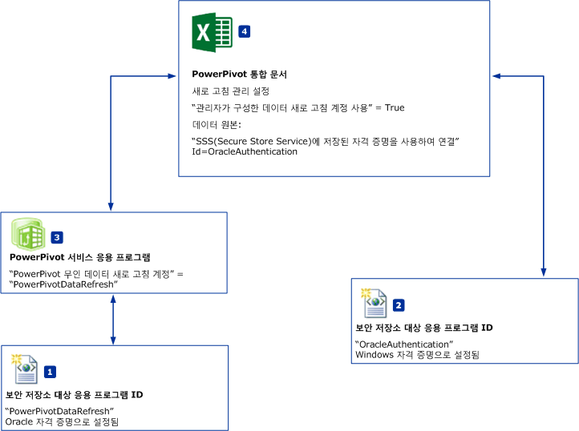
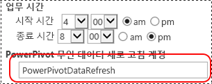

# 데이터 새로 고침 예약 및 데이터 소스에 Windows 인증 없음
[!INCLUDE[ssas-appliesto-sqlas](../../includes/ssas-appliesto-sqlas.md)]이 항목의 워크플로에 대해 설명 [!INCLUDE[ssGemini](../../includes/ssgemini-md.md)] SharePoint에 대 한 데이터 새로 고침 예약 데이터를 사용할 수 있는 원본을 **하지** Windows 인증을 지원 합니다. 예를 들어 Oracle 또는 IDM DB2 데이터 원본의 경우입니다. 이 항목의 그림 및 단계는 Oracle 데이터 원본을 참조하지만 동일한 워크플로가 다른 데이터 원본에도 적용됩니다.  
  
||  
|-|  
|**[!INCLUDE[applies](../../includes/applies-md.md)]**  SharePoint 2010 &#124; SharePoint 2013|  
  
 **개요:** 보안 저장소 대상 응용 프로그램을 두 개 만듭니다. Windows 자격 증명을 사용하는 첫 번째 대상 응용 프로그램(PowerPivotDataRefresh)을 구성합니다. Windows 인증을 지원하지 않는 데이터 원본(예: Oracle 데이터베이스)에 대한 자격 증명을 사용하여 두 번째 대상 응용 프로그램을 구성합니다. 두 번째 대상 응용 프로그램도 무인 데이터 새로 고침 계정에는 첫 번째 대상 응용 프로그램을 사용합니다.  
  
   
  
-   **(1) PowerPivotDatarefresh:** Windows 인증으로 설정된 보안 저장소 대상 응용 프로그램 ID입니다.  
  
-   **(2) OracleAuthentication:** Oracle 자격 증명으로 설정된 보안 저장소 대상 응용 프로그램 ID입니다.  
  
-   **(3)** [!INCLUDE[ssGemini](../../includes/ssgemini-md.md)] 서비스 응용 프로그램은 **무인 데이터 새로 고침 계정**에 대해 대상 응용 프로그램 “PowerPivotDataRefresh”를 사용하도록 구성됩니다.  
  
-   **(4)** PowerPivot 통합 문서는 Oracle 데이터를 사용합니다. 통합 문서 새로 고침 설정은 데이터 원본 연결 자격 증명에 대상 응용 프로그램 **(2)** 를 사용하도록 지정합니다.  
  
## 필수 구성 요소  
  
-   [!INCLUDE[ssGemini](../../includes/ssgemini-md.md)] 서비스 응용 프로그램이 있어야 합니다.  
  
-   Secure Store Service 응용 프로그램이 있습니다.  
  
-   [!INCLUDE[ssGemini](../../includes/ssgemini-md.md)] 데이터 모델이 포함된 Excel 통합 문서가 있어야 합니다.  
  
## Windows 인증을 사용하는 대상 응용 프로그램 ID를 만들려면  
  
1.  SharePoint 중앙 관리에서 **서비스 응용 프로그램 관리**를 클릭합니다.  
  
2.  Secure Store Service 응용 프로그램의 이름을 클릭합니다.  
  
3.  **관리** 페이지에서 **새로 만들기**를 클릭합니다.   
  
4.  **새 보안 저장소 대상 응용 프로그램 만들기** 페이지에서 다음 값을 구성합니다.  
  
    -   **대상 응용 프로그램 ID:** PowerPivotDataRefresh  
  
    -   **표시 이름:** PowerPivotDataRefresh  
  
    -   **담당자 메일:** ?  
  
    -   **대상 응용 프로그램 형식:** 그룹  
  
    -   **대상 응용 프로그램 페이지 URL:** 없음  
  
5.  **다음**을 클릭합니다.  
  
6.  자격 증명 페이지에서 **Windows 사용자 이름** 및 **Windows 암호**의 두 기본 필드 이름과 필드 형식은 그대로 둡니다.  
  
7.  **다음**을 클릭합니다.  
  
8.  **멤버 자격 설정** 페이지에서 하나 이상의 **대상 응용 프로그램 관리자** 를 추가한 다음 대상 응용 프로그램에 대한 액세스 권한이 필요한 멤버를 추가합니다.  
  
9. **확인**을 클릭합니다.  
  
10. 새 대상 응용 프로그램 ID가 목록에 추가됩니다. 대상 응용 프로그램 ID를 선택 하 고 클릭 **자격 증명 설정**합니다.  
  
11. Windows 사용자 이름 및 Windows 암호를 입력한 다음 **확인**을 클릭합니다.  
  
## Oracle 자격 증명을 사용하는 대상 응용 프로그램 ID를 만들려면  
  
1.  SharePoint 중앙 관리에서 **서비스 응용 프로그램 관리**를 클릭합니다.  
  
2.  Secure Store Service 응용 프로그램의 이름을 클릭합니다.  
  
3.  에 **관리** 페이지 **새로**.  
  
4.  **새 보안 저장소 대상 응용 프로그램 만들기** 페이지에서 다음 값을 구성합니다.  
  
    -   **대상 응용 프로그램 ID:** OracleAuthentication  
  
    -   **표시 이름:** OracleAuthentication  
  
    -   **담당자 메일:** ?  
  
    -   **대상 응용 프로그램 형식:** 그룹  
  
    -   **대상 응용 프로그램 페이지 URL:** 없음  
  
5.  **다음**을 클릭합니다.  
  
6.  **자격 증명** 페이지에서 첫 번째 필드 이름을 **Oracle User ID** 로 변경하고 **필드 형식** 을 **User Name**으로 변경합니다.  
  
     두 번째 필드 이름을 **Oracle Password** 로 변경하고 **필드 형식** 은 **Password**로 변경합니다.  
  
7.  **다음**을 클릭합니다.  
  
8.  **멤버 자격 설정** 페이지에서 하나 이상의 **대상 응용 프로그램 관리자** 를 추가한 다음 대상 응용 프로그램에 대한 액세스 권한이 필요한 멤버를 추가합니다.  
  
9. **확인**을 클릭합니다.  
  
10. 새 대상 응용 프로그램 ID가 목록에 추가됩니다. 대상 응용 프로그램 ID를 선택 하 고 클릭 **자격 증명 설정**합니다.  
  
11. Oracle 사용자 ID 및 Oracle 암호를 입력한 다음 **확인**을 클릭합니다.  
  
 자세한 내용은 [SQL Server 인증으로 보안 저장소 사용(SharePoint Server 2013)](http://technet.microsoft.com/library/gg298949.aspx) (http://technet.microsoft.com/library/gg298949.aspx)에서 “SQL Server 인증을 위한 대상 응용 프로그램을 만들려면” 섹션을 참조하세요.  
  
## 파워 피벗 서비스 응용 프로그램을 구성하려면  
  
1.  SharePoint 중앙 관리에서 서비스 응용 프로그램 관리를 클릭합니다.  
  
2.  [!INCLUDE[ssGemini](../../includes/ssgemini-md.md)] 서비스 응용 프로그램 이름을 클릭합니다(예: 기본 [!INCLUDE[ssGemini](../../includes/ssgemini-md.md)] 서비스 응용 프로그램).  
  
3.  동작 섹션에서 **서비스 응용 프로그램 설정 구성** 을 클릭합니다.  
  
4.  **데이터 새로 고침** 섹션에서 **[!INCLUDE[ssGemini](../../includes/ssgemini-md.md)] 무인 데이터 새로 고침 계정**을**PowerPivotDataRefresh** 로 설정한 다음 **확인**을 클릭합니다.  
  
       
  
## 통합 문서를 구성하려면  
  
1.  통합 문서를 찾습니다는 [!INCLUDE[ssGemini](../../includes/ssgemini-md.md)] 클릭 **데이터 새로 고침 관리**.  
  
2.  **데이터 새로 고침 기록** 페이지가 표시되면 **일정 구성**를 클릭합니다.  
  
3.  **사용**을 클릭합니다.  
  
4.  **가능한 빨리 새로 고치십시오.**를 클릭합니다.  
  
5.  **자격 증명** 섹션에서 **관리자가 구성한 데이터 새로 고침 계정 사용**을 클릭합니다.  
  
6.  **모든 데이터 원본**의 선택을 취소합니다.  
  
7.  Oracle 데이터를 사용하는 데이터 원본에 대해 **새로 고침** 을 선택합니다. 데이터 원본 이름의 이름은 Microsoft Excel의 **데이터**, **연결**, **속성** 메뉴에서 변경할 수 있습니다.  
  
8.  해당 데이터 원본에서 **기본 일정 사용**을 선택합니다.  
  
9. **데이터 원본에 로그온하려면 SSS(Secure Store Service)에 저장된 자격 증명을 사용하여 연결합니다. SSS ID 상자에 자격 증명을 조회하는 데 사용되는 ID를 입력합니다**.  
  
10. **ID:** 상자에 **OracleAuthentication**을 입력합니다.  
  
11. **확인**을 클릭합니다.  
  
     `The provided Secure Store target application is either incorrectly configured or does not exist`과(와) 유사한 오류 메시지가 표시될 경우.  
  
     일반적인 해결 방법으로는 다음 두 가지가 있습니다.  
  
    -   대상 응용 프로그램 ID가 올바른지 확인하십시오.  
  
    -   대상 응용 프로그램에 대한 자격 증명 설정을 확인하십시오.  
  
## 새 인증으로 데이터 새로 고침을 확인하려면  
 **확인**을 클릭하면 **새로 고침 기록** 페이지가 표시됩니다. 이전 단계에서 **가능한 빨리 새로 고치십시오.**를 선택했으므로 몇 분 이내에 새로 고침 기록에 새 항목이 표시됩니다. 타이머 작업 **[!INCLUDE[ssGemini](../../includes/ssgemini-md.md)] 데이터 새로 고침 타이머 작업** 의 기본값은 1분입니다. 새로 고침 기록에 새 항목이 표시되지 않으면 몇 분 기다렸다가 브라우저를 새로 고치십시오. 여전히 새 항목이 표시되지 않으면 타이머 작업의 현재 값을 확인하십시오.  
  
## 자세한 정보  
  
-   [SharePoint 2013에서 보안 저장소 서비스 구성](http://technet.microsoft.com/library/ee806866.aspx).  
  
-   [SharePoint 2013 및 SQL Server 2012 SP1에서 파워 피벗 데이터 새로 고침(Analysis Services)](http://msdn.microsoft.com/library/jj879294.aspx#bkmk_windows_auth_interactive_data_refresh)의 "예약된 데이터 새로 고침" 섹션을 참조하세요.  
  
  
