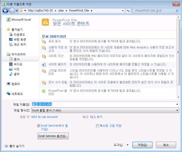

# 파워 피벗 갤러리 사용
[!INCLUDE[ssas-appliesto-sqlas](../../includes/ssas-appliesto-sqlas.md)]
  [!INCLUDE[ssGemini](../../includes/ssgemini-md.md)] 갤러리는 [!INCLUDE[ssGemini](../../includes/ssgemini-md.md)] 데이터를 포함하는 게시된 Excel 통합 문서 및 Reporting Services 보고서에 대해 유용한 미리 보기와 문서 관리 기능을 제공합니다.  
  
> [!NOTE]  
>  해당 서버를 구성하는 방법에 따라 특정 문서에 대한 미리 보기 영역에서 경고 또는 오류 메시지가 표시될 수 있습니다. Excel 통합 문서를 열 때마다 해당 데이터를 자동으로 새로 고치도록 설정한 경우 메시지가 표시될 수 있습니다. Excel 서비스가 새로 고칠 때 경고 오류 메시지를 표시하도록 구성되어 있으면 데이터 새로 고침 경고 메시지가 미리 보기 이미지로 나타납니다. 팜 또는 서비스 관리자는 구성 설정을 수정하여 실제 워크시트의 미리 보기가 나타나도록 허용할 수 있습니다. 자세한 내용은 [중앙 관리에서 파워 피벗 사이트에 대한 신뢰할 수 있는 위치 만들기](../../analysis-services/power-pivot-sharepoint/create-a-trusted-location-for-power-pivot-sites-in-central-administration.md)을 참조하세요.  
  
##   항목 내용  
 [필수 구성 요소](#prereq)  
  
 [파워 피벗 갤러리의 아이콘](#icons)  
  
 [파워 피벗 갤러리에 Excel 통합 문서 저장](#add)  
  
 [게시된 파워 피벗 통합 문서를 기반으로 새 보고서나 통합 문서 만들기](#newdocs)  
  
 [통합 문서 또는 보고서를 전체 페이지 모드로 열기](#view)  
  
 [파워 피벗 갤러리의 파워 피벗 통합 문서에 대한 데이터 새로 고침 예약](#newdr)  
  
 [파워 피벗 갤러리에서 통합 문서 또는 보고서 삭제](#delete)  
  
 [축소판 이미지 새로 고침](#image)  
  
 [알려진 문제](#bkmk_known_issues)  
  
##   필수 구성 요소  
  
> [!NOTE]  
>  파워 피벗 갤러리에는 Microsoft Silverlight가 필요합니다.  Microsoft Edge 브라우저는 Silverlight를 지원하지 않습니다.   
> Edge에서 라이브러리 콘텐츠를 보려면 파워 피벗 갤러리에서 **라이브러리** 탭을 클릭한 다음 문서 라이브러리 보기를 **모든 문서**로 변경합니다.    
> 기본 보기를 변경하려면 **라이브러리** 탭을 클릭한 다음 보기 수정을 클릭합니다. "이 보기를 기본 보기로 만듭니다"를 클릭한 다음 확인을 클릭하여 기본 보기를 저장합니다.  
>  Edge에서 지원하는 사항에 대한 자세한 내용은 Windows 블로그 [과거로부터의 완벽한 변화, 2부: ActiveX, VBScript의 종말...](https://blogs.windows.com/msedgedev/2015/05/06/a-break-from-the-past-part-2-saying-goodbye-to-activex-vbscript-attachevent/)(영문)을 참조하세요.  
  
 필수 조건의 전체 목록은 [Create and Customize Power Pivot Gallery](../../analysis-services/power-pivot-sharepoint/create-and-customize-power-pivot-gallery.md)을 참조하세요.  
  
##   파워 피벗 갤러리의 아이콘  
 아이콘은 콘텐츠 사용 가능 여부와 상태를 시각적으로 표시합니다.  
  
|아이콘|Description|  
|----------|-----------------|  
||문서의 각 페이지 축소판 이미지를 생성하는 동안에는 모래 시계 아이콘이 나타납니다. 업데이트된 이미지를 표시하려면 페이지를 새로 고칩니다.|  
||통합 문서 또는 보고서의 페이지 수가 [!INCLUDE[ssGemini](../../includes/ssgemini-md.md)] 갤러리에 표시할 수 있는 것보다 많으면 페이지 아이콘이 나타납니다. 모든 페이지를 표시하려면 클라이언트 응용 프로그램을 사용해야 합니다.|  
||문서의 축소판 이미지를 렌더링할 수 없으면 오류 아이콘이 나타납니다. 문서는 라이브러리에 게시되기는 하지만 사용자 지정 [!INCLUDE[ssGemini](../../includes/ssgemini-md.md)] 갤러리 보기에서 렌더링할 수는 없습니다. Excel용 [!INCLUDE[ssGemini](../../includes/ssgemini-md.md)] 추가 기능 등의 클라이언트 응용 프로그램에서는 문서를 볼 수 있습니다.|  
||업로드한 문서를 [!INCLUDE[ssGemini](../../includes/ssgemini-md.md)] 갤러리에서 렌더링할 수 없으면 콘텐츠 사용할 수 없음 아이콘이 나타납니다. 지원되는 문서 유형에는 SQL Server 2008 R2 Reporting Services 보고서 작성기에서 만든 [!INCLUDE[ssGemini](../../includes/ssgemini-md.md)] 통합 문서 및 보고서가 포함됩니다.   휴지통에서 문서를 재활용하는 경우에도 이 아이콘이 표시됩니다.   이전에는 유효한 미리 보기 이미지를 제공했던 문서에 이 아이콘이 표시되게 하려는 경우 문서 속성을 편집하고 변경 사항을 저장하여 이미지를 새로 고칠 수 있습니다.|  
||이 문서에 대해 축소판 이미지를 의도적으로 사용할 수 없도록 설정한 경우 콘텐츠 잠김 아이콘이 나타납니다. [!INCLUDE[ssGemini](../../includes/ssgemini-md.md)] 갤러리는 [!INCLUDE[ssGemini](../../includes/ssgemini-md.md)] 데이터가 없는 Excel 통합 문서나 스냅숏 생성 요구 사항을 충족하지 않는 [!INCLUDE[ssGemini](../../includes/ssgemini-md.md)] 통합 문서 또는 Reporting Services 보고서에 대한 축소판 이미지를 생성하지 않습니다. 자세한 내용은 이 항목의 사전 요구 사항 섹션을 참조하세요.|  
  
##   파워 피벗 갤러리에 Excel 통합 문서 저장  
 Excel 2010에서 제공하는 모든 공유 기술을 사용하여 [!INCLUDE[ssGemini](../../includes/ssgemini-md.md)] 통합 문서를 라이브러리에 게시할 수 있습니다. 예를 들어 Excel 2010에서 다른 이름으로 저장을 사용하여 라이브러리에 대한 전체 또는 부분 SharePoint 경로를 지정할 수 있습니다.  
  
1.  파일을 저장합니다.  
  
2.  1.  **Excel 2010:** 파일 메뉴에서 **저장 및 보내기**를 클릭합니다.  
  
    2.  **SharePoint에 저장**을 클릭합니다.  
  
    3.  Excel 서비스 옵션을 사용하여 게시하려는 개별 시트 또는 매개 변수를 선택하려면 **게시 옵션** 을 클릭합니다. 예를 들어 Excel 서비스 옵션의 매개 변수 탭을 사용하면 게시된 통합 문서에 표시할 슬라이서를 선택할 수 있습니다.  
  
    1.  **Excel 2013:**  파일 메뉴에서 **저장**을 클릭하세요.  
  
    2.  Excel 서비스 옵션을 사용하여 게시하려는 개별 시트 또는 매개 변수를 선택하려면 **브라우저 보기 옵션** 을 클릭합니다. 예를 들어 Excel 서비스 옵션의 매개 변수 탭을 사용하면 게시된 통합 문서에 표시할 슬라이서를 선택할 수 있습니다.  
  
3.  다른 이름으로 저장 대화 상자의 파일 이름에 [!INCLUDE[ssGemini](../../includes/ssgemini-md.md)] 갤러리의 전체 또는 부분 URL을 입력합니다. 서버 이름과 같이 URL 주소의 일부를 입력하는 경우 사이트를 탐색하여 [!INCLUDE[ssGemini](../../includes/ssgemini-md.md)] 갤러리를 찾을 수 있습니다. 이렇게 하려면 **저장** 을 클릭하여 지정한 서버에 대한 연결을 엽니다.  
  
       
  
1.  다른 이름으로 저장 대화 상자를 사용하여 사이트에서 [!INCLUDE[ssGemini](../../includes/ssgemini-md.md)] 갤러리를 선택합니다.  
  
2.  **열기** 를 클릭하여 라이브러리를 엽니다.  
  
3.  **저장** 을 클릭하여 통합 문서를 라이브러리에 게시합니다.  
  
 브라우저 창에서 해당 문서가 [!INCLUDE[ssGemini](../../includes/ssgemini-md.md)] 갤러리에 나타나는지 확인합니다. 새로 게시된 문서가 목록에 나타납니다. 라이브러리 설정에 따라 문서의 표시 방법이 결정됩니다(예: 날짜별 오름차순 정렬 또는 이름별 사전순 정렬). 가장 최근에 추가된 항목을 보려면 브라우저 창을 새로 고쳐야 할 수도 있습니다.  
  
#### 파워 피벗 갤러리에 통합 문서 업로드  
 SharePoint에서 시작하여 컴퓨터에서 게시할 파일을 선택하려는 경우 통합 문서를 업로드할 수도 있습니다.  
  
1.  SharePoint  사이트에서 [!INCLUDE[ssGemini](../../includes/ssgemini-md.md)] 갤러리를 엽니다.  
  
2.  라이브러리 리본에서 **문서**를 클릭합니다.  
  
3.  **문서 업로드**에서 업로드 옵션을 선택한 다음 업로드할 파일의 이름과 위치를 입력합니다. 라이브러리 설정에 따라 문서의 표시 방법이 결정됩니다. 가장 최근에 추가된 항목을 보려면 브라우저 창을 새로 고쳐야 할 수도 있습니다.  
  
##   게시된 파워 피벗 통합 문서를 기반으로 새 보고서나 통합 문서 만들기  
 [!INCLUDE[ssGemini](../../includes/ssgemini-md.md)] 갤러리에 게시하는 [!INCLUDE[ssGemini](../../includes/ssgemini-md.md)] 통합 문서의 경우 게시된 통합 문서를 연결된 데이터 원본으로 사용하는 추가 통합 문서나 Reporting Services 보고서를 만들 수 있습니다.  
  
|||  
|-|-|  
||보고서 작성기나 Excel 2010을 시작하려면 새 보고서 단추의 아래쪽 화살표 부분을 클릭합니다. [!INCLUDE[ssGemini](../../includes/ssgemini-md.md)] 새 보고서 단추를 사용하려면 갤러리에서 미리 정의된 보기(극장식, 갤러리, 회전식) 중 하나를 사용해야 합니다.|  
  
#### 보고서 작성기 보고서 만들기  
 라이브러리에서 기존 [!INCLUDE[ssGemini](../../includes/ssgemini-md.md)] 통합 문서를 기반으로 새 보고서를 만들려면 [!INCLUDE[ssGemini](../../includes/ssgemini-md.md)] 갤러리를 포함하는 동일 사이트에 대해 Reporting Services를 SharePoint 통합용으로 구성해야 합니다. 보고서 작성기 보고서 만들기 옵션을 선택하면 보고서 서버에서 보고서 작성기가 다운로드되어 처음 사용 시 로컬 워크스테이션에 설치됩니다. 그런 다음 새 보고서에 대한 자리 표시자 보고서 파일이 생성되어 [!INCLUDE[ssGemini](../../includes/ssgemini-md.md)] 갤러리에 저장됩니다. 또한 [!INCLUDE[ssGemini](../../includes/ssgemini-md.md)] 통합 문서에 대한 연결 정보가 보고서에서 새 데이터 원본으로 자동 생성됩니다. 다음 단계로, 디자인 작업 영역에서 데이터 집합 및 보고서 레이아웃을 만들 수 있습니다. 보고서 작성기를 사용하여 보고서를 조합할 때 변경 사항 및 최종 결과를 갤러리의 보고서 문서에 저장할 수 있습니다. 나중에 데이터 연결이 끊어지지 않도록 같은 라이브러리에 보고서와 통합 문서 파일을 함께 둡니다.  
  
#### 새 Excel 통합 문서 열기  
 기존 통합 문서에서 새 Excel 통합 문서를 만들려면 로컬 컴퓨터에 Excel 및 [!INCLUDE[ssGeminiClient](../../includes/ssgeminiclient-md.md)] 이 있어야 합니다. 새 Excel 통합 문서 열기를 선택하면 Excel이 시작되고, 빈 통합 문서(.xlsx) 파일이 열리며, 백그라운드로 [!INCLUDE[ssGemini](../../includes/ssgemini-md.md)] 데이터가 연결된 데이터 원본으로 로드됩니다. 원래 통합 문서의 [!INCLUDE[ssGemini](../../includes/ssgemini-md.md)] 창에 표시된 데이터만 새 통합 문서에서 사용됩니다. 원래 통합 문서의 피벗 테이블 또는 피벗 차트는 제외됩니다. 새 통합 문서는 원래 통합 문서의 데이터에 연결됩니다. 데이터가 새 통합 문서 자체에 복사되지는 않습니다.  
  
##   통합 문서 또는 보고서를 전체 페이지 모드로 열기  
 [!INCLUDE[ssGemini](../../includes/ssgemini-md.md)] 갤러리 미리 보기와 관계없이 미리 보기한 문서의 표시된 축소판 이미지를 클릭하여 전체 페이지 모드로 문서를 열 수 있습니다. [!INCLUDE[ssGemini](../../includes/ssgemini-md.md)] 통합 문서는 브라우저에서 열립니다. Reporting Services 보고서는 SharePoint 서버의 Reporting Services 배포에 포함된 ReportViewer 웹 파트에서 열립니다.  
  
 브라우저에서 통합 문서를 보는 다른 방법은 클라이언트 워크스테이션의 Excel에서 여는 것입니다. 파일을 보려면 Excel 2013 또는 Excel 2010과 [!INCLUDE[ssGeminiClient](../../includes/ssgeminiclient-md.md)] 추가 기능이 있어야 합니다. Excel 2007을 사용하여 파일을 열 수 있지만 이를 사용하여 데이터를 피벗할 수 없습니다. 따라서 [!INCLUDE[ssGemini](../../includes/ssgemini-md.md)] 보기와 만들기에는 Excel 2013 또는 Excel 2010을 사용하는 것이 좋습니다. 필요한 응용 프로그램이 없는 경우 브라우저를 사용하여 SharePoint에서 통합 문서를 표시해야 합니다.  
  
##   파워 피벗 갤러리의 파워 피벗 통합 문서에 대한 데이터 새로 고침 예약  
 [!INCLUDE[ssGemini](../../includes/ssgemini-md.md)] 데이터를 예약된 간격으로 새로 고칠 수 있습니다.  
  
|||  
|-|-|  
||데이터 새로 고침 관리 단추를 클릭하여 연결된 데이터 원본에서 업데이트된 데이터를 검색하는 일정을 만들거나 봅니다. 일정을 만드는 방법에 대한 지침은 [데이터 새로 고침 예약(SharePoint용 파워 피벗)](http://msdn.microsoft.com/en-us/8571208f-6aae-4058-83c6-9f916f5e2f9b)을 참조하세요.|  
  
##   파워 피벗 갤러리에서 통합 문서 또는 보고서 삭제  
 라이브러리에서 문서를 삭제하려면 먼저 모든 문서 보기로 전환합니다.  
  
1.  SharePoint  사이트에서 [!INCLUDE[ssGemini](../../includes/ssgemini-md.md)] 갤러리를 엽니다.  
  
2.  리본에서 **라이브러리**를 클릭합니다.  
  
3.  보기 관리에 있는 현재 보기 목록에서 아래쪽 화살표를 클릭하고 모든 문서를 선택합니다.  
  
4.  삭제할 통합 문서나 보고서를 선택합니다.  
  
5.  문서(파일)의 관리에서 **문서 삭제** 단추를 클릭합니다.  
  
##   축소판 이미지 새로 고침  
 [!INCLUDE[ssGemini](../../includes/ssgemini-md.md)] 갤러리에 있는 문서에 대한 축소판 이미지를 다시 생성하려면 다음 단계를 수행합니다.  
  
1.  [!INCLUDE[ssGemini](../../includes/ssgemini-md.md)] 갤러리를 모든 문서 보기로 전환합니다. 이렇게 전환하려면 리본에서 **라이브러리** 를 클릭하고 **현재 보기** 를 **모든 문서**로 변경합니다.  
  
2.  축소판 이미지를 새로 고칠 통합 문서 또는 보고서를 선택합니다.  
  
3.  오른쪽에 있는 아래쪽 화살표를 클릭한 다음 **속성 편집**을 선택합니다.  
  
4.  **저장**을 클릭합니다. 문서를 저장하면 스냅숏 서비스에서 미리 보기 이미지를 다시 생성합니다.  
  
##   알려진 문제  
  
### 문서 유형이 지원되지 않습니다.  
 **[!INCLUDE[ssGemini](../../includes/ssgemini-md.md)] 갤러리 문서** 콘텐츠 형식은 지원되지 않습니다. 문서 라이브러리에 대해 **[!INCLUDE[ssGemini](../../includes/ssgemini-md.md)] 갤러리 문서** 콘텐츠 형식을 사용하도록 설정하고 해당 형식의 새 문서를 만들려고 하면 다음 중 하나와 비슷한 오류 메시지가 표시됩니다.  
  
-   '새 문서'를 사용하려면 Microsoft Sharepoint Foundation 호환 응용 프로그램 및 웹 브라우저가 있어야 합니다. 이 문서 라이브러리에 문서를 추가하려면 '문서 업로드' 단추를 클릭하세요.  
  
-   "인터넷 주소 'http://[server name]/testSite/PowerPivot Gallery/ReportGallery/Forms/Template.xlsx'가 잘못되었습니다. Microsoft Excel에서 'http://[server name]/testSite/PowerPivot Gallery/ReportGallery/Forms/Template.xlsx' 파일에 액세스할 수 없습니다." 원인은 다음과 같습니다.  
  
 **[!INCLUDE[ssGemini](../../includes/ssgemini-md.md)] 갤러리 문서** 콘텐츠 형식이 문서 라이브러리에 자동으로 추가되지 않습니다. 지원되지 않는 콘텐츠 형식을 사용하도록 수동으로 설정하지 않으면 이 문제가 발생하지 않습니다.  
  
## 관련 항목:  
 [Create a trusted location for Power Pivot sites in Central Administration](../../analysis-services/power-pivot-sharepoint/create-a-trusted-location-for-power-pivot-sites-in-central-administration.md)   
 [파워 피벗 갤러리 삭제](../../analysis-services/power-pivot-sharepoint/delete-power-pivot-gallery.md)   
 [만들기 및 파워 피벗 갤러리에 사용자 지정](../../analysis-services/power-pivot-sharepoint/create-and-customize-power-pivot-gallery.md)   
 [데이터 새로 고침 예약(SharePoint용 파워 피벗)](http://msdn.microsoft.com/en-us/8571208f-6aae-4058-83c6-9f916f5e2f9b)  
  
  
