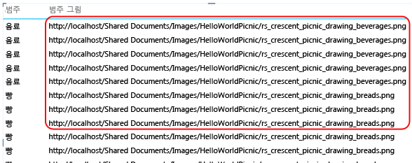
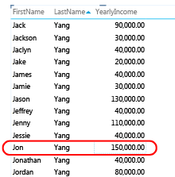
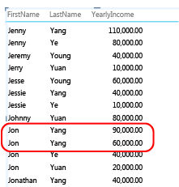
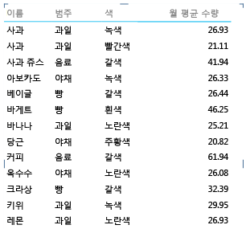
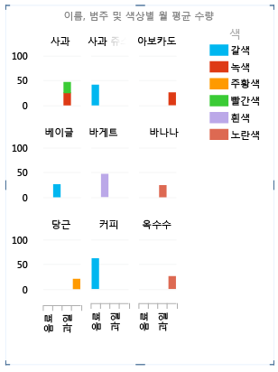
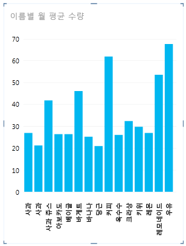

# Power View-보고서에 대 한 테이블 동작 속성 구성
[!INCLUDE[ssas-appliesto-sqlas-aas](../../includes/ssas-appliesto-sqlas-aas.md)]
  테이블 형식 모델을 [!INCLUDE[ssCrescent](../../includes/sscrescent-md.md)]에 대한 데이터 모델로 사용할 경우 정보 행을 더 자세히 표시하는 테이블 동작 속성을 설정할 수 있습니다. 테이블 동작 속성을 설정하면 정보 행의 그룹화 동작이 변경되고 바둑판식 배열, 카드 및 차트 레이아웃의 식별 정보(예: 이름, 사진 ID, 로고 이미지)의 기본 배치가 향상됩니다.  
  
 [!INCLUDE[ssCrescent](../../includes/sscrescent-md.md)]수 있으므로 사용 중인 표시 형식 기준으로 보고서 필드 목록에 배치 하는 열을 평가 하 여 보고서 디자인 중 항목을 자동으로 그룹화 합니다 것 한다는 점에서 다른 보고 응용 프로그램에서 다릅니다. 대부분의 경우 기본 그룹화를 통해 최적의 결과가 만들어집니다. 그러나 정보 데이터가 포함된 일부 테이블의 경우 그룹화되지 않아야 할 행이 기본 그룹화 동작에 의해 그룹화되는 경우도 있습니다. 이러한 테이블의 경우 그룹 평가 방법을 변경하는 속성을 설정할 수 있습니다.  
  
 테이블 동작 속성은 직원 또는 고객 레코드와 같이 개별 행이 주요 대상인 테이블에 대해 설정하는 것이 좋습니다. 반대로 조회 테이블로 사용되는 테이블(예: 상대적으로 적은 수의 행과 열로 구성되는 데이터 테이블, 제품 범주 테이블 또는 부서 테이블)이나 요약할 때만 필요한 행이 포함된 요약 테이블(예: 성별, 연령별 또는 지역별로 롤업되는 인구 조사 데이터)의 경우 이러한 속성이 유용하지 않습니다. 조회 및 요약 테이블의 경우 기본 그룹화 동작으로 최상의 결과가 만들어집니다.  
  
> [!NOTE]  
>  테이블 동작 속성은 [!INCLUDE[ssCrescent](../../includes/sscrescent-md.md)]에서 데이터 모델로 사용되는 테이블 형식 모델에만 영향을 줍니다. Excel 피벗 보고서에서는 테이블 동작 속성이 지원되지 않습니다.  
  
 다음과 같은 테이블 동작 속성이 있습니다.  
  
-   **행 식별자** - 열을 내부 그룹화 키로 사용할 수 있도록 고유한 값만 포함하는 열을 지정합니다.  
  
-   **고유한 행 유지** - 중복된 경우에도 고유한 값으로 처리되어야 하는 값을 제공하는 열을 지정합니다(예: 이름이 같은 직원이 여러 명 있는 경우의 직원 이름과 성).  
  
-   **기본 레이블** - 행 데이터를 표시하도록 표시 이름을 제공하는 열을 지정합니다(예: 직원 레코드의 직원 이름).  
  
-   **기본 이미지** - 행 데이터를 표시하는 이미지를 제공하는 열을 지정합니다(예: 직원 레코드의 사진 ID).  
  
> [!NOTE]  
>  특정 표시 형식의 관점에서 레이아웃을 최적화하는 방법에 대한 자세한 내용은  [특정 레이아웃 최적화](#bkmk_optimizeforlayout)섹션을 참조하세요.  
  
## 테이블 동작 대화 상자 열기  
  
1.  [!INCLUDE[ssBIDevStudioFull](../../includes/ssbidevstudiofull-md.md)]에서 기본 필드 목록을 구성 중인 테이블(탭)을 클릭합니다.  
  
2.  **속성** 창의 **테이블 동작** 속성에서 **편집하려면 클릭**을 클릭합니다.  
  
3.  **테이블 동작** 대화 상자에서 **행 식별자**를 설정한 다음 이 대화 상자에서 다른 속성을 지정합니다.  
  
## 행 식별자 속성 설정  
 테이블에서 행 식별자는 공백이 아닌 고유한 값만 포함하는 단일 열을 지정합니다. 행 식별자 속성은 특정 보고서 레이아웃에 사용되는 필드에 상관없이 항상 행을 고유하게 식별하는 데 사용되는 고정 열 대신 행의 필드 컴퍼지션을 기반으로 그룹화하지 않도록 그룹화를 변경하는 데 사용됩니다.  
  
 이 속성을 설정하면 기본 그룹화 동작이 캔버스에 있는 열을 기반으로 하는 동적 그룹화에서 행 식별자를 기반으로 요약하는 고정 그룹화 동작으로 변경됩니다. 기본 그룹화 동작 변경은 행의 각 열에 대해 그룹화하거나 부분합을 표시하는 보고서 레이아웃(예: 행렬)과 관련이 있습니다.  
  
 [!INCLUDE[ssCrescent](../../includes/sscrescent-md.md)]에서 행 식별자를 설정하여 추가 속성인 **Keep Unique Rows** 속성, **Default Label** 속성 및 **Default Image** 속성을 활성화합니다.  
  
 **행 식별자** 를 독립 실행형 속성으로 사용하여 다음을 설정할 수도 있습니다.  
  
-   보고서에 이진 이미지 사용. 행 고유성과 관련한 모호성을 제거하여 [!INCLUDE[ssCrescent](../../includes/sscrescent-md.md)] 에서 지정된 행에 대한 기본 이미지와 기본 레이블을 할당하는 방법을 결정할 수 있습니다.  
  
-   행렬 보고서에서 원치 않는 부분합 제거. 필드 수준의 기본 그룹화는 각 필드에 대한 부분합을 만듭니다. 행 수준에서 단일 부분합만 계산하려면 행 식별자를 설정합니다.  
  
 날짜 테이블로 표시된 테이블에 대해서는 행 식별자를 설정할 수 없습니다. 날짜 테이블의 경우 테이블을 표시하면 행 식별자가 지정됩니다. 자세한 내용은 참조 [날짜 테이블 대화 상자로 표시 ](http://msdn.microsoft.com/library/698b5ef1-b79b-4d76-9847-39669b4f5bb9)합니다.  
  
## 고유한 행 유지 속성 설정  
 이 속성을 사용하면 각 행을 구별하여 ID 정보(예: 직원 이름, 제품 코드 등)를 전달하는 열을 지정할 수 있습니다. 두 고객의 이름이 같은 경우처럼 여러 행이 동일하게 나타나는 경우 이 속성에 대해 지정한 열이 보고서 테이블에서 반복됩니다.  
  
 보고서에 추가한 열에 따라 각 행의 값이 동일(예: 두 고객의 이름이 Jon Yang으로 동일)한 것으로 나타나기 때문에 서로 다른 행이 동일한 행으로 처리될 수도 있습니다. 구별되는 다른 열(예: 중간 이름, 주소, 생년월일 등)이 보고서 캔버스에 없기 때문에 이러한 상황이 발생할 수 있습니다. 이러한 경우 기본 동작은 동일한 행을 단일 행으로 그룹화하여 계산된 값을 결합된 행의 더 큰 단일 결과로 요약합니다.  
  
 **고유한 행 유지** 속성을 설정하면 열을 보고서 캔버스에 추가할 때마다 중복 인스턴스가 있더라도 항상 반복해야 하는 하나 이상의 열을 지정할 수 있습니다. 행에 연결된 계산된 값은 이제 단일 행으로 롤업되지 않고 각 개별 행을 기반으로 할당됩니다. **고유한 행 유지** 속성에 대한 열을 선택할 경우 고유하거나 거의 고유한 값을 포함하는 열을 선택합니다.  
  
> [!NOTE]  
>  최종 사용자가 선택하는 열이 그룹화에 영향을 주어서 식 계산에 대한 필터 컨텍스트가 변경될 수 있으므로 모델 디자이너는 올바른 결과를 반환하는 측정값을 만들도록 주의해야 합니다. 자세한 내용은 [파워 뷰 FAQ](http://go.microsoft.com/fwlink/?LinkId=220674)를 참조하십시오.  
  
## 기본 레이블 설정  
 이 속성은 바둑판식 배열 보고서의 탐색 스트립에 표시되는 레이블을 지정합니다. 기본 이미지와 함께 사용할 경우 기본 레이블이 이미지 아래에 표시됩니다. 이미지 없이 사용하는 경우에는 기본 레이블이 직접 표시됩니다. 기본 레이블을 선택한 경우 행에 대한 대부분의 정보(예: 이름)를 전달하는 열을 선택합니다.  
  
 바둑판식 배열 레이아웃에서 기본 레이블은 기본 이미지 속성에 정의된 대로 이미지 아래의 바둑판식 배열 영역에 표시됩니다. 예를 들어 직원 목록이 있는 경우 사진 ID를 기본 이미지로 사용하고 직원 이름을 기본 레이블로 사용하여 직원 정보를 바둑판식으로 표시할 수 있습니다. 바둑판식 배열에서 기본 레이블은 기본 이미지 아래에 표시됩니다. 이러한 열은 보고서 필드 목록에서 명시적으로 선택하지 않더라도 바둑판식 배열에 항상 표시됩니다.  
  
## 기본 이미지 설정  
 이 속성은 바둑판식 배열 보고서의 탐색 스트립 또는 카드의 맨 앞에 표시되는 이미지를 지정합니다. 보고서에서 기본 이미지가 포함된 열을 선택하면 바둑판식 배열 보고서 레이아웃의 탐색 스트립이나 카드의 맨 앞에 기본 이미지가 표시됩니다. 기본 이미지는 시각적 콘텐츠여야 합니다. 예를 들면 직원 테이블의 사진 ID, 고객 테이블의 고객 로고, 지리 테이블의 국가 셰이프 등이 있습니다.  
  
> [!NOTE]  
>  이미지는 웹 서버의 이미지 파일에 대한 URL 주소 또는 통합 문서에 포함된 이진 데이터를 기반으로 할 수 있습니다. 이미지가 URL을 기반으로 하는 경우 [!INCLUDE[ssCrescent](../../includes/sscrescent-md.md)] 에서 URL을 보고서에 텍스트 데이터로 표시하는 대신 이미지를 검색하도록 열을 이미지 유형으로 설정해야 합니다.  
  
##   특정 레이아웃 최적화  
 이 섹션에서는 데이터의 특정 표시 형식과 특성의 관점에서 테이블 동작 속성을 설정할 때의 효과에 대해 설명합니다. 예를 들어 행렬 보고서의 레이아웃을 세부적으로 조정하려면 이 정보를 사용하여 모델의 테이블 동작 속성으로 행렬 표시를 개선하는 방법을 이해할 수 있습니다.  
  
### 이미지가 없습니다.  
 모델에서 설정한 속성에 따라 보고서에서 이미지가 시각화되는지 아니면 텍스트 값으로 표시되는지가 결정됩니다.  
  
   
  
 기본적으로 모델의 텍스트는 보고서에서 텍스트로 해석됩니다. 텍스트 열이 보고서 이미지에 대한 URL 주소인 경우 **에서 이미지 파일을 검색하도록** 이미지 URL [!INCLUDE[ssCrescent](../../includes/sscrescent-md.md)] 속성을 설정해야 합니다. 이진 이미지의 경우 **행 식별자** 속성을 설정해야 합니다.  
  
### 테이블에서 하나 이상의 행이 누락되었습니다.  
 기본 그룹화 동작으로 인해 원하는 것과 반대의 결과가 나타나는 경우가 있습니다. 특히, 모델에 있는 정보 행이 보고서에 표시되지 않습니다. 기본적으로 [!INCLUDE[ssCrescent](../../includes/sscrescent-md.md)] 는 캔버스에 추가한 열에 그룹화됩니다. **국가 이름** 을 보고서에 추가할 경우 기본 테이블에 각 국가 이름의 여러 인스턴스를 포함하는 수천 개의 행이 있더라도 각 국가가 캔버스에 한 번만 표시됩니다. 이 경우 기본 그룹화 동작은 올바른 결과를 생성합니다.  
  
 그러나 기본 행에 다른 항목에 대한 데이터가 포함되어 있어서 행의 여러 인스턴스를 표시하려는 다른 예를 생각해 볼 수 있습니다. 이 예에서는 이름이 **Jon Yang**인 두 고객이 있다고 가정합니다. 기본 그룹화 동작을 사용하면 **Jon Yang** 인스턴스가 보고서에 하나만 표시됩니다. 또한 인스턴스가 목록에 하나만 표시되기 때문에 **연간 수입** 측정값은 두 고객에 대한 해당 값의 합계입니다.  
  
   
  
 기본 그룹화 동작을 변경하려면 **행 식별자** 및 **고유한 행 유지** 속성을 설정합니다. **고유한 행 유지**에서 성 값이 다른 행에 이미 표시되어 있더라도 이 값을 행에 대해 반복하도록 성 열을 선택합니다. 속성을 변경하고 통합 문서를 다시 게시한 후 동일한 보고서를 만들 수 있습니다. 이 경우에만 **연간 소득**이 올바르게 할당된 상태로 **Jon Yang** 이라는 두 고객이 모두 표시됩니다.  
  
   
  
### 행렬 레이아웃이 너무 복잡합니다.  
 행렬에 정보 테이블을 표시할 때 기본 그룹화 동작은 각 열에 대한 요약된 값을 제공합니다. 목적에 따라 원하는 것보다 더 많은 요약 내용이 표시될 수 있습니다. 이 동작을 변경하려면 **행 식별자**를 설정하면 됩니다. 추가 속성을 설정할 필요는 없습니다. 고유한 행 식별자를 기반으로 각 행에 대한 요약 내용을 계산하도록 그룹화 동작을 변경하려면 행 식별자를 설정하는 것만으로 충분합니다.  
  
 행렬 레이아웃에 대해 이 속성을 설정할 때의 효과를 보여 주는 다음의 이전 및 이후 이미지를 비교하십시오.  
  
 **이전: 행렬의 필드를 기반으로 기본 그룹화**  
  
   
  
 **이후: 행 식별자를 기반으로 그룹화**  
  
   
  
### 차트의 축에 너무 많은 항목과 수준이 표시됩니다.  
 정보 데이터를 표시하는 차트 보고서에서는 행 식별자를 축으로 사용해야 합니다. 행 식별자를 사용하지 않으면 축이 명확하지 않아서 잘못된 추측 레이아웃이 표시될 수 있습니다. 이 동작을 변경하려면 **행 식별자**를 설정하면 됩니다. 추가 속성을 설정할 필요는 없습니다. 고유한 행 식별자를 기반으로 각 행에 대한 요약 내용을 계산하도록 그룹화 동작을 변경하려면 행 식별자를 설정하는 것만으로 충분합니다.  
  
 차트 레이아웃에 대해 이 속성을 설정할 때의 효과를 보여 주는 다음 이전 및 이후 이미지를 비교하십시오. 동일한 필드와 표시의 동일한 보고서입니다. 맨 아래에 있는 이미지에 항목 테이블에서 **행 식별자** 를 설정한 이후의 보고서가 표시된다는 점만 다릅니다.  
  
 **이전: 차트의 필드를 기반으로 기본 그룹화**  
  
   
  
 **이후: 행 식별자를 기반으로 그룹화(행 식별자가 축이 됨)**  
  
   
  
## 다음 단계  
 모델에서 테이블을 평가하고 개별 항목으로 항상 표시되어야 하는 정보 행을 포함하는 테이블에서 테이블 동작 속성을 설정한 후 추가 속성 또는 설정을 사용하여 모델을 최적화할 수 있습니다.  
  
  
