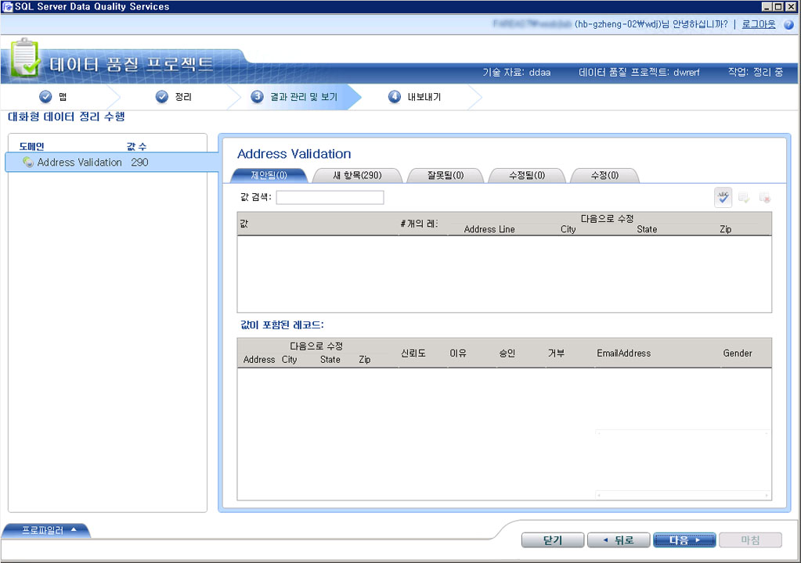

# (외부) 기술 자료 참조 데이터-DQS (Data Quality Services)를 사용 하 여 데이터 정리

[!INCLUDE [SQL Server - Windows only ASDBMI  ](../includes/applies-to-version/sqlserver.md)]

  이 항목에서는 참조 데이터 공급자의 기술 자료를 사용하여 데이터를 정리하는 방법에 대해 설명합니다. [DQS &#40;내부&#41; 기술 자료를 사용하여 데이터 정리](../data-quality-services/cleanse-data-using-dqs-internal-knowledge.md)에서 설명한 대로 정리 작업을 실행하는 모든 단계는 참조 데이터 공급자의 기술 자료를 사용하여 데이터를 정리하는 경우와 같지만 이 항목에서는 DQS([!INCLUDE[ssDQSnoversion](../includes/ssdqsnoversion-md.md)])에서 참조 데이터 서비스를 사용하여 데이터를 정리하는 방법을 설명합니다.  

> [!IMPORTANT]
> 이 문서에서는 Azure DataMarket에서 이전에 사용할 수 있었던 타사 참조 데이터 서비스에 대해 설명합니다. 예를 들어 Melissa 주소 데이터를 포함한 DataMarket 및 Data Services는 2016년 12월 31일 이후 중단되었습니다. 따라서 DataMarket의 지정된 서비스를 사용하여 이 문서의 예제를 더 이상 실행할 수 없습니다. 타사 참조 데이터 공급자로부터 직접 온라인으로 사용할 수 있는 참조 데이터 서비스는 계속 사용할 수 있습니다.
 
 DQS의 참조 데이터 서비스 기능을 사용하여 데이터를 정리하는 경우 DQS 정리 프로세스에서는 매핑된 도메인 값을 참조 데이터 서비스 공급자에게 일괄 처리 요청으로 보냅니다. 참조 데이터 서비스는 다음과 같은 정보로 응답합니다.  
  
-   제안된 수정  
  
-   신뢰도  
  
-   매핑된 도메인에 대한 추가 정보 참조 데이터는 추가 데이터로 원본을 표준화, 구문 분석 또는 보강할 수 있습니다. 이 정보는 응답의 추가 필드에 제공됩니다.  
  
 참조 데이터 서비스에서 응답을 받은 후 정리 작업 도중 DQS에서는 다음과 같은 작업이 수행됩니다.  
  
-   도메인을 참조 데이터 서비스와 매핑하는 동안 지정한 **자동 수정 임계값** 및 **최소 신뢰도** 값을 기반으로 신뢰도 수준에 따라 도메인 값이 자동으로 수정되거나 제안됩니다.  
  
    > [!NOTE]  
    >  참조 데이터 서비스에서 기술 자료를 사용하여 데이터를 정리하는 동안 도메인을 참조 데이터 서비스에 매핑하는 도중 지정한 임계값이 적용되며 **구성** 섹션의 **일반 설정** 탭에서 지정한 임계값은 적용되지 않습니다. 참조 데이터 정리의 임계값 지정에 대한 자세한 내용은 [참조 데이터에 도메인 또는 복합 도메인 연결](../data-quality-services/attach-domain-or-composite-domain-to-reference-data.md)의 9단계를 참조하십시오.  
  
-   도메인 값은 **제안**, **새로 만들기**, **잘못 됨**, **수정됨**및 **수정**으로 분류됩니다.  
  
-   추가 데이터가 원본에 연결되고 정보를 정리된 데이터와 함께 내보내기에 사용할 수 있습니다.  
  
## 시작하기 전에  
  
###   필수 조건  
 DQS 기술 자료의 필수 도메인이 알맞은 참조 데이터 서비스에 매핑되어 있어야 합니다. 또한 정리할 데이터 유형에 대한 정보가 기술 자료에 포함되어 있어야 합니다. 예를 들어 미국 주소가 포함된 원본 데이터를 정리하려면 미국 주소의 "고품질" 데이터를 제공하는 참조 데이터 서비스 공급자로 도메인을 매핑해야 합니다. 자세한 내용은 [참조 데이터에 도메인 또는 복합 도메인 연결](../data-quality-services/attach-domain-or-composite-domain-to-reference-data.md)을 참조하세요.  
  
###   보안  
  
####   권한  
 데이터 정리를 수행하려면 DQS_MAIN 데이터베이스에 대한 dqs_kb_editor 또는 dqs_kb_operator 역할이 있어야 합니다.  
  
##   참조 데이터 기술 자료를 사용하여 데이터 정리  
 Melissa 데이터 Azure Marketplace 서비스를 사용 하 여 이전 항목인 [도메인 또는 복합 도메인을 참조 데이터에 연결](../data-quality-services/attach-domain-or-composite-domain-to-reference-data.md)하는 것과 동일한 예를 사용 하 여 작업을 계속 합니다. 이제 같은 도메인을 사용하여 샘플 US 주소 몇 개를 정리합니다. 데이터를 정리하는 단계는 [DQS&#40;내부&#41; 기술 자료를 사용하여 데이터 정리](../data-quality-services/cleanse-data-using-dqs-internal-knowledge.md)에 설명된 것과 동일합니다. 그러나 프로세스를 진행하는 동안 필요할 때마다 다시 설명하겠습니다.  
  
1.  데이터 품질 프로젝트를 만들고 **정리** 작업을 선택합니다. [Create a Data Quality Project](../data-quality-services/create-a-data-quality-project.md)을 참조하세요.  
  
2.  **맵** 페이지에서 **Address Line**, **City**, **State**및 **Zip**도메인을 원본 데이터의 알맞은 열에 매핑합니다. **다음**을 클릭합니다.  
  
    > [!NOTE]  
    >  **Address Verification** 복합 도메인에 있는 도메인 4개를 모두 매핑하면 이제 개별 도메인 수준이 아닌 복합 도메인 수준에서 데이터 정리가 수행됩니다.  
  
3.  **정리** 페이지에서 **시작**을 클릭하여 컴퓨터 기반 정리 프로세스를 실행합니다. 정리 프로세스가 끝난 후 **다음**을 클릭합니다.  
  
    > [!NOTE]  
    >  **정리** 페이지에 다음 두 가지 방법으로 참조 데이터 서비스에 연결된 도메인에 대한 정보가 표시됩니다.  
    >   
    >  -   **시작** 단추 아래에 메시지가 표시 됩니다. "도메인 \<Domain1> , \<Domain2> ,... \<DomainN> 참조 데이터 서비스 공급자를 사용 하 여 정리 됩니다. " 이 예에서는 다음 메시지가 표시됩니다. “Address Verification 도메인이 참조 데이터 서비스 공급자를 사용하여 정리됩니다.”  
    > -   아이콘이 **프로파일러** 영역에 참조 데이터 서비스 공급자에 연결 된 도메인에 대해 표시 됩니다. 이 예에서는 **Address Verification** 복합 도메인에 대해 아이콘이 표시됩니다.  
  
4.  **결과 관리 및 보기** 페이지에서 도메인 값을 검토합니다. 참조 데이터 서비스는 도메인이 참조 데이터 서비스에 매핑되는 동안 **제안된 후보** 상자에 지정된 최대 제안 수에 따라 둘 이상의 제안을 값에 대해 표시할 수 있습니다(사용 가능한 경우). 예를 들어, 다음 미국 주소에는 두 가지 제안이 표시됩니다.  
  
     **원래 값:**  
  
    |Address Line|City|시스템 상태|Zip|  
    |------------------|----------|-----------|---------|  
    |1 msft way|Redmond||98052|  
  
     **제안 된 값:**  
  
    |Address Line|City|시스템 상태|Zip|  
    |------------------|----------|-----------|---------|  
    |1 Microsoft Way|Redmond|WA|98052|  
    |PO Box 1|Redmond|WA|98073|  
  
       
  
    > [!NOTE]  
    >  복합 도메인의 경우 컴퓨터 기반 정리 프로세스 도중 수정한 개별 도메인이 다른 색으로 강조 표시됩니다. 예를 들어 이 경우에는 **Address Line** 및 **State** 도메인이 수정되었으므로 녹청으로 강조 표시됩니다.  
  
5.  모든 도메인 값을 검토한 후 **다음** 을 클릭하여 데이터를 내보냅니다.  
  
6.  **내보내기** 페이지에는 각 도메인의 정리 작업에 대한 원본, 이유, 신뢰도 및 상태의 일반 정보 외에, Melissa Data 참조 데이터 서비스가 주소 데이터에 대해 제공하는 주소, 위도와 경도, 지방 이름, 주소 유형(건물, 거리 등) 등의 추가 정보가 표시됩니다.  
  
7.  데이터를 필요한 대상(SQL Server, CSV 또는 Excel)으로 내보내고 **마침** 을 클릭하여 프로젝트를 닫습니다.  
  
    > [!IMPORTANT]  
    >  64비트 버전의 Excel을 사용 중인 경우 정리한 데이터를 Excel 파일로 내보낼 수 없습니다. SQL Server 데이터베이스 또는 .csv 파일로만 내보낼 수 있습니다.  
  
  
