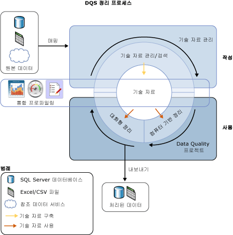
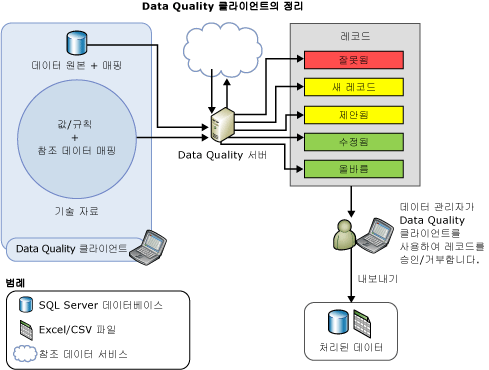

# Data Cleansing

[!INCLUDE [SQL Server - Windows only ASDBMI  ](../includes/applies-to-version/sqlserver.md)]

  데이터 정리는 데이터 원본의 데이터 품질을 분석하고, 시스템의 제안을 수동으로 승인/거부하고, 데이터를 변경하는 프로세스입니다. DQS( [!INCLUDE[ssDQSnoversion](../includes/ssdqsnoversion-md.md)] )의 데이터 정리에는 데이터가 기술 자료의 지식을 준수하는 정도를 분석하는 컴퓨터 기반 프로세스이며, 데이터 정리가 정확히 원하는 대로 수행되는지 보장하기 위해 데이터 관리자가 컴퓨터 기반 프로세스 결과를 검토하고 수정할 수 있게 해주는 대화형 프로세스입니다.  
  
 데이터 관리자는 Integration Services 패키징 프로세스에서 데이터 정리를 수행할 수도 있습니다. 이 경우 데이터 관리자는 기존 기술 자료를 사용하여 데이터 정리를 자동으로 수행하는 [!INCLUDE[ssDQSCleansingLong](../includes/ssdqscleansinglong-md.md)] 를 사용합니다. 자세한 내용은 [DQS 정리 변환](../integration-services/data-flow/transformations/dqs-cleansing-transformation.md)을 참조하세요.  
  
 DQS의 데이터 정리 기능에는 다음과 같은 이점이 있습니다.  
  
-   데이터 원본(Excel 파일 또는 SQL Server 데이터베이스)에서 완전하지 않거나 잘못된 데이터를 식별하여 데이터를 수정하거나 유효하지 않은 데이터에 대한 경고를 사용자에게 제공합니다.  
  
-   데이터 정리를 위한 2단계 프로세스 *computer-assisted* 및 *interactive*를 제공합니다. 컴퓨터 기반 프로세스에서는 DQS 기술 자료의 지식을 사용하여 데이터를 자동으로 처리하고 교체/수정을 제안합니다. 그 다음 단계인 대화형 프로세스에서는 데이터 관리자가 컴퓨터 기반 정리 중 DQS에서 제안된 변경 사항을 승인, 거부 또는 수정할 수 있습니다.  
  
-   도메인 값, 도메인 규칙 및 참조 데이터를 사용하여 고객 데이터를 표준화하고 강화합니다. 예를 들어 “St.”를 “Street”로 변경하여 용어 사용을 표준화하고, “1 Microsoft way Redmond 98006”을 “1 Microsoft Way, Redmond, WA 98006”으로 변경하여 누락된 요소를 채워서 데이터를 강화합니다.  
  
-   사용자가 데이터를 탐색하고 매우 큰 데이터 집합에서 오류를 조사할 수 있도록 간단하고, 직관적이며, 일관적인 마법사와 비슷한 인터페이스를 제공합니다.  
  
 다음 그림은 DQS에서 데이터 정리를 수행하는 방법을 보여 줍니다.  
  
   
  
##  컴퓨터 기반 정리  
 DQS 데이터 정리 프로세스에서는 정리할 데이터에 기술 자료를 적용하고 데이터에 대한 변경 내용을 제시합니다. 데이터 관리자는 제시된 각 변경 내용에 액세스할 수 있으므로 변경 내용을 확인하고 수정할 수 있습니다. 데이터 관리자가 데이터 정리를 수행하기 위해 진행하는 단계는 다음과 같습니다.  
  
1.  데이터 품질 프로젝트를 만들고, 원본 데이터를 분석 및 정리하는 데 사용할 기술 자료를 선택하고, **정리** 활동을 선택합니다. 여러 데이터 품질 프로젝트에서 동일한 기술 자료를 사용할 수 있습니다.  
  
2.  정리할 원본 데이터가 포함된 데이터베이스 테이블/뷰 또는 Excel 파일을 지정합니다. 데이터베이스 또는 Excel 파일은 기술 자료 검색에 사용된 것과 동일하거나 다른 데이터베이스 또는 Excel 파일일 수 있습니다.  
  
    > [!NOTE]  
    >  기술 자료 검색 및 정리 활동을 위해 동일한 데이터 원본을 선택한 경우 데이터가 변경되지 않습니다. 예제 데이터에 대해 기술 자료 검색을 실행하고 나중에 기술 자료 검색 활동 중 작성된 지식에 따라 원본 데이터를 정리하는 것이 좋습니다.  
  
3.  정리할 데이터 필드를 기술 자료의 적합한 도메인/복합 도메인에 매핑합니다. 필드를 복합 도메인에 매핑할 경우 필드 및 복합 도메인 간에 매핑이 수행되며 복합 도메인의 개별 도메인에서는 매핑이 수행되지 않습니다. 또한 매핑된 필드의 데이터 정리는 복합 도메인의 개별 도메인이 아니라 복합 도메인에 대해 지정된 규칙에 따라 수행됩니다. 복합 도메인에 대한 자세한 내용은 [DQS Knowledge Bases and Domains](../data-quality-services/dqs-knowledge-bases-and-domains.md)을 참조하십시오.  
  
4.  **정리** 페이지에서 **시작** 을 클릭하여 컴퓨터 기반 정리 프로세스를 실행합니다.  
  
 데이터 정리 프로세스에서는 알려진 데이터 도메인 값에 가장 일치하는 데이터 인스턴스를 찾습니다. 예제 데이터의 일부에서 실행되는 기술 자료 검색 프로세스와 달리 이 프로세스에서는 모든 원본 데이터에 데이터 품질 지식을 적용합니다.  
  
 컴퓨터 기반 프로세스에서는 대화형 정리 프로세스에 사용되는 [!INCLUDE[ssDQSClient](../includes/ssdqsclient-md.md)] 에 데이터 품질 정보를 표시합니다. 구문 오류 규칙의 준수와는 별도로 DQS에서는 *신뢰 수준*을 사용하여 데이터를 분류하기 위한 고급 알고리즘 및 참조 데이터도 사용됩니다. 신뢰 수준은 수정 내용 또는 제안 내용에 대한 DQS의 확신도를 나타냅니다. 신뢰 수준은 다음 임계값에 따라 결정됩니다.  
  
-   *자동 수정 임계값* 보다 높으면 DQS에서 변경 내용을 제안하고 데이터 관리자가 거부하지 않는 한 이를 적용합니다. **구성** 화면의 **일반 설정** 탭에서 자동 수정 임계값을 지정할 수 있습니다. 자세한 내용은 [정리 및 일치에 대한 임계값 구성](../data-quality-services/configure-threshold-values-for-cleansing-and-matching.md)을 참조하세요.  
  
-   *자동 제안 임계값* 보다 높고 자동 수정 임계값보다 낮으면 DQS에서 변경 내용을 제안하고 데이터 관리자가 승인할 경우 이를 적용합니다. **구성** 화면의 **일반 설정** 탭에서 자동 제안 임계값을 지정할 수 있습니다. 자세한 내용은 [정리 및 일치에 대한 임계값 구성](../data-quality-services/configure-threshold-values-for-cleansing-and-matching.md)을 참조하세요.  
  
 신뢰 수준 값이 자동 제안 임계값보다 낮으면 데이터 관리자가 변경 내용을 지정하지 않은 한 DQS에서 데이터를 현재대로 둡니다.  
  
##  대화형 정리  
 컴퓨터 기반 정리 프로세스에 따라 DQS는 데이터 관리자에게 데이터 변경과 관련된 의사 결정에 필요한 정보를 제공합니다. DQS는 다음 5개 탭으로 데이터를 분류합니다.  
  
-   **제안**: 신뢰도 수준이 *자동 제안 임계값* 보다 높고 *자동 수정 임계값* 보다 낮은 것으로 DQS에서 검색된 제안 값입니다. 이러한 값은 검토 후 적절하게 승인 또는 거부해야 합니다.  
  
-   **새**내용: DQS에 충분 한 정보 (제안)가 없는 유효한 값 이므로 다른 탭에 매핑할 수 없습니다. 또한이 탭에는 신뢰도 수준이 *자동 제안 임계값* 보다 낮지만 유효한 것으로 표시 될 수 있는 값도 포함 됩니다.  
  
-   **잘못됨**: 기술 자료의 도메인에 유효하지 않은 것으로 표시된 값 또는 도메인 규칙이나 참조 데이터를 준수하지 않은 값입니다. 이 탭에는 또한 대화형 정리 프로세스 중에 다른 네 개 탭 중에서 사용자가 거부한 값이 포함됩니다.  
  
-   **수정됨**: 자동화된 정리 프로세스 중에 DQS에서 신뢰도 수준이 *자동 수정 임계값* 보다 높은 값에 대한 수정 값을 검색하여 수정한 값입니다. 이 탭에는 또한 대화형 정리 중 **다음으로 수정** 열에서 사용자가 올바른 값을 지정했고 다른 네 개 탭 중에서 **승인** 열의 라디오 단추를 클릭하여 승인한 값이 포함됩니다.  
  
-   **올바름**: 올바른 것으로 발견된 값입니다. 예를 들어 도메인 값과 일치하는 값이 여기에 해당합니다. 필요한 경우 이 탭에서 값을 거부하거나 **다음으로 수정** 열에서 대체 단어를 지정하고 **수락** 열에서 라디오 단추를 클릭하여 DQS 정리를 재정의할 수 있습니다. 또한 이 탭에는 **새로 만들기** 또는 **잘못됨** 탭에서 **승인** 열의 라디오 단추를 클릭하여 대화형 정리 중에 사용자가 승인한 값도 포함됩니다.  
  
> [!NOTE]  
>  **제안됨**, **수정됨**및 **수정** 탭에서 DQS는 각 도메인 값에 대해 **다음으로 수정** 열에 도메인에 대한 선행 값(적용되는 경우)을 표시합니다.  
  
 데이터 관리자는 [!INCLUDE[ssDQSClient](../includes/ssdqsclient-md.md)] 를 사용하여 DQS에서 제시한 변경 내용을 확인하고, 변경 내용을 구현할지 여부를 결정합니다. 또한 DQS에서 올바른 것으로 지정한 값이 실제로 올바른지 확인할 수 있습니다. 높은 신뢰 수준으로 DQS에서 이미 적용한 변경 내용이 타당한지 확인할 수 있습니다. 자동으로 제안된 변경 내용을 승인할지 여부를 결정할 수 있습니다. 컴퓨터 기반 프로세스에서 찾지 못한 변경 작업을 수행하려는 경우 변경되지 않은 값을 검토할 수도 있습니다.  
  
 DQS에서는 데이터 관리자가 적용한 변경 내용과 컴퓨터 기반 데이터 정리 결과를 병합합니다. 그러나 이러한 변경 내용은 프로젝트와 함께 보관되며 기술 자료에는 추가되지 않습니다. 데이터 정리 중에 관련 기술 자료는 읽기 전용 상태입니다.  
  
 데이터 정리 프로세스가 완료되면 처리된 데이터를 SQL Server 데이터베이스의 새 테이블, .csv 파일 또는 Excel 파일로 내보내도록 선택할 수 있습니다. 정리를 수행한 원본 데이터는 원래 상태로 유지됩니다. 데이터 관리자는 별도의 정리된 데이터를 사용하여 실제 원본 데이터를 수정할 수 있습니다.  
  
 다음 그림은 [!INCLUDE[ssDQSClient](../includes/ssdqsclient-md.md)] 애플리케이션을 사용하여 데이터 정리를 수행하는 방법을 보여 줍니다.  
  
   
  
##   선행 값 수정  
 선행 값 수정은 동의어가 있는 도메인 값에 적용되며, 사용자는 일관적인 값 표현을 위해 다른 값 대신 동의어 값 중 하나를 선행 값으로 사용할 수 있습니다. 예를 들어 “New York”, “NYC” 및 “big apple”은 동의어이며, 사용자가 “NYC” 및 “Big Apple” 대신 “New York”을 선행 값으로 사용하도록 할 수 있습니다. DQS는 데이터 표준화를 위해 정리 프로세스 중에 선행 값 수정을 지원합니다. 선행 값 수정은 도메인을 만들 때 동시에 선행 값 수정을 사용하도록 도메인을 설정한 경우에만 수행됩니다. 기본적으로 도메인을 만들 때 **선행 값 사용** 확인란의 선택을 취소하지 않은 한 모든 도메인이 선행 값 수정을 사용하도록 설정됩니다. 이 확인란에 대한 자세한 내용은 [Set Domain Properties](../data-quality-services/set-domain-properties.md)을 참조하십시오.  
  
##   정리 데이터 표준화  
 도메인에 대해 정의된 출력 형식을 기반으로 표준화된 형식으로 정리된 데이터를 내보낼지 여부를 선택할 수 있습니다. 도메인을 만드는 동안 도메인의 데이터 값이 출력될 때 적용할 서식을 선택할 수 있습니다. 도메인의 출력 형식을 지정하는 방법은 **에서 출력 형식**[Set Domain Properties](../data-quality-services/set-domain-properties.md)목록을 참조하십시오.  
  
 정리 데이터 품질 프로젝트 마법사의 **내보내기** 페이지에서 정리된 데이터를 내보내는 동안 **출력 표준화** 확인란을 선택하여 정리된 데이터를 표준화된 형식으로 내보낼지 여부를 지정할 수 있습니다. 기본적으로 정리된 데이터는 표준화된 형식으로 내보냅니다. 즉, 확인란이 기본적으로 선택됩니다. 정리된 데이터 내보내기에 대한 자세한 내용은 [DQS&#40;내부&#41; 기술 자료를 사용하여 데이터 정리](../data-quality-services/cleanse-data-using-dqs-internal-knowledge.md)를 참조하세요.  
  
##   관련 작업  
  
|태스크 설명|항목|  
|----------------------|-----------|  
|정리 활동을 위한 임계값 구성 방법을 설명합니다.|[정리 및 일치에 대한 임계값 구성](../data-quality-services/configure-threshold-values-for-cleansing-and-matching.md)|  
|DQS에 기본 제공되는 지식을 사용하여 데이터를 정리하는 방법을 설명합니다.|[DQS&#40;내부&#41; 기술 자료를 사용하여 데이터 정리](../data-quality-services/cleanse-data-using-dqs-internal-knowledge.md)|  
|참조 데이터 서비스의 지식을 사용하여 데이터를 정리하는 방법을 설명합니다.|[참조 데이터&#40;외부&#41; 기술 자료를 사용하여 데이터 정리](../data-quality-services/cleanse-data-using-reference-data-external-knowledge.md)|  
|복합 도메인을 정리하는 방법을 설명합니다.|[복합 도메인의 데이터 정리](../data-quality-services/cleanse-data-in-a-composite-domain.md)|  
  
## 참고 항목  
 [DQS&#41;&#40;데이터 품질 프로젝트](../data-quality-services/data-quality-projects-dqs.md)   
 [데이터 일치](../data-quality-services/data-matching.md)  
  
  
