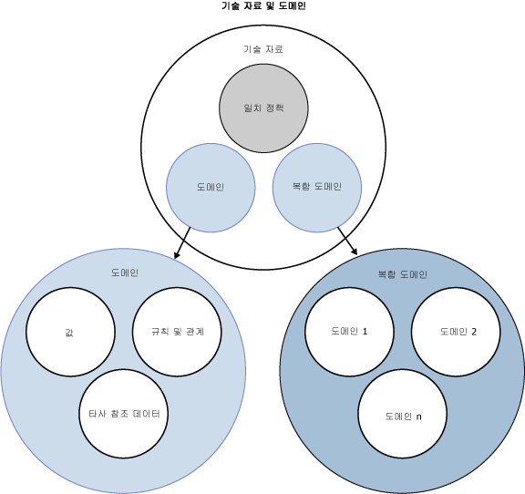

# DQS 기술 자료 및 도메인

[!INCLUDE[appliesto-ss-xxxx-xxxx-xxx-md-winonly](../includes/appliesto-ss-xxxx-xxxx-xxx-md-winonly.md)]

  이 항목에서는 DQS( [!INCLUDE[ssDQSnoversion](../includes/ssdqsnoversion-md.md)] )의 기술 자료에 대해 설명합니다. 데이터를 정리하려면 데이터에 대한 지식이 있어야 합니다. 데이터 품질 프로젝트에 대한 지식을 준비하기 위해서는 DQS가 잘못되었거나 부적합한 데이터를 식별하기 위해 사용할 수 있는 KB(기술 자료)를 작성하고 유지 관리해야 합니다. DQS를 사용하면 컴퓨터 기반 프로세스 대화형 프로세스를 모두 사용하여 기술 자료를 만들고, 작성 및 업데이트할 수 있습니다. 기술 자료에서 지식은 도메인에서 유지 관리되며 이러한 각 기술 자료는 특정 데이터 필드와 관련이 있습니다. 기술 자료는 데이터 관련 정보의 리포지토리로서 데이터를 이해하고 데이터의 무결성을 유지하는 데 사용됩니다.  
  
 DQS 기술 자료는 다음과 같은 이점을 갖습니다.  
  
-   데이터에 대한 지식 구축은 세부적인 프로세스입니다. 예제 데이터로부터 데이터에 대한 지식을 자동으로 추출하는 DQS 프로세스는 이러한 프로세스를 보다 쉽게 수행할 수 있게 해줍니다.  
  
-   DQS를 사용하면 데이터에 대한 분석 내용을 보고 규칙을 만들고 데이터 값을 변경하여 기술 자료에서의 지식을 늘릴 수 있습니다. 이러한 작업은 반복적으로 수행하여 시간 경과에 따라 지식 수준을 향상시킬 수 있습니다.  
  
-   기존 KB를 기반으로 기술 자료를 구축하고, 파일로 된 도메인 지식을 KB로 가져오고, 프로젝트의 지식을 다시 KB로 가져오거나 DQS 기본 KB, DQS 데이터를 사용하여 기존에 있던 데이터 품질 지식을 활용할 수 있습니다.  
  
-   참조 데이터 공급자에서 유지 관리되는 데이터에 비교하여 자신의 데이터 품질을 보장할 수 있습니다.  
  
-   기술 자료를 구축하고 이를 데이터 수정 프로세스에 적용하는 과정이 명확히 구분되어 있으므로 기술 자료를 구축하고 업데이트하는 방법에 있어서 유연성을 제공합니다.  
  
 데이터 관리자는 [!INCLUDE[ssDQSClient](../includes/ssdqsclient-md.md)] 애플리케이션을 사용하여 컴퓨터 기반 단계를 실행 및 제어하고 대화형 단계를 수행합니다.  
  
 다음 그림은 기술 자료의 여러 구성 요소 및 DQS의 도메인을 보여 줍니다.  
  
   
  
##   DQS 기술 자료 만들기 및 구축 방법  
 DQS 기술 자료 구축에는 다음 프로세스 및 구성 요소가 포함됩니다.  
  
 **기술 자료 검색**  
 데이터 예제를 처리하여 지식을 기술 자료로 구축하는 컴퓨터 기반 프로세스  
  
 **도메인 관리**  
 데이터 필드와 연결된 기술 자료 도메인에 있는 지식을 확인하고 수정할 수 있게 해주는 대화형 프로세스입니다. 여기에는 필드 너비의 속성을 설정하고, 규칙을 만들고, 특정 값을 변경하고, 참조 데이터 서비스를 사용하고, 용어 기반 또는 필드 간 관계를 설정하는 등의 작업이 포함됩니다.  
  
 **참조 데이터 서비스**  
 참조 데이터 공급자가 유지 관리 및 보장하는 데이터에 대해 데이터의 유효성을 검사할 수 있게 해주는 도메인 관리 프로세스입니다.  
  
 **일치 정책**  
 DQS 프로세스가 컴퓨터 기반 및 대화형 프로세스로 기술 자료에 구축된 잠재적으로 중복 가능성이 있는 데이터와 일치하지 않는 데이터를 식별하는 방법을 정의하는 정책입니다.  
  
##   기술 자료 검색  
 기술 자료 만들기 프로세스는 처음에 컴퓨터의 안내를 따릅니다. 기술 자료 검색 활동에서는 데이터 불일치와 구문 오류를 찾고 데이터에 대한 변경 내용을 제시하는 과정을 통해 데이터 예제가 데이터 품질 기준에 맞는지 분석하여 기술 자료를 구축합니다. 이러한 분석은 DQS에 기본 제공되는 알고리즘을 기반으로 합니다.  
  
 데이터 관리자는 기술 자료를 사용하여 분석할 데이터와 유사한 샘플 데이터를 포함하는 SQL Server 데이터베이스 테이블 또는 뷰에 해당 기술 자료를 연결하여 이 프로세스를 준비합니다. 그런 다음 데이터 관리자는 분석할 샘플 데이터의 각 열에 기술 자료 도메인을 매핑합니다. 도메인은 단일 필드에 매핑되는 단일 도메인이거나 각각의 도메인이 단일 필드의 데이터 부분에 매핑되는 여러 단일 도메인으로 구성된 복합 도메인일 수 있습니다(아래의 "복합 도메인" 참조). 기술 자료 검색을 실행하면 DQS는 샘플 데이터에서 데이터 품질 정보를 추출하여 기술 자료의 도메인에 넣습니다. 기술 자료 검색을 실행한 경우 데이터 수정을 수행할 수 있는 기술 자료를 갖게 됩니다.  
  
 DQS 기술 자료는 확장 가능합니다. 기술 자료 검색 활동 내에서는 컴퓨터 기반 기술 자료 검색 분석 이후 기술 자료에 대화형으로 지식을 추가할 수 있습니다. 값 변경 사항을 수동으로 추가하고 Excel 파일에서 도메인 값을 가져올 수 있습니다. 또한 예제에 포함된 데이터가 변경된 경우 나중에 기술 자료 검색 프로세스를 다시 실행할 수 있습니다. 도메인 관리 활동 및 데이터 일치 활동 내에서 더 많은 지식을 적용할 수 있습니다(아래 참조).  
  
 기술 자료 검색 프로세스를 수행하는 데이터와 데이터 수정을 수행하는 데이터가 동일할 필요는 없습니다. DQS에서는 하나의 데이터베이스 필드 집합에서 기술 자료를 생성하고 이를 정리가 필요한 다른 관련 데이터 집합에 적용할 수 있는 유연성을 제공합니다. 데이터 관리자는 새 기술 자료를 처음부터 새로 또는 기존 기술 자료를 기반으로 만들 수도 있고, 데이터 파일로부터 기술 자료를 가져올 수도 있습니다. 또한 기존 기술 자료에 대해 기술 자료 검색을 다시 실행할 수 있습니다. 여러 개의 기술 자료를 단일 [!INCLUDE[ssDQSServer](../includes/ssdqsserver-md.md)]에서 유지 관리할 수 있으며, 여러 개의 애플리케이션 인스턴스를 동일한 기술 자료에 연결할 수도 있습니다. DQS는 기술 자료 관리 세션에서 기술 자료를 여는 사용자만 사용할 수 있도록 기술 자료를 잠가 동시성 충돌을 방지합니다.  
  
### DQS의 대/소문자 구분 안 함  
 DQS의 값은 대/소문자를 구분하지 않습니다. 즉, DQS는 기술 자료 검색, 도메인 관리 또는 일치를 수행할 때 대/소문자로 값을 구분하지 않습니다. 다른 값과 대/소문자만 다른 값을 값 관리에 추가할 경우 동의어가 아닌 동일한 값으로 간주됩니다. 대/소문자만 다른 두 값을 일치 프로세스에서 비교할 경우에는 정확한 일치 값으로 간주됩니다.  
  
 그러나 결과를 정리할 때 내보내는 값에서는 대/소문자를 제어할 수 있습니다. 이렇게 하려면 **출력 형식** 도메인 속성([도메인 속성 설정](../data-quality-services/set-domain-properties.md) 참조)을 설정하고 정리 결과를 내보낼 때 **출력 표준화** 확인란을 사용합니다([DQS&#40;내부&#41; 기술 자료를 사용하여 데이터 정리](../data-quality-services/cleanse-data-using-dqs-internal-knowledge.md) 참조).  
  
##   도메인 관리  
 도메인 관리 활동에서는 데이터 관리자가 컴퓨터 기반 기술 자료 검색 활동으로 생성된 메타데이터를 대화형으로 변경 및 보강할 수 있습니다. 변경하는 각 내용은 기술 자료 도메인에 대한 내용입니다. 도메인 관리 활동에서는 다음과 같은 작업을 수행할 수 있습니다.  
  
-   새 도메인을 만듭니다. 새 도메인은 기존 도메인에 연결하거나 기존 도메인에서 복사할 수 있습니다.  
  
-   도메인에 있는 각 용어에 적용되는 도메인 속성을 설정합니다.  
  
-   정의하는 값 범위에 대해 유효성 검사 또는 표준화를 수행하는 도메인 규칙을 적용합니다.  
  
-   변경 사항을 도메인의 특정 데이터 값에 대화형으로 적용합니다.  
  
-   DQS 맞춤법 검사기를 사용하여 문자열 값의 구문, 맞춤법 및 문장 구조를 검사합니다.  
  
-   .dqs 파일에서 도메인을 가져오거나 Microsoft Excel 파일에서 도메인 값을 가져옵니다.  
  
-   데이터 품질 프로젝트에서 정리 프로세스로 찾은 값을 다시 기술 자료로 가져옵니다.  
  
-   데이터 무결성 및 정확성을 확인하기 위해 참조 데이터에 대해 도메인 값을 비교한 결과와 함께 참조 데이터 공급자가 유지 관리하는 참조 데이터에 도메인을 연결합니다. 데이터 공급자 설정을 지정할 수도 있습니다.  
  
-   단일 도메인에 대한 용어 기반 관계를 적용합니다.  
  
 도메인 관리 활동이 완료되면 데이터 프로젝트에 사용할 기술 자료를 게시할 수 있습니다.  
  
### 도메인 속성 설정  
 도메인 속성은 연관된 값에 적용할 처리를 정의하고 구동합니다. 값의 데이터 형식 및 언어를 설정하고, 선행 값을 사용하여 원본 데이터가 정리되도록 지정하고(이 옵션을 해제하면 선행 값이 아니라 올바른 용어를 사용하여 원본 데이터가 정리됨), 도메인에 있는 데이터 값이 출력될 때 적용할 형식을 구성하여 데이터 표준화를 보장하고, 적용할 알고리즘(구문 오류, 맞춤법 검사기 또는 문자열 정규화)을 정의할 수 있습니다.  
  
### 참조 Data Services  
 도메인 관리 프로세스에서 온라인 참조 데이터를 도메인에 연결할 수 있습니다. 이를 통해 도메인의 데이터를 참조 데이터 공급자가 유지 관리하는 데이터와 비교할 수 있습니다. **애플리케이션의** 관리 [!INCLUDE[ssDQSClient](../includes/ssdqsclient-md.md)] 섹션에서 DQS 구성 기능을 통해 참조 데이터 공급자를 먼저 구성해야 합니다. 자세한 내용은 [Reference Data Services in DQS](../data-quality-services/reference-data-services-in-dqs.md)을 참조하세요.  
  
### 도메인 규칙 적용  
 데이터 유효성 검사를 위한 도메인 규칙을 만들 수 있습니다. 도메인 규칙은 문자열 값일 수 있는 단일 용어와 같은 기본 제약 조건으로부터 전자 메일 주소의 올바른 형식과 같은 보다 복잡한 정규식까지 다양한 데이터의 정확도를 보장합니다.  
  
 복합 도메인의 경우 복합 도메인의 일부가 되는 단일 도메인의 값과 다른 단일 도메인의 값 사이의 관계를 지정하는 CD 규칙을 만들 수 있습니다.  
  
### 도메인 값 설정  
 기술 자료를 구축한 후에는 기술 자료의 각 도메인에 데이터 값을 채우고 표시할 수 있습니다. 기술 자료 검색 후 DQS에는 각 용어가 표시된 횟수, 각 용어의 상태 및 처리된 수정 내용이 표시됩니다. 이러한 지식은 다음과 같이 관리할 수 있습니다.  
  
-   값의 상태를 변경하여 올바르거나, 오류 또는 부적합한 상태로 만듭니다.  
  
-   특정 값을 기술 자료에 추가하거나 기술 자료에서 특정 값을 삭제합니다.  
  
-   오류가 있거나 유효하지 않은 용어에 대한 대체 용어 지정을 포함하여 한 값과 다른 값 사이의 관계를 변경합니다.  
  
-   도메인과 연관된 지식을 추가, 제거 또는 변경합니다.  
  
 값은 사용자가 직접 만들거나, 데이터 검색 중에 또는 가져오기 기능을 통해 만들 수 있습니다. 이를 통해 사용자는 비즈니스 목적에 따라 도메인을 수정하고 쉽게 확장할 수 있도록 만들 수 있습니다.  
  
 도메인 값은 도메인 관리 활동 중에 또는 기술 자료 검색 활동 종료 후 도메인 값 관리 단계에서 설정할 수 있습니다. 도메인-값 기능은 두 활동 모두 동일합니다.  
  
### 용어 관계 설정  
 도메인 관리에서는 단일 값에 대한 변경 사항을 지정하여 단일 도메인에 대한 용어 기반 관계를 지정할 수 있습니다.  
  
### 복합 도메인  
 복합 도메인은 각각 공통 데이터에 대한 지식이 포함된 두 개 이상의 단일 도메인으로 구성되는 구조입니다. 복합 도메인으로 처리할 수 있는 데이터 예로는 이름 필드의 성, 중간 이름 및 이름과 주소 필드의 국가, 우편 번호, 시/도, 구/군/시, 세부 주소 및 집 호수가 있습니다. 단일 필드를 복합 도메인에 매핑할 때는 DQS가 한 필드의 데이터를 여러 도메인으로 구문 분석하여 복합 도메인으로 만듭니다.  
  
 일부 경우에는 단일 도메인으로 전체 필드 데이터가 표현되지 않을 수 있습니다. 복합 도메인에서 두 개 이상의 도메인을 그룹화하면 데이터를 효율적인 방식으로 표현할 수 있습니다. 다음은 복합 도메인 사용의 이점입니다.  
  
-   복합 도메인을 구성하는 서로 다른 단일 도메인을 분석하는 것이 데이터 품질을 평가할 수 있는 보다 효과적인 방법일 수 있습니다.  
  
-   복합 도메인을 사용할 때는 다중 도메인의 데이터 간 관계가 적합한지 확인할 수 있게 해주는 도메인 간 규칙을 만들 수도 있습니다. 예를 들어 구/군/시 도메인에 있는 문자열 "London"이 국가 도메인에 있는 "England" 문자열에 해당하는지 확인할 수 있습니다. 도메인 간 규칙은 도메인 규칙 이후에 고려됩니다.  
  
-   복합 도메인의 데이터는 참조 데이터 원본에 연결할 수 있으며, 이 경우 복합 도메인이 참조 데이터 공급자에 전송됩니다. 이러한 작업은 종종 주소 데이터에서 수행됩니다.  
  
 복합 도메인으로 표현되는 데이터를 구문 분석하는 방법은 복합 도메인 속성에 의해 결정됩니다. 구분 기호나 도메인 순서를 기준으로 데이터 구문을 분석하거나, 복합 도메인에서 **기술 자료 구문 분석 사용** 속성을 선택하여 복합 도메인에 연결된 도메인의 기술 자료를 기반으로 데이터 구문을 분석할 수 있습니다. 자세한 내용은 [Set Composite Domain Properties](../data-quality-services/create-a-composite-domain.md#CompositeDomainProperties)을 참조하세요.  
  
 복합 도메인은 단일 도메인과 다르게 관리됩니다. 복합 도메인에서는 값을 관리하지 않으며, 복합 도메인을 구성하는 단일 도메인에서 값을 관리합니다. 하지만 도메인 관리 활동의 도메인 목록에서 복합 도메인에 있는 서로 다른 값 사이의 관계를 보고 여기에 적용되는 통계를 확인할 수 있습니다. 예를 들어 동일한 5개 문자열 값으로 구성되는 단일 주소가 몇 번이나 반복되는지 확인할 수 있습니다. 기술 자료 검색 활동의 검색 단계에서 프로파일링은 복합 도메인이 아닌 복합 도메인 내의 단일 도메인에서 수행됩니다. 하지만 대화형 정리의 경우 단일 도메인이 아니라 복합 도메인에서 데이터를 정리합니다.  
  
 일치는 복합 도메인을 구성하는 단일 도메인에서 수행할 수 있지만 복합 도메인 자체에서는 수행할 수 없습니다.  
  
##   데이터 일치  
 도메인 관리를 통해 기술 자료를 수동으로 변경하는 것 외에도 일치하는 지식을 기술 자료에 추가할 수 있습니다. 데이터 중복 제거 프로세스를 위해 DQS를 준비하려면 일치 가능성을 계산하기 위해 DQS가 사용할 일치 규칙을 만들어야 합니다. 정책에는 데이터 관리자가 DQS에서 데이터 행을 비교하는 방법을 식별하기 위해 만드는 하나 이상의 일치 규칙이 포함됩니다. 데이터 관리자는 행에서 비교할 데이터 필드와 비교 시 각 필드가 갖는 가중치를 결정합니다. 데이터 관리자는 또한 일치하는 것으로 간주할 일치 확률을 결정합니다. DQS는 데이터 품질 프로젝트에서 일치 활동을 수행하는 데 사용할 일치 규칙을 기술 자료에 추가합니다.  
  
 기술 자료 및 데이터 일치에 대한 자세한 내용은 [데이터 일치](../data-quality-services/data-matching.md)에서 유지 관리할 수 있으며,  
  
## 섹션 내용  
 기술 자료 및 도메인에서 다음과 같은 작업을 수행할 수 있습니다.  
  
|||  
|-|-|  
|지식 만들기, 열기 및 기술 자료에 지식 추가, 기술 자료에서 검색 수행|[기술 자료 구축](../data-quality-services/building-a-knowledge-base.md)|  
|도메인 및 기술 자료에서 가져오기 및 내보내기 작업 수행|[기술 자료 가져오기 및 내보내기](../data-quality-services/importing-and-exporting-knowledge.md)|  
|단일 도메인, 도메인 규칙, 용어 기반 관계 만들기 및 도메인 값 변경|[도메인 관리](../data-quality-services/managing-a-domain.md)|  
|복합 도메인 만들기, 도메인 간 규칙 만들기, 값 관계 사용|[복합 도메인 관리](../data-quality-services/managing-a-composite-domain.md)|  
|DQS에 기본 제공되는 기본 DQS 데이터 기술 자료 사용|[DQS 기본 기술 자료 사용](../data-quality-services/using-the-dqs-default-knowledge-base.md)|  
  
  
