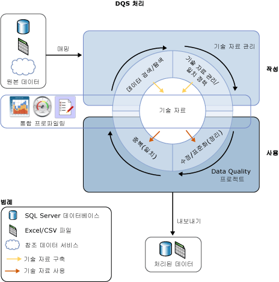

# Data Quality Services 소개

[!INCLUDE[appliesto-ss-xxxx-xxxx-xxx-md-winonly](../includes/appliesto-ss-xxxx-xxxx-xxx-md-winonly.md)]

  DQS( [!INCLUDE[ssDQSnoversion](../includes/ssdqsnoversion-md.md)] )에서 제공되는 데이터 품질 솔루션을 통해 데이터 관리자 또는 IT 전문가는 데이터의 품질을 유지 관리하고 데이터가 비즈니스 용도에 적합한지 보장할 수 있습니다. DQS는 컴퓨터 기반 방식과 대화형 방식 모두를 사용하여 데이터 원본의 무결성과 품질을 관리할 수 있게 해주는 지식 기반 솔루션입니다. DQS를 사용하면 데이터에 대한 지식을 검색, 구축 및 관리할 수 있습니다. 그런 후 이러한 지식을 사용하여 데이터 정리, 일치 및 프로파일링을 수행할 수 있습니다. 또한 DQS 데이터 품질 프로젝트에서 참조 데이터 공급자의 클라우드 기반 서비스를 활용할 수도 있습니다.  
  
##   DQS에 대한 비즈니스 요구 사항  
 잘못된 데이터는 사용자가 잘못 입력했거나, 전송 또는 저장 과정에서 손상되었거나, 데이터 사전 정의가 일치하지 않을 때 및 기타 데이터 품질 및 프로세스 문제로 인해 나타날 수 있습니다. 서로 다른 데이터 표준을 사용하는 여러 원본의 데이터를 집계할 때는 임의적인 규칙을 적용하거나 내역 데이터를 덮어 쓸 수 있으므로 일관적이지 않은 데이터를 얻게 될 수 있습니다. 잘못된 데이터가 있으면 기업이 본연의 비즈니스 기능을 수행하고 고객에게 서비스를 제공하는 데 영향이 있을 수 있으며 이로 인해 신용 및 수익 손실, 고객 불만족 및 규정 준수 문제를 초래할 수 있습니다. 또한 자동화된 시스템은 잘못된 데이터를 사용할 경우 작동하지 않는 경우가 많으며, 잘못된 데이터로 인해 수동으로 프로세스를 수행하느라 시간과 인력을 낭비하게 됩니다. 잘못된 데이터는 데이터 분석, 보고, 데이터 마이닝 및 웨어하우징과 관련된 문제를 유발할 수 있습니다.  
  
 고품질 데이터는 사업체 및 기관의 업무 효율을 위한 핵심 요소입니다. 어떤 규모의 조직이라도 DQS를 활용하여 자신의 데이터가 갖는 정보 가치를 향상시키고 데이터를 의도한 용도에 맞게 적합하게 만들 수 있습니다. 데이터 품질 솔루션은 데이터를 보다 안정적이고, 액세스할 수 있으며, 다시 사용할 수 있도록 만듭니다. 이러한 솔루션은 비즈니스 인텔리전스 또는 데이터 웨어하우스 작업뿐만 아니라 OLTP 작업 시스템에서 잘못된 데이터로 인해 발생하는 문제를 해결하여 데이터의 완전성, 정확성, 준수성 및 일관성을 향상시킬 수 있습니다.  
  
 DQS를 사용하면 데이터베이스 전문가 또는 프로그래머가 아니어도 비즈니스 사용자, 정보 근로자 또는 IT 전문가가 최소한의 설정 및 준비 시간만으로 조직의 데이터 품질 작업을 만들고, 유지 관리 및 실행할 수 있습니다.  
  
##   DQS의 요구 사항 답변  
 데이터 품질이란 절대적인 가치를 갖는 특정 용어로 정의되지 않습니다. 데이터 품질은 해당 데이터가 의도한 목적에 대해 적합한지 여부에 따라 달라집니다. DQS는 잠재적으로 잘못된 데이터를 식별하고 해당 데이터가 실제로 잘못되었을 가능성에 대한 평가 결과를 사용자에게 제공합니다. DQS는 사용자가 데이터의 적합성을 결정할 수 있도록 해당 데이터에 대한 체계적인 이해를 돕습니다. DQS를 사용하면 불완전성, 준수성 부족, 비일관성, 부정확성, 부적합성 및 데이터 중복성과 관련된 문제를 해결할 수 있습니다.  
  
 DQS는 데이터 품질 문제 해결을 위해 다음과 같은 기능을 제공합니다.  
  
-   **데이터 정리:** 컴퓨터 기반 및 대화형 프로세스를 사용하여 잘못되었거나 완전하지 않은 데이터를 수정, 제거 또는 강화합니다. 자세한 내용은 [Data Cleansing](../data-quality-services/data-cleansing.md)을 참조하세요.  
  
-   **일치:** 규칙 기반 프로세스의 의미적인 중복 항목의 식별을 통해 일치 항목을 확인하고 중복 제거를 수행할 수 있습니다. 자세한 내용은 [Data Matching](../data-quality-services/data-matching.md)을 참조하세요.  
  
-   **참조 데이터 서비스:** 참조 데이터 공급자의 서비스를 사용하여 데이터의 품질을 확인합니다. [Microsoft Azure Marketplace](https://azure.microsoft.com/marketplace/)에서 참조 데이터 서비스를 사용하여 데이터를 정리, 유효성 검사, 일치 및 강화할 수 있습니다. 자세한 내용은 [Reference Data Services in DQS](../data-quality-services/reference-data-services-in-dqs.md)을 참조하세요.  
  
-   **프로파일링:** 데이터 원본의 분석을 통해 기술 자료 검색, 도메인 관리, 일치 및 데이터 정리 프로세스의 모든 단계에서 데이터의 품질에 대한 이해력을 제공합니다. 프로파일링은 DQS 데이터 품질 솔루션의 강력한 도구입니다. 프로파일링이 지식 관리, 일치 또는 데이터 정리만큼 중요한 데이터 품질 솔루션을 만들 수 있습니다. 자세한 내용은 [Data Profiling and Notifications in DQS](../data-quality-services/data-profiling-and-notifications-in-dqs.md)을 참조하세요.  
  
-   **모니터링:** 데이터 품질 활동의 상태를 추적 및 결정합니다. 모니터링을 사용하면 데이터 품질 솔루션이 원래 의도한 기능을 수행하는지 확인할 수 있습니다. 자세한 내용은 [DQS Administration](../data-quality-services/dqs-administration.md)을 참조하세요.  
  
-   **기술 자료:** Data Quality Services는 DQS에서 구축한 지식에 따라 데이터를 분석하는 지식 기반 솔루션입니다. 이를 통해 사용자는 데이터에 대한 지식을 지속적으로 강화하는 데이터 품질 프로세스를 만들고 이렇게 함으로써 데이터의 품질을 지속적으로 향상시킬 수 있습니다.  
  
 다음 그림은 DQS 프로세스를 보여 줍니다.  
  
   
  
##   기술 자료 기반 솔루션  
 DQS 기술 자료는 즉시 사용 가능한 지식, [!INCLUDE[ssDQSServer](../includes/ssdqsserver-md.md)]로 생성된 지식 및 사용자가 생성한 지식의 세 가지 지식 유형의 리포지토리입니다. DQS를 사용하면 기술 자료에서 데이터에 대한 지식을 저장하고, 비즈니스 규칙을 추가하고, 필요에 따라 지식을 수정한 후, 이를 적용하여 데이터의 무결성 및 정확성을 테스트할 수 있습니다. 기술 자료를 구축한 후에는 지속적으로 이를 향상시키고 여러 데이터 품질 향상 프로세스에서 다시 사용할 수 있습니다.  
  
 기술 자료의 지식은 잠재적으로 잘못된 데이터를 식별하고 데이터에 대한 변경 사항을 제안합니다. 지식은 데이터 일치를 찾아서 데이터 중복 제거를 수행할 수 있도록 해줍니다. 또한 원본 데이터를 데이터 품질 공급자가 유지 관리하고 보증하는 클라우드 기반 참조 데이터와 비교할 수 있습니다. 데이터 관리자 또는 IT 전문가는 기술 자료의 지식과 데이터에 대해 적용할 변경 사항을 모두 확인하고 정리, 중복 제거 및 참조 데이터 서비스를 실행합니다.  
  
 기술 자료는 특정 유형의 데이터 원본과 관련된 모든 지식을 저장합니다. 예를 들어 고객 데이터베이스에 대해 하나의 기술 자료를 유지 관리하고 직원 데이터베이스에 대해 다른 기술 자료를 유지 관리할 수 있습니다. 지식은 하나 이상의 데이터 도메인에 포함되며, 각 데이터 도메인은 데이터 필드에서 한 유형의 데이터를 의미 체계에 따라 표현한 것입니다. 고객 데이터베이스에 대한 기술 자료는 회사 이름, 주소, 담당자, 연락 정보 등에 대한 도메인을 포함할 수 있습니다. 도메인은 신뢰할 수 있는 값, 잘못된 값 및 오류가 있는 데이터 목록을 포함합니다. 도메인 지식에는 동의어 연관, 용어 관계, 유효성 검사 및 비즈니스 규칙, 일치 정책이 포함됩니다. 이러한 지식으로 무장된 데이터 관리자는 한 도메인의 특정 값을 수정할지 여부를 합리적으로 결정할 수 있습니다.  
  
 DQS를 사용하면 기술 자료에 대한 가져오기 및 내보내기 작업을 수행할 수 있습니다. DQS 파일을 사용하여 도메인 또는 기술 자료를 가져오거나 내보낼 수 있습니다. Excel 파일에서 값 또는 도메인을 가져올 수 있습니다. 또한 기술 자료를 기반으로 정리 프로세스로 찾은 값을 도메인으로 다시 가져올 수도 있습니다. 이러한 작업을 통해 기술 자료를 지속적으로 향상시키고 의사 결정 및 검색을 통해 얻은 지식을 다시 기술 자료로 되돌릴 수 있습니다.  
  
 DQS 기술 자료 기반 솔루션에서는 다음과 같은 두 가지 기본 단계를 사용하여 데이터를 정리합니다.  
  
-   기술 자료를 구축하는 **기술 자료 관리** 프로세스  
  
-   기술 자료의 지식을 기반으로 원본 데이터에 대한 변경 내용을 제시하는 **데이터 품질 프로젝트**  
  
 자세한 내용은 [DQS 기술 자료 및 도메인](../data-quality-services/dqs-knowledge-bases-and-domains.md) 및 [데이터 품질 프로젝트&#40;DQS&#41;](../data-quality-services/data-quality-projects-dqs.md)를 참조하세요.  
  
##   DQS 구성 요소  
 Data Quality Services는 [!INCLUDE[ssDQSServer](../includes/ssdqsserver-md.md)] 및 [!INCLUDE[ssDQSClient](../includes/ssdqsclient-md.md)]로 구성됩니다. 이러한 구성 요소를 통해 다른 SQL Server 작업과 별도로 Data Quality Services를 수행할 수 있습니다. 이 둘은 모두 SQL Server 설치 프로그램 내에서 설치됩니다.  
  
 [!INCLUDE[ssDQSServer](../includes/ssdqsserver-md.md)] 는 SQL Server Management Studio에서 관리 및 모니터링할 수 있는 세 가지 SQL Server 카탈로그(DQS_MAIN, DQS_PROJECTS 및 DQS_STAGING_DATA)로 구현됩니다. DQS_MAIN에는 DQS 저장 프로시저, DQS 엔진 및 게시된 기술 자료가 포함됩니다. DQS_PROJECTS에는 지식 기반 관리와 DQS 프로젝트 작업에 필요한 데이터가 포함됩니다. DQS_STAGING_DATA는 DQS 작업을 수행하기 위해 원본 데이터를 복사한 다음 처리된 데이터를 내보낼 수 있는 중간 준비 데이터베이스를 제공합니다.  
  
 [!INCLUDE[ssDQSClient](../includes/ssdqsclient-md.md)] 는 지식 관리, 데이터 품질 프로젝트 및 관리를 하나의 사용자 인터페이스로 수행할 수 있게 해주는 독립형 실행형 응용 프로그램입니다. 이 응용 프로그램은 데이터 관리자 및 DQS 관리자 모두를 위해 디자인되었습니다. 이 응용 프로그램은 기술 자료 검색, 도메인 관리, 일치 정책 만들기, 데이터 정리, 일치, 프로파일링, 모니터링 및 서버 관리를 수행하는 독립 실행형 실행 파일입니다. [!INCLUDE[ssDQSClient](../includes/ssdqsclient-md.md)] 는 [!INCLUDE[ssDQSServer](../includes/ssdqsserver-md.md)] 와 동일한 컴퓨터에 설치하여 실행하거나 별도의 컴퓨터에 원격으로 설치하여 실행할 수 있습니다. [!INCLUDE[ssDQSClient](../includes/ssdqsclient-md.md)] 의 여러 작업은 쉽게 사용할 수 있도록 마법사 기반으로 제공됩니다.  
  
##   Integration Services 및 MDS(Master Data Services)의 데이터 품질 기능  
 Data Quality Services에서 제공되는 데이터 품질 기능은 SSIS(SQL Server Integration Services)의 구성 요소 및 MDS(Master Data Services)의 기능에 포함되어 해당 서비스 내에서 데이터 품질 프로세스를 수행할 수 있게 해줍니다.  
  
 **[!INCLUDE[ssDQSCleansingLong](../includes/ssdqscleansinglong-md.md)]**  
  
 [!INCLUDE[ssDQSCleansingLong](../includes/ssdqscleansinglong-md.md)] 에서는 Integration Services 패키지의 일부로 데이터 정리를 수행할 수 있습니다. 패키지를 실행하면 데이터 정리가 일괄 처리 파일로 실행됩니다. 이러한 방식은 [!INCLUDE[ssDQSClient](../includes/ssdqsclient-md.md)] 응용 프로그램에서 정리 프로젝트를 실행하는 작업의 대안입니다. 데이터 품질을 자동으로 보장할 수 있습니다. [!INCLUDE[ssDQSClient](../includes/ssdqsclient-md.md)] 응용 프로그램 내에서 데이터 정리 프로젝트의 대화형 단계를 수행할 필요가 없습니다. 다른 Integration Services 구성 요소가 포함된 데이터 흐름 내에 데이터 정리 프로세스를 포함할 수 있습니다. 자세한 내용은 [DQS 정리 변환](../integration-services/data-flow/transformations/dqs-cleansing-transformation.md)을 참조하세요.  
  
 **MDS(Master Data Services)의 데이터 품질 프로세스**  
  
 Data Quality Services 기능은 Microsoft Excel용 Microsoft SQL Server 2014 Master Data Services 추가 기능 내에서 원본 데이터 및 마스터 데이터에 대해 중복 제거를 수행할 수 있도록 MDS(Master Data Services)에 통합되어 있습니다. 일치를 수행하려면 MDS에서 관리되는 데이터를 Excel 워크시트로 로드하고, 이를 MDS에서 관리되지 않는 데이터와 조합한 다음, Excel 내에서 일치를 수행합니다. MDS와 함께 [!INCLUDE[ssDQSServer](../includes/ssdqsserver-md.md)] 구성 요소를 설치해야 합니다. 자세한 내용은 [Excel용 MDS 추가 기능의 데이터 품질 일치](../master-data-services/microsoft-excel-add-in/data-quality-matching-in-the-mds-add-in-for-excel.md)를 참조하세요.  
  
  
