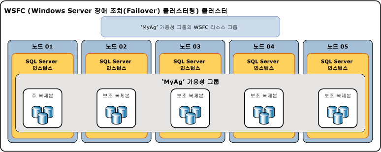

# Always On 가용성 그룹 개요(SQL Server)
[!INCLUDE[appliesto-ss-xxxx-xxxx-xxx-md](../../../includes/appliesto-ss-xxxx-xxxx-xxx-md.md)]

 이 항목에서는 [!INCLUDE[ssHADR](../../../includes/sshadr-md.md)] 에서 하나 이상의 가용성 그룹을 구성하고 관리하는 데 중심이 되는 [!INCLUDE[ssCurrent](../../../includes/sscurrent-md.md)]개념을 소개합니다. 가용성 그룹에서 제공하는 이점의 요약과 [!INCLUDE[ssHADR](../../../includes/sshadr-md.md)] 용어의 개요는 [Always On 가용성 그룹 &#40;SQL Server &#41;](../../../database-engine/availability-groups/windows/always-on-availability-groups-sql-server.md)을 참조하세요.  
  
 *가용성 그룹*은 *가용성 데이터베이스*라고 하는 개별 사용자 데이터베이스의 불연속 집합에 대해 복제된 환경을 지원합니다. HA(고가용성) 또는 읽기-배율에 대한 가용성 그룹을 만들 수 있습니다. HA 가용성 그룹은 함께 장애 조치를 수행하는 데이터베이스 그룹입니다. 읽기-배율 가용성 그룹은 읽기 전용 작업을 위해 다른 SQL Server 인스턴스에 복사되는 데이터베이스 그룹입니다. 가용성 그룹은 하나의 주 데이터베이스 집합과 1~8개의 해당 보조 데이터베이스 집합을 지원합니다. 보조 데이터베이스는 백업이 *아닙니다* . 계속하여 정기적으로 데이터베이스 및 해당 트랜잭션 로그를 백업하세요.  
  
> [!TIP]  
>  모든 유형의 주 데이터베이스 백업을 만들 수 있습니다. 또는 로그 백업과 보조 데이터베이스의 복사 전용 전체 백업을 만들 수 있습니다. 자세한 내용은 [활성 보조 복제본: 보조 복제본에 백업&#40;Always On 가용성 그룹&#41;](../../../database-engine/availability-groups/windows/active-secondaries-backup-on-secondary-replicas-always-on-availability-groups.md)을 참조하세요.   

 각 가용성 데이터베이스 집합은 *가용성 복제본*에 의해 호스팅됩니다. 가용성 복제본에는 *주 복제본*과 *보조 복제본*의 두 가지 유형이 있습니다. 주 복제본은 하나이고 주 데이터베이스를 호스팅하며, 보조 복제본은 1~8개로 각각 보조 데이터베이스 집합을 호스팅하고 가용성 그룹에 대한 잠재적인 장애 조치(Failover) 대상 역할을 합니다. 가용성 그룹은 가용성 복제본의 수준에서 장애 조치(Failover)됩니다. 가용성 복제본은 가용성 그룹에 속한 데이터베이스 세트에 대해 데이터베이스 수준에서만 중복을 제공합니다. 따라서 데이터 파일 손실, 트랜잭션 로그 손상 등으로 인해 주의 대상 데이터베이스가 발생할 경우 이러한 데이터베이스 문제로는 장애 조치(Failover)가 수행되지 않습니다.  
  
 주 복제본은 주 데이터베이스를 클라이언트에서 읽기/쓰기 연결에 사용할 수 있게 만듭니다. 주 복제본은 각 주 데이터베이스의 트랜잭션 로그 레코드를 모든 보조 복제본에 보냅니다. 또한 *데이터 동기화*라고 하는 이 프로세스는 데이터베이스 수준에서 발생합니다. 모든 보조 복제본은 트랜잭션 로그 레코드를 캐시, 즉 로그를*확정* 한 다음 해당하는 보조 데이터베이스에 적용합니다. 데이터 동기화는 주 데이터베이스 및 연결된 각 보조 데이터베이스 간에 다른 데이터베이스와 독립적으로 발생합니다. 따라서 보조 데이터베이스가 중지되거나 실패할 때 다른 보조 데이터베이스에 영향을 주지 않을 수 있으며, 주 데이터베이스는 중지되거나 실패할 때 다른 주 데이터베이스에 영향을 주지 않을 수 있습니다.  
  
 필요한 경우 보조 데이터베이스에 대한 읽기 전용 액세스를 지원하기 위해 하나 이상의 보조 복제본을 구성할 수 있으며, 보조 데이터베이스에서 백업을 허용하도록 보조 복제본을 구성할 수 있습니다.  

 SQL Server 2017은 가용성 그룹에 대해 서로 다른 두 가지 아키텍처를 도입하고 있습니다. *Always On 가용성 그룹*은 고가용성, 재해 복구 및 읽기-배율 분산을 제공합니다. 이러한 가용성 그룹에는 클러스터 관리자가 필요합니다. Windows에서는 장애 조치 클러스터링에서 클러스터 관리자를 제공하며, Linux에서는 Pacemaker를 사용할 수 있습니다. 다른 아키텍처는 *읽기-배율 가용성 그룹*입니다. 읽기-배율 가용성 그룹은 읽기 전용 작업에 대한 복제본을 제공하지만, 고가용성은 제공하지 않습니다. 읽기-배율 가용성 그룹에는 클러스터 관리자가 없습니다. 
 
 Windows에서 HA용 [!INCLUDE[ssHADR](../../../includes/sshadr-md.md)]을 배포하려면 WSFC(Windows Server 장애 조치 클러스터)가 필요합니다. 지정된 가용성 그룹의 가용성 복제본 각각은 동일한 WSFC 클러스터의 서로 다른 노드에 있어야 합니다. 유일한 예외는 다른 WSFC 클러스터로 마이그레이션되는 동안 가용성 그룹이 일시적으로 두 클러스터에 걸쳐 있는 경우입니다. 

 >[!NOTE]
 >Linux의 가용성 그룹에 대한 자세한 내용은 [Linux에서 SQL Server에 대한 Always On 가용성 그룹](../../../linux/sql-server-linux-availability-group-overview.md)을 참조하세요. 

 HA 구성에서 만드는 모든 가용성 그룹에 대해 클러스터 역할이 만들어집니다. WSFC 클러스터에서는 이 역할을 모니터링하여 주 복제본의 상태를 평가합니다. [!INCLUDE[ssHADR](../../../includes/sshadr-md.md)] 에 대한 쿼럼은 지정된 클러스터 노드가 가용성 복제본을 호스팅하는지 여부에 관계없이 WSFC 클러스터의 모든 노드를 기반합니다. 데이터베이스 미러링과 달리 [!INCLUDE[ssHADR](../../../includes/sshadr-md.md)]에는 모니터 역할이 없습니다.  
  
> [!NOTE]  
>  WSFC 클러스터와 SQLServer AlwaysOn 구성 요소의 관계에 대한 자세한 내용은 [SQL Server의 WSFC&#40;Windows Server 장애 조치(Failover) 클러스터링&#41;](../../../sql-server/failover-clusters/windows/windows-server-failover-clustering-wsfc-with-sql-server.md)를 참조하세요.  
  
 다음 그림에서는 하나의 주 복제본과 네 개의 보조 복제본이 포함된 가용성 그룹을 보여 줍니다. 하나의 주 복제본과 두 개의 동기 커밋 보조 복제본을 포함하여 최대 8개의 보조 복제본이 지원됩니다.  
  
   
  
##   Availability Databases  
 데이터베이스를 가용성 그룹에 추가하려면 데이터베이스는 주 복제본을 호스팅하는 서버 인스턴스에 있는 온라인 읽기-쓰기 데이터베이스여야 합니다. 데이터베이스를 추가하면 이 데이터베이스는 가용성 그룹을 주 데이터베이스로 조인하며 클라이언트에서 사용할 수 있는 상태로 유지됩니다. 새로운 주 데이터베이스의 백업이 보조 복제본을 호스팅하는 서버 인스턴스로 복원될 때까지 해당 보조 데이터베이스는 존재하지 않습니다(RESTORE WITH NORECOVERY 사용). 새 보조 데이터베이스는 가용성 그룹에 조인될 때까지 RESTORING 상태에 있습니다. 자세한 내용은 [Always On 보조 데이터베이스에서 데이터 이동 시작&#40;SQL Server&#41;](../../../database-engine/availability-groups/windows/start-data-movement-on-an-always-on-secondary-database-sql-server.md)를 참조하세요.  
  
 조인하면 보조 데이터베이스가 ONLINE 상태로 전환되고 해당 주 데이터베이스와의 데이터 동기화가 시작됩니다. *데이터 동기화* 는 주 데이터베이스에 대한 변경 사항이 보조 데이터베이스에서 재현되는 프로세스입니다. 데이터 동기화를 수행하면 주 데이터베이스가 트랜잭션 로그 레코드를 보조 데이터베이스에 전송합니다.  
  
> [!IMPORTANT]  
>  가용성 데이터베이스는 *에서* 데이터베이스 복제본 [!INCLUDE[tsql](../../../includes/tsql-md.md)], PowerShell 및 SMO(SQL Server 관리 개체) 이름이라고도 합니다. 예를 들어 "데이터베이스 복제본"이라는 용어는 가용성 데이터베이스  **sys.dm_hadr_database_replica_states** 및 **sys.dm_hadr_database_replica_cluster_states**에 대한 정보를 반환하는 Always On 동적 관리 뷰의 이름에서 사용됩니다. 그러나 SQL Server 온라인 설명서에서 "복제본"이라는 용어는 일반적으로 가용성 복제본입니다. 예를 들어 "주 복제본"과 "보조 복제본"은 항상 가용성 복제본을 나타냅니다.  
  
##   가용성 복제본  
 각 가용성 그룹은 가용성 복제본이라는 두 개 이상의 장애 조치(Failover) 파트너 집합을 정의합니다. *가용성 복제본* 은 가용성 그룹의 구성 요소입니다. 각 가용성 복제본은 가용성 그룹에 있는 가용성 데이터베이스의 복사본을 호스팅합니다. 가용성 그룹의 각 가용성 복제본은 WSFC 클러스터의 서로 다른 노드에 있는 별도의 [!INCLUDE[ssNoVersion](../../../includes/ssnoversion-md.md)] 인스턴스에서 호스팅해야 합니다. 각 서버 인스턴스에서 Always On을 사용하도록 설정해야 합니다.  
  
 한 인스턴스는 가용성 그룹별로 하나의 가용성 복제본만 호스팅할 수 있습니다. 하지만 각 인스턴스는 여러 가용성 그룹에 사용될 수 있습니다. 각 인스턴스는 독립 실행형 인스턴스이거나 [!INCLUDE[ssNoVersion](../../../includes/ssnoversion-md.md)] FCI(장애 조치(Failover) 클러스터 인스턴스)일 수 있습니다. 서버 수준 중복이 필요한 경우에는 장애 조치(Failover) 클러스터 인스턴스를 사용하세요.  
  
 모든 가용성 복제본에는 초기 역할이 할당됩니다. 초기 역할은 해당 복제본의 가용성 데이터베이스에서 상속하는 *주 역할* 또는 *보조 역할*입니다. 지정된 복제본의 역할에 따라 읽기-쓰기 데이터베이스가 호스팅되는지 아니면 읽기 전용 데이터베이스가 호스팅되는지가 결정됩니다. *주 복제본*이라는 하나의 복제본에는 주 역할이 할당되며 이 복제본은 *주 데이터베이스*라는 읽기-쓰기 데이터베이스를 호스트합니다. *보조 복제본*이라는 하나 이상의 다른 복제본에는 보조 역할이 할당됩니다. 보조 복제본은 보조 데이터베이스라는 읽기 전용 데이터베이스를 호스팅합니다.  
  
> [!NOTE]  
>  장애 조치(Failover) 도중과 같이 가용성 복제본의 역할이 불확실할 때 데이터베이스는 일시적으로 NOT SYNCHRONIZING 상태에 있습니다. 가용성 복제본의 역할이 확인될 때까지 데이터베이스의 역할은 RESOLVING으로 설정됩니다. 가용성 복제본이 주 역할로 확인되면 해당 데이터베이스는 주 데이터베이스가 됩니다. 가용성 복제본이 보조 역할로 확인되면 해당 데이터베이스는 보조 데이터베이스가 됩니다.  
  
##   가용성 모드  
 가용성 모드는 각 가용성 복제본의 속성입니다. 가용성 모드는 지정된 보조 복제본이 트랜잭션 로그 레코드를 디스크에 쓸 때까지(로그 확정) 주 복제본이 데이터베이스에서 트랜잭션을 커밋하기 위해 기다리는지 여부를 결정합니다. [!INCLUDE[ssHADR](../../../includes/sshadr-md.md)]는 *비동기-커밋 모드* 및 *동기-커밋 모드*라는 두 가지 가용성 모드를 지원합니다.  
  
-   **Asynchronous-commit mode**  
  
     이 가용성 모드를 사용하는 가용성 복제본을 *비동기-커밋 복제본*이라고 합니다. 비동기-커밋 모드에서는 주 복제본이 비동기-커밋 보조 복제본이 로그를 확정할 때까지 기다리지 않고 트랜잭션을 커밋합니다. 비동기-커밋 모드에서는 보조 데이터베이스의 트랜잭션 대기 시간이 최소화되지만 보조 데이터베이스가 주 데이터베이스보다 뒤쳐질 수 있어 일부 데이터가 손실될 수 있습니다.  
  
-   **Synchronous-commit mode**  
  
     이 가용성 모드를 사용하는 가용성 복제본을 *동기-커밋 복제본*이라고 합니다. 동기-커밋 모드에서는 동기-커밋 주 복제본이 트랜잭션을 커밋하기 전에 동기-커밋 보조 복제본이 로그 확정을 완료했음을 확인할 때까지 기다립니다. 동기-커밋 모드에서는 지정된 보조 데이터베이스가 주 데이터베이스와 동기화되고 나면 커밋된 트랜잭션이 완전히 보호됩니다. 이렇게 보호되는 대신에 트랜잭션 대기 시간이 증가합니다.  
  
 자세한 내용은 [가용성 모드&#40;Always On 가용성 그룹&#41;](../../../database-engine/availability-groups/windows/availability-modes-always-on-availability-groups.md)개념을 소개합니다.  
  
##   장애 조치(Failover) 유형  
 주 복제본과 보조 복제본 간의 섹션 컨텍스트 내에서 주 역할과 보조 역할은 *장애 조치(Failover)* 라는 프로세스에서 서로 교환할 수 있습니다. 장애 조치(Failover) 중에 대상 보조 복제본은 주 역할로 전환되어 새로운 주 복제본이 됩니다. 새로운 주 복제본은 해당 데이터베이스를 주 데이터베이스로 온라인으로 전환하며 클라이언트 애플리케이션은 이 데이터베이스에 연결할 수 있습니다. 이전의 주 복제본이 사용 가능한 경우 이 복제본은 보조 역할로 전환되어 보조 복제본이 됩니다. 이전의 주 복제본은 보조 데이터베이스가 되고 데이터 동기화가 다시 시작됩니다.  
  
 자동, 수동 및 강제(데이터가 손실될 수 있음)라는 세 가지 형태의 장애 조치(Failover)가 있습니다. 지정된 보조 복제본에서 지원되는 장애 조치(Failover)의 형태는 가용성 모드에 따라 다르며 동기-커밋 모드의 경우 다음과 같이 주 복제본 및 대상 보조 복제본의 장애 조치(Failover) 모드에 따라 다릅니다.  
  
-   대상 보조 복제본이 avt1과 현재 동기화되어 있는 경우 동기-커밋 모드는*계획된 수동 장애 조치(Failover)* 및 *자동 장애 조치(Failover)* 라는 두 가지 형태의 장애 조치(Failover)를 지원합니다. 이러한 형태의 장애 조치(Failover)에 대한 지원은 장애 조치(Failover) 파트너에서 *장애 조치(Failover) 모드 속성* 의 설정에 따라 다릅니다. 주 복제본 또는 보조 복제본에서 장애 조치(Failover) 모드가 "수동"으로 설정된 경우 해당 보조 복제본에 대해 수동 장애 조치(Failover)만 지원됩니다. 주 복제본과 보조 복제본에서 모두 장애 조치(Failover) 모드가 "자동"으로 설정된 경우 해당 보조 복제본에서는 자동 및 수동 장애 조치(Failover)가 모두 지원됩니다.  
  
    -   **계획된 수동 장애 조치(Failover)** (데이터가 손실되지 않음)  
  
         수동 장애 조치(Failover)는 데이터베이스 관리자가 장애 조치(Failover) 명령을 실행한 후에 수행되며 결과적으로 동기화된 보조 복제본이 주 역할(데이터 보호 보장)로 전환되고 주 복제본이 보조 역할로 전환됩니다. 수동 장애 조치(Failover)를 수행하려면 주 복제본과 대상 보조 복제본이 모두 동기-커밋 모드에서 실행 중이어야 하며 보조 복제본은 항상 동기화되어야 합니다.  
  
    -   **자동 장애 조치(Failover)** (데이터가 손실되지 않음)  
  
         자동 장애 조치(Failover)는 동기화된 보조 복제본이 주 역할(데이터 보호 보장)로 전환되는 오류에 대응하여 수행됩니다. 이전의 주 복제본을 사용할 수 있게 되면 이 복제본은 보조 역할로 전환됩니다. 자동 장애 조치(Failover)를 수행하려면 장애 조치(Failover) 모드가 "자동"으로 설정된 상태로 주 복제본과 대상 보조 복제본이 모두 동기-커밋 모드에서 실행 중이어야 합니다. 또한 보조 복제본이 이미 동기화되고, WSFC 쿼럼이 있으며, 가용성 그룹의 [유연한 장애 조치(Failover) 정책](../../../database-engine/availability-groups/windows/flexible-automatic-failover-policy-availability-group.md)에서 지정된 조건과 일치해야 합니다.  
  
        > [!IMPORTANT]  
        >  SQL Server FCI(장애 조치(Failover) 클러스터 인스턴스)는 가용성 그룹에 따라 AlwaysOn 자동 장애 조치(Failover)를 지원하지 않으므로 FCI에서 호스팅하는 모든 가용성 복제본은 수동 장애 조치(Failover)에 대해서만 구성될 수 있습니다.  
  
    > [!NOTE]  
    >  동기화된 보조 복제본에 강제 장애 조치(failover) 명령을 실행하면 보조 복제본은 계획된 수동 장애 조치(failover)의 경우와 동일하게 작동하는 것을 참고하세요.  
  
-   비동기-커밋 모드에서 유일한 형태의 장애 조치(failover)는 일반적으로 *강제 장애 조치(failover)* 라고 하는 강제 수동 장애 조치(failover)(데이터가 손실될 수 있음)입니다. 강제 장애 조치(failover)는 수동으로만 시작될 수 있기 때문에 수동 장애 조치(failover)의 한 형태로 간주됩니다. 강제 장애 조치(failover)는 재해 복구 옵션입니다. 이것은 대상 보조 복제본이 주 복제본과 동기화되지 않은 경우 가능한 유일한 형태의 장애 조치(failover)입니다.  
  
 자세한 내용은 [장애 조치(Failover) 및 장애 조치(Failover) 모드&#40;Always On 가용성 그룹&#41;](../../../database-engine/availability-groups/windows/failover-and-failover-modes-always-on-availability-groups.md)개념을 소개합니다.  
  
##   클라이언트 연결  
 가용성 그룹 수신기를 만들어 지정된 가용성 그룹의 주 복제본에 대한 클라이언트 연결을 제공할 수 있습니다. *가용성 그룹 수신기* 는 지정된 가용성 그룹에 연결된 리소스 집합을 해당 가용성 복제본에 대한 직접 클라이언트 연결에 제공합니다.  
  
 가용성 그룹 수신기는 VNN(가상 네트워크 이름) 역할을 하는 고유의 DNS 이름, 하나 이상의 VIP(가상 IP 주소) 및 TCP 포트 번호와 연결됩니다. 자세한 내용은 [가용성 그룹 수신기, 클라이언트 연결 및 애플리케이션 장애 조치(failover)&amp;#40;SQL Server&amp;#41;](../../../database-engine/availability-groups/windows/listeners-client-connectivity-application-failover.md)개념을 소개합니다.  
  
> [!TIP]  
>  가용성 그룹에 두 개의 가용성 복제본만 있고 보조 복제본에 대한 읽기 액세스를 허용하도록 구성되지 않은 경우, 클라이언트는 [데이터베이스 미러링 연결 문자열](../../../database-engine/database-mirroring/connect-clients-to-a-database-mirroring-session-sql-server.md)을 사용하여 주 복제본에 연결할 수 있습니다. 이 방법은 데이터베이스 미러링에서 [!INCLUDE[ssHADR](../../../includes/sshadr-md.md)]로 데이터베이스를 마이그레이션한 후 일시적으로 유용할 수 있습니다. 보조 복제본을 더 추가하기 전에 가용성 그룹의 가용성 그룹 수신기를 만들고 수신기의 네트워크 이름을 사용하도록 애플리케이션을 업데이트해야 합니다.  
  
##   활성 보조 복제본  
 [!INCLUDE[ssHADR](../../../includes/sshadr-md.md)] 은 활성 보조 복제본을 지원합니다. 활성 보조 기능에는 다음에 대한 지원이 포함됩니다.  
  
-   **보조 복제본에 대한 백업 작업 수행**  
  
     보조 복제본은 전체 데이터베이스, 파일 또는 파일 그룹의 [복사 전용](../../../database-engine/availability-groups/windows/active-secondaries-backup-on-secondary-replicas-always-on-availability-groups.md) 백업 및 로그 백업 수행을 지원합니다. 가용성 그룹을 구성하여 백업을 수행해야 하는 위치에 대한 기본 설정을 지정할 수 있습니다. 기본 설정은 SQL Server에서 적용하는 것이 아니므로 임시 백업에 영향을 미치지 않는다는 것을 이해해야 합니다. 이 기본 설정의 해석은 지정된 가용성 그룹의 각 데이터베이스에 대한 백업 작업으로 스크립팅하는 논리(있는 경우)에 따라 달라집니다. 개별 가용성 복제본에 대해 동일한 가용성 그룹의 다른 복제본과 관련하여 이 복제본에서 백업을 수행하기 위한 우선 순위를 지정할 수 있습니다. 자세한 내용은 [활성 보조 복제본: 보조 복제본에 백업&#40;Always On 가용성 그룹&#41;](../../../database-engine/availability-groups/windows/active-secondaries-backup-on-secondary-replicas-always-on-availability-groups.md)을 참조하세요.  
  
-   **하나 이상의 보조 복제본(읽기 가능한 보조 복제본)에 대한 읽기 전용 액세스(읽기 가능한 보조 복제본)**  
  
     가용성 복제본이 보조 역할을 수행할 경우 로컬 데이터베이스에 대한 읽기 전용 액세스를 허용하도록 구성할 수 있습니다. 그러나 일부 작업은 부분적으로만 지원됩니다. 또한 주 복제본에서 읽기 전용 작업이 실행되지 않도록 하려는 경우에는 주 역할로 실행될 때 읽기/쓰기 액세스만 허용하도록 복제본을 구성할 수 있습니다. 자세한 내용은 [활성 보조 복제본: 읽기 가능한 보조 복제본&#40;Always On 가용성 그룹&#41;](../../../database-engine/availability-groups/windows/active-secondaries-readable-secondary-replicas-always-on-availability-groups.md)을 참조하세요.  
  
     가용성 그룹에 현재 가용성 그룹 수신기와 하나 이상의 읽기 가능한 보조 복제본이 있는 경우 [!INCLUDE[ssNoVersion](../../../includes/ssnoversion-md.md)] 에서는 읽기 전용 연결 요청을 이러한 보조 복제본 중 하나로 라우팅할 수 있습니다(*읽기 전용 라우팅*). 자세한 내용은 [가용성 그룹 수신기, 클라이언트 연결 및 애플리케이션 장애 조치(failover)&amp;#40;SQL Server&amp;#41;](../../../database-engine/availability-groups/windows/listeners-client-connectivity-application-failover.md)개념을 소개합니다.  
  
##   세션 제한 시간  
 세션 제한 시간은 다른 가용성 복제본과의 연결이 얼마 동안 비활성으로 유지되면 연결이 종료되는지를 결정하는 가용성 복제본 속성입니다. 주 복제본과 보조 복제본은 활성 상태임을 알리기 위해 서로 ping합니다. 제한 시간 내에 다른 복제본으로부터 ping을 받으면 연결이 아직 열려 있고 서버 인스턴스가 통신하고 있음을 나타냅니다. ping을 받으면 가용성 복제본은 해당 연결에서의 세션 제한 시간 카운터를 다시 설정합니다.  
  
 세션 제한 시간은 각 복제본이 다른 복제본으로부터 ping을 받기 위해 무기한 대기하는 것을 방지합니다. 세션 제한 시간 내 다른 복제본으로부터 ping을 받지 못하면 이 복제본은 시간 초과됩니다. 그러면 연결이 닫히고 시간 초과된 복제본은 DISCONNECTED 상태로 됩니다. 연결이 끊어진 복제본이 동기 커밋 모드로 구성되어 있더라도 트랜잭션에서는 해당 복제본이 다시 연결되어 다시 동기화될 때까지 대기하지 않습니다.  
  
 각 가용성 복제본의 기본 세션 제한 시간은 10초입니다. 이 값은 사용자가 구성할 수 있으며 최소값은 5초입니다. 일반적으로 제한 시간을 10초 이상으로 유지하는 것이 좋습니다. 10초 미만의 값을 설정하면 로드가 많은 시스템에서 잘못된 실패를 선언할 수 있습니다.  
  
> [!NOTE]  
>  확인 역할인 경우 ping이 발생하지 않기 때문에 세션 제한 시간이 적용되지 않습니다.  
  
##   자동 페이지 복구  
 각 가용성 복제본은 데이터 페이지를 읽지 못하게 하는 특정 오류 유형을 확인하여 로컬 데이터베이스의 손상된 페이지를 자동으로 복구하려고 시도합니다. 보조 복제본이 페이지를 읽을 수 없는 경우 복제본은 주 복제본에서 페이지의 새 복사본을 요청합니다. 주 복제본이 페이지를 읽을 수 없는 경우 복제본은 모든 보조 복제본에 새 복사본에 대한 요청을 브로드캐스팅하고 처음 응답하는 보조 복제본에서 페이지를 가져옵니다. 이 요청이 성공하면 읽을 수 없는 페이지는 새 복사본으로 대체되고 일반적으로 오류가 해결됩니다.  
  
 자세한 내용은 [자동 페이지 복구&#40;가용성 그룹: 데이터베이스 미러링&#41;](../../../sql-server/failover-clusters/automatic-page-repair-availability-groups-database-mirroring.md)을 참조하세요.  
  
##   관련 태스크  
  
-   [Always On 가용성 그룹 시작&#40;SQL Server&#41;](../../../database-engine/availability-groups/windows/getting-started-with-always-on-availability-groups-sql-server.md)  
  
##   관련 내용  
  
-   **블로그:**  
  
     [Always On - HADRON 학습 시리즈: HADRON 사용 데이터베이스의 작업자 풀 사용](https://blogs.msdn.com/b/psssql/archive/2012/05/17/Always%20On-hadron-learning-series-worker-pool-usage-for-hadron-enabled-databases.aspx)  
  
     [SQL Server Always On 팀 블로그: 공식 SQL Server Always On 팀 블로그](https://blogs.msdn.microsoft.com/sqlalwayson/)  
  
     [CSS SQL Server 엔지니어 블로그](https://blogs.msdn.com/b/psssql/)  
  
-   **비디오:**  
  
     [Microsoft SQL Server 코드 이름 "Denali" Always On 시리즈, 1부: 차세대 고가용성 솔루션 소개](https://channel9.msdn.com/Events/TechEd/NorthAmerica/2011/DBI302)  
  
     [Microsoft SQL Server 코드 이름 "Denali" Always On 시리즈, 2부: Always On을 사용하여 중요 업무용 고가용성 솔루션 빌드](https://channel9.msdn.com/Events/TechEd/NorthAmerica/2011/DBI404)  
  
-   **백서:**  
  
     [고가용성 및 재해 복구를 위한 Microsoft SQL Server Always On 솔루션 가이드](https://go.microsoft.com/fwlink/?LinkId=227600)  
  
     [SQL Server 2012에 대한 Microsoft 백서](https://msdn.microsoft.com/library/hh403491.aspx)  
  
     [SQL Server 고객 자문 팀 백서](https://sqlcat.com/)  
  
## 참고 항목  
 [가용성 모드&#40;Always On 가용성 그룹&#41;](../../../database-engine/availability-groups/windows/availability-modes-always-on-availability-groups.md)   
 [장애 조치 및 장애 조치 모드&#40;Always On 가용성 그룹&#41;](../../../database-engine/availability-groups/windows/failover-and-failover-modes-always-on-availability-groups.md)   
 [Always On 가용성 그룹에 대한 Transact-SQL 문 개요&#40;SQL Server&#41;](../../../database-engine/availability-groups/windows/transact-sql-statements-for-always-on-availability-groups.md)   
 [Always On 가용성 그룹에 대한 PowerShell Cmdlet 개요&#40;SQL Server&#41;](../../../database-engine/availability-groups/windows/overview-of-powershell-cmdlets-for-always-on-availability-groups-sql-server.md)   
 [메모리 내 OLTP 데이터베이스에 대한 고가용성 지원](../../../relational-databases/in-memory-oltp/high-availability-support-for-in-memory-oltp-databases.md)   
 [Always On 가용성 그룹에 대한 필수 조건, 제한 사항 및 권장 사항&#40;SQL Server&#41;](../../../database-engine/availability-groups/windows/prereqs-restrictions-recommendations-always-on-availability.md)   
 [가용성 그룹의 생성 및 구성&#40;SQL Server&#41;](../../../database-engine/availability-groups/windows/creation-and-configuration-of-availability-groups-sql-server.md)   
 [활성 보조 복제본: 읽기 가능한 보조 복제본&#40;Always On 가용성 그룹&#41;](../../../database-engine/availability-groups/windows/active-secondaries-readable-secondary-replicas-always-on-availability-groups.md)   
 [활성 보조 복제본: 보조 복제본에 백업&#40;Always On 가용성 그룹&#41;](../../../database-engine/availability-groups/windows/active-secondaries-backup-on-secondary-replicas-always-on-availability-groups.md)   
 [가용성 그룹 수신기, 클라이언트 연결 및 애플리케이션 장애 조치(failover)&amp;#40;SQL Server&amp;#41;](../../../database-engine/availability-groups/windows/listeners-client-connectivity-application-failover.md)  
  
   
