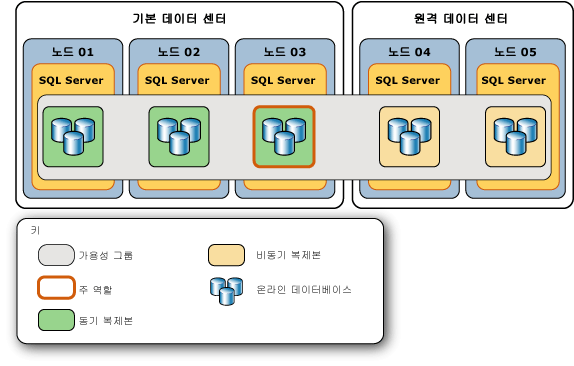
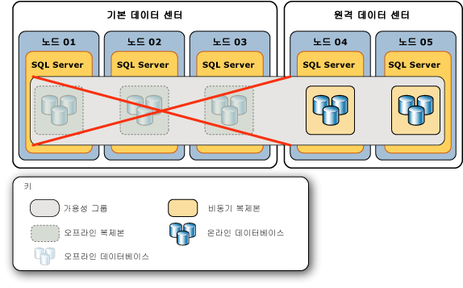
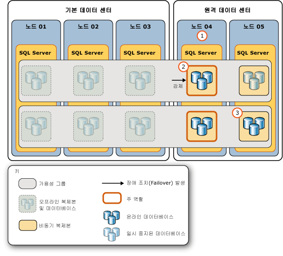
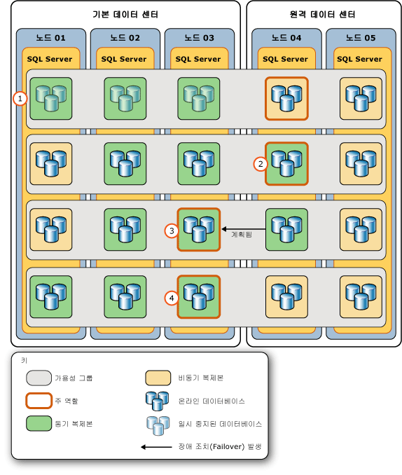

# <a name="perform-a-forced-manual-failover-of-an-availability-group-sql-server"></a>가용성 그룹의 강제 수동 장애 조치(Failover) 수행(SQL Server)
[!INCLUDE[appliesto-ss-xxxx-xxxx-xxx-md](../../../includes/appliesto-ss-xxxx-xxxx-xxx-md.md)]
  이 항목에서는 [!INCLUDE[ssManStudioFull](../../../includes/ssmanstudiofull-md.md)], [!INCLUDE[tsql](../../../includes/tsql-md.md)]또는 [!INCLUDE[ssCurrent](../../../includes/sscurrent-md.md)]의 PowerShell을 사용하여 Always On 가용성 그룹에서 강제 장애 조치(failover)(데이터 손실 가능)를 수행하는 방법을 설명합니다. 강제 장애 조치(failover)는 [예정된 수동 장애 조치(failover)](../../../database-engine/availability-groups/windows/perform-a-planned-manual-failover-of-an-availability-group-sql-server.md) 가 가능하지 않을 때 재해 복구용으로만 사용하기 위한 수동 장애 조치(failover)의 한 형태입니다. 동기화되지 않은 보조 복제본으로 강제 장애 조치(failover)를 수행하면 데이터 손실이 발생할 수 있습니다. 따라서 서비스를 즉시 가용성 그룹으로 복원해야 하고 데이터 손실 위험을 감수할 수 있는 경우에만 강제 장애 조치(failover)를 수행하는 것이 좋습니다.  
  
 강제 장애 조치(failover) 후 가용성 그룹이 장애 조치된 장애 조치failover) 대상은 새로운 주 복제본이 됩니다. 남은 보조 복제본에 있는 보조 데이터베이스는 일시 중지되기 때문에 수동으로 다시 시작해야 합니다. 이전의 주 복제본을 사용할 수 있게 되면 이 복제본은 보조 역할로 전환됩니다. 따라서 이전의 주 데이터베이스는 보조 데이터베이스가 되고 SUSPENDED 상태로 전환됩니다. 지정된 보조 데이터베이스를 다시 시작하기 전에 해당 데이터베이스에서 손실된 데이터를 복구할 수도 있습니다. 그러나 보조 데이터베이스 중 하나라도 일시 중지되어 있는 동안에는 지정된 주 데이터베이스에서 트랜잭션 로그 잘림이 지연됩니다.  
  
> [!IMPORTANT]  
>  주 데이터베이스를 사용한 데이터 동기화는 보조 데이터베이스가 재개될 때까지 발생하지 않습니다. 보조 데이터베이스를 재개하는 방법에 대한 정보는 이 문서의 뒷 부분에 나오는 [후속 작업: 강제 장애 조치(Failover) 후 필수 태스크](#FollowUp) 를 참조하세요.  
  
 강제 장애 조치(failover)는 다음과 같은 응급 상황에 수행해야 합니다.  
  
-   WSFC 클러스터에서*강제 쿼럼*을 수행한 후에는 각 가용성 그룹에 대해 강제 장애 조치(failover)(데이터 손실 가능)를 수행해야 합니다. 강제 장애 조치(failover)가 필요한 이유는 WSFC 클러스터 값의 실제 상태가 손실되었을 수 있기 때문입니다. 그러나 강제 쿼럼을 수행하기 전에 주 복제본이었던 복제본을 호스팅하는 시스템 인스턴스에서 강제 장애 조치(failover)를 수행할 수 있거나 강제 쿼럼을 수행하기 전에 동기화된 보조 복제본으로 강제 장애 조치(failover)를 수행할 수 있으면 데이터 손실을 방지할 수 있습니다. 자세한 내용은 이 항목의 뒷부분에 나오는 [강제 쿼럼 후 데이터 손실을 방지할 수 있는 잠재적인 방법](#WaysToAvoidDataLoss)을 참조하세요.  
  
    > [!IMPORTANT]  
    >  강제적인 방법이 아니라 자연스러운 방법으로 쿼럼을 다시 얻으면 가용성 복제본이 일반적인 방법으로 복구됩니다. 쿼럼을 다시 얻은 후에도 여전히 주 복제본을 사용할 수 없는 경우 동기화된 보조 복제본으로 예정된 수동 장애 조치(failover)를 수행할 수 있습니다.  
  
     강제 쿼럼에 대한 자세한 내용은 [강제 쿼럼을 통해 WSFC 재해 복구&#40;SQL Server&#41;](../../../sql-server/failover-clusters/windows/wsfc-disaster-recovery-through-forced-quorum-sql-server.md)의 PowerShell을 사용하여 Always On 가용성 그룹에서 강제 장애 조치(failover)(데이터 손실 가능)를 수행하는 방법을 설명합니다. 강제 쿼럼 후에 강제 장애 조치(failover)가 필요한 이유에 대한 자세한 내용은 [장애 조치(failover) 및 장애 조치(failover) 모드&#40;Always On 가용성 그룹&#41;](../../../database-engine/availability-groups/windows/failover-and-failover-modes-always-on-availability-groups.md)의 PowerShell을 사용하여 Always On 가용성 그룹에서 강제 장애 조치(failover)(데이터 손실 가능)를 수행하는 방법을 설명합니다.  
  
-   WSFC 클러스터에 정상 상태의 쿼럼이 있어도 주 복제본을 사용할 수 없는 경우 역할이 SECONDARY 또는 RESOLVING 상태인 복제본으로 강제 장애 조치(failover)(데이터 손실 가능)를 수행할 수 있습니다. 가능하면 주 복제본이 손실될 당시 동기화된 동기-커밋 보조 복제본으로 장애 조치(failover)를 수행하세요.  
  
    > [!TIP]  
    >  WSFC 클러스터에 정상 상태의 쿼럼이 있을 때 동기화된 보조 복제본에서 강제 장애 조치(failover) 명령을 실행하면 해당 복제본이 실제로 예정된 수동 장애 조치(failover)를 수행합니다.  
  
> [!NOTE]  
>  강제 장애 조치(failover)를 위한 필수 조건 및 권장 사항에 대한 자세한 내용과 강제 장애 조치(failover)를 사용하여 치명적인 오류에서 복구하는 예제 시나리오는 이 항목의 뒷부분에 나오는 [예제 시나리오: 강제 장애 조치(Failover)를 사용하여 치명적인 오류 복구](../../../database-engine/availability-groups/windows/perform-a-forced-manual-failover-of-an-availability-group-sql-server.md#ExampleRecoveryFromCatastrophy)를 참조하세요.  
  
-   **시작하기 전 주의 사항:**  
  
     [제한 사항](#Restrictions)  
  
     [필수 구성 요소](#Prerequisites)  
  
     [권장 사항](#Recommendations)  
  
     [강제 쿼럼 후 데이터 손실을 방지할 수 있는 잠재적인 방법](#WaysToAvoidDataLoss)  
  
     [보안](#Security)  
  
-   **강제 장애 조치(failover)를 수행하려면(데이터가 손실될 수 있음):**  
  
     [SQL Server Management Studio](#SSMSProcedure)  
  
     [Transact-SQL](#TsqlProcedure)  
  
     [PowerShell](#PowerShellProcedure)  
  
-   **후속 작업:** [강제 장애 조치(Failover) 후 필수 태스크](#FollowUp)  
  
-   **시나리오 예:** [강제 장애 조치(Failover)를 사용하여 치명적인 오류 복구](#ExampleRecoveryFromCatastrophy)  
  
-   [관련 태스크](#RelatedTasks)  
  
-   [관련 내용](#RelatedContent)  
  
##  <a name="BeforeYouBegin"></a> 시작하기 전에  
  
###  <a name="Restrictions"></a> 제한 사항  
  
-   장애 조치(failover)를 수행할 수 없는 유일한 시간은 WSFC(Windows Server 장애 조치(Failover) 클러스터링) 클러스터에 쿼럼이 부족할 때입니다.  
  
-   가용성 그룹의 강제 장애 조치(failover) 중 데이터가 손실될 수 있습니다. 또한 강제 장애 조치(failover)를 시작할 때 주 복제본이 실행 중인 경우 클라이언트는 여전히 이전의 주 데이터베이스에 연결되어 있을 수 있습니다. 따라서 주 복제본이 더 이상 실행되지 않는 경우와 가용성 그룹의 데이터베이스에 액세스를 복원하기 위해 데이터 손실 위험을 감수할 수 있는 경우에만 강제 장애 조치(failover)를 수행하는 것이 좋습니다.  
  
-   보조 데이터베이스가 REVERTING 또는 INITIALIZING 상태일 때는 강제 장애 조치(failover)를 수행해도 해당 데이터베이스가 주 데이터베이스로 시작되지 않습니다. 데이터베이스가 INTIAILIZGING 상태에 있었다면 데이터베이스 백업에서 누락된 로그 레코드를 적용하거나 처음부터 데이터베이스를 전체 복원해야 합니다. 데이터베이스가 REVERTING 상태에 있었다면 데이터베이스를 백업에서 전체 복원해야 합니다.  
  
-   장애 조치(failover) 명령은 장애 조치(failover) 대상에서 해당 명령을 수락하는 즉시 반환하지만 데이터베이스 복구는 가용성 그룹의 장애 조치가 끝난 후 비동기로 수행됩니다.  
  
-   장애 조치(failover) 시 가용성 그룹 내에서 데이터베이스 간 일관성은 유지되지 않을 수 있습니다.  
  
    > [!NOTE]  
    >  데이터베이스 간 트랜잭션 및 분산 트랜잭션 지원은 SQL Server 및 운영 체제 버전에 따라 달라집니다. 자세한 내용은 [Always On 가용성 그룹 및 데이터베이스 미러링에 대한 데이터베이스 간 트랜잭션 및 분산 트랜잭션&#40;SQL Server&#41;](../../../database-engine/availability-groups/windows/transactions-always-on-availability-and-database-mirroring.md)를 참조하세요.  
  
###  <a name="Prerequisites"></a> 사전 요구 사항  
  
-   WSFC 클러스터에 쿼럼이 있습니다. 클러스터에 쿼럼이 없는 경우 [강제 쿼럼을 통해 WSFC 재해 복구&#40;SQL Server&#41;](../../../sql-server/failover-clusters/windows/wsfc-disaster-recovery-through-forced-quorum-sql-server.md)의 PowerShell을 사용하여 Always On 가용성 그룹에서 강제 장애 조치(failover)(데이터 손실 가능)를 수행하는 방법을 설명합니다.  
  
-   역할이 SECONDARY 또는 RESOLVING 상태인 복제본을 호스팅하는 서버 인스턴스에 연결할 수 있어야 합니다.  
  
###  <a name="Recommendations"></a> 권장 사항  
  
-   주 복제본이 여전히 실행되는 동안에는 강제 장애 조치(failover)를 수행하지 마세요.  
  
-   가능하면 보조 데이터베이스가 NOT SYNCHRONIZED, SYNCHRONIZED 또는 SYNCHRONIZING 상태인 장애 조치(failover) 대상으로만 강제 장애 조치(failover)를 수행하세요. 보조 데이터베이스가 INTIAILIZGING 또는 REVERTING 상태일 경우 강제 장애 조치(failover)의 영향에 대한 자세한 내용은 이 항목의 앞 부분에서 [제한 사항](#Restrictions)을 참조하세요.  
  
-   일반적으로 서로 다른 비동기 커밋 보조 복제본에서 주 데이터베이스를 기준으로 지정된 보조 데이터베이스의 대기 시간이 비슷해야 합니다. 그러나 강제 장애 조치(failover)를 수행하는 경우 데이터 손실이 중요한 문제가 될 수 있습니다. 따라서 서로 다른 보조 복제본에서 데이터베이스 복사본의 상대적 대기 시간을 결정하는 데 시간이 걸린다는 사실을 고려해야 합니다. 지정된 보조 데이터베이스의 복사본 중 최소 대기 시간을 갖는 복사본을 확인하려면 해당 로그 끝 LSN을 비교합니다. 로그 끝 LSN이 클수록 대기 시간이 짧습니다.  
  
    > [!TIP]  
    >  로그 LSN 끝을 비교하려면 각 온라인 보조 복제본에 연결한 다음 각 로컬 보조 데이터베이스의 [end_of_log_lsn](../../../relational-databases/system-dynamic-management-views/sys-dm-hadr-database-replica-states-transact-sql.md) 값에 대해 **sys.dm_hadr_database_replica_states** 를 쿼리합니다. 그런 다음 각 데이터베이스의 여러 다른 복사본의 로그 끝 LSN을 비교합니다. 각 보조 복제본마다 각 데이터베이스의 가장 큰 LSN이 다를 수 있습니다. 이 경우 가장 적절한 장애 조치(failover) 대상은 서로 다른 데이터베이스의 데이터에 두는 상대적 중요도에 따라 달라집니다. 즉, 이러한 데이터베이스 중 데이터 손실을 가장 최소화하려는 데이터베이스를 고려합니다.  
  
-   클라이언트가 원래 주 복제본에 연결할 수 있는 경우 강제 장애 조치(failover)를 수행하면 분리 장애(split-brain) 동작이 발생할 위험이 있습니다. 강제 장애 조치(failover)를 수행하기 전에 클라이언트가 원래 주 복제본에 액세스하지 않도록 하는 것이 좋습니다. 그렇지 않으면 강제로 장애 조치한 후 원래 주 데이터베이스와 현재 주 데이터베이스가 서로 독립적으로 업데이트될 수 있습니다.  
  
###  <a name="WaysToAvoidDataLoss"></a> 강제 쿼럼 후 데이터 손실을 방지할 수 있는 잠재적인 방법  
 쿼럼이 손실된 후 오류 조건에 따라 다음과 같이 데이터 손실을 방지할 수 있습니다.  
  
-   **원래 주 복제본이 온라인 상태가 된 경우**  
  
     쿼럼이 손실된 경우 WSFC 쿼럼 강제 적용으로 가용성 그룹의 주 복제본을 호스팅하는 클러스터 노드를 복원하면 이 가용성 그룹에 대한 데이터 손실을 방지할 수 있습니다. 주 복제본에 연결하고 강제 장애 조치(failover)(FAILOVER_ALLOW_DATA_LOSS)를 수행합니다. 이렇게 하면 주 복제본이 다시 온라인 상태가 됩니다. 원래 주 복제본으로 강제 장애 조치(failover)를 수행하므로 데이터가 손실되지 않습니다.  
  
-   **동기화된 동기-커밋 보조 복제본이 온라인 상태가 된 경우**  
  
     쿼럼이 손실된 경우 WSFC 쿼럼 강제 적용으로 가용성 그룹의 동기화된 보조 복제본을 호스팅하는 클러스터 노드를 복원하면 이 가용성 그룹에 대한 데이터 손실을 방지할 수 있습니다. 쿼럼 손실 당시 복원된 노드가 실행 중이었다면 **sys.dm_hadr_database_replica_cluster_states** 동적 관리 뷰의 [is_failover_ready](../../../relational-databases/system-dynamic-management-views/sys-dm-hadr-database-replica-cluster-states-transact-sql.md) 열을 쿼리하여 지정된 데이터베이스에서 데이터 손실이 발생할 수 있었는지 여부를 확인할 수 있습니다. 예를 들어 `sql108w2k8r22`라는 서버 인스턴스가 있다고 가정할 경우 다음 쿼리를 실행합니다.  
  
    ```  
    SELECT * FROM sys.dm_hadr_database_replica_cluster_states  
       WHERE replica_id=(SELECT replica_id FROM sys.availability_replicas   
          WHERE replica_server_name ='sql108w2k8r22')  
    ```  
  
    > [!CAUTION]  
    >  쿼럼 손실 당시 복원된 노드가 실행되고 있지 않았다면 주 복제본이 오프라인으로 전환될 당시의 실제 클러스터 상태가 **is_failover_ready** 에 반영되지 않을 수 있습니다. 따라서 **is_failover_ready** 값은 실패 당시 호스트 노드가 실행 중이었던 경우에만 유효합니다. 자세한 내용은 [장애 조치(failover) 및 장애 조치(failover) 모드&#40;Always On 가용성 그룹&#41;](../../../database-engine/availability-groups/windows/failover-and-failover-modes-always-on-availability-groups.md)의 PowerShell을 사용하여 Always On 가용성 그룹에서 강제 장애 조치(failover)(데이터 손실 가능)를 수행하는 방법을 설명합니다.  
  
     **is_failover_ready** 가 1이면 데이터베이스가 클러스터에서 동기화된 상태로 표시되고 장애 조치(failover)를 수행할 준비가 됩니다. 지정된 보조 복제본의 모든 데이터베이스에 대해 **is_failover_ready** 가 1이면 이 데이터 복제본에서 데이터 손실 없이 강제 장애 조치(failover)(FORCE_FAILOVER_ALLOW_DATA_LOSS)를 수행할 수 있습니다. 그러면 동기화된 보조 복제본이 주 역할에서 온라인 상태가 됩니다. 즉, 모든 데이터가 그대로 있는 상태에서 새로운 주 복제본이 됩니다.  
  
     **is_failover_ready** 가 0이면 데이터베이스가 클러스터에서 동기화된 상태로 표시되지 않고 계획된 수동 장애 조치(failover)를 수행할 준비가 되지 *않습니다* . 호스트 보조 복제본으로 강제 장애 조치(failover)를 수행하면 이 데이터베이스에서 데이터가 손실됩니다.  
  
    > [!NOTE]  
    >  보조 복제본으로 강제 장애 조치(failover)를 수행할 때 손실되는 데이터의 양은 주 복제본과 장애 조치 대상(failover) 간의 시간차에 의해 결정됩니다. 그러나 WSFC 클러스터에 쿼럼이 부족하거나 쿼럼이 강제로 적용된 경우에는 잠재적 데이터 손실 양을 평가할 수 없습니다. 그러나 WSFC 클러스터가 정상 상태의 쿼럼을 다시 얻으면 잠재적 데이터 손실 추적을 시작할 수 있습니다. 자세한 내용은 [장애 조치(failover) 및 장애 조치(failover) 모드&#40;Always On 가용성 그룹&#41;](../../../database-engine/availability-groups/windows/failover-and-failover-modes-always-on-availability-groups.md)의 PowerShell을 사용하여 Always On 가용성 그룹에서 강제 장애 조치(failover)(데이터 손실 가능)를 수행하는 방법을 설명합니다.  
  
###  <a name="Security"></a> 보안  
  
####  <a name="Permissions"></a> Permissions  
 가용성 그룹에 대한 ALTER AVAILABILITY GROUP 권한, CONTROL AVAILABILITY GROUP 권한, ALTER ANY AVAILABILITY GROUP 권한 또는 CONTROL SERVER 권한이 필요합니다.  
  
##  <a name="SSMSProcedure"></a> SQL Server Management Studio 사용  
 **강제 장애 조치(failover)를 수행하려면(데이터가 손실될 수 있음)**  
  
1.  개체 탐색기에서, 장애 조치해야 할 가용성 그룹에서 역할이 SECONDARY 또는 RESOLVING인 복제본을 호스팅하는 서버 인스턴스에 연결하고 서버 트리를 확장합니다.  
  
2.  **Always On 고가용성** 노드 및 **가용성 그룹** 노드를 확장합니다.  
  
3.  장애 조치할 가용성 그룹을 마우스 오른쪽 단추로 클릭하고 **장애 조치(Failover)** 명령을 선택합니다.  
  
4.  그러면 가용성 그룹 장애 조치(failover) 마법사가 시작됩니다. 자세한 내용은 이 항목의 뒷부분에 나오는 [가용성 그룹 장애 조치(Failover) 마법사 사용&#40;SQL Server Management Studio&#41;](../../../database-engine/availability-groups/windows/use-the-fail-over-availability-group-wizard-sql-server-management-studio.md)의 PowerShell을 사용하여 Always On 가용성 그룹에서 강제 장애 조치(failover)(데이터 손실 가능)를 수행하는 방법을 설명합니다.  
  
5.  가용성 그룹을 강제로 장애 조치한 후 필요한 후속 단계를 완료합니다. 자세한 내용은 이 항목의 뒷부분에 있는 [후속 작업: 강제 장애 조치(Failover) 후 필수 태스크](#FollowUp)를 참조하세요.  
  
##  <a name="TsqlProcedure"></a> Transact-SQL 사용  
 **강제 장애 조치(failover)를 수행하려면(데이터가 손실될 수 있음)**  
  
1.  장애 조치해야 할 가용성 그룹에서 역할이 SECONDARY 또는 RESOLVING인 복제본을 호스팅하는 서버 인스턴스에 연결합니다.  
  
2.  다음과 같은 [ALTER AVAILABILITY GROUP](../../../t-sql/statements/alter-availability-group-transact-sql.md) 문을 사용합니다.  
  
     ALTER AVAILABILITY GROUP *group_name* FORCE_FAILOVER_ALLOW_DATA_LOSS  
  
     여기서 *group_name* 은 가용성 그룹의 이름입니다.  
  
     다음 예에서는 `AccountsAG` 가용성 그룹을 로컬 보조 복제본으로 강제로 장애 조치(failover)합니다.  
  
    ```  
    ALTER AVAILABILITY GROUP AccountsAG FORCE_FAILOVER_ALLOW_DATA_LOSS;  
    ```  
  
3.  가용성 그룹을 강제로 장애 조치한 후 필요한 후속 단계를 완료합니다. 자세한 내용은 이 항목의 뒷부분에 있는 [후속 작업: 강제 장애 조치(Failover) 후 필수 태스크](#FollowUp)를 참조하세요.  
  
##  <a name="PowerShellProcedure"></a> PowerShell 사용  
 **강제 장애 조치(failover)를 수행하려면(데이터가 손실될 수 있음)**  
  
1.  장애 조치해야 할 가용성 그룹에서 역할이 SECONDARY 또는 RESOLVING인 복제본을 호스팅하는 서버 인스턴스로 디렉터리를 변경합니다(**cd**).  
  
2.  **Switch-SqlAvailabilityGroup** cmdlet을 다음 형식 중 하나로 된 **AllowDataLoss** 매개 변수와 함께 사용합니다.  
  
    -   **-AllowDataLoss**  
  
         기본적으로 **-AllowDataLoss** 매개 변수를 사용하면 **Switch-SqlAvailabilityGroup** 에서 강제 장애 조치(failover)를 수행하면 커밋되지 않은 트랜잭션이 손실될 수 있음을 알리고 확인을 요청하는 메시지가 나타납니다. 계속하려면 **Y**를 입력하고, 작업을 취소하려면 **N**을 입력합니다.  
  
         다음 예제에서는 `MyAg` 이라는 서버 인스턴스의 보조 복제본으로 가용성 그룹 `SecondaryServer\InstanceName`의 강제 장애 조치(failover)(데이터가 손실될 수 있음)를 수행합니다. 이 작업을 확인하라는 메시지가 나타납니다.  
  
        ```  
        Switch-SqlAvailabilityGroup `  
           -Path SQLSERVER:\Sql\SecondaryServer\InstanceName\AvailabilityGroups\MyAg `  
           -AllowDataLoss  
        ```  
  
    -   **-AllowDataLoss-Force**  
  
         확인하지 않고 강제 장애 조치(failover)를 시작하려면 **-AllowDataLoss** 및 **-Force** 매개 변수를 모두 지정합니다. 이 작업은 명령을 스크립트에 포함시키고 사용자 상호 작용 없이 명령을 실행하려는 경우에 유용합니다.  그러나 강제 장애 조치(Failover)를 수행하면 가용성 그룹에 참여하는 데이터베이스에서 데이터가 손실될 수 있으므로 **-Force** 옵션은 주의해서 사용해야 합니다.  
  
         다음 예제에서는 `MyAg` 이라는 서버 인스턴스로 가용성 그룹 `SecondaryServer\InstanceName`의 강제 장애 조치(failover)(데이터가 손실될 수 있음)를 수행합니다. **-Force** 옵션을 사용하면 이 작업의 확인 메시지가 표시되지 않습니다.  
  
        ```  
        Switch-SqlAvailabilityGroup `  
           -Path SQLSERVER:\Sql\SecondaryServer\InstanceName\AvailabilityGroups\MyAg `  
           -AllowDataLoss -Force  
        ```  
  
    > [!NOTE]  
    >  cmdlet의 구문을 보려면 **PowerShell 환경에서** Get-Help [!INCLUDE[ssNoVersion](../../../includes/ssnoversion-md.md)] cmdlet을 사용합니다. 자세한 내용은 [Get Help SQL Server PowerShell](../../../relational-databases/scripting/get-help-sql-server-powershell.md)을 참조하세요.  
  
3.  가용성 그룹을 강제로 장애 조치한 후 필요한 후속 단계를 완료합니다. 자세한 내용은 이 항목의 뒷부분에 있는 [후속 작업: 강제 장애 조치(Failover) 후 필수 태스크](#FollowUp)를 참조하세요.  
  
 **SQL Server PowerShell 공급자를 설정하고 사용하려면**  
  
-   [SQL Server PowerShell 공급자](../../../relational-databases/scripting/sql-server-powershell-provider.md)  
  
##  <a name="FollowUp"></a> 후속 작업: 강제 장애 조치(Failover) 후 필수 태스크  
  
1.  강제 장애 조치 후 장애 조치한 보조 복제본은 새로운 주 복제본이 됩니다. 그러나 해당 가용성 복제본이 클라이언트에 액세스할 수 있도록 하려면 다음과 같이 WSFC 쿼럼을 다시 구성하거나 가용성 그룹의 가용성 모드 구성을 조정해야 할 수 있습니다.  
  
    -   **[!INCLUDE[ssFosAuto](../../../includes/ssfosauto-md.md)] 외부로 장애 조치(failover)한 경우:** 새로운 가용성 그룹 구성을 반영하도록 WSFC 노드의 쿼럼 투표를 조정합니다. 대상 보조 복제본을 호스팅하는 WSFC 노드에 WSFC 쿼럼 투표가 없는 경우 WSFC 쿼럼을 강제 적용해야 할 수 있습니다.  
  
        > [!NOTE]  
        >  [!INCLUDE[ssFosAuto](../../../includes/ssfosauto-md.md)] 는 자동 장애 조치(failover)를 사용하는 동기-커밋 모드에 대해 2개의 가용성 복제본(이전의 주 복제본 포함)이 구성된 경우에만 존재합니다.  
  
         **쿼럼 투표를 조정하려면**  
  
        -   [클러스터 쿼럼 NodeWeight 설정 보기](../../../sql-server/failover-clusters/windows/view-cluster-quorum-nodeweight-settings.md)  
  
        -   [클러스터 쿼럼 NodeWeight 설정 구성](../../../sql-server/failover-clusters/windows/configure-cluster-quorum-nodeweight-settings.md)  
  
        -   [쿼럼 없이 WSFC 클러스터 강제 시작](../../../sql-server/failover-clusters/windows/force-a-wsfc-cluster-to-start-without-a-quorum.md)  
  
    -   **[!INCLUDE[ssFosSync](../../../includes/ssfossync-md.md)] 외부에서 장애 조치(failover)한 경우:** 원하는 동기-커밋 및 자동 장애 조치(failover) 구성을 반영하도록 새로운 주 복제본과 나머지 보조 복제본에서 가용성 모드와 장애 조치(failover) 모드를 조정하는 것이 좋습니다.  
  
        > [!NOTE]  
        >  [!INCLUDE[ssFosSync](../../../includes/ssfossync-md.md)] 은 현재 주 복제본이 동기-커밋 모드용으로 구성되어 있는 경우에만 존재합니다.  
  
         **가용성 모드와 장애 조치(failover) 모드를 변경하려면**  
  
        -   [가용성 복제본의 가용성 모드 변경&#40;SQL Server&#41;](../../../database-engine/availability-groups/windows/change-the-availability-mode-of-an-availability-replica-sql-server.md)  
  
        -   [가용성 복제본의 장애 조치(failover) 모드 변경&#40;SQL Server&#41;](../../../database-engine/availability-groups/windows/change-the-failover-mode-of-an-availability-replica-sql-server.md)  
  
2.  강제 장애 조치(failover) 후 모든 보조 데이터베이스가 일시 중지됩니다. 여기에는 이전 주 복제본이 다시 온라인 상태가 되고 이제 보조 복제본임을 확인한 후의 이전 주 데이터베이스가 포함됩니다. 각 보조 복제본에서 일시 중지된 각 데이터베이스를 개별적으로 수동 재개해야 합니다.  
  
     재개된 보조 데이터베이스는 해당 주 데이터베이스와 데이터 동기화를 시작합니다. 보조 데이터베이스는 새로운 주 데이터베이스에서 커밋되지 않은 로그 레코드를 모두 롤백합니다. 따라서 사후 장애 조치(Post-failover) 주 데이터베이스에서 발생할 수 있는 데이터 손실이 우려되는 경우에는 동기 커밋 보조 데이터베이스 중 하나에서 일시 중지된 데이터베이스에 대한 데이터베이스 스냅숏을 만들어야 합니다.  
  
    > [!IMPORTANT]  
    >  보조 데이터베이스 중 하나라도 일시 중지되어 있는 동안에는 주 데이터베이스에서 트랜잭션 로그 잘림이 지연됩니다. 또한 일시 중지된 상태로 남아 있는 로컬 데이터베이스가 있으면 동기 커밋 보조 복제본의 동기화 상태가 정상으로 전환될 수 없습니다.  
  
     **데이터베이스 스냅숏을 만들려면**  
  
    -   [데이터베이스 스냅숏 만들기&#40;Transact-SQL&#41;](../../../relational-databases/databases/create-a-database-snapshot-transact-sql.md)  
  
     **가용성 데이터베이스를 재개하려면**  
  
    -   [가용성 데이터베이스 재개&#40;SQL Server&#41;](../../../database-engine/availability-groups/windows/resume-an-availability-database-sql-server.md)  
  
    > [!CAUTION]  
    >  모든 보조 데이터베이스를 재개한 후 그룹을 다시 장애 조치하기 전에 다음 장애 조치(failover) 대상의 모든 보조 데이터베이스가 SYNCHRONIZING 상태로 전환될 때까지 기다립니다. 데이터베이스가 아직 SYNCHRONIZING 상태가 아닌 경우 해당 데이터베이스는 주 데이터베이스로 온라인 상태가 될 수 없으며 데이터베이스에 대한 데이터 동기화를 다시 설정하려면 트랜잭션 로그를 복원하거나 전체 데이터베이스 백업을 복원하거나 다시 이전의 주 복제본으로 장애 조치해야 할 수 있습니다.  
  
3.  실패한 가용성 복제본이 가용성 복제본으로 돌아가지 않거나 너무 늦게 돌아가서 새로운 주 데이터베이스에서 트랜잭션 로그 잘림을 지연시킬 수 없는 경우 가용성 그룹에서 오류 상태의 복제본을 제거하여 로그 파일에 사용할 디스크 공간이 부족하지 않도록 할 수 있습니다.  
  
     **보조 복제본을 제거하려면**  
  
    -   [가용성 그룹에서 보조 복제본 제거&#40;SQL Server&#41;](../../../database-engine/availability-groups/windows/remove-a-secondary-replica-from-an-availability-group-sql-server.md)  
  
4.  하나 이상의 추가 강제 장애 조치(Failover)가 포함된 강제 장애 조치를 수행하는 경우 각 추가 강제 장애 조치 후 로그 백업을 수행합니다. 그 이유에 대한 자세한 내용은 [장애 조치(failover) 및 장애 조치(failover) 모드&#40;Always On 가용성 그룹&#41;](../../../database-engine/availability-groups/windows/failover-and-failover-modes-always-on-availability-groups.md)의 PowerShell을 사용하여 Always On 가용성 그룹에서 강제 장애 조치(failover)(데이터 손실 가능)를 수행하는 방법을 설명합니다.  
  
     **로그 백업을 수행하려면**  
  
    -   [트랜잭션 로그 백업&#40;SQL Server&#41;](../../../relational-databases/backup-restore/back-up-a-transaction-log-sql-server.md)  
  
##  <a name="ExampleRecoveryFromCatastrophy"></a> 예제 시나리오: 강제 장애 조치(Failover)를 사용하여 치명적인 오류 복구  
 주 복제본이 실패하고 사용할 수 있는 동기화된 보조 복제본이 없는 경우 가용성 그룹을 강제 장애 조치(failover)하는 것이 적절한 대처 방법이 될 수 있습니다. 강제 장애 조치(failover)의 적합성은 (1) SLA(서비스 수준 계약)에서 허용하는 기간보다 오랫동안 주 복제본이 오프라인 상태가 될 것으로 예상되는지 여부와 (2) 주 데이터베이스를 빨리 사용 가능하게 하기 위해 잠재적인 데이터 손실 위험을 감수할지 여부에 따라 결정됩니다. 가용성 그룹을 강제 장애 조치(failover)해야 한다고 판단되는 경우 실제 강제 장애 조치(failover)는 여러 단계 프로세스 중 한 단계일 뿐입니다.  
  
 이 항목에서는 강제 장애 조치(failover)를 사용하여 치명적인 오류를 복구하는 데 필요한 단계를 보여 주기 위해 가능한 재해 복구 시나리오를 제공합니다. 예제 시나리오에서는 원래 토폴로지가 주 복제본을 비롯한 세 개의 동기 커밋 가용성 복제본을 호스팅하는 기본 데이터 센터와 두 개의 동기 커밋 보조 복제본을 호스팅하는 원격 데이터 센터로 구성된 가용성 그룹을 고려합니다. 다음 그림에서는 이 예제 가용성 그룹의 원래 토폴로지를 보여 줍니다. 가용성 그룹은 기본 데이터 센터에 세 개의 노드(**노드 01**, **노드 02**및 **노드 03**)가 있고 원격 데이터 센터에 두 개의 노드(**노드 04** 및 **노드 05**)가 있는 다중 서브넷 WSFC 클러스터에 의해 호스트됩니다.  
  
   
  
 기본 데이터 센터가 예기치 않게 종료됩니다. 기본 데이터 센터의 세 가용성 복제본이 오프라인 상태가 되고 해당 데이터베이스를 사용할 수 없게 됩니다. 다음 그림에서는 이 장애가 가용성 그룹의 토폴로지에 주는 영향을 보여 줍니다.  
  
   
  
 DBA(데이터베이스 관리자)는 가용성 그룹을 원격 비동기 커밋 보조 복제본 중 하나로 강제 장애 조치(failover)하는 것이 가능한 최고의 대처 방법이라고 결정합니다. 이 예제에서는 가용성 그룹을 원격 복제본으로 강제 장애 조치(failover)하고 가용성 그룹을 원래 토폴로지로 돌려 놓는 경우와 관련된 일반적인 단계를 보여 줍니다.  
  
 여기에 제시된 실패 응답은 다음과 같은 두 단계로 구성되어 있습니다.  
  
-   [기본 데이터 센터의 치명적인 오류에 응답](#FailureResponse)  
  
-   [가용성 그룹을 원래 토폴로지로 복귀](#ReturnToOrigTopology)  
  
###  <a name="FailureResponse"></a> Responding to the Catastrophic Failure of the Main Data Center  
 다음 그림에서는 기본 데이터 센터에서의 치명적 오류에 대한 응답으로 원격 데이터 센터에서 수행되는 일련의 동작을 보여 줍니다.  
  
   
  
 이 그림의 단계는 다음 단계를 나타냅니다.  
  
|단계|작업|링크|  
|----------|------------|-----------|  
|**1.**|DBA 또는 네트워크 관리자는 WSFC 클러스터가 정상 쿼럼인지 확인합니다. 이 예제에서는 쿼럼을 강제 실행해야 합니다.|[WSFC 쿼럼 모드 및 투표 구성&#40;SQL Server&#41;](../../../sql-server/failover-clusters/windows/wsfc-quorum-modes-and-voting-configuration-sql-server.md)<br /><br /> [강제 쿼럼을 통해 WSFC 재해 복구&#40;SQL Server&#41;](../../../sql-server/failover-clusters/windows/wsfc-disaster-recovery-through-forced-quorum-sql-server.md)|  
|**2.**|DBA는 **노드 04**에서 최소 대기 시간을 사용하여 서버 인스턴스에 연결하고 강제 수동 장애 조치(failover)를 수행합니다. 강제 장애 조치(failover)는 이 보조 복제본을 주 역할로 전환하고 나머지 보조 복제본( **노드 05**)에서 보조 데이터베이스를 일시 중지합니다.|[sys.dm_hadr_database_replica_states&#40;Transact-SQL&#41;](../../../relational-databases/system-dynamic-management-views/sys-dm-hadr-database-replica-states-transact-sql.md) ( **sys.dm_hadr_database_replica_states** 열을 쿼리합니다. 자세한 내용은 이 항목의 앞부분에 나오는 [권장 사항](#Recommendations)을 참조하세요.)|  
|**3.**|DBA는 수동으로 나머지 보조 복제본에서 보조 데이터베이스를 재개합니다.|[가용성 데이터베이스 재개&#40;SQL Server&#41;](../../../database-engine/availability-groups/windows/resume-an-availability-database-sql-server.md)|  
  
###  <a name="ReturnToOrigTopology"></a> 가용성 그룹을 원래 토폴로지로 복귀  
 다음 그림에서는 기본 데이터 센터가 다시 온라인 상태가 되고 WSFC 노드가 WSFC 클러스터와의 통신을 다시 설정한 후 가용성 그룹을 원래 토폴로지로 돌려 놓는 일련의 동작을 보여 줍니다.  
  
> [!IMPORTANT]  
>  WSFC 클러스터 쿼럼을 강제 적용하는 경우 오프라인 노드가 다시 시작될 때 다음 조건에 모두 부합하면 오프라인 노드가 새 쿼럼을 형성할 수 있습니다. (a) 강제 쿼럼 집합의 노드 간에 네트워크 연결이 없는 경우 (b) 다시 시작되는 노드가 대부분 클러스터 노드인 경우. 이 경우 가용성 그룹에 두 개의 독립적인 주 복제본(각 데이터 센터에 하나씩)이 있는 "분리 장애(split-brain)"가 발생합니다. 쿼럼을 강제 실행하여 소수 쿼럼 집합을 만들기 전에 [강제 쿼럼을 통해 WSFC 재해 복구&#40;SQL Server&#41;](../../../sql-server/failover-clusters/windows/wsfc-disaster-recovery-through-forced-quorum-sql-server.md)의 PowerShell을 사용하여 Always On 가용성 그룹에서 강제 장애 조치(failover)(데이터 손실 가능)를 수행하는 방법을 설명합니다.  
  
   
  
 이 그림의 단계는 다음 단계를 나타냅니다.  
  
||단계|링크|  
|-|----------|-----------|  
|**1.**|기본 데이터 센터의 노드가 다시 온라인 상태가 되고 WSFC 클러스터와의 통신을 다시 설정합니다. 해당 가용성 복제본이 일시 중지된 데이터베이스가 있는 보조 복제본으로 온라인 상태가 되고 DBA가 곧 이 데이터베이스를 각각 수동으로 재개해야 합니다.|[가용성 데이터베이스 재개&#40;SQL Server&#41;](../../../database-engine/availability-groups/windows/resume-an-availability-database-sql-server.md)<br /><br /> 팁: 사후 장애 조치(failover) 주 데이터베이스에서 데이터가 손실될 가능성이 있는 경우에는 동기 커밋 보조 데이터베이스 중 하나에서 일시 중지된 데이터베이스에 대한 데이터베이스 스냅숏을 만들어야 합니다. 보조 데이터베이스 중 하나라도 일시 중지되어 있는 동안에는 주 데이터베이스에서 트랜잭션 로그 잘림이 지연됩니다. 또한 일시 중지된 상태로 남아 있는 로컬 데이터베이스가 있으면 동기 커밋 보조 복제본의 동기화 상태가 정상으로 전환될 수 없습니다.|  
|**2.**|데이터베이스를 재개하면 DBA가 새 주 복제본을 동기 커밋 모드로 일시적으로 변경합니다. 여기에는 다음 두 단계가 포함됩니다.<br /><br /> 1) 오프라인 가용성 복제본 하나를 비동기 커밋 모드로 변경합니다.<br /><br /> 2) 새 주 복제본을 동기 커밋 가용성 모드로 변경합니다. 참고: 이 단계에서는 다시 시작된 동기 커밋 보조 데이터베이스를 동기화된 상태로 설정할 수 있습니다.|[가용성 복제본의 가용성 모드 변경&#40;SQL Server&#41;](../../../database-engine/availability-groups/windows/change-the-availability-mode-of-an-availability-replica-sql-server.md)|  
|**3.**|**노드 03** (원래 주 복제본)에서 동기 커밋 보조 복제본이 정상 동기화 상태가 되면 DBA는 해당 복제본에 대해 계획된 수동 장애 조치(failover)를 수행하여 다시 주 복제본이 되도록 합니다. **노드 04** 의 복제본은 보조 복제본으로 돌아갑니다.|[sys.dm_hadr_database_replica_states&#40;Transact-SQL&#41;](../../../relational-databases/system-dynamic-management-views/sys-dm-hadr-database-replica-states-transact-sql.md)<br /><br /> [Always On 정책을 사용하여 가용성 그룹의 상태 보기&#40;SQL Server&#41;](../../../database-engine/availability-groups/windows/use-always-on-policies-to-view-the-health-of-an-availability-group-sql-server.md)<br /><br /> [가용성 그룹의 계획된 수동 장애 조치(Failover) 수행&#40;SQL Server&#41;](../../../database-engine/availability-groups/windows/perform-a-planned-manual-failover-of-an-availability-group-sql-server.md)|  
|**4.**|DBA는 새 주 복제본에 연결하고 다음 작업을 수행합니다.<br /><br /> 1) 원격 센터의 이전 주 복제본을 다시 비동기 커밋 모드로 변경합니다.<br /><br /> 2) 기본 데이터 센터의 비동기 커밋 보조 복제본을 다시 동기 커밋 모드로 변경합니다.|[가용성 복제본의 가용성 모드 변경&#40;SQL Server&#41;](../../../database-engine/availability-groups/windows/change-the-availability-mode-of-an-availability-replica-sql-server.md)|  
  
##  <a name="RelatedTasks"></a> 관련 태스크  
 **쿼럼 투표를 조정하려면**  
  
-   [클러스터 쿼럼 NodeWeight 설정 보기](../../../sql-server/failover-clusters/windows/view-cluster-quorum-nodeweight-settings.md)  
  
-   [클러스터 쿼럼 NodeWeight 설정 구성](../../../sql-server/failover-clusters/windows/configure-cluster-quorum-nodeweight-settings.md)  
  
-   [쿼럼 없이 WSFC 클러스터 강제 시작](../../../sql-server/failover-clusters/windows/force-a-wsfc-cluster-to-start-without-a-quorum.md)  
  
 **계획된 수동 장애 조치(failover):**  
  
-   [가용성 그룹의 계획된 수동 장애 조치(Failover) 수행&#40;SQL Server&#41;](../../../database-engine/availability-groups/windows/perform-a-planned-manual-failover-of-an-availability-group-sql-server.md)  
  
-   [가용성 그룹 장애 조치(Failover) 마법사 사용&#40;SQL Server Management Studio&#41;](../../../database-engine/availability-groups/windows/use-the-fail-over-availability-group-wizard-sql-server-management-studio.md)  
  
 **문제를 해결하려면**  
  
-   [Always On 가용성 그룹 구성 문제 해결&#40;SQL Server&#41;](../../../database-engine/availability-groups/windows/troubleshoot-always-on-availability-groups-configuration-sql-server.md)  
  
-   [실패한 파일 추가 작업 문제 해결&#40;Always On 가용성 그룹&#41;](../../../database-engine/availability-groups/windows/troubleshoot-a-failed-add-file-operation-always-on-availability-groups.md)  
  
##  <a name="RelatedContent"></a> 관련 내용  
  
-   **블로그:**  
  
     [SQL Server Always On 팀 블로그: 공식 SQL Server Always On 팀 블로그](https://blogs.msdn.microsoft.com/sqlalwayson/)  
  
     [CSS SQL Server 엔지니어 블로그](http://blogs.msdn.com/b/psssql/)  
  
-   **백서:**  
  
     [고가용성 및 재해 복구를 위한 Microsoft SQL Server Always On 솔루션 가이드](http://go.microsoft.com/fwlink/?LinkId=227600)  
  
     [SQL Server 2012에 대한 Microsoft 백서](http://msdn.microsoft.com/library/hh403491.aspx)  
  
     [SQL Server 고객 자문 팀 백서](http://sqlcat.com/)  
  
## <a name="see-also"></a>참고 항목  
 [Always On 가용성 그룹 개요&#40;SQL Server&#41;](../../../database-engine/availability-groups/windows/overview-of-always-on-availability-groups-sql-server.md)   
 [가용성 모드&#40;Always On 가용성 그룹&#41;](../../../database-engine/availability-groups/windows/availability-modes-always-on-availability-groups.md)   
 [장애 조치 및 장애 조치 모드&#40;Always On 가용성 그룹&#41;](../../../database-engine/availability-groups/windows/failover-and-failover-modes-always-on-availability-groups.md)   
 [가용성 복제본에 대한 클라이언트 연결 액세스 정보&#40;SQL Server&#41;](../../../database-engine/availability-groups/windows/about-client-connection-access-to-availability-replicas-sql-server.md)   
 [가용성 그룹 모니터링&#40;SQL Server&#41;](../../../database-engine/availability-groups/windows/monitoring-of-availability-groups-sql-server.md)   
 [SQL Server의 WSFC&#40;Windows Server 장애 조치(failover) 클러스터링&#41;](../../../sql-server/failover-clusters/windows/windows-server-failover-clustering-wsfc-with-sql-server.md)  
  
  
