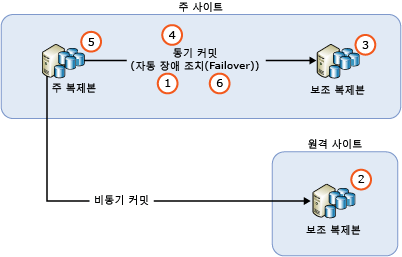
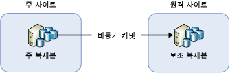
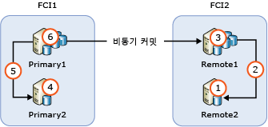

# Always On 가용성 그룹 복제본 인스턴스 업그레이드
[!INCLUDE[appliesto-ss-xxxx-xxxx-xxx-md](../../../includes/appliesto-ss-xxxx-xxxx-xxx-md.md)]

  [!INCLUDE[ssNoVersion](../../../includes/ssnoversion-md.md)] Always On 가용성 그룹을 신규 [!INCLUDE[ssCurrent](../../../includes/sscurrent-md.md)] 버전, 신규 [!INCLUDE[ssNoVersion](../../../includes/ssnoversion-md.md)]서비스 팩 또는 누적 업데이트로 업그레이드하거나 신규 Windows 서비스 팩 또는 누적 업데이트를 설치하려는 경우 롤링 업그레이드를 수행하여 주 복제본을 단일 수동 장애 조치(Failover)에만 적용하여 가동 중지 시간을 단축할 수 있습니다(또는 원본 주 복제본이 실패하는 경우 두 개의 수동 장애 조치(Failover)). 업그레이드 프로세스 동안 읽기 전용 작업 또는 장애 조치(Failover)에서는 보조 복제본을 사용할 수 없고 업그레이드 이후에는 주 복제본 노드에서의 작업 크기에 따라 보조 복제본이 주 복제본 노드를 따라잡기 위해서는 약간의 시간이 걸릴 수 있습니다(이로 인해 높은 네트워크 트래픽이 예상됨).  
  
> [!NOTE]  
>  이 항목은 SQL Server 업그레이드에 대한 설명으로 제한됩니다. WSFC(Windows Server Failover Clusting) 클러스터를 포함하는 운영 체제 업그레이드를 다루지 않습니다. Windows Server 2012 R2 이전의 운영 체제에서는 장애 조치(Failover) 클러스터를 호스팅하는 Windows 운영 체제 업그레이드가 지원되지 않습니다. Windows Server 2012 R2에서 실행되는 클러스터 노드를 업그레이드하려면 [클러스터 운영 체제 롤링 업그레이드](https://technet.microsoft.com/library/dn850430.aspx)를 참조하세요.  
  
## 필수 구성 요소  
 시작하기 전에 다음과 같은 중요한 정보를 검토하십시오.  
  
-   [Supported Version and Edition Upgrades](../../../database-engine/install-windows/supported-version-and-edition-upgrades.md): 사용자의 Windows 운영 체제 버전 및 SQL Server 버전에서 SQL Server 2016으로 업그레이드할 수 있는지 확인합니다. 예를 들어, SQL Server 2005 인스턴스에서 [!INCLUDE[ssCurrent](../../../includes/sscurrent-md.md)]로 직접 업그레이드할 수 없습니다.  
  
-   [Choose a Database Engine Upgrade Method](../../../database-engine/install-windows/choose-a-database-engine-upgrade-method.md): 지원되는 버전 및 버전 업그레이드에 대한 검토와 사용자 환경에 설치된 기타 구성 요소를 바탕으로 적절한 업그레이드 방법 및 단계를 선택하여 올바른 순서로 구성 요소를 업그레이드합니다.  
  
-   [데이터베이스 엔진 업그레이드 계획 및 테스트](../../../database-engine/install-windows/plan-and-test-the-database-engine-upgrade-plan.md): 릴리스 정보 및 알려진 업그레이드 문제, 업그레이드 전 검사 목록을 검토한 후 업그레이드 계획을 개발하고 테스트합니다.  
  
-   [SQL Server 2016 설치를 위한 하드웨어 및 소프트웨어 요구 사항](../../../sql-server/install/hardware-and-software-requirements-for-installing-sql-server.md): [!INCLUDE[ssCurrent](../../../includes/sscurrent-md.md)]를 설치하기 위한 소프트웨어 요구 사항을 검토합니다. 추가 소프트웨어가 필요한 경우 가동 중지 시간을 최소화할 수 있도록 업그레이드 프로세스를 시작하기 전에 각 노드에 해당 소프트웨어를 설치하세요.  
  
## Always On 가용성 그룹의 롤링 업그레이드를 위한 최상의 방법  
 서버 업그레이드 도는 업데이트를 수행할 때 가용성 그룹에 대한 가동 중단 시간 및 데이터 손실을 최소화하기 위해 다음과 같은 최상의 방법을 구현해야 합니다.  
  
-   롤링 업그레이드를 시작하기 전에  
  
    -   동기-커밋 복제본 인스턴스 중 하나 이상에서 수동 장애 조치(Failover)를 연습해 봅니다.  
  
    -   모든 가용성 데이터베이스에 대해 전체 데이터베이스 백업을 수행하여 데이터를 보호합니다.  
  
    -   모든 가용성 데이터베이스에서 DBCC CHECKDB를 실행합니다.  
  
-   항상 원격 보조 복제본을 먼저 업그레이드한 후 로컬 보조 복제본 인스턴스와 주 복제본 인스턴스 순으로 업그레이드합니다.  
  
-   업그레이드되고 있는 데이터베이스에 대한 백업은 발생할 수 없습니다.  보조 복제본을 업그레이드하기 전에 주 복제본에 대해서만 백업을 실행하도록 자동화된 백업 기본 설정을 구성합니다.  버전을 업그레이드하는 동안 백업을 위해 복제본을 읽거나 사용할 수 없습니다. 비-버전 업그레이드 동안 자동화 업데이트가 보조 복제본에서 실행되도록 구성한 후 주 복제본을 업그레이드할 수 있습니다.  
  
-   버전 업그레이드 동안 읽기 가능 보조 복제본은 읽기 가능 보조 복제본을 업그레이드한 후 및 주 복제본이 업그레이드된 보조 복제본으로 장애 조치(Failover)되거나 주 복제본이 업그레이드되기 이전에 읽을 수 없습니다.  
  
-   업그레이드 프로세스 동안 가용성 그룹에서 의도하지 않은 장애 조치(failover)를 수행하지 않도록 시작하기 전에 모든 동기-커밋에서 가용성 장애 조치(failover)를 제거하십시오.  
  
-   가용성 그룹을 보조 복제본이 포함된 업그레이드된 인스턴스로 장애 조치(Failover)하기 전에 주 복제본 인스턴스를 업그레이드해서는 안 됩니다. 그렇지 않으면 주 복제본 인스턴스에서 업그레이드를 진행하는 동안 클라이언트 응용 프로그램의 작동 중단 시간이 길어질 수 있습니다.  
  
-   항상 가용성 그룹을 동기-커밋 보조 복제본 인스턴스로 장애 조치(failover)합니다. 비동기-커밋 보조 복제본 인스턴스로 장애 조치(failover)하는 경우 데이터베이스의 데이터가 손실되고, 데이터 이동을 수동으로 다시 시작할 때까지 데이터 이동이 자동으로 중지됩니다.  
  
-   다른 보조 복제본 노드를 업그레이드하기 전에 주 복제본 인스턴스를 업그레이드해서는 안 됩니다. 업그레이드된 주 복제본은 [!INCLUDE[ssCurrent](../../../includes/sscurrent-md.md)] 인스턴스가 아직 같은 버전으로 업그레이드되지 않은 보조 복제본에 로그를 더 이상 전달할 수 없습니다. 보조 복제본으로 데이터 이동이 일시 중지된 경우 해당 복제본에 대한 자동 장애 조치(failover)를 수행할 수 없고 가용성 데이터베이스의 데이터가 손실될 수 있습니다.  
  
-   가용성 그룹을 장애 조치(failover)하기 전에 장애 조치(failover) 대상의 동기화 상태가 SYNCHRONIZED인지 확인하십시오.  
  
## 롤링 업그레이드 프로세스  
 실제로 정확한 프로세스는 가용성 그룹의 배포 토폴로지 및 각 복제본의 커밋 모드와 같은 요소에 따라 달라집니다. 가장 간단한 시나리오는 다음 단계가 포함된 가장 간단한 형식의 다단계 프로세스로 롤링 업그레이드를 수행하는 것입니다.  
  
   
  
1.  모든 동기-커밋 복제본에서 자동 장애 조치(failover)를 제거합니다.  
  
2.  비동기-커밋 보조 복제본을 실행하는 모든 원격 보조 복제본 인스턴스를 업그레이드합니다.  
  
3.  현재 주 복제본을 실행하지 않는 모든 로컬 보조 복제본 인스턴스를 업그레이드합니다.  
  
4.  수동으로 가용성 그룹을 로컬 동기-커밋 보조 복제본으로 장애 조치(failover)합니다.  
  
5.  이전에 주 복제본을 호스팅한 로컬 복제본 인스턴스를 업그레이드 또는 업데이트합니다.  
  
6.  자동 장애 조치(Failover) 파트너를 원하는 대로 구성합니다.  
  
 필요한 경우 추가 수동 장애 조치(failover)를 수행하여 가용성 그룹을 원래 구성으로 되돌릴 수 있습니다.  
  
## 원격 보조 복제본 하나가 포함된 가용성 그룹  
 재해 복구용으로만 가용성 그룹을 배포한 경우 가용성 그룹을 비동기-커밋 보조 복제본으로 장애 조치(failover)해야 할 수 있습니다. 다음 그림에서는 이 구성을 보여 줍니다.  
  
   
  
 이 경우 롤링 업그레이드 동안 가용성 그룹을 비동기-커밋 보조 복제본으로 장애 조치(failover)해야 합니다. 데이터 손실을 방지하려면 가용성 그룹을 장애 조치(failover)하기 전에 커밋 모드를 동기 커밋으로 변경하고 보조 복제본이 동기화될 때까지 기다리십시오. 즉, 롤링 업그레이드 프로세스는 다음과 같습니다.  
  
1.  원격 사이트에서 보조 복제본 인스턴스 업그레이드  
  
2.  커밋 모드를 동기 커밋으로 변경  
  
3.  동기화 상태가 SYNCHRONIZED가 될 때까지 대기  
  
4.  가용성 그룹을 원격 사이트의 보조 복제본으로 장애 조치(failover)  
  
5.  로컬 (주 사이트) 복제본 인스턴스 업그레이드 또는 업데이트  
  
6.  가용성 그룹을 주 사이트로 다시 장애 조치(failover)  
  
7.  커밋 모드를 비동기 커밋으로 변경  
  
 동기-커밋 모드는 원격 사이트로 데이터 동기화에 권장되는 설정이 아니므로 설정 변경 후 클라이언트 응용 프로그램에서 데이터베이스 대기 시간이 증가됨을 즉각적으로 알릴 수 있습니다. 또한 장애 조치(failover)를 수행하면 승인되지 않은 모든 로그 메시지가 삭제됩니다. 두 사이트 간 긴 네트워크 지연 시간으로 인해 삭제된 로그 메시지의 양이 상당히 커질 수 있고 이에 따라 방대한 양의 트랜잭션이 실패할 수 있습니다. 다음을 수행하여 클라이언트 응용 프로그램에 대한 영향을 최소화할 수 있습니다.  
  
-   클라이언트 트래픽이 낮을 때 유지 관리 기간을 신중하게 선택합니다.  
  
-   주 사이트에서 [!INCLUDE[ssCurrent](../../../includes/sscurrent-md.md)] 을(를) 업그레이드 또는 업데이트하는 동안 가용성 모드를 비동기 커밋으로 변경한 다음 주 사이트에 대한 장애 조치(failover)를 수행할 준비가 되면 동기 커밋으로 되돌립니다.  
  
## 장애 조치(Failover) 클러스터 인스턴스 노드가 포함된 가용성 그룹  
 가용성 그룹에 FCI(장애 조치(failover) 클러스터 인스턴스) 노드가 포함된 경우 활성 노드를 업그레이드하기 전에 비활성 노드를 업그레이드해야 합니다. 아래 그림에서는 로컬 고가용성을 위한 FCI 및 원격 재해 복구용 FCI 간 비동기 커밋과 함께 일반적인 가용성 그룹 시나리오와 업그레이드 시퀀스를 설명합니다.  
  
   
  
1.  REMOTE2 업그레이드 또는 업데이트  
  
2.  FCI2를 REMOTE2로 장애 조치(Failover)  
  
3.  REMOTE1 업그레이드 또는 업데이트  
  
4.  PRIMARY2 업그레이드 또는 업데이트  
  
5.  FCI1을 PRIMARY2로 장애 조치(Failover)  
  
6.  PRIMARY1 업그레이드 또는 업데이트  
  
## 여러 가용성 그룹이 있는 SQL Server 인스턴스 업그레이드/업데이트  
 별도의 서버 노드(활성/비활성 구성)에서 주 복제본이 있는 여러 가용성 그룹을 실행 중인 경우 프로세스 중에 고가용성을 유지하기 위해 업그레이드 경로에 더 많은 장애 조치(failover) 단계가 포함됩니다. 다음 표와 같이 3개의 서버 노드에서 3개의 가용성 그룹을 실행하고 모든 보조 복제본이 동기-커밋 모드에서 실행 중이라고 가정합니다.  
  
|가용성 그룹|Node1|Node2|Node3|  
|------------------------|-----------|-----------|-----------|  
|AG1|주|||  
|AG2||주||  
|AG3|||주|  
  
 다음 시퀀스에서 부하 분산 롤링 업그레이드를 실행하기 위한 상황에 적합할 수 있습니다.  
  
1.  AG2를 Node3으로 장애 조치(Failover)(Node2를 확보하기 위함)  
  
2.  Node2 업그레이드 또는 업데이트  
  
3.  AG1을 Node2로 장애 조치(Failover)(Node1을 확보하기 위함)  
  
4.  Node1 업그레이드 또는 업데이트  
  
5.  AG2 및 AG3을 Node1로 장애 조치(Failover)(Node3을 확보하기 위함)  
  
6.  Node3 업그레이드 또는 업데이트  
  
7.  AG3을 Node3으로 장애 조치(Failover)  
  
 이 업그레이드 시퀀스에는 가용성 그룹당 2번의 장애 조치(Failover)보다 적은 평균적인 작동 중단 시간이 발생합니다. 결과적인 구성이 아래 표에 표시됩니다.  
  
|가용성 그룹|Node1|Node2|Node3|  
|------------------------|-----------|-----------|-----------|  
|AG1||주||  
|AG2|주|||  
|AG3|||주|  
  
 특정 구현에 따라 업그레이드 경로가 달라질 수 있으며 클라이언트 응용 프로그램에 발생하는 작동 중지 시간도 달라질 수 있습니다.  
  
> [!NOTE]  
>  대부분의 경우에서 롤링 업그레이드가 완료된 후 원래 주 복제본에 대한 장애 복구가 수행됩니다.  
  
## 참고 항목  
 [설치 마법사를 사용하여 SQL Server 2016으로 업그레이드&#40;설치&#41;](../../../database-engine/install-windows/upgrade-sql-server-using-the-installation-wizard-setup.md)   
 [명령 프롬프트에서 SQL Server 2016 설치](../../../database-engine/install-windows/install-sql-server-2016-from-the-command-prompt.md)  
  
  
