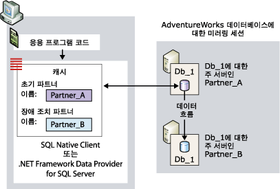
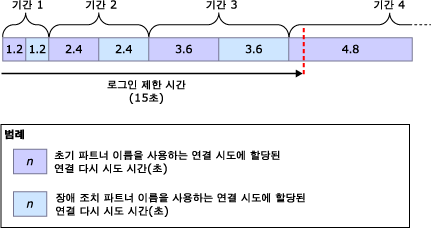
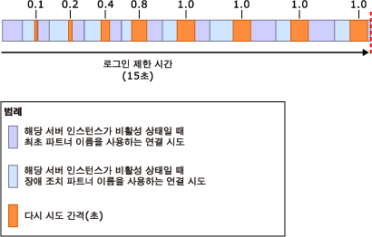

# <a name="connect-clients-to-a-database-mirroring-session-sql-server"></a>데이터베이스 미러링 세션에 클라이언트 연결(SQL Server)
[!INCLUDE[appliesto-ss-xxxx-xxxx-xxx-md](../../includes/appliesto-ss-xxxx-xxxx-xxx-md.md)]
  데이터베이스 미러링 세션에 연결하기 위해 클라이언트는 [!INCLUDE[ssNoVersion](../../includes/ssnoversion-md.md)] Native Client 또는 .NET Framework Data Provider for [!INCLUDE[ssNoVersion](../../includes/ssnoversion-md.md)]를 사용할 수 있습니다. [!INCLUDE[ssCurrent](../../includes/sscurrent-md.md)] 데이터베이스에 대해 구성하면 두 데이터 액세스 공급자가 모두 데이터베이스 미러링을 완전하게 지원합니다. 미러된 데이터베이스 사용 시 프로그래밍 고려 사항에서 대한 자세한 내용은 [Using Database Mirroring](../../relational-databases/native-client/features/using-database-mirroring.md)을 참조하십시오. 또한 현재 주 서버 인스턴스를 사용할 수 있어야 하며 서버 인스턴스에 클라이언트 로그인이 만들어져 있어야 합니다. 자세한 내용은 [분리된 사용자 문제 해결&#40;SQL Server&#41;](../../sql-server/failover-clusters/troubleshoot-orphaned-users-sql-server.md)을 실행합니다. 클라이언트에서 데이터베이스 미러링 세션에 연결할 때는 미러링 모니터 서버 인스턴스가 있어도 사용되지 않습니다.  
  
  
##  <a name="InitialConnection"></a> 데이터베이스 미러링 세션에 대한 초기 연결 설정  
 미러된 데이터베이스에 대한 초기 연결의 경우 클라이언트에서 최소한 서버 인스턴스의 이름을 제공하는 연결 문자열을 제공해야 합니다. 이 필수 서버 이름은 현재 주 서버 인스턴스를 식별하며 *초기 파트너 이름*이라고 합니다.  
  
 필요에 따라 연결 문자열에서 다른 서버 인스턴스의 이름을 제공할 수도 있습니다. 이 이름은 첫 번째 연결 시도 중에 초기 파트너를 사용할 수 없는 경우 사용되는 현재 미러 서버 인스턴스를 식별합니다. 두 번째 이름을 *장애 조치(failover) 파트너 이름*이라고 합니다.  
  
 또한 연결 문자열에서 데이터베이스 이름을 제공해야 합니다. 데이터베이스 이름은 데이터 액세스 공급자의 장애 조치(Failover) 시도를 지원하는 데 필요합니다.  
  
 연결 문자열이 수신되면 데이터 액세스 공급자는 초기 파트너 이름과 장애 조치(failover) 파트너 이름(제공된 경우)을 클라이언트의 휘발성 메모리에 캐시로 저장합니다. 관리 코드의 경우 캐시 범위는 애플리케이션 도메인까지 해당됩니다. 초기 파트너 이름이 캐시된 다음에는 데이터 액세스 공급자가 초기 파트너 이름을 업데이트하지 않습니다. 클라이언트에서 장애 조치(failover) 파트너 이름을 제공하면 데이터 액세스 공급자는 초기 파트너 이름을 사용하여 연결할 수 없는 경우에 대비하여 이 장애 조치(failover) 파트너 이름도 일시적으로 저장합니다.  
  
 데이터베이스 미러링 세션에서는 클라이언트 컴퓨터에 네트워크 통신 문제가 있는 경우 등 서버에 액세스하는 클라이언트와 관련된 문제를 방지하지 못합니다. 데이터 액세스 공급자와 관련되지 않은 여러 가지 이유로 인해 미러된 데이터베이스에 대한 연결 시도가 실패할 수도 있습니다. 예를 들어 데이터베이스가 장애 조치 중이어서 주 서버 인스턴스가 비활성화되거나 네트워크 오류로 인해 연결 시도가 실패할 수 있습니다.  
  
 연결을 시도할 때 데이터 액세스 공급자는 최초 파트너 이름부터 사용하기 시작합니다. 지정한 서버 인스턴스를 사용할 수 있으며 현재 주 서버 인스턴스이면 일반적으로 연결 시도에 성공합니다.  
  
> [!NOTE]  
>  미러링 세션이 일시 중지되면 일반적으로 클라이언트는 주 서버에 연결하여 파트너 이름을 다운로드합니다. 그러나 미러링이 재개될 때까지 클라이언트에서 데이터베이스를 사용할 수 없습니다.  
  
 이 시도가 실패하면 데이터 액세스 공급자는 장애 조치(failover) 파트너 이름(사용 가능한 경우)을 시도합니다. 파트너 이름이 현재 주 서버를 올바르게 식별하는 경우 일반적으로 데이터 액세스 공급자가 초기 연결을 여는 데 성공합니다. 이 연결을 완료하면 데이터 액세스 공급자는 현재 미러 서버의 서버 인스턴스 이름을 다운로드합니다. 이 이름은 장애 조치(failover) 파트너 이름으로 캐시에 저장되며 클라이언트에서 제공한 장애 조치(failover) 파트너 이름(있는 경우)을 덮어씁니다. 그런 후에는 .NET Framework Data Provider for [!INCLUDE[ssNoVersion](../../includes/ssnoversion-md.md)] 에서 장애 조치(failover) 파트너 이름을 업데이트하지 않습니다. 반면 [!INCLUDE[ssNoVersion](../../includes/ssnoversion-md.md)] Native Client는 후속 연결이나 연결 다시 설정에서 다른 파트너 이름이 반환될 때마다 캐시를 업데이트합니다.  
  
 다음 그림에서는 미러된 데이터베이스 **Db_1**에 대한 클라이언트의 초기 파트너 **Partner_A**연결을 보여 줍니다. 이 그림은 클라이언트가 제공한 초기 파트너 이름이 현재 주 서버인 **Partner_A**를 올바르게 식별하는 경우를 나타냅니다. 초기 연결 시도에 성공하고 데이터 액세스 공급자가 미러 서버의 이름(현재 **Partner_B**)을 장애 조치(failover) 파트너 이름으로 해당 로컬 캐시에 저장합니다. 마지막으로 클라이언트에서 **Db_1** 데이터베이스의 주 복사본에 연결합니다.  
  
   
  
 예를 들어 네트워크 오류나 비활성 서버 인스턴스로 인해 초기 연결 시도가 실패할 수 있습니다. 초기 파트너를 사용할 수 없어 데이터 액세스 공급자가 장애 조치(failover) 파트너에 연결하려면 클라이언트에서 제공한 장애 조치(failover) 파트너 이름이 연결 문자열에 있어야 합니다.  
  
 이 경우 장애 조치(failover) 파트너 이름을 사용할 수 없으면 미러되지 않은 데이터베이스의 경우처럼 오류가 반환되거나 네트워크 연결 시간이 초과될 때까지 원래 연결 시도가 계속됩니다.  
  
 장애 조치(failover) 파트너 이름이 연결 문자열에 제공되는 경우 데이터 액세스 공급자의 동작은 클라이언트의 네트워크 프로토콜과 운영 체제에 따라 다음과 같이 달라집니다.  
  
-   TCP/IP의 경우 데이터베이스 미러링과 관련된 연결 다시 시도 알고리즘에 의해 연결 시도가 조정됩니다. *연결 다시 시도 알고리즘* 은 지정된 연결 시도에서 연결을 여는 데 할당되는 최대 시간( *다시 시도 시간*)을 결정합니다.  
  
-   기타 네트워크 프로토콜의 경우  
  
     오류가 발생하거나 초기 파트너를 사용할 수 없으면 데이터 액세스 공급자에서 네트워크 연결 제한 시간이 만료되거나 로그인 제한 시간이 만료될 때까지 초기 연결 시도가 대기합니다. 일반적으로 이 대기 시간은 20초에서 30초 정도입니다. 그런 후에는 데이터 액세스 공급자가 시간 초과되지 않으면 장애 조치(failover) 파트너에 연결을 시도합니다. 연결에 성공하기 전에 연결 제한 시간이 만료되거나 장애 조치(failover) 파트너를 사용할 수 없으면 연결 시도가 실패합니다. 로그인 제한 시간 내에 장애 조치(failover) 파트너를 사용할 수 있으며 현재 주 서버인 경우 일반적으로 연결 시도에 성공합니다.  
  
  
### <a name="connection-strings-for-a-mirrored-database"></a>미러된 데이터베이스에 대한 연결 문자열  
 클라이언트가 제공한 연결 문자열에는 데이터 액세스 공급자가 데이터베이스에 연결하는 데 사용하는 정보가 포함되어 있습니다. 이 섹션에서는 특히 [!INCLUDE[ssNoVersion](../../includes/ssnoversion-md.md)] Native Client ODBC 드라이버 연결을 사용하여 미러된 데이터베이스에 연결하는 경우와 관련된 키워드에 대해 설명합니다.  
  
#### <a name="network-attribute"></a>Network 특성  
 연결 문자열에 네트워크 프로토콜을 지정하는 **Network** 특성이 있어야 합니다. 이렇게 하면 지정한 네트워크 프로토콜이 여러 파트너에 대한 연결 간에 유지됩니다. 미러된 데이터베이스에 대한 연결에 가장 적합한 프로토콜은 TCP/IP입니다. 클라이언트에서 모든 파트너 연결에 대해 TCP/IP를 요청하도록 하기 위해 연결 문자열은 다음 특성을 제공합니다.  
  
```  
Network=dbmssocn;   
```  
  
> [!IMPORTANT]  
>  클라이언트의 프로토콜 목록 맨 위에 TCP/IP를 유지하는 것이 좋습니다. 그러나 연결 문자열에서 **Network** 특성을 지정하면 목록 순서가 재정의됩니다.  
  
 또는 클라이언트에서 모든 파트너 연결에 대해 명명된 파이프를 요청하도록 하기 위해 연결 문자열은 다음 특성을 제공합니다.  
  
```  
Network=dbnmpntw;   
```  
  
> [!IMPORTANT]  
>  명명된 파이프는 TCP/IP 다시 시도 알고리즘을 사용하지 않으므로 미러된 데이터베이스에 연결하기 전에 명명된 파이프 연결 시도가 시간 초과되는 경우가 많습니다.  
  
#### <a name="server-attribute"></a>Server 특성  
 연결 문자열에는 초기 파트너 이름을 제공하는 **Server** 특성이 있어야 합니다. 이 특성은 현재 주 서버 인스턴스를 식별합니다.  
  
 서버 인스턴스를 식별하는 가장 간단한 방법은 *<server_name>*[**\\***<SQL_Server_instance_name>*]과 같이 해당 이름을 지정하는 것입니다. 예를 들어 다음과 같이 사용할 수 있습니다.  
  
 `Server=Partner_A;`  
  
 로 구분하거나 여러  
  
 `Server=Partner_A\Instance_2;`  
  
 그러나 시스템 이름을 사용하는 경우 클라이언트에서 DNS 조회를 수행하여 서버의 IP 주소를 가져오고 SQL Server Browser 쿼리를 수행하여 파트너가 있는 서버의 포트 번호를 가져와야 합니다. 서버 이름을 지정하는 대신 **Server** 특성에 파트너의 IP 주소와 포트 번호를 지정하면 해당 조회와 쿼리를 무시할 수 있습니다. 파트너에 연결하는 동안 외부 지연 가능성을 최소화하려면 이 방법을 사용하는 것이 좋습니다.  
  
> [!NOTE]  
>  연결 문자열에서 포트가 아닌 명명된 인스턴스 이름을 지정하는 경우 SQL Server Browser 쿼리가 필요합니다.  
  
 IP 주소와 포트를 지정하기 위해 **Server** 특성은 `Server=`*<ip_address>*`,`*\<포트>* 형식을 사용합니다. 예를 들면 다음과 같습니다.  
  
```  
Server=123.34.45.56,4724;   
```  
  
> [!NOTE]  
>  IP 주소는 IP 버전 4(IPv4) 또는 IP 버전 6(IPv6)일 수 있습니다.  
  
#### <a name="database-attribute"></a>Database 특성  
 또한 연결 문자열은 미러된 데이터베이스의 이름을 제공하는 **Database** 특성을 지정해야 합니다. 클라이언트가 연결을 시도할 때 데이터베이스를 사용할 수 없으면 예외가 발생합니다.  
  
 예를 들어 주 서버 Partner_A의 **AdventureWorks** 데이터베이스에 명시적으로 연결하기 위해 클라이언트는 다음 연결 문자열을 사용합니다.  
  
 `" Server=Partner_A; Database=AdventureWorks "`  
  
> [!NOTE]  
>  이 문자열에는 인증 정보가 생략됩니다.  
  
> [!IMPORTANT]  
>  프로토콜 접두사를 **Server** 특성(`Server=tcp:`*\<servername>*)으로 묶으면 **Network** 특성과 호환되지 않으며, 두 위치 모두에서 프로토콜을 지정하면 오류가 발생할 가능성이 있습니다. 따라서 연결 문자열에서 **Network** 특성을 사용하여 프로토콜을 지정하고 **Server** 특성에는 서버 이름만 지정하는 것이 좋습니다(`"Network=dbmssocn; Server=`*\<servername>*`"`).  
  
#### <a name="failover-partner-attribute"></a>Failover Partner 특성  
 초기 파트너 이름 외에 클라이언트에서 현재 미러 서버 인스턴스를 식별하는 장애 조치(failover) 파트너 이름을 지정할 수도 있습니다. 장애 조치(failover) 파트너는 Failover Partner 특성의 키워드 중 하나에 의해 지정됩니다. 이 특성의 키워드는 사용 중인 API에 따라 다릅니다. 다음 표에서는 이러한 키워드를 보여 줍니다.  
  
|API|Failover Partner 특성의 키워드|  
|---------|--------------------------------------------|  
|OLE DB 공급자|**FailoverPartner**|  
|ODBC 드라이버|**Failover_Partner**|  
|ADO(ActiveX Data Objects)|**장애 조치(failover) 파트너**|  
  
 서버 인스턴스를 식별하는 가장 간단한 방법은 *<server_name>*[**\\***<SQL_Server_instance_name>*]과 같이 시스템 이름을 지정하는 것입니다.  
  
 또는 **장애 조치(failover) 파트너** 특성에 IP 주소와 포트 번호를 제공할 수 있습니다. 데이터베이스에 대한 첫 번째 연결 중에 초기 연결 시도가 실패하면 장애 조치(failover) 파트너에 대한 연결에서 DNS 및 SQL Server Browser를 사용하지 않습니다. 연결이 설정되면 장애 조치(failover) 파트너 이름이 장애 조치(failover) 파트너 이름을 덮어쓰므로 장애 조치가 발생할 경우 리디렉션된 연결에 DNS 및 SQL Server Browser가 필요합니다.  
  
> [!NOTE]  
>  초기 파트너 이름만 제공되면 다시 연결 방법에 대한 경우를 제외하고 애플리케이션 개발자가 다른 동작을 수행하거나 코드를 작성할 필요가 없습니다.  
  
> [!NOTE]  
>  관리 코드 애플리케이션 개발자는 **ConnectionString** 개체의 **SqlConnection** 에 장애 조치(failover) 파트너 이름을 제공합니다. 이러한 연결 문자열을 사용하는 방법은 [!INCLUDE[msCoName](../../includes/msconame-md.md)] .NET Framework SDK에 포함된 ADO.NET 설명서에서 "Database Mirroring Support in the .NET Framework Data Provider for SQL Server"를 참조하십시오.  
  
#### <a name="example-connection-string"></a>연결 문자열 예  
 예를 들어 TCP/IP를 사용하여 Prtner_A 또는 Partner_B의 **AdventureWorks** 데이터베이스에 명시적으로 연결하기 위해 ODBC 드라이버를 사용하는 클라이언트 애플리케이션에서 다음 연결 문자열을 제공할 수 있습니다.  
  
```  
"Server=Partner_A; Failover_Partner=Partner_B; Database=AdventureWorks; Network=dbmssocn"  
```  
  
 또는 클라이언트에서 IP 주소와 포트 번호를 사용하여 초기 파트너 Partner_A를 식별할 수 있습니다. 예를 들어 IP 주소가 250.65.43.21이고 포트 번호가 4734이면 연결 문자열은 다음과 같습니다.  
  
```  
"Server=250.65.43.21,4734; Failover_Partner=Partner_B; Database=AdventureWorks; Network=dbmssocn"  
```  
  
##  <a name="RetryAlgorithm"></a> 연결 다시 시도 알고리즘(TCP/IP 연결용)  
 TCP/IP 연결의 경우 두 파트너 이름이 캐시에 있을 때 데이터 액세스 공급자가 연결 다시 시도 알고리즘을 따릅니다. 이는 세션에 대한 초기 연결을 설정하는 경우와 설정된 연결이 끊어진 후 다시 연결하는 경우에 모두 적용됩니다. 연결이 열려 있으면 사전 로그인 및 로그인 단계를 완료하는 데 추가 시간이 필요합니다.  
  
> [!NOTE]  
>  느린 DNS 조회, 느린 도메인 컨트롤러/Kerberos KDC(키 배포 센터), SQL Server Browser 연결 시간, 많은 네트워크 사용량 등의 외부 요소로 인해 연결에 소요되는 시간이 다시 시도 시간을 초과할 수 있습니다. 이러한 외부 요소 때문에 클라이언트가 미러된 데이터베이스에 연결하지 못할 수 있습니다. 또한 외부 요소로 인해 연결을 여는 데 걸리는 시간이 할당된 다시 시도 시간을 초과할 수 있습니다. 초기 파트너에 대한 연결 시도에서 DNS 및 SQL Server Browser를 무시하는 방법은 이 항목의 앞부분에 나오는 [데이터베이스 미러링 세션에 대한 초기 연결 설정](#InitialConnection)을 참조하십시오.  
  
 연결 시도가 실패하거나 성공하기 전에 다시 시도 시간이 만료하면 데이터 액세스 공급자는 다른 파트너에 연결을 시도합니다. 이때 연결이 열려 있지 않으면 공급자는 연결이 열리거나 로그인 기간이 시간 초과될 때까지 초기 및 장애 조치(Failover) 파트너 이름에 연결을 시도합니다. 기본 로그인 제한 시간은 15초입니다. 로그인 제한 시간을 5초 이상으로 설정하는 것이 좋습니다. 너무 짧은 제한 시간을 지정하면 연결 시도가 하나도 성공하지 못할 수 있습니다.  
  
 다시 시도 시간은 로그인 기간의 백분율입니다. 연결 시도의 다시 시도 시간은 연속 라운드가 진행됨에 따라 더 커집니다. 첫 번째 라운드에서 두 시도 중 각각의 다시 시도 시간은 총 로그인 기간의 8%입니다. 다시 시도 알고리즘은 각 연속 라운드에서 최대 다시 시도 시간을 동일한 양만큼 늘립니다. 따라서 처음 8개 연결 시도의 다시 시도 시간은 다음과 같습니다.  
  
 8%, 8%, 16%, 16%, 24%, 24%, 32%, 32%  
  
 다시 시도 시간은 다음 수식을 사용하여 계산됩니다.  
  
 *RetryTime* **=** *PreviousRetryTime* **+(** 0.08 **\****LoginTimeout***)**  
  
 여기서 *PreviousRetryTime* 의 초기값은 0입니다.  
  
 예를 들어 기본 로그인 제한 시간이 15초이면 *LoginTimeout* *= 15*입니다. 이 경우 처음 세 라운드에 할당되는 다시 시도 시간은 다음과 같습니다.  
  
|반올림|*RetryTime* 계산|시도당 다시 시도 시간|  
|-----------|-----------------------------|----------------------------|  
|1|0 **+(** 0.08 **\*** 15 **)**|1.2초|  
|2|1.2 **+(** 0.08 **\*** 15 **)**|2.4초|  
|3|2.4 **+(** 0.08 **\*** 15 **)**|3.6초|  
|4|3.6 **+(** 0.08 **\*** 15 **)**|4.8초|  
  
 다음 그림에서는 각각 시간 초과되는 연속 연결 시도의 다시 시도 시간을 보여 줍니다.  
  
   
  
 기본 로그인 제한 시간 동안 처음 세 라운드의 연결 시도에 할당되는 최대 시간은 14.4초입니다. 각 시도에서 할당된 시간을 모두 사용하는 경우 로그인 기간이 시간 초과되기까지 0.6초의 시간만 남습니다. 이 경우 네 번째 라운드는 단축되어 초기 파트너 이름을 사용하여 빨리 연결할 수 있는 최종 시도만 허용합니다. 그러나 특히 이후 라운드에서 연결 시도가 할당된 다시 시도 시간보다 먼저 실패할 수 있습니다. 예를 들어 네트워크 오류가 발생하면 다시 시도 시간이 만료되기 전에 시도가 종료될 수 있습니다. 네트워크 오류로 인해 이전 시도가 실패하면 네 번째 라운드 및 추가 라운드에 더 많은 시간을 사용할 수 있습니다.  
  
 연결 시도에 실패하는 또 다른 원인에는 서버 인스턴스가 데이터베이스 장애 조치를 수행할 때 발생하는 비활성 서버 인스턴스가 있습니다. 이 경우 다시 시도가 지연되어 클라이언트가 연결 시도를 빨리 연속하여 파트너를 오버로드하지 않도록 방지합니다.  
  
> [!NOTE]  
>  두 파트너 이름을 모두 사용할 수 있을 경우 로그인 제한 시간이 정해져 있지 않으면 클라이언트는 초기 파트너 이름과 장애 조치(failover) 파트너 이름을 교대로 사용하여 무제한으로 서버에 다시 연결합니다.  
  
  
### <a name="retry-delays-during-failover"></a>장애 조치 중 다시 시도 지연  
 클라이언트가 장애 조치 중인 파트너에 연결하면 해당 파트너가 비활성 상태라고 즉시 응답합니다. 이 경우 각 라운드의 연결 시도가 할당된 다시 시도 시간보다 훨씬 짧습니다. 즉, 로그인 기간이 시간 초과되기 전에 많은 라운드의 연결 시도가 수행될 수 있습니다. 장애 조치 중에 연결 시도를 빨리 연속하여 파트너를 오버로드하지 않도록 방지하기 위해 데이터 액세스 공급자는 각 다시 시도 주기 후에 짧은 다시 시도 지연을 추가합니다. 지정된 다시 시도 지연의 길이는 다시 시도 지연 알고리즘에 의해 결정됩니다. 첫 번째 라운드 후의 지연은 100밀리초입니다. 다음 세 라운드 후에는 각각 다시 시도 지연이 각각 두 배씩 증가하여 200, 400, 800이 됩니다. 이후의 모든 라운드에서 다시 시도 지연은 연결 시도가 성공하거나 시간이 초과될 때까지 1초입니다.  
  
> [!NOTE]  
>  서버 인스턴스가 중지되면 연결 요청이 즉시 실패합니다.  
  
 다음 그림에서는 파트너가 서로 역할을 전환하는 수동 장애 조치 중에 다시 시도 지연이 연결 시도에 미치는 영향을 보여 줍니다. 로그인 제한 시간은 15초입니다.  
  
   
  
##  <a name="Reconnecting"></a> 데이터베이스 미러링 세션에 다시 연결  
 데이터베이스 미러링 장애 조치(Failover) 등의 이유로 데이터베이스 미러링 세션에 대해 설정된 연결이 실패하고 애플리케이션이 초기 서버에 다시 연결하는 경우 데이터 액세스 공급자는 클라이언트 캐시에 저장된 장애 조치(failover) 파트너 이름을 사용하여 다시 연결할 수 있습니다. 그러나 다시 연결은 자동으로 수행되지 않습니다. 애플리케이션에서 오류를 알고 있어야 합니다. 그런 다음 애플리케이션은 실패한 연결을 닫고 동일한 연결 문자열 특성을 사용하여 새 연결을 열어야 합니다. 이때 데이터 액세스 공급자는 장애 조치(failover) 파트너로 연결을 리디렉션합니다. 이 이름으로 식별된 서버 인스턴스가 현재 주 서버이면 일반적으로 연결 시도에 성공합니다. 트랜잭션이 커밋 또는 롤백되었는지가 확실하지 않으면 애플리케이션에서 독립 실행형 서버 인스턴스에 다시 연결할 때와 같은 방식으로 트랜잭션 상태를 확인해야 합니다.  
  
 다시 연결은 연결 문자열이 장애 조치(failover) 파트너 이름을 제공한 초기 연결과 유사합니다. 첫 번째 연결 시도가 실패하면 클라이언트가 주 서버에 연결하거나 데이터 액세스 공급자가 시간 초과될 때까지 연결 시도에서 초기 파트너 이름과 장애 조치(failover) 파트너 이름을 교대로 사용합니다.  
  
> [!NOTE]  
>  [!INCLUDE[ssNoVersion](../../includes/ssnoversion-md.md)] Native Client는 주 서버 인스턴스에 연결하는지 확인하지만, 이 인스턴스가 연결 문자열의 초기 파트너 이름에 지정된 서버 인스턴스의 파트너인지 여부는 확인하지 않습니다.  
  
 연결에서 TCP/IP를 사용하는 경우 연결 다시 시도 알고리즘에 의해 각 라운드의 연결 시도에 할당되는 시간이 결정됩니다.  
  
> [!IMPORTANT]  
>  데이터베이스에서 클라이언트의 연결이 끊어지는 경우 데이터 액세스 공급자는 다시 연결을 시도하지 않습니다. 클라이언트는 새 연결 요청을 실행해야 합니다. 또한 연결 손실 시 애플리케이션이 종료되면 캐시된 파트너 이름도 손실됩니다. 주 서버를 사용할 수 없어 연결이 손실된 경우 연결 문자열의 장애 조치(failover) 파트너 이름을 제공해야만 애플리케이션이 미러 서버에 다시 연결할 수 있습니다.  
  
  
### <a name="impact-of-redirection-on-a-client-application"></a>리디렉션이 클라이언트 애플리케이션에 미치는 영향  
 장애 조치 후에 데이터 액세스 공급자는 현재 주 서버 인스턴스로 연결을 리디렉션합니다. 그러나 클라이언트에서 리디렉션을 인식하지 못합니다. 리디렉션된 연결은 초기 파트너 이름으로 식별된 서버 인스턴스에 대한 연결인 것처럼 클라이언트에 표시됩니다. 초기 파트너가 현재 미러 서버인 경우 클라이언트가 미러 서버에 연결되어 있으며 미러 데이터베이스를 업데이트하는 것처럼 보일 수 있습니다. 그러나 클라이언트는 실제로 현재 주 데이터베이스인 장애 조치(failover) 파트너로 리디렉션되었으며 새로운 주 데이터베이스를 업데이트하고 있습니다.  
  
 장애 조치(failover) 파트너로 리디렉션된 후에 클라이언트에서 다른 데이터베이스를 사용하기 위해 [!INCLUDE[tsql](../../includes/tsql-md.md)] USE 문을 사용하면 예기치 않은 결과가 발생할 수 있습니다. 현재 주 서버 인스턴스(장애 조치(failover) 파트너)에 원래 주 서버(초기 파트너)와 다른 데이터베이스 집합이 있을 경우 이런 문제가 발생합니다.  
  
##  <a name="Benefits"></a>   
  
##  <a name="StalePartnerName"></a> 유효하지 않은 장애 조치(Failover) 파트너 이름의 영향  
 데이터베이스 관리자는 언제라도 장애 조치(Failover) 파트너를 변경할 수 있습니다. 그러므로 클라이언트에서 제공한 장애 조치(failover) 파트너 이름이 최신이 아니거나 *부실*할 수 있습니다. 예를 들어 Partner_B라는 장애 조치(failover) 파트너가 다른 서버 인스턴스인 Partner_C로 바뀔 수 있습니다. 이 경우 클라이언트에서는 장애 조치(failover) 파트너 이름으로 Partner_B를 제공하지만 이 이름은 유효하지 않습니다. 클라이언트가 제공한 장애 조치(failover) 파트너 이름이 지난 데이터인 경우 데이터 액세스 공급자의 동작은 클라이언트에서 장애 조치(failover) 파트너 이름을 제공하지 않은 경우와 같습니다.  
  
 예를 들어 클라이언트가 하나의 연결 문자열을 사용하여 4회 연속으로 연결 시도를 하는 경우를 가정합니다. 연결 문자열에서 초기 파트너 이름은 Partner_A이고 장애 조치(failover) 파트너 이름은 Partner_B입니다.  
  
```  
"Server=Partner_A; Failover Partner=Partner_B; Database=AdventureWorks"  
```  
  
 다음 표에서는 4가지 파트너 구성을 보여 주고 각 구성에 대해 이 연결 문자열이 클라이언트를 처음 연결하는 데 사용되는지 여부를 나타냅니다.  
  
> [!NOTE]  
>  애플리케이션에서 구성 변경 내용을 추적하고 연결 문자열을 적절하게 변경할 수 있습니다. 이렇게 하려면 추가 코드가 필요하지만 관리 작업이 줄어듭니다.  
  
|Configuration|주 서버|미러 서버|Partner_A 및 Partner_B를 지정하여 연결을 시도할 때의 동작|  
|-------------------|----------------------|-------------------|------------------------------------------------------------------------------|  
|초기 미러링 구성 단계입니다.|Db_1|Partner_B|Partner_A가 초기 파트너 이름으로 캐시됩니다. 클라이언트가 Partner_A에 대한 연결에 성공합니다. 클라이언트는 미러 서버 이름인 Partner_B를 다운로드하고 이를 캐시합니다. 이때 클라이언트가 제공한 장애 조치(failover) 파트너 이름은 무시합니다.|  
|Partner_A에 하드웨어 오류가 발생하고 장애 조치가 수행됩니다(클라이언트 연결 끊기).|Partner_B|none|Partner_A가 초기 파트너 이름으로 계속 캐시되지만 클라이언트가 제공한 장애 조치(failover) 파트너 이름인 Partner_B를 사용하여 클라이언트는 현재 주 서버에 연결할 수 있습니다.|  
|데이터베이스 관리자는 미러링을 중지(클라이언트 연결 끊기)하고 Partner_A를 Partner_C로 바꾼 다음 미러링을 다시 시작합니다.|Partner_B|Partner_C|클라이언트가 Partner_A에 연결을 시도하지만 실패합니다. 그런 다음 클라이언트가 Partner_B(현재 주 서버)에 연결을 시도하여 성공합니다. 데이터 액세스 공급자는 현재 미러 서버 이름인 Partner_C를 다운로드하고 이를 현재 장애 조치(failover) 파트너 이름으로 캐시합니다.|  
|서비스가 Partner_C로 수동으로 장애 조치가 수행됩니다(클라이언트 연결 끊기).|Partner_C|Partner_B|클라이언트가 처음에는 Partner_A로 연결을 시도한 다음 Partner_B로 연결을 시도합니다. 두 이름이 모두 유효하지 않으면 연결 요청 시간이 초과되고 실패합니다.|  
  
  
## <a name="see-also"></a>참고 항목  
 [데이터베이스 미러링&#40;SQL Server&#41;](../../database-engine/database-mirroring/database-mirroring-sql-server.md)   
 [데이터베이스 미러링 중에 발생 가능한 오류](../../database-engine/database-mirroring/possible-failures-during-database-mirroring.md)  
  
  
