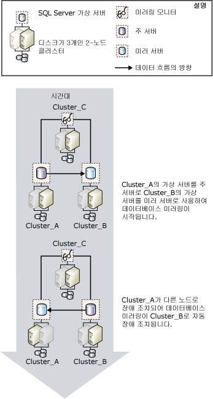

# 데이터베이스 미러링 및 SQL Server 장애 조치(Failover) 클러스터 인스턴스
[!INCLUDE[appliesto-ss-xxxx-xxxx-xxx-md](../../includes/appliesto-ss-xxxx-xxxx-xxx-md.md)]
  장애 조치 클러스터는 리소스 그룹으로 알려진 MSCS( [!INCLUDE[msCoName](../../includes/msconame-md.md)] Cluster Service) 클러스터 그룹 내에 있는 하나 이상의 물리적 디스크 조합이며 클러스터의 참여 노드입니다. 리소스 그룹은 [!INCLUDE[ssNoVersion](../../includes/ssnoversion-md.md)]인스턴스를 호스팅하는 장애 조치 클러스터형 인스턴스로 구성됩니다. [!INCLUDE[ssNoVersion](../../includes/ssnoversion-md.md)] 장애 조치 클러스터형 인스턴스는 네트워크에서 한 대의 컴퓨터처럼 보이지만 어떤 노드를 사용할 수 없게 되는 경우 노드 간 장애 조치 기능을 제공합니다. 자세한 내용은 [Always On 장애 조치(failover) 클러스터 인스턴스&#40;SQL Server&#41;](../../sql-server/failover-clusters/windows/always-on-failover-cluster-instances-sql-server.md)인스턴스를 호스팅하는 장애 조치 클러스터형 인스턴스로 구성됩니다.  
  
 장애 조치(failover) 클러스터는 단일 데이터베이스에 대해 가용성 우선 지원을 제공하는 데이터베이스 미러링과 달리 전체 [!INCLUDE[msCoName](../../includes/msconame-md.md)] [!INCLUDE[ssNoVersion](../../includes/ssnoversion-md.md)] 인스턴스에 대해 가용성 우선 지원을 제공합니다. 데이터베이스 미러링은 장애 조치 클러스터 간, 그리고 장애 조치 클러스터와 비클러스터형 호스트 간에 작동합니다.  
  
> [!NOTE]  
>  데이터베이스 미러링에 대한 소개는 [데이터베이스 미러링&#40;SQL Server&#41;](../../database-engine/database-mirroring/database-mirroring-sql-server.md)인스턴스를 호스팅하는 장애 조치 클러스터형 인스턴스로 구성됩니다.  
  
## 미러링 및 클러스터링  
 일반적으로 미러링을 클러스터링과 함께 사용할 때 주 서버와 미러 서버는 모두 클러스터에 있으며 주 서버는 클러스터의 장애 조치 클러스터형 인스턴스에서 실행되고 미러 서버는 다른 클러스터의 장애 조치 클러스터형 인스턴스에서 실행됩니다. 그러나 한 파트너가 클러스터의 장애 조치 클러스터형 인스턴스에 있고 다른 파트너는 별도의 비클러스터형 컴퓨터에 있는 미러링 세션을 설정할 수 있습니다.  
  
 클러스터 장애 조치로 인해 일시적으로 주 서버를 사용할 수 없게 되면 클라이언트와 데이터베이스의 연결이 끊어집니다. 클러스터 장애 조치(Failover)가 완료된 후 클라이언트는 [운영 모드](../../database-engine/database-mirroring/database-mirroring-operating-modes.md)에 따라 동일한 클러스터나 다른 클러스터의 주 서버 또는 비클러스터형 컴퓨터에 다시 연결됩니다. 따라서 클러스터형 환경에서 데이터베이스 미러링을 구성하는 방법을 결정할 때 미러링에 사용할 운영 모드는 매우 중요합니다.  
  
### 자동 장애 조치 있는 보호 우선 모드 세션  
 자동 장애 조치가 있는 보호 우선 모드에서 데이터베이스를 미러링하려면 파트너를 두 개의 클러스터로 구성하는 것이 좋습니다. 이러한 구성은 가용성을 최대한 높여 줍니다. 미러링 모니터는 세 번째 클러스터나 비클러스터형 컴퓨터에 있을 수 있습니다.  
  
 현재의 주 서버가 실행되는 노드에 장애가 생기면 몇 초 안에 데이터베이스 자동 장애 조치가 시작되고 클러스터는 계속 다른 노드로 장애 조치를 합니다. 데이터베이스 미러링 세션은 다른 클러스터의 미러 서버 또는 비클러스터형 컴퓨터로 장애 조치되고 이전 미러 서버는 주 서버가 됩니다. 새로운 주 서버는 최대한 빨리 자체 데이터베이스 복사본을 롤포워드하여 온라인 상태의 주 데이터베이스가 됩니다. 보통 몇 분 정도가 소요되는 클러스터 장애 조치가 끝나면 이전에 주 서버였던 장애 조치 클러스터형 인스턴스는 미러 서버가 됩니다.  
  
 다음 그림에서는 미러링 모니터 서버가 포함된 보호 우선 모드(자동 장애 조치 지원)로 실행되는 미러링 세션의 클러스터 간 자동 장애 조치를 보여 줍니다.  
  
   
  
 미러링 세션에서 3개의 서버 인스턴스는 3개의 고유 클러스터인 **Cluster_A**, **Cluster_B**및 **Cluster_C**에 상주합니다. 각 클러스터에서 [!INCLUDE[ssNoVersion](../../includes/ssnoversion-md.md)] 의 기본 인스턴스가 [!INCLUDE[ssNoVersion](../../includes/ssnoversion-md.md)] 장애 조치 클러스터형 인스턴스로 실행됩니다. 미러링 세션이 시작되면 미러링 세션에서 **Cluster_A** 의 장애 조치(failover) 클러스터된 인스턴스가 주 서버로, **Cluster_B** 의 장애 조치(failover) 클러스터된 인스턴스는 미러 서버로, **Cluster_C** 의 장애 조치(failover) 클러스터된 인스턴스는 미러링 모니터 서버가 됩니다. 결국 **Cluster_A** 에 활성화되어 있는 노드에 장애가 발생하면 주 서버를 이용할 수 없게 됩니다.  
  
 클러스터가 장애 조치할 시간을 갖기 전에 미러 서버가 미러링 모니터 서버의 도움을 받아 주 서버의 손실을 감지합니다. 미러 서버는 가능한 한 빨리 해당 데이터베이스를 롤포워드하여 새로운 주 데이터베이스로 사용할 수 있도록 온라인 상태로 만듭니다. **Cluster_A** 가 장애 조치(failover)를 마치면 이전의 주 서버는 이제 미러 서버가 되고 해당 데이터베이스를 **Cluster_B**에 있는 현재의 주 데이터베이스와 동기화합니다.  
  
### 자동 장애 조치 없는 보호 우선 모드 세션  
 자동 장애 조치가 없는 보호 우선 모드에서 데이터베이스를 미러링하는 경우 현재 주 서버를 실행하는 노드가 실패하면 클러스터의 다른 노드가 주 서버 역할을 합니다. 클러스터를 이용할 수 없을 때는 데이터베이스를 사용할 수 없습니다.  
  
### 성능 우선 모드 세션  
 성능 우선 모드에서 데이터베이스를 미러링할 때는 클러스터의 장애 조치 클러스터형 인스턴스에 주 서버를 배치하고 미러 서버는 원격 위치의 비클러스터형 서버에 배치하십시오. 클러스터가 다른 노드로 장애 조치되면 미러링 세션에서 장애 조치 클러스터형 인스턴스가 계속 주 서버로 작동합니다. 전체 클러스터에 문제가 있는 경우 미러 서버로 서비스를 강제할 수 있습니다.  
  
 **새 SQL Server 장애 조치 클러스터를 설정하려면**  
  
-   [새 SQL Server 장애 조치(failover) 클러스터 만들기&#40;설치 프로그램&#41;](../../sql-server/failover-clusters/install/create-a-new-sql-server-failover-cluster-setup.md)  
  
 **데이터베이스 미러링을 설정하려면**  
  
-   [데이터베이스 미러링 설정&#40;SQL Server&#41;](../../database-engine/database-mirroring/setting-up-database-mirroring-sql-server.md)  
  
-   [Windows 인증을 사용하여 데이터베이스 미러링 세션 구성&#40;SQL Server Management Studio&#41;](../../database-engine/database-mirroring/establish-database-mirroring-session-windows-authentication.md)  
  
## 참고 항목  
 [데이터베이스 미러링&#40;SQL Server&#41;](../../database-engine/database-mirroring/database-mirroring-sql-server.md)   
 [데이터베이스 미러링 운영 모드](../../database-engine/database-mirroring/database-mirroring-operating-modes.md)   
 [Always On 장애 조치(failover) 클러스터 인스턴스&#40;SQL Server&#41;](../../sql-server/failover-clusters/windows/always-on-failover-cluster-instances-sql-server.md)  
  
  
