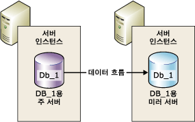
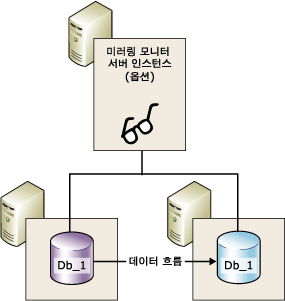
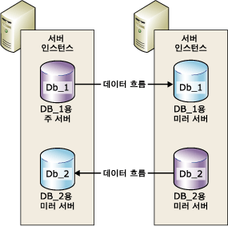

# 데이터베이스 미러링(SQL Server)
 [!INCLUDE [SQL Server](../../includes/applies-to-version/sqlserver.md)]
    
> [!NOTE]  
>  [!INCLUDE[ssNoteDepFutureAvoid](../../includes/ssnotedepfutureavoid-md.md)][!INCLUDE[ssHADR](../../includes/sshadr-md.md)]을 대신 사용합니다.  
  
 *데이터베이스 미러링* 은 [!INCLUDE[ssNoVersion](../../includes/ssnoversion-md.md)] 데이터베이스의 가용성을 높이기 위한 솔루션입니다. 미러링은 데이터베이스 단위로 구현되며 전체 복구 모델을 사용하는 데이터베이스에서만 작동합니다.  
  
> [!IMPORTANT]  
>  데이터베이스 미러링 지원, 파트너 서버 구성을 위한 제한 사항, 사전 요구 사항 및 권장 사항, 데이터베이스 미러링 배포를 위한 권장 사항에 대한 자세한 내용은 [데이터베이스 미러링을 위한 필수 구성 요소, 제한 사항 및 권장 사항](../../database-engine/database-mirroring/prerequisites-restrictions-and-recommendations-for-database-mirroring.md)을 참조하세요.  
  
  
##   데이터베이스 미러링의 이점  
 데이터베이스 미러링은 다음과 같은 이점을 제공하는 간단한 전략입니다.  
  
-   데이터베이스의 가용성이 커집니다.  
  
     자동 장애 조치(failover)가 있는 보호 우선 모드에서는 재해 발생 시 장애 조치에 의해 데이터베이스의 대기 복사본이 신속하게 온라인 상태가 됩니다(데이터 손실 없음). 다른 운영 모드의 경우 데이터베이스 관리자가 데이터베이스의 대기 복사본으로 서비스를 강제할 수 있습니다(데이터 손실 가능). 자세한 내용은 이 항목의 뒷부분에 나오는 [역할 전환](#RoleSwitching)을 참조하세요.  
  
-   데이터 보호가 향상됩니다.  
  
     데이터베이스 미러링은 운영 모드가 보호 우선 모드인지 성능 우선 모드인지에 따라 완벽하거나 거의 완벽한 데이터 중복을 제공합니다. 자세한 내용은 이 항목의 뒷부분에 나오는 [운영 모드](#OperatingModes)를 참조하세요.  
  
     [!INCLUDE[ssEnterpriseEd10](../../includes/ssenterpriseed10-md.md)] 이상 버전에서 실행 중인 데이터베이스 미러링 파트너는 데이터 페이지를 읽지 못하게 하는 특정 오류 유형을 자동으로 해결하려고 시도합니다. 페이지를 읽지 못하는 파트너는 다른 파트너로부터 새 복사본을 요청합니다. 이 요청이 성공하면 읽을 수 없는 페이지는 새 복사본으로 대체되고 일반적으로 오류가 해결됩니다. 자세한 내용은 [자동 페이지 복구&#40;가용성 그룹: 데이터베이스 미러링&#41;](../../sql-server/failover-clusters/automatic-page-repair-availability-groups-database-mirroring.md)을 참조하세요.  
  
-   업그레이드 중에 프로덕션 데이터베이스의 가용성이 증가합니다.  
  
     미러된 데이터베이스의 작동 중단을 최소화하려면 장애 조치(failover) 파트너를 호스팅하는 [!INCLUDE[ssNoVersion](../../includes/ssnoversion-md.md)] 인스턴스를 순차적으로 업그레이드하면 됩니다. 이렇게 하면 단일 장애 조치(failover)에 대해서만 가동 중단이 발생합니다. 이러한 형태의 업그레이드를 *롤링 업그레이드*라고 합니다. 자세한 내용은 [Upgrading Mirrored Instances](../../database-engine/database-mirroring/upgrading-mirrored-instances.md)을 참조하세요.  
  
  
##   데이터베이스 미러링 용어 및 정의  
 자동 장애 조치(automatic failover)  
 주 서버를 사용할 수 없게 되면 미러 서버가 주 서버의 역할을 맡고 해당 데이터베이스의 복사본을 온라인으로 전환하여 주 데이터베이스로 사용하도록 하는 프로세스입니다.  
  
 장애 조치(failover) 파트너(failover partner)  
 미러된 데이터베이스에 대한 역할 전환 파트너로 작동하는 두 개의 서버 인스턴스(주 서버 또는 미러 서버)입니다.  
  
 강제 서비스(forced service)  
 주 서버 오류 발생 시 데이터베이스 소유자에 의해 시작되는 장애 조치(failover)로, 상태를 알 수 없는 동안 미러 데이터베이스로 서비스를 전송합니다.  
  
 성능 우선 모드  
 데이터베이스 미러링 세션이 비동기적으로 작동하며 주 서버와 미러 서버만 사용합니다. 역할 전환의 유일한 형식은 강제 서비스(데이터 손실 가능)입니다.  
  
 보호 우선 모드  
 데이터베이스 미러링 세션이 동기적으로 작동하며 필요한 경우 주 서버와 미러 서버뿐 아니라 미러링 모니터 서버도 사용합니다.  
  
 수동 장애 조치(manual failover)  
 주 서버가 계속 실행 중일 때 데이터베이스 소유자에 의해 시작되는 장애 조치(failover)로, 동기화된 상태에서 주 데이터베이스의 서비스를 미러 데이터베이스로 전송합니다.  
  
 미러 데이터베이스(mirror database)  
 일반적으로 주 데이터베이스와 완전하게 동기화되는 데이터베이스 복사본입니다.  
  
 미러 서버(mirror server)  
 데이터베이스 미러링 구성에서 미러 데이터베이스가 있는 서버 인스턴스입니다.  
  
 주 데이터베이스(principal database)  
 데이터베이스 미러링에서 트랜잭션 로그 레코드가 데이터베이스(미러 데이터베이스)의 읽기 전용 복사본에 적용되는 읽기/쓰기 데이터베이스입니다.  
  
 주 서버(principal server)  
 데이터베이스 마이닝에서 해당 데이터베이스가 현재 주 데이터베이스인 파트너를 말합니다.  
  
 Redo Queue  
 미러 서버의 디스크에서 대기 중인 받은 트랜잭션 로그 레코드입니다.  
  
 역할(role)  
 주 서버와 미러 서버는 서로 보완적인 주 역할 및 미러 역할을 수행합니다. 필요에 따라 미러링 모니터 서버의 역할을 제3의 서버 인스턴스가 수행할 수 있습니다.  
  
 역할 전환  
 기본 역할을 미러에게 인계하는 것을 말합니다.  
  
 Send Queue  
 주 서버의 로그 디스크에 누적된 보내지 않은 트랜잭션 로그 레코드입니다.  
  
 세션  
 주 서버, 미러 서버 및 미러링 모니터 서버(있는 경우) 간에 데이터베이스 미러링이 수행될 때 발생하는 관계입니다.  
  
 미러링 세션이 시작 또는 재개된 후 주 서버에 누적된 주 데이터베이스의 로그 레코드가 미러 서버로 전송되는 프로세스입니다. 미러 서버는 주 서버를 따라잡기 위해 이러한 로그 레코드를 가능한 빨리 디스크에 기록합니다.  
  
 트랜잭션 보안  
 데이터베이스 미러링 세션이 동기적으로 작동하는지 아니면 비동기적으로 작동하는지를 결정하는 미러링별 데이터베이스 속성입니다. 보안 수준은 FULL 및 OFF의 두 가지입니다.  
  
 미러링 모니터  
 보호 우선 모드에서만 사용할 수 있으며, 자동 장애 조치(failover)가 시작될 경우 미러 서버에서 인식할 수 있도록 하는 SQL Server의 선택적 인스턴스입니다. 미러링 모니터 서버는 두 장애 조치(Failover) 파트너와는 달리 데이터베이스를 제공하지 않습니다. 미러링 모니터 서버는 자동 장애 조치(Failover)를 지원하는 역할만 수행합니다.  
  
  
##   데이터베이스 미러링 개요  
 데이터베이스 미러링은 [!INCLUDE[ssDEnoversion](../../includes/ssdenoversion-md.md)]의 서로 다른 서버 인스턴스에 있어야 하는 두 개의 단일 데이터베이스 복사본을 유지 관리합니다. 일반적으로 두 서버 인스턴스는 서로 다른 위치의 컴퓨터에 있습니다. 데이터베이스에서 데이터베이스 미러링을 시작하면 이러한 서버 인스턴스 간의 관계( *데이터베이스 미러링 세션*이라고 함)가 시작됩니다.  
  
 한 서버 인스턴스는 클라이언트에 데이터베이스를 제공하고( *주 서버*) 다른 서버 인스턴스는 미러링 세션의 구성 및 상태에 따라 상시 또는 웜 대기 서버( *미러 서버*) 역할을 합니다. 데이터베이스 미러링 세션을 동기화하면 데이터베이스 미러링은 커밋된 트랜잭션에서 데이터 손실 없이 신속한 장애 조치(Failover)를 지원하는 상시 대기 서버를 제공합니다. 세션이 동기화되지 않은 경우 미러 서버는 일반적으로 웜 대기 서버로 사용할 수 있으며 데이터가 손실될 수 있습니다.  
  
 주 서버와 미러 서버는 *데이터베이스 미러링 세션* 에서 *파트너*로 통신하고 협력합니다. 두 파트너는 세션에서 서로 보완하는 *주 역할* 과 *미러 역할*을 수행합니다. 언제든지 한 파트너는 주 역할을 수행하고 다른 파트너는 미러 역할을 수행합니다. 각 파트너는 현재 역할을 *소유* 한다고 표현합니다. 주 역할을 소유하는 파트너를 *주 서버*라고 하며 주 서버의 데이터베이스 복사본이 현재의 주 데이터베이스입니다. 미러 역할을 소유하는 파트너를 *미러 서버*라고 하며 미러 서버의 데이터베이스 복사본이 현재의 미러 데이터베이스입니다. 프로덕션 환경에 데이터베이스 미러링이 구축된 경우 주 데이터베이스가 *프로덕션 데이터베이스*가 됩니다.  
  
 데이터베이스 미러링은 주 데이터베이스에서 발생한 모든 삽입, 업데이트 및 삭제 작업을 가능한 한 빨리 미러 데이터베이스에 대해 *다시 실행* 하는 작업과 관련이 있습니다. 다시 실행은 활성 트랜잭션 로그 레코드의 스트림을 미러 서버로 보내고, 미러 서버에서 가능한 한 빨리 로그 레코드를 순서대로 미러 데이터베이스에 적용함으로써 이루어집니다. 논리적 수준에서 작동하는 복제와 달리 데이터베이스 미러링은 물리적 로그 레코드 수준에서 작동합니다. [!INCLUDE[ssKatmai](../../includes/sskatmai-md.md)]부터 주 서버는 트랜잭션 로그 레코드의 스트림을 미러 서버에 보내기 전에 압축합니다. 이러한 로그 압축은 모든 미러링 세션에서 발생합니다.  
  
> [!NOTE]  
>  지정된 서버 인스턴스는 같은 파트너 또는 다른 파트너에 있는 여러 개의 동시 데이터베이스 미러링 세션에 참여할 수 있습니다. 서버 인스턴스는 한 세션에서는 파트너가 되고, 다른 세션에서는 미러링 모니터 서버가 될 수 있습니다. 미러 서버 인스턴스는 동일한 [!INCLUDE[ssNoVersion](../../includes/ssnoversion-md.md)]버전을 실행해야 합니다.  
  
 **섹션 내용**  
  
-   [운영 모드](#OperatingModes)  
  
-   [역할 전환](#RoleSwitching)  
  
-   [동시 세션](#ConcurrentSessions)  
  
-   [클라이언트 연결](#ClientConnections)  
  
-   [세션을 일시 중지할 경우 주 서버의 트랜잭션 로그에 미치는 영향](#ImpactOfPausing)  
  
  
###   운영 모드  
 데이터베이스 미러링 세션이 동기 또는 비동기 작업으로 실행됩니다. 비동기 작업에서는 미러 서버가 로그를 디스크에 쓸 때까지 기다리지 않고 트랜잭션이 커밋되므로 성능이 극대화됩니다. 동기 작업에서는 트랜잭션이 두 파트너에서 모두 커밋되지만 트랜잭션 대기 시간이 길어집니다.  
  
 두 가지 미러링 운영 모드가 있습니다. 이 중에서 *보호 우선 모드* 는 동기 작업을 지원합니다. 보호 우선 모드에서 세션을 시작하면 미러 서버는 가능한 한 빨리 미러 데이터베이스를 주 데이터베이스와 동기화합니다. 데이터베이스가 동기화되면 트랜잭션이 두 파트너에서 모두 커밋되지만 트랜잭션 대기 시간이 길어집니다.  
  
 두 번째 운영 모드인 *성능 우선 모드*는 비동기적으로 실행됩니다. 미러 서버는 주 서버가 보낸 로그 레코드를 유지하려고 합니다. 미러 데이터베이스에 주 데이터베이스보다 약간 뒤처질 수 있습니다. 그러나 두 데이터베이스의 시간 간격은 일반적으로 크지 않습니다. 그러나 주 서버에 작업이 크거나 미러 서버 시스템이 과부화된 경우 이 시간 간격은 상당히 커질 수 있습니다.  
  
 성능 우선 모드에서는 주 서버가 로그 레코드를 미러 서버로 보내는 즉시 클라이언트로 확인 메시지를 보냅니다. 이때 주 서버는 미러 서버의 확인을 기다리지 않습니다. 즉, 미러 서버에서 로그를 디스크에 쓸 때까지 기다리지 않고 트랜잭션이 커밋됩니다. 비동기 작업을 통해 주 서버는 최소 트랜잭션 대기 시간으로 실행될 수 있지만 데이터가 손실될 수 있는 위험이 있습니다.  
  
 모든 데이터베이스 미러링 세션은 주 서버와 미러 서버를 각각 하나씩만 지원합니다. 다음 그림에서는 이 구성을 보여 줍니다.  
  
   
  
 자동 장애 조치(failover) 있는 보호 우선 모드를 사용하려면 *미러링 모니터 서버*라는 세 번째 서버 인스턴스가 필요합니다. 미러링 모니터 서버는 두 파트너와는 달리 데이터베이스를 제공하지 않습니다. 미러링 모니터 서버는 주 서버가 작동하는지 여부만 확인하여 자동 장애 조치(Failover)를 지원합니다. 미러 서버는 미러 서버 및 미러링 모니터 서버가 주 서버와 연결이 끊어진 후에도 서로 연결되어 있는 경우에만 자동 장애 조치를 시작합니다.  
  
 다음 그림에서는 미러링 모니터 서버가 포함된 구성을 보여 줍니다.  
  
   
  
 자세한 내용은 이 항목의 뒷부분에 나오는 [역할 전환](#RoleSwitching)을 참조하세요.  
  
> [!NOTE]  
>  새 미러링 세션을 설정하거나 기존 미러링 구성에 미러링 모니터 서버를 추가하려면 관련된 모든 서버 인스턴스가 같은 버전의 [!INCLUDE[ssNoVersion](../../includes/ssnoversion-md.md)]를 실행해야 합니다. 그러나 [!INCLUDE[ssKatmai](../../includes/sskatmai-md.md)] 이상 버전으로 업그레이드하면 관련된 인스턴스의 버전이 다를 수 있습니다. 자세한 내용은 [Upgrading Mirrored Instances](../../database-engine/database-mirroring/upgrading-mirrored-instances.md)을 참조하세요.  
  
  
####   트랜잭션 보안 및 운영 모드  
 트랜잭션 보안 설정에 따라 동기 또는 비동기 운영 모드가 결정됩니다. [!INCLUDE[ssManStudioFull](../../includes/ssmanstudiofull-md.md)] 만 사용하여 데이터베이스 미러링을 구성하는 경우 운영 모드를 선택할 때 자동으로 트랜잭션 보안 설정이 구성됩니다.  
  
 [!INCLUDE[tsql](../../includes/tsql-md.md)] 을 사용하여 데이터베이스 미러링을 구성하는 경우 트랜잭션 보안 설정 방법을 알아야 합니다. 트랜잭션 보안은 ALTER DATABASE 문의 SAFETY 속성으로 조정합니다. 미러되는 데이터베이스에서 SAFETY는 FULL 또는 OFF 중 하나입니다.  
  
-   SAFETY 옵션이 FULL로 설정되어 있으면 데이터베이스 미러링 작업이 초기 동기화 단계 이후 동기적으로 수행됩니다. 보호 우선 모드로 미러링 모니터 서버를 설정하면 세션에서 자동 장애 조치(Failover)를 지원합니다.  
  
-   SAFETY 옵션이 OFF로 설정되어 있으면 데이터베이스 미러링 작업이 비동기적으로 수행됩니다. 세션은 성능 우선 모드로 실행되며 WITNESS 옵션도 OFF여야 합니다.  
  
 자세한 내용은 [Database Mirroring Operating Modes](../../database-engine/database-mirroring/database-mirroring-operating-modes.md)을 참조하세요.  
  
  
###   역할 전환  
 데이터베이스 미러링 세션에서는 *역할 전환*프로세스를 통해 주 역할과 미러 역할을 서로 바꿀 수 있습니다. 역할 전환 시 주 역할을 미러 서버로 이전해야 합니다. 역할 전환에서 미러 서버는 주 서버의 *장애 조치(Failover) 파트너* 역할을 합니다. 역할이 전환되면 미러 서버가 주 역할을 맡고 해당 데이터베이스의 복사본을 새로운 주 데이터베이스로 사용할 수 있도록 온라인 상태로 만듭니다. 이전 주 서버(사용 가능한 경우)는 미러 역할을 맡고 해당 데이터베이스는 새로운 미러 데이터베이스가 됩니다. 역할은 상호 전환할 수 있습니다.  
  
 역할 전환에는 다음과 같은 세 가지 형식이 있습니다.  
  
-   *자동 장애 조치(Failover)*  
  
     보호 우선 모드가 필요하며 미러 서버와 미러링 모니터 서버가 있어야 합니다. 데이터베이스는 이미 동기화된 상태여야 하고 미러링 모니터 서버가 미러 서버에 연결되어 있어야 합니다.  
  
     미러링 모니터 서버의 역할은 지정된 파트너 서버가 실행되고 있는지 여부를 확인하는 것입니다. 미러 서버와 주 서버 사이의 연결은 끊어졌지만 미러링 모니터 서버가 여전히 주 서버에 연결되어 있으면 미러 서버에서 장애 조치(Failover)를 시작하지 않습니다. 자세한 내용은 [데이터베이스 미러링 모니터 서버](../../database-engine/database-mirroring/database-mirroring-witness.md)를 참조하세요.  
  
-   *수동 장애 조치*  
  
     보호 우선 모드가 필요합니다. 파트너가 서로 연결되어 있어야 하며 데이터베이스는 이미 동기화된 상태여야 합니다.  
  
-   *강제 서비스* (데이터 손실 가능)  
  
     성능 우선 모드 및 자동 장애 조치(Failover) 없는 보호 우선 모드에서는 주 서버가 실패했으며 미러 서버가 사용 가능한 경우 강제 서비스를 사용할 수 있습니다.  
  
    > [!IMPORTANT]  
    >  성능 우선 모드는 미러링 모니터 서버 없이 실행되도록 설계되었습니다. 그러나 미러링 모니터 서버가 있는 경우 강제 서비스를 사용하려면 미러링 모니터 서버가 미러 서버에 연결되어 있어야 합니다.  
  
 모든 역할 전환 시나리오에서 새로운 주 데이터베이스가 온라인 상태가 되면 클라이언트 애플리케이션에서 해당 데이터베이스에 다시 연결하여 신속하게 복구할 수 있습니다.  
  
  
###   동시 세션  
 지정된 서버 인스턴스는 같은 서버 인스턴스 또는 다른 서버 인스턴스에 있는 여러 개의 동시 데이터베이스 미러링 세션(미러된 데이터베이스당 한 번)에 참여할 수 있습니다. 모든 데이터베이스 미러링 세션에서 서버 인스턴스가 파트너나 미러링 모니터 서버로만 사용되는 경우가 많습니다. 그러나 각 세션은 다른 세션과 독립적이므로 서버 인스턴스가 일부 세션에서는 파트너 역할을 하고 다른 세션에서는 미러링 모니터 서버 역할을 할 수 있습니다. 예를 들어 3개 서버 인스턴스(`SSInstance_1`, `SSInstance_2`및 `SSInstance_3`)에서의 다음 4개 세션을 고려합니다. 각 서버 인스턴스가 일부 세션에서는 파트너 역할을 하고 다른 세션에서는 미러링 모니터 서버 역할을 합니다.  
  
|서버 인스턴스|데이터베이스 A에 대한 세션|데이터베이스 B에 대한 세션|데이터베이스 C에 대한 세션|데이터베이스 D에 대한 세션|  
|---------------------|----------------------------|----------------------------|----------------------------|----------------------------|  
|`SSInstance_1`|미러링 모니터|파트너|파트너|파트너|  
|`SSInstance_2`|파트너|미러링 모니터|파트너|파트너|  
|`SSInstance_3`|파트너|파트너|미러링 모니터|미러링 모니터|  
  
 다음 그림에서는 두 미러링 세션에서 함께 파트너로 참여하는 두 서버 인스턴스를 보여 줍니다. 한 세션은 **Db_1**이라는 데이터베이스에 대한 세션이고 다른 세션은 **Db_2**라는 데이터베이스에 대한 세션입니다.  
  
   
  
 각 데이터베이스는 서로 독립적입니다. 예를 들어 서버 인스턴스는 초기에 두 데이터베이스의 미러 서버일 수 있습니다. 두 데이터베이스 중 하나가 장애 조치를 수행할 경우 서버 인스턴스는 장애 조치를 수행한 데이터베이스의 주 서버가 되는 한편 다른 데이터베이스에 대해서는 계속 미러 서버 역할을 수행합니다.  
  
 또 다른 예로 서버 인스턴스가 자동 장애 조치 있는 보호 우선 모드에서 실행 중인 둘 이상의 데이터베이스에 대해 주 서버가 된다고 가정합니다. 서버 인스턴스가 실패하면 모든 데이터베이스는 해당하는 각 미러 데이터베이스에 대해 자동으로 장애 조치(Failover)를 수행합니다.  
  
 서버 인스턴스가 파트너 및 미러링 모니터 두 가지 모두로 작동하도록 설정하는 경우 데이터베이스 미러링 엔드포인트가 두 역할을 모두 지원해야 합니다. 자세한 내용은 [데이터베이스 미러링 엔드포인트&#40;SQL Server&#41;](../../database-engine/database-mirroring/the-database-mirroring-endpoint-sql-server.md)) 또한 리소스 충돌을 줄이기 위해 시스템에 충분한 리소스가 있어야 합니다.  
  
> [!NOTE]  
>  미러된 데이터베이스는 서로 독립적이므로 여러 데이터베이스에 대한 장애 조치를 하나의 그룹으로 처리할 수 없습니다.  
  
###   클라이언트 연결  
 데이터베이스 미러링 세션에 대한 클라이언트 연결 지원은 [!INCLUDE[msCoName](../../includes/msconame-md.md)] 용 [!INCLUDE[ssNoVersion](../../includes/ssnoversion-md.md)].NET Data Provider에서 제공합니다. 자세한 내용은 [데이터베이스 미러링 세션에 클라이언트 연결&#40;SQL Server&#41;](../../database-engine/database-mirroring/connect-clients-to-a-database-mirroring-session-sql-server.md)프로세스를 통해 주 역할과 미러 역할을 서로 바꿀 수 있습니다.  
  
  
###   세션을 일시 중지할 경우 주 서버의 트랜잭션 로그에 미치는 영향  
 데이터베이스 소유자는 언제든지 세션을 일시 중지할 수 있습니다. 일시 중지는 미러링을 제거하는 동안 세션 상태를 유지합니다. 세션이 일시 중지되면 주 서버에서 새 로그 레코드를 미러 서버로 보내지 않습니다. 이러한 레코드는 모두 활성 상태로 유지되며 주 데이터베이스의 트랜잭션 로그에 누적됩니다. 데이터베이스 미러링 세션이 일시 중지된 동안에는 트랜잭션 로그를 자를 수 없습니다. 따라서 데이터베이스 미러링 세션을 너무 오래 일시 중지하면 로그가 가득 찰 수 있습니다.  
  
 자세한 내용은 이 항목의 뒷부분에 나오는 [데이터베이스 미러링 일시 중지 및 재개&#40;SQL Server&#41;](../../database-engine/database-mirroring/pausing-and-resuming-database-mirroring-sql-server.md)을 참조하세요.  
  
##   데이터베이스 미러링 세션 설정  
 미러링 세션을 시작하려면 먼저 데이터베이스 소유자 또는 시스템 관리자가 미러 데이터베이스를 만들고 엔드포인트와 로그인을 설정해야 하며 경우에 따라서는 인증서를 만들고 설정해야 합니다. 자세한 내용은 이 항목의 뒷부분에 나오는 [데이터베이스 미러링 설정&#40;SQL Server&#41;](../../database-engine/database-mirroring/setting-up-database-mirroring-sql-server.md)을 참조하세요.  
  
##   다른 데이터베이스 엔진 기능과의 상호 운용성 및 공존성  
 데이터베이스 미러링은 다음의 [!INCLUDE[ssNoVersion](../../includes/ssnoversion-md.md)]기능 또는 구성 요소와 함께 사용할 수 있습니다.  
  
-   [로그 전달](../../database-engine/database-mirroring/database-mirroring-and-log-shipping-sql-server.md)  
  
-   [전체 텍스트 카탈로그](../../database-engine/database-mirroring/database-mirroring-and-full-text-catalogs-sql-server.md)  
  
-   [데이터베이스 스냅샷](../../database-engine/database-mirroring/database-mirroring-and-database-snapshots-sql-server.md)  
  
-   [복제](../../database-engine/database-mirroring/database-mirroring-and-replication-sql-server.md)  
  
##   섹션 내용  
 [데이터베이스 미러링을 위한 필수 구성 요소, 제한 사항 및 권장 사항](../../database-engine/database-mirroring/prerequisites-restrictions-and-recommendations-for-database-mirroring.md)  
 데이터베이스 미러링을 설정하기 위한 사전 요구 사항과 권장 사항에 대해 설명합니다.  
  
 [데이터베이스 미러링 운영 모드](../../database-engine/database-mirroring/database-mirroring-operating-modes.md)  
 데이터베이스 미러링 세션의 동기 운영 모드 및 비동기 운영 모드에 대해 설명하고 데이터베이스 미러링 세션 동안 파트너 역할을 전환하는 방법에 대해 설명합니다.  
  
 [데이터베이스 미러링 모니터 서버](../../database-engine/database-mirroring/database-mirroring-witness.md)  
 데이터베이스 미러링 시 미러링 모니터 서버의 역할, 여러 미러링 세션에서 단일 미러링 모니터 서버를 사용하는 방법, 미러링 모니터 서버에 대한 소프트웨어 및 하드웨어 권장 사항, 자동 장애 조치(failover) 시 미러링 모니터 서버의 역할을 설명합니다. 미러링 모니터 서버를 추가 또는 제거하는 방법에 대해서도 설명합니다.  
  
 [데이터베이스 미러링 세션 중 역할 전환&#40;SQL Server&#41;](../../database-engine/database-mirroring/role-switching-during-a-database-mirroring-session-sql-server.md)  
 자동 장애 조치(failover), 수동 장애 조치 및 강제 적용된 서비스(데이터가 손실될 수 있음) 등의 데이터베이스 미러링 세션 동안 파트너 역할을 전환하는 방법에 대해 설명합니다. 또한 역할 전환 중에 서비스가 중단될 가능성을 평가하는 방법에 대해 설명합니다.  
  
 [데이터베이스 미러링 중에 발생 가능한 오류](../../database-engine/database-mirroring/possible-failures-during-database-mirroring.md)  
 데이터베이스 미러링 세션에서 오류를 발생시킬 수 있는 물리적 문제, 운영 체제 문제 및 [!INCLUDE[ssNoVersion](../../includes/ssnoversion-md.md)] 문제(하드 오류 및 소프트 오류 포함)에 대해 설명합니다. 미러링 시간 제한 메커니즘이 소프트 오류에 대처하는 방식에 대해서도 설명합니다.  
  
 [데이터베이스 미러링 엔드포인트&#40;SQL Server&#41;](../../database-engine/database-mirroring/the-database-mirroring-endpoint-sql-server.md)  
 데이터베이스 미러링 엔드포인트의 작동 방법에 대해 설명합니다.  
  
 [데이터베이스 미러링 설정&#40;SQL Server&#41;](../../database-engine/database-mirroring/setting-up-database-mirroring-sql-server.md)  
 데이터베이스 미러링을 설정하기 위한 사전 요구 사항, 권장 사항 및 단계에 대한 항목을 제공합니다.  
  
 [데이터베이스 미러링 세션에 클라이언트 연결&#40;SQL Server&#41;](../../database-engine/database-mirroring/connect-clients-to-a-database-mirroring-session-sql-server.md)  
 클라이언트를 미러된 데이터베이스에 연결 및 다시 연결하기 위한 알고리즘과 클라이언트 연결 문자열 특성에 대한 항목을 제공합니다.  
  
 [데이터베이스 미러링 일시 중지 및 재개&#40;SQL Server&#41;](../../database-engine/database-mirroring/pausing-and-resuming-database-mirroring-sql-server.md)  
 트랜잭션 로그 잘림에 미치는 영향을 포함하여 데이터베이스 미러링이 일시 중지된 동안 발생하는 상황을 설명하고, 데이터베이스 미러링을 일지 중지 및 재개하는 방법에 대해 설명합니다.  
  
 [데이터베이스 미러링 제거&#40;SQL Server&#41;](../../database-engine/database-mirroring/removing-database-mirroring-sql-server.md)  
 미러링을 제거할 경우의 영향과 세션을 종료하는 방법에 대해 설명합니다.  
  
 [데이터베이스 미러링 모니터링&#40;SQL Server&#41;](../../database-engine/database-mirroring/monitoring-database-mirroring-sql-server.md)  
 데이터베이스 미러링 모니터 또는 **dbmmonitor** 저장 프로시저를 사용하여 데이터베이스 미러링이나 세션을 모니터링하는 방법에 대해 설명합니다.  
  
  
##   관련 작업  
  
### 구성 태스크  
 **SQL Server Management Studio 사용**  
  
-   [데이터베이스 미러링 보안 구성 마법사 시작&#40;SQL Server Management Studio&#41;](../../database-engine/database-mirroring/start-the-configuring-database-mirroring-security-wizard.md)  
  
-   [Windows 인증을 사용하여 데이터베이스 미러링 세션 구성&#40;SQL Server Management Studio&#41;](../../database-engine/database-mirroring/establish-database-mirroring-session-windows-authentication.md)  
  
 **Transact-SQL 사용**  
  
-   [Windows 인증을 사용하여 데이터베이스 미러링 엔드포인트에 대한 네트워크 액세스 허용&#40;SQL Server&#41;](../../database-engine/database-mirroring/database-mirroring-allow-network-access-windows-authentication.md)  
  
-   [데이터베이스 미러링 엔드포인트의 아웃바운드 연결에 대한 인증서 사용 허용&#40;Transact-SQL&#41;](../../database-engine/database-mirroring/database-mirroring-use-certificates-for-outbound-connections.md)  
  
-   [데이터베이스 미러링 엔드포인트의 인바운드 연결에 대한 인증서 사용 허용&#40;Transact-SQL&#41;](../../database-engine/database-mirroring/database-mirroring-use-certificates-for-inbound-connections.md)  
  
-   [Windows 인증에 대한 데이터베이스 미러링 엔드포인트 만들기&#40;Transact-SQL&#41;](../../database-engine/database-mirroring/create-a-database-mirroring-endpoint-for-windows-authentication-transact-sql.md)  
  
-   [Windows 인증을 사용하여 데이터베이스 미러링 세션 구성&#40;Transact-SQL&#41;](../../database-engine/database-mirroring/database-mirroring-establish-session-windows-authentication.md)  
  
-   [Windows 인증을 사용하여 데이터베이스 미러링 모니터 추가&#40;Transact-SQL&#41;](../../database-engine/database-mirroring/add-a-database-mirroring-witness-using-windows-authentication-transact-sql.md)  
  
-   [Trustworthy 속성을 사용하도록 미러 데이터베이스 설정&#40;Transact-SQL&#41;](../../database-engine/database-mirroring/set-up-a-mirror-database-to-use-the-trustworthy-property-transact-sql.md)  
  
 **Transact-SQL 또는 SQL Server Management Studio 사용**  
  
-   [Upgrading Mirrored Instances](../../database-engine/database-mirroring/upgrading-mirrored-instances.md)  
  
-   [미러 데이터베이스의 미러링 준비&#40;SQL Server&#41;](../../database-engine/database-mirroring/prepare-a-mirror-database-for-mirroring-sql-server.md)  
  
  
### 관리 태스크  
 **Transact-SQL**  
  
-   [데이터베이스 미러링 세션에서 트랜잭션 보안 변경&#40;Transact-SQL&#41;](../../database-engine/database-mirroring/change-transaction-safety-in-a-database-mirroring-session-transact-sql.md)  
  
-   [데이터베이스 미러링 세션 수동 장애 조치(failover)&#40;Transact-SQL&#41;](../../database-engine/database-mirroring/manually-fail-over-a-database-mirroring-session-transact-sql.md)  
  
-   [데이터베이스 미러링 세션에 서비스 강제 수행&#40;Transact-SQL&#41;](../../database-engine/database-mirroring/force-service-in-a-database-mirroring-session-transact-sql.md)  
  
-   [데이터베이스 미러링 세션 일시 중지 또는 재개&#40;SQL Server&#41;](../../database-engine/database-mirroring/pause-or-resume-a-database-mirroring-session-sql-server.md)  
  
-   [데이터베이스 미러링 세션에서 미러링 모니터 서버 제거&#40;SQL Server&#41;](../../database-engine/database-mirroring/remove-the-witness-from-a-database-mirroring-session-sql-server.md)  
  
-   [데이터베이스 미러링 제거&#40;SQL Server&#41;](../../database-engine/database-mirroring/remove-database-mirroring-sql-server.md)  
  
 **SQL Server Management Studio**  
  
-   [데이터베이스 미러링 모니터 서버 추가 또는 바꾸기&#40;SQL Server Management Studio&#41;](../../database-engine/database-mirroring/add-or-replace-a-database-mirroring-witness-sql-server-management-studio.md)  
  
-   [데이터베이스 미러링 세션 수동 장애 조치(failover)&#40;SQL Server Management Studio&#41;](../../database-engine/database-mirroring/manually-fail-over-a-database-mirroring-session-sql-server-management-studio.md)  
  
-   [데이터베이스 미러링 세션 일시 중지 또는 재개&#40;SQL Server&#41;](../../database-engine/database-mirroring/pause-or-resume-a-database-mirroring-session-sql-server.md)  
  
-   [데이터베이스 미러링 세션에서 미러링 모니터 서버 제거&#40;SQL Server&#41;](../../database-engine/database-mirroring/remove-the-witness-from-a-database-mirroring-session-sql-server.md)  
  
-   [데이터베이스 미러링 제거&#40;SQL Server&#41;](../../database-engine/database-mirroring/remove-database-mirroring-sql-server.md)  
  
  
## 참고 항목  
 [데이터베이스 미러링 엔드포인트&#40;SQL Server&#41;](../../database-engine/database-mirroring/the-database-mirroring-endpoint-sql-server.md)   
 [자동 페이지 복구&#40;가용성 그룹: 데이터베이스 미러링&#41;](../../sql-server/failover-clusters/automatic-page-repair-availability-groups-database-mirroring.md)   
 [데이터베이스 미러링 구성 문제 해결&#40;SQL Server&#41;](../../database-engine/database-mirroring/troubleshoot-database-mirroring-configuration-sql-server.md)   
 [데이터베이스 미러링: 상호 운용성 및 공존성&#40;SQL Server&#41;](../../database-engine/database-mirroring/database-mirroring-interoperability-and-coexistence-sql-server.md)   
 [데이터베이스 미러링을 위한 필수 조건, 제한 사항 및 권장 사항](../../database-engine/database-mirroring/prerequisites-restrictions-and-recommendations-for-database-mirroring.md)   
 [Always On 가용성 그룹 개요&#40;SQL Server&#41;](../../database-engine/availability-groups/windows/overview-of-always-on-availability-groups-sql-server.md)   
 [로그 전달 정보&#40;SQL Server&#41;](../../database-engine/log-shipping/about-log-shipping-sql-server.md)  
  
  
